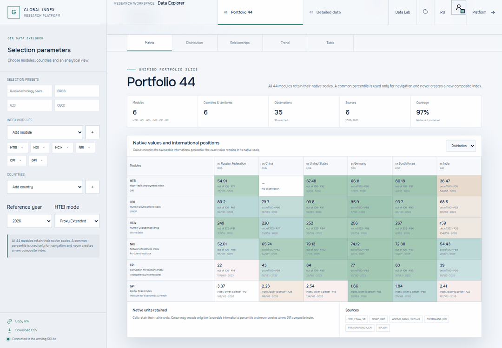
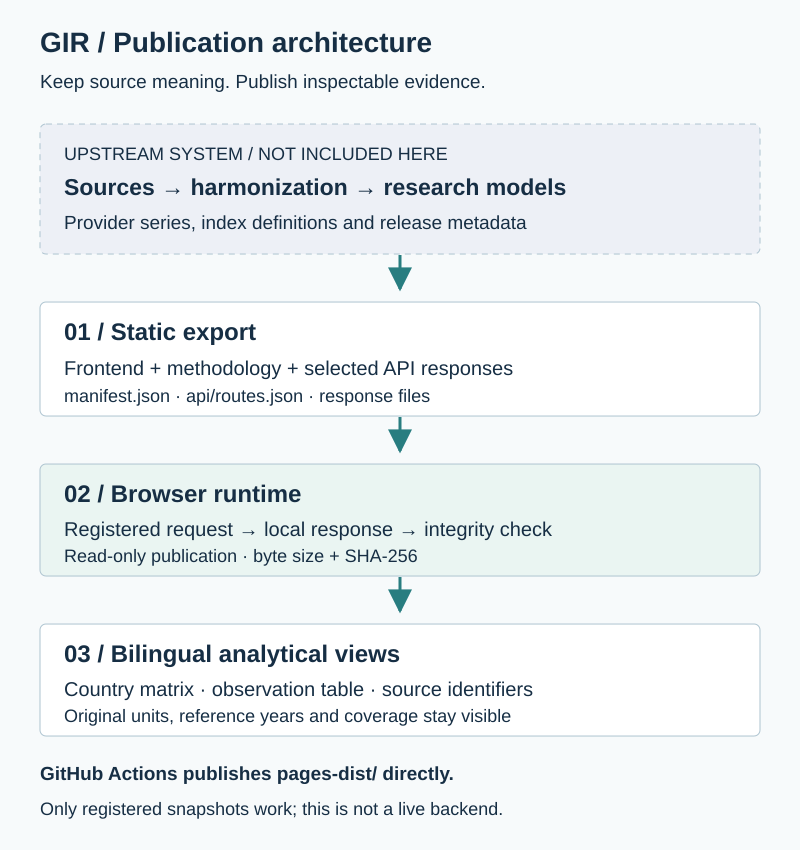
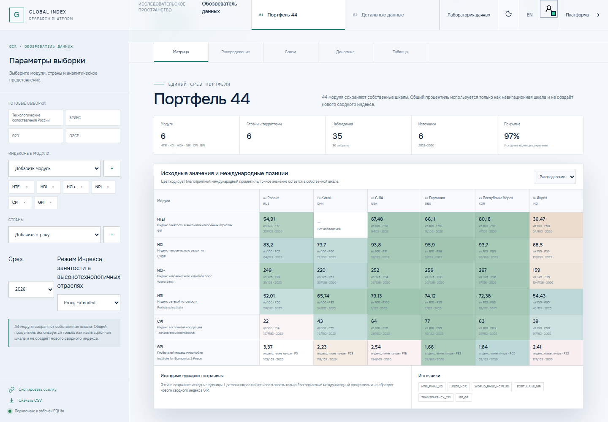
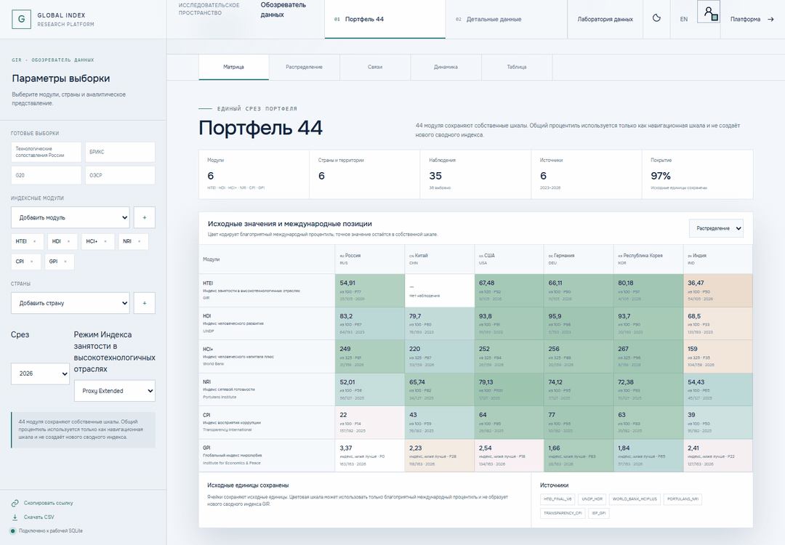
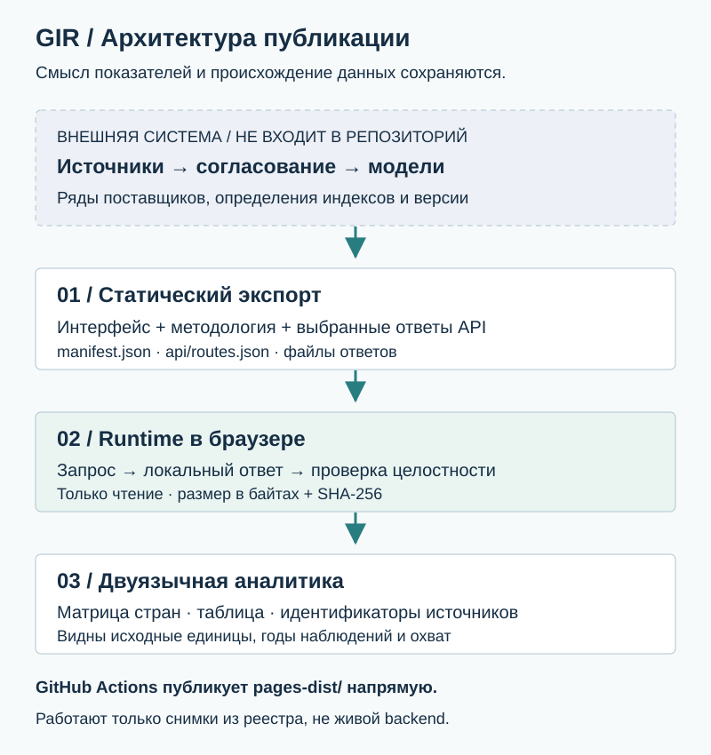

# GIR · Global Index Research Platform

[Open the platform](https://arseniy24rus.github.io/GIR/) · [Data Explorer](https://arseniy24rus.github.io/GIR/data-explorer.html) · [English](#english) · [Русский](#русский)

<a id="english"></a>
## English

GIR is a research interface for comparing countries through international indices and examining relationships between human capital, institutions, technology and development. Its value is not another universal country score: it brings heterogeneous evidence into a common workspace while retaining original units, reference years, coverage and sources.

**This repository publishes a read-only GitHub Pages export, not the complete server application.** It includes the frontend, methodology and selected API snapshots. The FastAPI service, working SQLite database, ingestion jobs and administrative backend described in the platform methodology are not shipped here. Some views require a session; credentials are not included in this guide or its recordings.

### Research Use and Capabilities

The platform serves researchers, university courses and analysts who compare international evidence without treating different rankings as interchangeable. Its catalog groups **44 modules into eight thematic areas**, distinguishing published composite indices, multidimensional statistical systems, statistical series and GIR-derived models or country aggregations.

The recorded Data Explorer workflow uses six modules: HTEI, HDI, HCI+, NRI, CPI and GPI. Original scores appear alongside positions, coverage and observation years. Users can narrow the selection to Russia and inspect the observation table and source identifiers. English/Russian interfaces and light/dark themes are implemented. A common favorable percentile helps navigation but **does not create a new aggregate index**.

### Visual Overview


*A real browser capture of the exported matrix. Missing observations remain distinguishable from numeric values.*



*Recorded on the published site: compare the default cohort, select Russia, inspect the table and source information, then return to the matrix. This demonstrates supported snapshots rather than an unrestricted query service.*

### Data, Methodology and Architecture

The [export manifest](pages-dist/manifest.json) records a build from **24 July 2026**, schema `1.0.0`, with **891 registered routes**. Its predefined country cohort is RUS, USA, CHN, IND, DEU, GBR, FRA, JPN, KOR, SGP, BRA and ZAF. Catalog coverage can be broader than the country/detail routes actually exported.

The [English methodology](pages-dist/static/methodology/content/methodology.en.md) explains index definitions, international providers, transformations, evidence requirements and the HTEI model. HTEI's direct-core, common-support, proxy-extended and as-of diagnostic modes have different evidence/support rules; they are not interchangeable official measurements. Source release years may differ from the selected portfolio year.



*The upstream research system prepares the artifact. This repository hosts only the static publication boundary.*

The [route registry](pages-dist/api/routes.json) maps requests to response files. [The Pages runtime](pages-dist/pages-runtime.js) resolves registered requests locally and checks payload sizes and SHA-256 hashes. [GitHub Actions](.github/workflows/pages.yml) deploys `pages-dist/` directly; it does not rebuild upstream models or refresh source data.

### Interpretation and Export Boundaries

- Ranks are ordinal; cross-country association does not establish causality. Compare definitions, periods and missingness before comparing scores.
- Missing, source-gated and unavailable observations are not zero. Percentiles depend on the relevant available universe.
- This is a dated snapshot. Only request combinations listed in the registry can resolve.
- The recorded configuration uses `2026`, `proxy_extended` and the six modules above. Its matrix and table snapshots work. Arbitrary module/year combinations, detailed provenance requests and several additional chart endpoints are not exported. Some other lazy-loaded workspaces are unavailable in this artifact.
- Browser-side presentation access is not server-side authorization. Administrative mutations and persistent backend operations are outside the Pages release.

### Local Inspection and Checks

<details>
<summary>Serve the artifact and inspect its evidence</summary>

From a clone, with Python 3 installed:

```bash
python -m http.server 8000 --directory pages-dist
```

Open `http://localhost:8000/`. Use HTTP rather than `file://`, because the runtime fetches JSON. Protected views may still require access supplied by the maintainer.

There is no root package/build script or automated application test suite in this export repository. Useful checks are parsing the manifest/route registry, opening a registered response and verifying supported views in both languages. The runtime checks snapshot integrity during use. These README recordings were captured from the live Pages export after authentication, without recording credentials.

</details>

**Attribution and reuse.** GIR is maintained in Arseniy Sitkovskiy's portfolio. International datasets, indices, institutional marks and source documents retain their own terms; consult the methodology's source and license registry. This repository currently has no root license granting blanket reuse of all code or data. Publication on GitHub alone is not such a grant.

---

<a id="русский"></a>
## Русский

GIR — исследовательский интерфейс для сопоставления стран по международным индексам и изучения связей между человеческим капиталом, институтами, технологиями и развитием. Его ценность не в создании ещё одного универсального рейтинга: платформа объединяет разнородные свидетельства, сохраняя исходные единицы измерения, годы наблюдения, охват и источники.

**В репозитории опубликован статический экспорт для GitHub Pages, доступный только для чтения, а не полная серверная платформа.** Включены интерфейс, методология и выбранные снимки API. Сервис FastAPI, рабочая база SQLite, задания загрузки данных и административный backend, описанные в методологии платформы, здесь не поставляются. Для части представлений нужна сессия; учётные данные не включены в README и записи.

### Исследовательская Задача и Возможности

Платформа предназначена для исследователей, университетских курсов и аналитиков, которым нужно сравнивать международные данные, не считая разные рейтинги взаимозаменяемыми. Каталог объединяет **44 модуля в восемь тематических направлений**. В нём различаются опубликованные составные индексы, многомерные статистические системы, статистические ряды, авторские модели GIR и страновые агрегации.

В записанном сценарии Обозревателя данных используются шесть модулей: HTEI, HDI, HCI+, NRI, CPI и GPI. Исходные оценки показаны рядом с позициями, охватом и годами наблюдений. Выборку можно сузить до России и изучить таблицу с идентификаторами источников. Русский и английский интерфейсы, светлая и тёмная темы реализованы. Общий благоприятный процентиль помогает ориентироваться, но **не создаёт нового сводного индекса**.

### Визуальный Обзор



*Реальный снимок экспортированной матрицы в браузере. Отсутствующие наблюдения не подменяются числовыми значениями.*



*Запись опубликованного сайта: сравнение начальной группы стран, выбор России, просмотр таблицы и источников, возврат к матрице. Показана работа доступных снимков, а не неограниченного сервиса запросов.*

### Данные, Методология и Архитектура

[Манифест экспорта](pages-dist/manifest.json) фиксирует сборку от **24 июля 2026 года**, схему `1.0.0` и **891 зарегистрированный маршрут**. Предусмотренная группа стран: RUS, USA, CHN, IND, DEU, GBR, FRA, JPN, KOR, SGP, BRA и ZAF. Охват каталога может быть шире набора страновых и детальных маршрутов, действительно включённых в экспорт.

[Русская методология](pages-dist/static/methodology/content/methodology.ru.md) раскрывает определения индексов, международных поставщиков данных, преобразования, требования к доказательной базе и модель HTEI. Режимы HTEI direct-core, common-support, proxy-extended и as-of diagnostic используют разные правила поддержки данными; они не являются взаимозаменяемыми официальными измерениями. Год выпуска источника может отличаться от выбранного года портфеля.



*Исследовательская система подготавливает артефакт. Репозиторий содержит только слой статической публикации.*

[Реестр маршрутов](pages-dist/api/routes.json) связывает запросы с файлами ответов. [Runtime GitHub Pages](pages-dist/pages-runtime.js) разрешает зарегистрированные запросы локально и проверяет размер содержимого и SHA-256. [GitHub Actions](.github/workflows/pages.yml) публикует `pages-dist/` напрямую, не пересчитывая исходные модели и не обновляя данные поставщиков.

### Интерпретация и Границы Экспорта

- Место в рейтинге является порядковой величиной; межстрановая связь не доказывает причинность. До сравнения оценок нужно проверить определения, периоды и пропуски.
- Отсутствующие, закрытые условиями источника и недоступные наблюдения не равны нулю. Процентиль зависит от соответствующей доступной совокупности.
- Это датированный снимок. Разрешаются только комбинации запросов, включённые в реестр.
- Записанная конфигурация использует `2026`, `proxy_extended` и шесть перечисленных модулей. Снимки матрицы и таблицы работают. Произвольные комбинации модулей и лет, детальные запросы происхождения наблюдений и ряд дополнительных графических endpoints не экспортированы. Некоторые другие динамически загружаемые рабочие пространства также недоступны в этом артефакте.
- Доступ на уровне браузерной презентации не заменяет серверную авторизацию. Административные изменения и постоянные операции backend не входят в Pages-версию.

### Локальный Просмотр и Проверки

<details>
<summary>Запуск артефакта и проверка материалов</summary>

В клоне репозитория, при установленном Python 3:

```bash
python -m http.server 8000 --directory pages-dist
```

Откройте `http://localhost:8000/`. Нужен HTTP, а не `file://`: runtime загружает JSON-файлы. Для защищённых представлений может потребоваться доступ, предоставленный сопровождающим проекта.

Корневого package/build-скрипта и автоматического набора тестов приложения в этом репозитории экспорта нет. Полезные проверки: разбор манифеста и реестра, открытие зарегистрированного ответа и проверка поддерживаемых представлений на обоих языках. Во время работы runtime контролирует целостность снимков. Записи README сделаны на опубликованном Pages-экспорте после входа, без съёмки учётных данных.

</details>

**Авторство и использование.** GIR входит в портфолио Арсения Ситковского. Для международных наборов данных, индексов, институциональной символики и исходных документов действуют собственные условия; см. реестр источников и лицензий в методологии. Сейчас в корне этого репозитория нет лицензии, предоставляющей общее право повторного использования всего кода или данных. Сама публикация на GitHub такого права не предоставляет.
