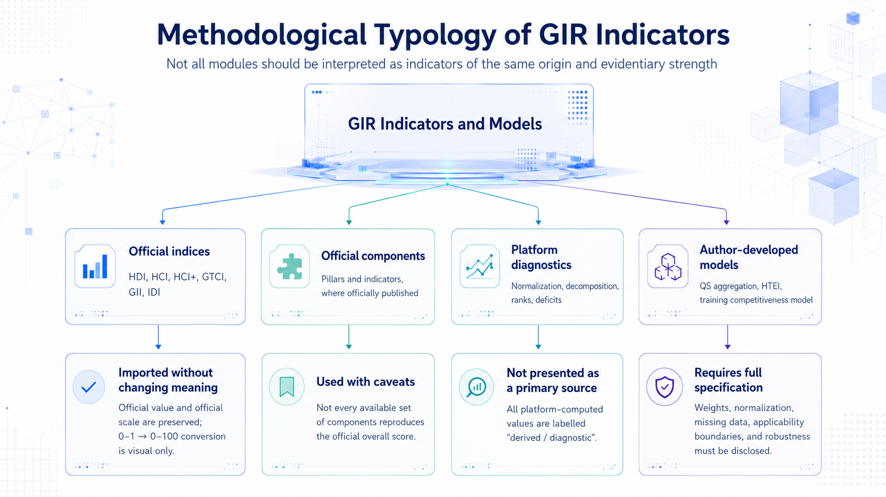
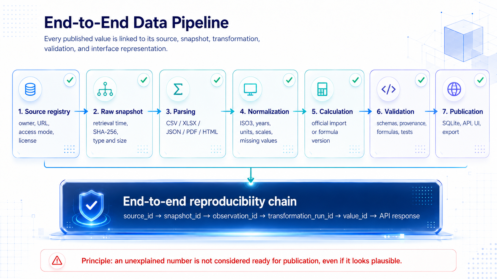
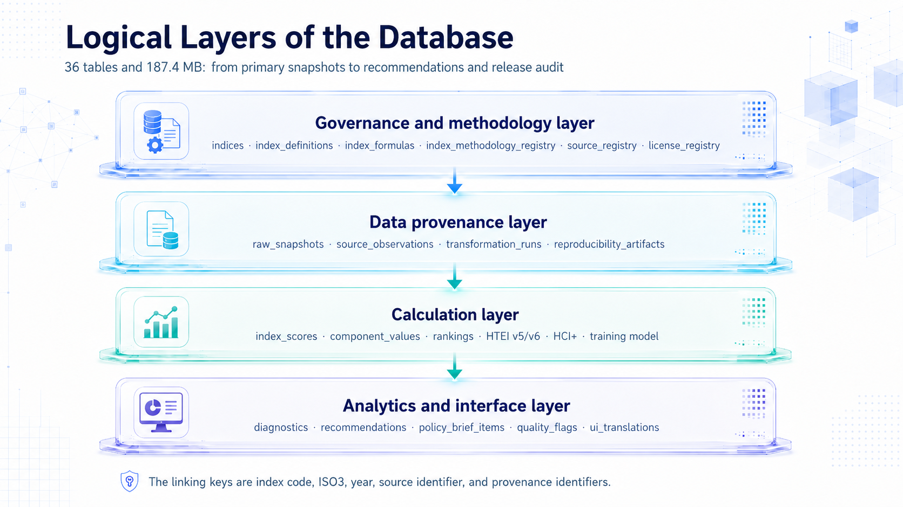
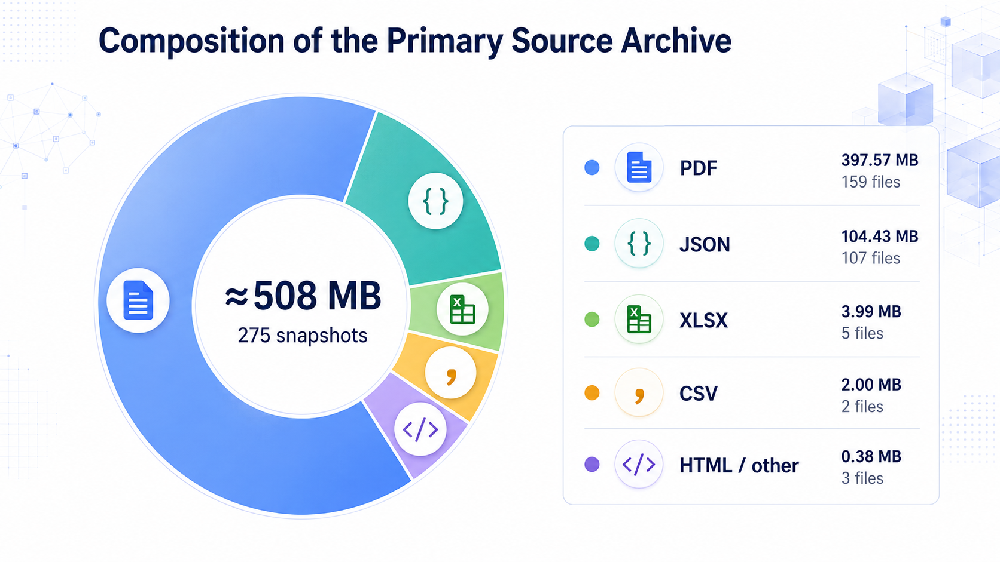
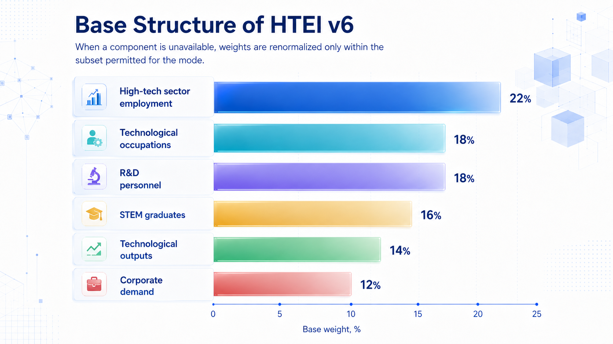
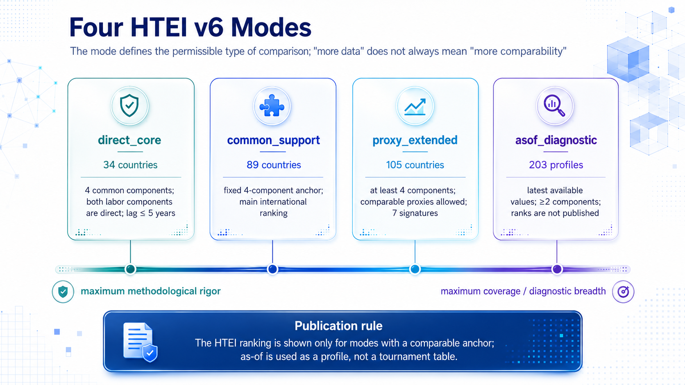
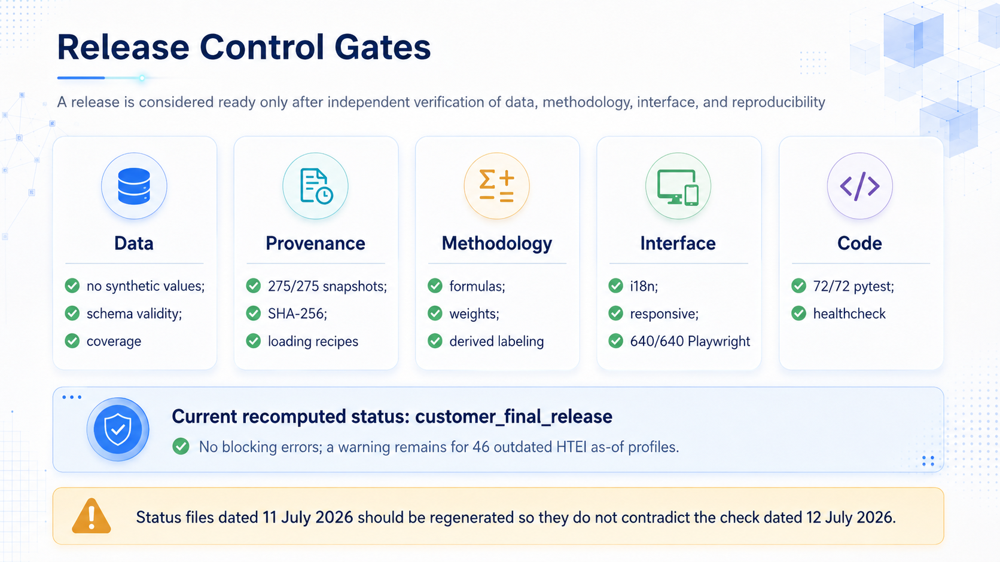
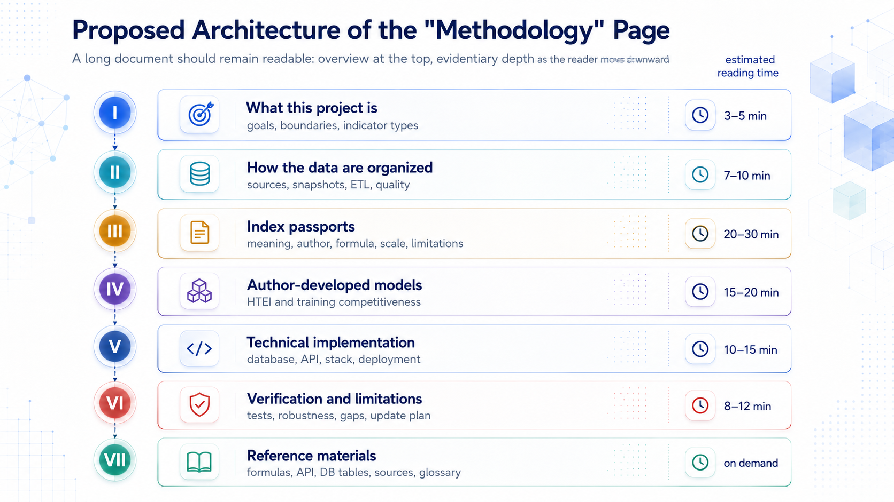

# GIR Project Methodology

> **Web integration package.** This variant is intended for the public website and uses the figure set `lang=en`, `theme=light`. The textual content is identical across the English light and dark variants; only the image paths differ.

A comprehensive plain-language description of the data, indices, formulas, algorithms, API, quality assurance, and reproducibility logic of the GIR platform.

**Document version:** 1.0  
**Delivery lock:** 12 July 2026  
**Platform title:** GIR — Global Index Ranker  
**Technical namespace in the codebase:** `giip` (retained for backward compatibility)

*Figure 1. Methodological Typology of GIR Indicators.*

## Document purpose

This document replaces a short interface note called “Methodology” with a full narrative reference text. It is designed for four simultaneous uses. First, it explains the substantive meaning of the platform and its indicators to a reviewer who does not need to read source code. Second, it records how the current release actually works, including formulas, component logic, provenance, and validation. Third, it separates official indices from derived platform diagnostics and from author-developed models, which is essential for honest interpretation. Fourth, it provides a ready structure for a long-form bilingual methodology page on the website.

## Document passport

| Parameter | Value |
| --- | --- |
| Public project title | GIR — Global Index Ranker |
| Technical namespace | `giip` |
| Institutional attribution in the project files | MGIMO / FNISC RAS |
| Delivery archive | `global_index_platform_customer_final_20260712-132359.zip` |
| Delivery lock date | 12 July 2026 |
| API version | `1.0.0-rc6` |
| Validation status | `customer_final_release` |
| Russian master methodology available | yes |
| English website methodology included in this package | yes |

**Recommended citation.** *GIR — Global Index Ranker. Project Methodology: comprehensive description of data, indices, formulas, algorithms, API, quality assurance, and reproducibility. Version 1.0. Delivery locked on 12 July 2026.*

## Reading guide

| Section | Why it matters |
| --- | --- |
| Executive summary | Explains what the platform is and what claims are actually supported by evidence. |
| Project scope and terminology | Distinguishes the platform from a simple ranking aggregator. |
| Data lifecycle and provenance | Shows how a value travels from a source to the database, API, and interface. |
| Information base | Documents the archive, the database, the country coverage, and the release scale. |
| Index passports | Explains each index or derived module separately. |
| HTEI v6 | Describes the project’s own composite index in full detail. |
| Training-system model | Explains the second author-developed model and its formula. |
| API and QA | Important for technical acceptance and integration. |
| Governance and limitations | Important for publication quality and public interpretation. |

## Executive summary

GIR is a bilingual analytical platform for international comparisons. It brings together measures of human development, human capital, innovation, digital connectivity, talent, engineering and technology education, and high-technology employment. The platform is not limited to publishing country rankings. It stores raw source snapshots, documents checksums, records the transformation path of every displayed value, preserves component-level evidence, computes diagnostics, exposes quality flags, and provides a public API.

The central methodological point is that not every numerical result on the platform has the same epistemic status. The release combines four classes of analytical products. Official indices such as HDI, HCI, HCI+, GTCI, GII, and IDI are imported from their original publishers. Official components are also preserved when they are needed for analysis. Platform diagnostics are derived values produced by GIR itself, for example ranks, normalized comparison layers, deficits, decomposition outputs, and coverage diagnostics. Finally, the platform contains author-developed models, namely the country aggregation for QS Engineering & Technology, HTEI v6, and the training-system competitiveness model.

A reviewer should therefore never treat the full platform as if it were one homogeneous family of “indices calculated by the project team”. The platform contains imported official results, derived analytical layers, and original research models, and it labels these categories separately.

*Figure 2. End-to-End Data Pipeline.*

## 1. Project scope, unit of analysis, and terminology

The main unit of analysis is a country or territory identified by an ISO3 code in a specific year. The platform uses a country-year logic for most released values. For author-developed models, especially HTEI, a distinction is also preserved between the profile year, the year of the underlying source observation, and the resulting data lag. This makes it possible to separate “the year for which a profile is shown” from “how fresh the underlying evidence actually is”.

The platform should be understood as a reproducible international evidence system with four layers. The first layer is the official source layer. The second is the storage and provenance layer. The third is the analytical and computational layer. The fourth is the publication layer, which includes the API, the website, and export-ready outputs.

## 2. Information base: archive, database, and scale

*Figure 3. Logical Layers of the Database.*

The release contains a compact but methodologically rich database. The logical structure is divided into a governance-and-methodology layer, a provenance layer, a calculation layer, and an analytics/interface layer.

### 2.1 Core quantitative characteristics of the release

| Metric | Value | Meaning |
| --- | --- | --- |
| Countries and territories in the reference registry | 225 | Geographic frame of the platform |
| Main relational tables | 36 | Formal database backbone |
| Database size | 187.4 MB | Size of the released relational data layer |
| Archived source snapshots | 275 | Stored source files used for verification and reproducibility |
| Approximate total size of raw snapshot archive | ≈508 MB | External evidence archive |
| Public / internal API routes documented in the methodology | 49 | Main machine-readable interface surface |
| Official index modules in the main release | 8 | HDI, HCI, HCI+, GTCI, GII, IDI, QS_ET, HTEI |
| Project-authored model families | 2 | HTEI and the training-system competitiveness model |

### 2.2 Primary source archive by file type

*Figure 4. Composition of the Primary Source Archive.*

| File type | Size | Count |
| --- | --- | --- |
| PDF | 397.57 MB | 159 files |
| JSON | 104.43 MB | 107 files |
| XLSX | 3.99 MB | 5 files |
| CSV | 2.00 MB | 2 files |
| HTML / other | 0.38 MB | 3 files |

These snapshot files are not decorative attachments. They are part of the methodological backbone: they preserve the source state used in the release, support checksum verification, and allow the team to reconstruct why a displayed value exists in the form in which it is published.

## 3. Typology of analytical products

The platform distinguishes four methodological classes.

| Class | Typical examples | What the platform does | How it should be described publicly |
| --- | --- | --- | --- |
| Official indices | HDI, HCI, HCI+, GTCI, GII, IDI | imports the official score and stores provenance | “official index imported from the source owner” |
| Official components | pillar scores and source indicators | preserves and organizes official component structure | “official component reused for analysis” |
| Platform diagnostics | ranks, normalization layers, decompositions, deficits, coverage | computes comparative and explanatory layers | “derived / diagnostic value” |
| Author-developed models | QS_ET country aggregation, HTEI v6, training model | defines weights, formulas, and interpretive rules | “author-developed model of the GIR project” |

This distinction is essential for scientific honesty. A country rank on an imported official index is not the same thing as a project-computed score. Likewise, a diagnostic deficit or a rank position derived by sorting official scores is not an official output of the original organization.

## 4. Common computational rules

The platform uses a shared family of computational rules wherever the original methodology permits or where a derived comparison layer is needed.

### 4.1 Normalization

For direct indicators where a larger value means a better outcome, GIR uses a standard min–max transformation onto a 0–100 scale:

`z = 100 × (x − min(x)) / (max(x) − min(x))`

For inverse indicators where a lower raw value is better, the transformation is reversed:

`z = 100 × (max(x) − x) / (max(x) − min(x))`

For HTEI, winsorization at the 2.5th and 97.5th percentiles is applied before min–max normalization in order to limit the effect of extreme outliers without deleting countries from the comparison set.

### 4.2 Ranking

Ranks are produced by sorting values in descending order when higher is better. If the original publisher does not provide an official rank but does provide an official score, GIR may compute a rank for interface convenience. Such a rank is diagnostic, not official, and should be labelled as such.

### 4.3 Missing data and renormalization

Missing values are not handled by a single universal rule. Imported official indices are preserved in their official form. For author-developed models, GIR uses controlled renormalization. When some components are unavailable, weights are renormalized only within the subset of components permitted by the specific mode of comparison.

### 4.4 Provenance labels

| Label | Meaning |
| --- | --- |
| `official_import` | official score imported from the source owner |
| `selected_official_observation` | a specific official observation selected from a source family |
| `derived_diagnostic` | a platform-computed diagnostic value |
| `project_composite_index` | a project-authored composite score |
| `profile_only_not_ranked` | a released profile intended for interpretation, not for a tournament-style ranking |

## 5. Index passports

This section briefly documents the core modules included in the release. The platform contains more metadata than is reproduced here, but the following summaries are sufficient for website methodology purposes.

### 5.1 HDI — Human Development Index

| Parameter | Value |
| --- | --- |
| Method owner | UNDP |
| Result status in GIR | official index import |
| Coverage in GIR | 5,940 observations for 193 countries, 1990–2023 |
| Interpretation | composite human development measure |

The official HDI combines three dimensions—health, education, and income—and uses the official UNDP scoring logic. GIR does not recalculate the official HDI score. It imports the official value, preserves provenance, and may compute derivative comparative views such as ranks or trajectories.

### 5.2 HCI — Human Capital Index (historical series)

| Parameter | Value |
| --- | --- |
| Method owner | World Bank |
| Result status in GIR | official index import |
| Coverage in GIR | 597 observations for 172 economies, 2010–2020 |
| Interpretation | expected future productivity under prevailing health and education conditions |

The historical HCI series is preserved as an official series. GIR stores the official values and the component logic used in the World Bank methodology. The platform does not claim authorship over the final score.

### 5.3 HCI+ 2026

| Parameter | Value |
| --- | --- |
| Method owner | World Bank |
| Result status in GIR | official index import |
| Coverage in GIR | 158 economies in the released slice |
| Interpretation | direct import of the official 2026 methodological edition |

HCI+ is handled separately from the historical HCI series because it represents a specific release and methodological framing. The platform stores the official score and exposes the structure needed for interpretation.

### 5.4 GTCI — Global Talent Competitiveness Index

| Parameter | Value |
| --- | --- |
| Method owner | INSEAD and partners |
| Result status in GIR | official index import |
| Coverage in GIR | 135 country observations |
| Interpretation | talent enablement, attraction, growth, retention, vocational and global knowledge skills |

The platform preserves official GTCI values and may expose pillar scores when available. Any additional rank or diagnostic layer created in GIR should be interpreted as a derived convenience layer rather than as a new official result.

### 5.5 GII — Global Innovation Index

| Parameter | Value |
| --- | --- |
| Method owner | WIPO and partners |
| Result status in GIR | official index import |
| Coverage in GIR | 536 observations for 141 countries |
| Interpretation | innovation inputs and outputs |

The official logic of GII is preserved. GIR stores the final score and, where available, the relevant sub-indices and components used for interpretation.

### 5.6 IDI — ICT Development Index

| Parameter | Value |
| --- | --- |
| Method owner | ITU |
| Result status in GIR | official index import with diagnostic presentation layers |
| Coverage in GIR | 503 observations for 175 economies, 2023–2025 |
| Interpretation | universal and meaningful digital connectivity |

In the release currently documented here, the platform still uses the 2025 edition while the 2026 edition has already been published officially. This is explicitly flagged as an update priority.

A compact representation of the official structure is:

`IDI = (Universal Connectivity + Meaningful Connectivity) / 2`

Within the hierarchy, equal weights are used where applicable; affordability is inverted; internet traffic is log-transformed; and 3G/4G coverage is combined with weights 0.4 and 0.6. In the GIR representation, `ACCESS` and `MEANING` correspond to official pillars, while `USE` is a diagnostic layer maintained by the platform.

### 5.7 QS Engineering & Technology — GIR country aggregation

| Parameter | Value |
| --- | --- |
| Original ranking owner | QS Quacquarelli Symonds |
| Result status in GIR | author-developed country aggregation of an official university ranking |
| Coverage in GIR | 227 observations for 61 countries, 2023–2026 |
| Interpretation | national presence in the global engineering and technology education field |

QS publishes a university ranking, not an official country ranking in this field. GIR therefore computes a country-level aggregation using four components: `TOP_COUNT`, `BEST_RANK`, `MEDIAN_RANK`, and `QS_SCORE`. Directional rank-based indicators are inverted and converted to a 0–100 scale. The country score is then calculated as:

`Country_QS = 0.25 × TOP_COUNT* + 0.25 × BEST_RANK* + 0.25 × MEDIAN_RANK* + 0.25 × QS_SCORE*`

If the spread of a component collapses to zero, the implementation assigns 100 to all observations for that component. Publicly, the result should be described as “GIR country aggregation based on QS Engineering & Technology”, not as an “official QS country ranking”.

## 6. HTEI v6 — High-Tech Employment Index

> **Status note.** HTEI v6 is the project’s own composite index calculated from official and documented international evidence. It is not an official index of the World Bank, UNESCO, ILO, OECD, Eurostat, or any other single source owner.

HTEI is broader than a narrow sectoral employment share. The concept aims to capture the ecosystem of technological labour capacity by combining labour demand, occupational structure, research potential, educational pipeline, technological outputs, and corporate demand/proxy capacity.

### 6.1 Coverage

The unified HTEI database covers 214 countries and territories and contains 1,980 standardized country-year scores for 1992–2026. However, not all country-year profiles belong to one fully comparable ranking pool. Comparability depends on mode, data freshness, and component availability.

*Figure 5. Base Structure of HTEI v6.*

### 6.2 HTEI components and base weights

| Code | Component | Base weight | Interpretation |
| --- | --- | ---: | --- |
| `HT_EMPLOYMENT_SHARE` | High-tech sector employment | 0.22 | sectoral employment in ICT / professional-scientific-technical activities, or transparently labelled proxy where needed |
| `HIGH_TECH_OCCUPATIONS` | Technological occupations | 0.18 | broad ISCO-based occupational intensity proxy |
| `RND_PERSONNEL` | R&D personnel | 0.18 | researchers and/or technicians in R&D per population or harmonized equivalent |
| `STEM_PIPELINE` | STEM graduates | 0.16 | tertiary graduates in science, mathematics, ICT, engineering, and adjacent fields |
| `TECH_OUTPUTS` | Technological outputs | 0.14 | composite of high-tech exports, ICT services exports, patents, or equivalent official signals |
| `CORPORATE_STRATEGY_AND_DEMAND` | Corporate demand / business R&D capacity | 0.12 | business-sector R&D participation used as a proxy for corporate technological demand/capacity |

### 6.3 Core formula

Let `S_c` be the subset of components available for country `c` under the currently permitted comparison mode. Then the content score is:

`HTEI_c = Σ(i∈S_c) w̃_i × z_ic`

where

`w̃_i = w_i / Σ(j∈S_c) w_j`

The normalized score `z_ic` is calculated after robust preprocessing and mode-specific eligibility checks.

A central methodological principle is the separation of **score** from **confidence**. Earlier legacy versions sometimes multiplied content score by a data-quality coefficient. In the current HTEI v6 logic, the content score answers the substantive question “what profile does the country have?”, while the confidence layer answers “how reliable and comparable is that profile?”. Confidence is therefore published as a separate diagnostic dimension.

*Figure 6. Four HTEI v6 Modes.*

### 6.4 Four HTEI v6 modes

| Mode | Coverage | Core rule | Publication logic |
| --- | --- | --- | --- |
| `direct_core` | 34 countries | 4 common components; both labour components are direct; data lag ≤ 5 years | maximum methodological rigor |
| `common_support` | 89 countries | fixed 4-component anchor; main international comparison layer | main comparable ranking |
| `proxy_extended` | 105 countries | at least 4 components; comparable proxies allowed; seven signatures | broader comparison with controlled extensions |
| `asof_diagnostic` | 203 profiles | latest available values; at least 2 components | profile-only; not published as a ranking |

The publication rule is strict: the HTEI ranking is shown only for modes that maintain a comparable anchor. The `asof_diagnostic` layer is intended for profiling and evidence review, not for tournament-style comparison.

### 6.5 Main source families for HTEI

| Source family | Role in HTEI | Main access logic |
| --- | --- | --- |
| World Bank | official input series | https://api.worldbank.org/v2/indicator |
| UNESCO UIS | STEM education indicators | https://api.uis.unesco.org/api/public/data/indicators |
| ILOSTAT | labour-force indicators | https://rplumber.ilo.org/files/website/bulk/indicator.html |
| OECD | R&D and technology-related series | https://sdmx.oecd.org/public/rest/v1/ |
| National statistical offices | audited supplementary evidence | checksum-verified local register |
| Corporate reports | audited supplementary evidence | checksum-verified local register |
| Specialized rankings and evidence | contextual and bridge indicators | archived official ranking snapshots |

### 6.6 Sensitivity and robustness

The methodology audit reports 200 simulation runs for the main training model and multiple HTEI robustness checks. The HTEI layer is therefore not just a one-shot calculation; it is accompanied by a stability audit.

### 6.7 Interpretation limits

HTEI should not be read as a pure official labour-market statistic. It is an author-developed composite built on official evidence. Some components are direct, some are broad proxies, and comparability varies by mode. That is why the interface must always display the mode, available component count, data lag or freshness, and confidence-related signals.

## 7. Training-system competitiveness model

> **Status note.** Training Model v2 is a separate analytical model. It uses some index components and HTEI-derived information but is not a second version of HTEI.

The model evaluates whether a national system creates institutional conditions, supports the educational pipeline, links training to corporate demand, and remains internationally connected. It is therefore better understood as a competitiveness model of the training ecosystem than as a quality score of universities.

### 7.1 Block structure

| Block | Weight | Components and sources |
| --- | ---: | --- |
| Institutional | 0.25 | GTCI ENABLE; GII Institutions; IDI Meaningful Connectivity |
| Educational | 0.30 | HCI School; HCI Learning; QS_ET Top Count; HTEI STEM Pipeline |
| Corporate | 0.25 | GII Business Sophistication; HTEI Corporate Demand; HTEI Tech Outputs |
| International | 0.20 | GTCI Attract; QS_ET QS Score; GII Knowledge & Technology Outputs |

### 7.2 Formula

The base score is computed over the available block set `B_c`:

`Base_c = Σ(b∈B_c) W̃_b × BlockScore_bc`

The final score uses a small quality multiplier:

`Final_c = Base_c × (0.90 + 0.10 × data_quality_c)`

Unlike HTEI v6, this model still includes a direct quality multiplier. If data quality is `0`, the final value is reduced by 10%; if data quality is `1`, the score remains unchanged.

### 7.3 Coverage and audit

| Metric | Value |
| --- | --- |
| Country-year scores | 508 |
| Countries | 135 |
| Period | 2023–2026 |
| Component rows | 4,943 |
| Sensitivity runs | 200 |
| Countries in audit | 117 |
| Mean Spearman ρ | 0.998747 |
| Minimum Spearman ρ | 0.996995 |
| Mean absolute rank change | 1.126 |
| Maximum rank change | 13 |
| Audit status | passed |

### 7.4 Implementation discrepancy to be resolved

The text methodology states that inclusion should require at least three blocks and 70% of total block weight. The actual implementation in `production_data.py` uses a threshold of `available_block_weight < 0.65`, effectively permitting publication at 65% available block weight. This is not a stylistic difference. It changes the composition of the published set. The next public release should align the documented rule, the code, the tests, and the API labels.

## 8. Additional evidence layers

Beyond the main index modules, the project also maintains supplementary evidence layers. These include national statistics, corporate reporting evidence, and policy-brief materials. Their methodological role is not to replace official global series but to enrich interpretation, especially where HTEI requires contextual evidence or where a country profile needs a narrative explanation.

Such evidence should be visually separated on the website from the main official or model-based score layers. Corporate evidence, in particular, should be described as an experimental supplementary layer rather than as a substitute for comparable official cross-country statistics.

## 9. ETL, provenance, and reproducibility

The platform is organized around an end-to-end reproducibility principle. Every value should be traceable to a source, a snapshot, a selected observation, a transformation run, and a publication artifact.

A compact reproducibility chain used throughout the project is:

`source_id → snapshot_id → observation_id → transformation_run_id → value_id → API response`

The main provenance-related tables include raw snapshots, source observations, transformation runs, reproducibility artifacts, and their links to released values. The methodology layer also stores source registries, formula registries, and method metadata.

### 9.1 Data lifecycle in seven steps

| Step | Function |
| --- | --- |
| 1. Source registry | records owner, URL, access mode, and licence context |
| 2. Raw snapshot | stores retrieval time, checksum, type, and size |
| 3. Parsing | converts CSV / XLSX / JSON / PDF / HTML into structured observations |
| 4. Normalization | harmonizes ISO3, years, units, scales, and missing-value logic |
| 5. Calculation | imports official scores or applies formula versions |
| 6. Validation | checks schemas, provenance, formulas, and tests |
| 7. Publication | exposes outputs through SQLite, API, UI, and export layers |

The rule is simple: an unexplained number is not ready for publication even if it appears plausible.

## 10. API and integration

The methodology documentation records 49 API routes grouped into several families: system status, registries, country profiles, index rankings and components, HTEI endpoints, training-model endpoints, provenance endpoints, and export-oriented endpoints.

### 10.1 Representative API routes

| Domain | Method | Route | Typical parameters |
| --- | --- | --- | --- |
| Index profiles | GET | `/api/index/profile/{code}` | `iso3`, `year` |
| Index ranking | GET | `/api/index/ranking/{code}` | `year`, `limit`, `offset`, `sort`, `direction` |
| HTEI model root | GET | `/api/htei/model` | `iso3`, `year` |
| HTEI v5 root | GET | `/api/htei/v5` | `iso3`, `mode` |
| HTEI v5 profile | GET | `/api/htei/v5/profile/{iso3}` | `mode` |
| HTEI v5 ranking | GET | `/api/htei/v5/ranking` | `mode`, `limit`, `offset`, `q`, `region`, `income_group`, `sort`, `direction` |
| HTEI v6 root | GET | `/api/htei/v6` | `iso3`, `mode` |
| HTEI v6 profile | GET | `/api/htei/v6/profile/{iso3}` | `mode` |
| HTEI v6 ranking | GET | `/api/htei/v6/ranking` | `mode`, `limit`, `offset`, `q`, `region`, `income_group`, `sort`, `direction` |
| Training model | GET | `/api/training/model` | `iso3`, `year` |
| Provenance view | GET | `/api/provenance/{value_id}` | `value_id` |
| System health | GET | `/api/health` | none |

Public integration should preserve the distinction between official source values, project-computed values, and diagnostic layers in the API output as well as in the website UI.

## 11. Quality assurance and release readiness

*Figure 7. Release Gates.*

The release is treated as ready only after independent checks of data, provenance, methodology, interface behaviour, and code health.

### 11.1 Release gate logic

| Gate | Evidence |
| --- | --- |
| Data | no synthetic values, schema validity, coverage control |
| Provenance | 275/275 snapshots, SHA-256 tracking, load recipes |
| Methodology | formulas, weights, derived labelling |
| Interface | i18n logic, responsive behaviour, 640/640 Playwright checks |
| Code | 72/72 `pytest`, healthcheck |

### 11.2 Current status of the documented release

| Parameter | Value |
| --- | --- |
| Current recalculated status | `customer_final_release` |
| Blocking errors | none |
| Remaining warning | 46 outdated HTEI as-of profiles |
| Additional release note | status files dated 11 July 2026 should be regenerated so that they do not contradict the verification of 12 July 2026 |

These warnings do not invalidate the release, but they should be resolved before the next formal public version.

## 12. Governance, authorship, and licensing

The project archives indicate an institutional affiliation of MGIMO / FNISC RAS. Official imported indices remain methodologically owned by their original organizations. GIR’s responsibility lies in the quality of import, provenance, interface labelling, and the methodological clarity of its own derived layers and project-developed models.

A particularly important governance issue concerns HTEI authorship. The delivery archive identifies HTEI as an institutional project methodology but does not contain a final approved bibliographic list of individual authors. The public website should therefore use careful wording such as “author-developed methodology of the GIR research team; institutional affiliation: MGIMO / FNISC RAS” unless an approved author list is later supplied.

Licensing must also be handled carefully. Some raw evidence can be stored internally for reproducibility but not necessarily redistributed publicly in raw form. The package therefore distinguishes between storage permission, transformation permission, and redistribution permission where relevant.

## 13. Recommended architecture of the website methodology page

*Figure 8. Proposed Architecture of the “Methodology” Page.*

The methodology page should be designed as a long-form readable document rather than a tiny help panel. The recommended structure moves from the broadest explanatory layer to the most technical one.

| Section | Main purpose |
| --- | --- |
| What this project is | goals, boundaries, indicator types |
| How the data are organized | sources, snapshots, ETL, quality |
| Index passports | meaning, owners, formulas, scales, limitations |
| Author-developed models | HTEI and training competitiveness model |
| Technical implementation | database, API, stack, deployment logic |
| Verification and limitations | tests, robustness, gaps, update plan |
| Reference materials | formulas, API list, DB tables, sources, glossary |

On the live website, the main text should remain language-specific, while the image set should switch according to both language and theme. This package is organized specifically for that use case.

## 14. Main limitations and next release priorities

The project is already technically mature, but several issues should be addressed in the next public release.

| Priority | Why it matters |
| --- | --- |
| Update IDI to the 2026 edition | the documented release still uses the 2025 edition |
| Synchronize training-model threshold | code and methodology currently disagree on 0.65 vs 0.70 available block weight |
| Document HCI+ Kosovo mapping explicitly | necessary for transparent country coverage handling |
| Synchronize release-status artifacts | 11 July files should not contradict 12 July verification |
| Publish approved HTEI authorship metadata | needed for proper scholarly citation |
| Maintain external methodological review | improves credibility of public scientific release |

## 15. Conclusion

GIR should be understood as a reproducible analytical platform rather than as a single ranking table. Its strength lies in the combination of source archiving, explicit provenance, transparent typology of outputs, author-developed models with documented formulas, and a release process that checks data, methodology, interface, and code independently.

For a public website, the main communication task is therefore not only to display values, but to explain what each value is, where it comes from, how it was produced, and how strongly it can be interpreted. This package is meant to support exactly that goal.

## Appendix A. Core source and API links

- UNDP HDI: https://hdr.undp.org/data-center/human-development-index
- World Bank HCI: https://www.worldbank.org/en/publication/human-capital
- World Bank Indicators API: https://api.worldbank.org/v2/indicator
- UNESCO UIS Data API: https://api.uis.unesco.org/api/public/data/indicators
- ILOSTAT bulk indicator access: https://rplumber.ilo.org/files/website/bulk/indicator.html
- OECD SDMX REST API: https://sdmx.oecd.org/public/rest/v1/
- ITU IDI information: https://www.itu.int/
- QS Engineering & Technology: https://www.topuniversities.com/university-subject-rankings/engineering-technology
- Project OpenAPI description: included in the release as `giip_openapi.json`

## Appendix B. Figure map in this package

| Figure key | Meaning |
| --- | --- |
| `01_taxonomy.png` | Typology of GIR products |
| `02_pipeline.png` | End-to-end data and reproducibility pipeline |
| `03_database_layers.png` | Logical layers of the database |
| `04_htei_modes.png` | Four HTEI modes |
| `05_htei_weights.png` | HTEI components and base weights |
| `06_index_coverage.png` | Coverage of index modules |
| `07_primary_sources_archive.png` | Composition of the raw source archive |
| `08_release_gates.png` | Release validation logic |
| `09_methodology_page_architecture.png` | Recommended information architecture of the methodology page |
