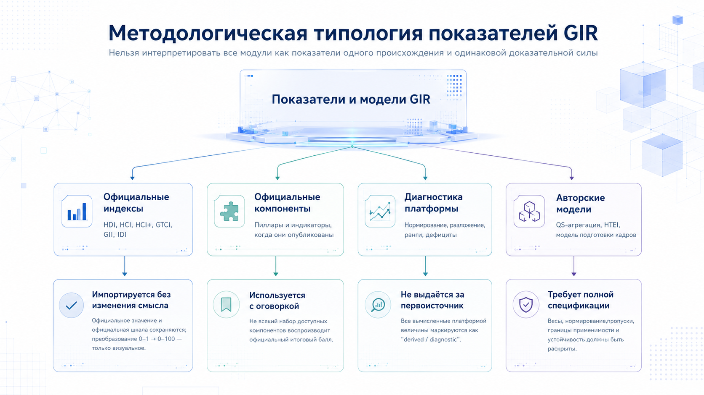
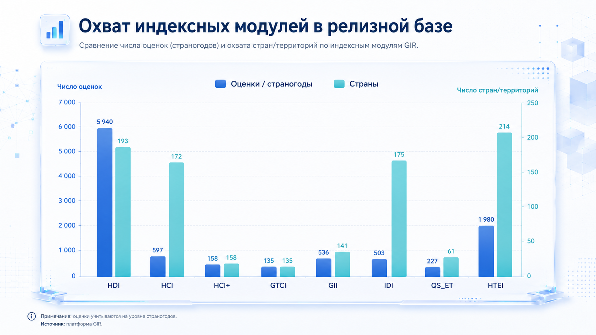
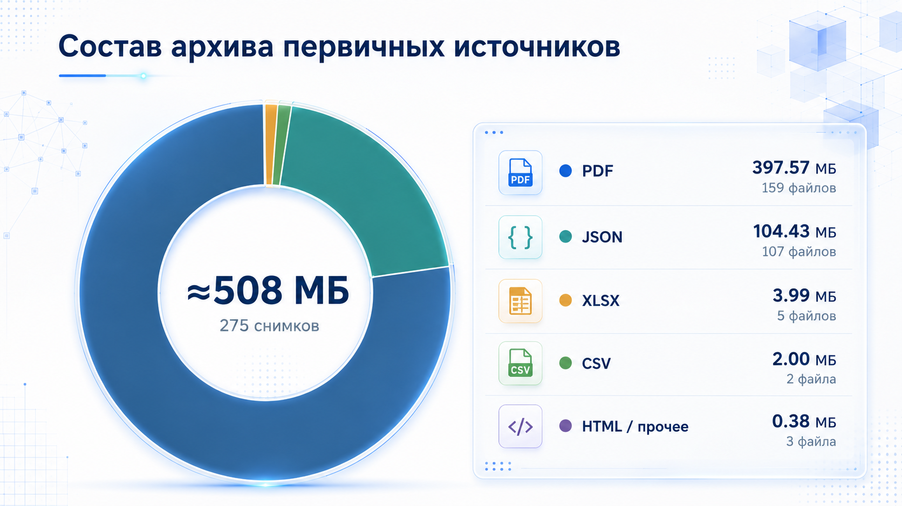
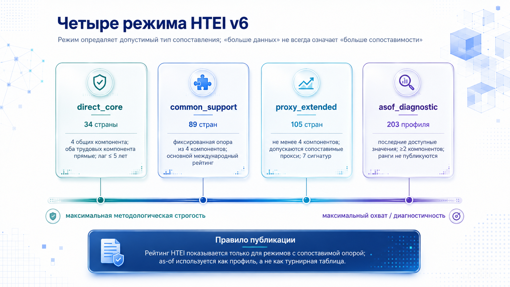
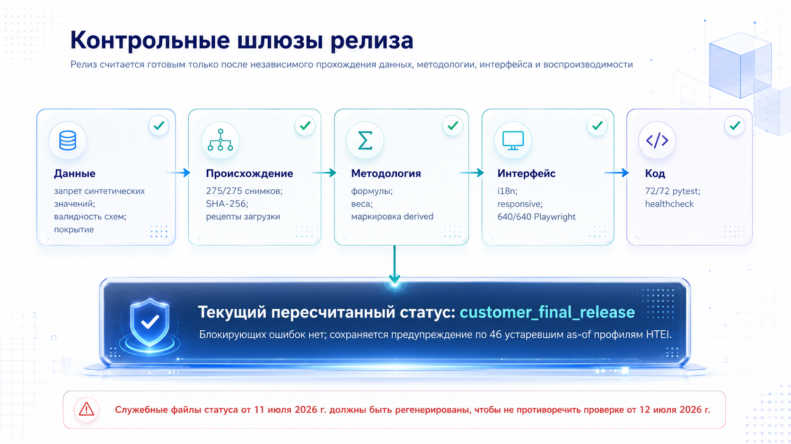
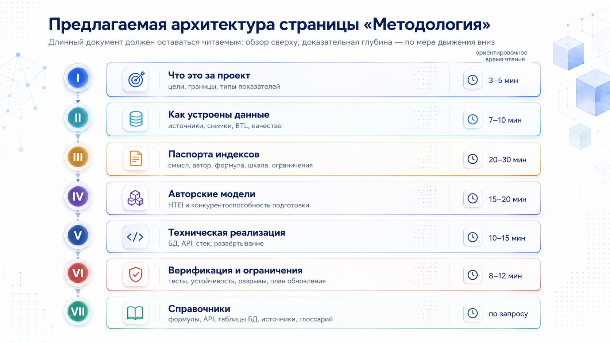

# Методология проекта GIR

**Полное описание данных, индексов, расчётов, архитектуры, API и процедур проверки**

Редакция от 12 июля 2026 г.

# Статус документа и правила чтения

> **Назначение.** Документ описывает проект по фактическому содержимому переданного релизного архива и предназначен одновременно для научной экспертизы, технического сопровождения и последующей переработки веб-страницы «Методология».

Платформа имеет публичное название Global Index Ranker (GIR), тогда как в исходном коде и структуре базы сохраняется исторический технический namespace GIIP. Это не две разные системы, а два уровня наименования одного продукта. В дальнейшем «GIR» обозначает проект и пользовательский интерфейс, а «GIIP» — технические модули, пути и идентификаторы, встречающиеся в коде.

Методология изложена по принципу «от смысла к реализации». Сначала объясняется, какую исследовательскую задачу решает платформа и чем отличаются типы показателей. Затем описываются данные, происхождение, преобразования и контроль качества. После этого приводятся паспорта индексов и авторских моделей, архитектура базы, API, программный стек, верификация и ограничения. Приложения содержат справочники, пригодные для прямого использования разработчиками и проверяющими.

> **Главное методологическое правило.** Официальный индекс, официальный компонент, диагностическое преобразование GIR и авторский составной показатель — разные сущности. Они должны иметь разную маркировку, разные формулировки в интерфейсе и разный уровень допустимых выводов.

**Таблица 1. Ключевые характеристики анализируемой сборки**

| Параметр | Значение |
| --- | --- |
| Файлы в архиве | 1 152 |
| Распакованный объём | ≈ 890,4 МБ |
| База SQLite | 187 400 192 байта (≈ 178,7 MiB) |
| Страны и территории | 225 |
| Таблицы базы данных | 36 |
| Публичные API-маршруты | 47 |
| Индексные оценки | 10 076 |
| Компонентные значения | 36 945 |
| Исходные наблюдения | 18 569 |
| Снимки источников | 275 |
| Артефакты воспроизводимости | 376 |
| Python-тесты | 72 из 72 пройдены |
| Playwright-сценарии | 640 из 640 пройдены |

_Источник: Инвентаризация архива, SQLite и актуальные валидаторы сборки от 12.07.2026._

# Содержание

- 1. Резюме проекта
- 2. Цели, задачи и границы
- 3. Методологическая рамка
- 4. Архитектура и жизненный цикл данных
- 5. Состав и объём данных
- 6. Источники, происхождение и правовой режим
- 7. Структура базы данных
- 8. Общие алгоритмы расчёта
- 9. Паспорта индексных модулей
- 10. Авторский индекс HTEI v6
- 11. Модель подготовки кадров
- 12. Национальная и корпоративная статистика
- 13. API и экспорт
- 14. Техническая архитектура
- 15. Контроль качества и релиз
- 16. Ограничения интерпретации
- 17. Несогласованности
- 18. Новая страница «Методология»
- 19. Заключение
- Приложения

# 1. Резюме проекта

GIR — исследовательская и информационно-аналитическая платформа для сопоставления стран по человеческому развитию, человеческому капиталу, талантам, инновациям, цифровой связанности, инженерно-технологическому образованию и технологической занятости. Её ценность состоит не в механическом объединении разнородных рейтингов, а в единой системе происхождения данных, сопоставимых страновых профилей, компонентной диагностики, алгоритмов рекомендаций и воспроизводимого программного контура.

В текущей сборке представлены семь актуальных пользовательских модулей — HDI, HCI+ 2026, GTCI 2025, GII, IDI, страновая агрегация QS Engineering & Technology, HTEI — и отдельный исторический модуль HCI 2010–2020. Из них шесть основаны на официальных индексах международных организаций, QS_ET является авторской страновой агрегацией официального университетского рейтинга, а HTEI — самостоятельным составным показателем проекта.

Платформа сохраняет первичные файлы или воспроизводимые рецепты их получения, фиксирует контрольные суммы SHA-256, преобразует географические идентификаторы к ISO3, хранит исходные и нормированные значения, версии формул и трансформаций, а затем публикует результаты через SQLite, FastAPI и двуязычный веб-интерфейс. Такой подход позволяет проверяющему двигаться от отображённого балла обратно к наблюдению, снимку источника и правилам расчёта.



**Таблица 2. Что именно рассчитывает или импортирует GIR**

| Модуль | Природа итогового балла | Что делает платформа | Допустимая формулировка |
| --- | --- | --- | --- |
| HDI | официальный UNDP | импортирует score; строит диагностику компонентов | официальный HDI; диагностика GIR |
| HCI 2010–2020 | официальный World Bank | импортирует исторический score и доступные компоненты | исторический официальный HCI |
| HCI+ 2026 | официальный World Bank | извлекает score и три пиллара из country briefs | официальный HCI+; ранги GIR |
| GTCI 2025 | официальный INSEAD / Portulans | импортирует общий score; переводит pillar ranks в диагностическую шкалу | официальный score; преобразованные ранги GIR |
| GII | официальный WIPO | импортирует общий и pillar scores | официальные значения WIPO |
| IDI | официальный ITU | импортирует score/pillars; вычисляет места | официальный score; место рассчитано GIR |
| QS_ET | авторская страновая агрегация | агрегирует 2 185 строк организаций в 227 страногодов | страновой показатель GIR по данным QS |
| HTEI | авторский составной индекс | нормирует, взвешивает, оценивает качество и устойчивость | авторский индекс GIR |

_Источник: Реестры indices, index_methodology_registry, index_formulas и код расчётов._

> **Ключевой вывод для новой страницы.** Верхняя часть страницы должна сразу отвечать на четыре вопроса: что измеряется; кто автор исходной методики; что импортируется официально; что рассчитывается самой платформой. Только после этого следует показывать формулы, API и технические детали.

# 2. Цели, задачи и границы проекта

## 2.1. Исследовательская цель

Цель GIR — создать воспроизводимую международную систему мониторинга, которая связывает макропоказатели человеческого развития и инновационного потенциала с более прикладной задачей формирования технологических кадров. В отличие от одиночного рейтинга, платформа позволяет увидеть одновременно положение страны, внутреннюю структуру результата, дефициты по компонентам, качество исходных данных и возможные направления политики.

## 2.2. Соответствие техническому заданию

**Таблица 3. Связь блоков технического задания с результатами платформы**

| Блок ТЗ | Смысл задачи | Реализация в GIR |
| --- | --- | --- |
| 2.1 → 3.1.2 | интегрированная база международных индексов | единая SQLite-база, справочники индексов и стран, API, происхождение данных |
| 2.2 → 3.2.1 | мониторинг и индекс технологической занятости | HTEI v6, четыре режима сопоставимости, компонентные профили и аудит |
| 2.3 → 3.3.1 | модель конкурентоспособности системы подготовки | Training Model v2, четыре блока, страновые баллы и устойчивость |
| 2.4 → 3.4.1 | рекомендации для России | диагностика разрывов, policy brief, приоритеты и источники подтверждения |

_Источник: Проектная документация и acceptance dossier в архиве._

## 2.3. Что входит в предметную область

- официальные страновые значения международных индексов и их официально опубликованные компоненты;
- первичные международные ряды занятости, профессий, исследовательских кадров, STEM-выпуска и технологических результатов;
- страновая агрегация университетских строк QS Engineering & Technology;
- авторские модели HTEI и конкурентоспособности системы подготовки технологических кадров;
- происхождение, лицензии, снимки, трансформации, качество, диагностика и рекомендации;
- публичное API, пользовательский интерфейс, экспорт и релизные доказательства.

## 2.4. Что не следует приписывать платформе

- GIR не является новой международной организацией, сертифицирующей официальные значения сторонних индексов;
- диагностический компонент или визуальный вес не доказывает официальную формулу первоисточника;
- место в рейтинге не является статистически значимым отличием от соседних стран без анализа неопределённости;
- рекомендации не заменяют отраслевое исследование причинности, бюджетную оценку и институциональную экспертизу;
- данные с разными годами наблюдения и режимами прокси не должны смешиваться без явной маркировки.

# 3. Методологическая рамка

## 3.1. Четыре класса методологических объектов

Официальный индекс — итоговая величина, опубликованная организацией-автором и импортированная без изменения её содержательного смысла. Официальный компонент — опубликованный пиллар или индикатор официального индекса. Диагностика платформы — воспроизводимое преобразование для сопоставления, визуализации или рекомендаций. Авторская модель — показатель, формула и правила которого разработаны внутри проекта и поэтому должны быть раскрыты полностью.

**Таблица 4. Маркировка происхождения и интерпретации**

| Класс | Пример | Обязательная маркировка | Что проверяется |
| --- | --- | --- | --- |
| official value | HDI, GII, HCI+ | официальное значение | совпадение с источником, дата и версия |
| official component | GII pillars, HCI+ pillars | официальный компонент | название, шкала, полнота и округление |
| recomputed diagnostic | GTCI rank transform, дефицит | рассчитано GIR | формула, направление шкалы, входы |
| derived aggregation | QS_ET country score | авторская агрегация | состав, нормирование, веса, пропуски |
| project index | HTEI | авторский индекс | концепт, прокси, веса, устойчивость, границы |
| experimental model | training model | аналитическая модель | правило включения, качество, чувствительность |

_Источник: quality_flags и index_methodology_registry._

## 3.2. Единица наблюдения

Основная аналитическая единица — страна или территория, идентифицированная кодом ISO3, в конкретном году. Для официальных индексов год обычно совпадает с годом выпуска или наблюдения, но для HTEI дополнительно сохраняется source_data_year: год фактического исходного наблюдения. Это позволяет отделить «год профиля» от возраста данных и вычислять лаг.

**Лаг исходного наблюдения**

`lag_ic = profile_year_c − source_data_year_ic`

Индекс i обозначает компонент, c — страновой профиль. Отрицательные лаги недопустимы; большие положительные лаги снижают свежесть и доверие.

## 3.3. Шкалы

Платформа стремится показывать большинство сравнимых диагностических величин на шкале 0–100, где больше означает более благоприятный результат. Это правило относится к интерфейсным и авторским показателям, но не меняет официальную шкалу источника. Например, HDI и исторический HCI официально публикуются на шкале 0–1, HCI+ — на шкале 0–325, а ранги GTCI имеют порядковую природу.

> **Предупреждение о шкалах.** Отображение 0–1 как 0–100 является линейным форматированием, а не новым расчётом. Преобразование ранга в 0–100 меняет тип величины и всегда должно называться диагностическим.

## 3.4. Принцип воспроизводимости

Каждая значимая величина должна иметь минимальный паспорт: идентификатор источника, URL, время получения, год выпуска, путь или рецепт снимка, SHA-256, идентификатор трансформации, версию формулы, флаг качества и JSON происхождения. Отсутствие одного из этих элементов не всегда делает число неверным, но снижает его аудируемость и должно быть отражено в интерфейсе.

# 4. Архитектура и жизненный цикл данных


## 4.1. Реестр источников

Работа начинается не с загрузки файла, а с регистрации источника. Таблица source_registry содержит владельца, официальное наименование, основной и фактический URL, способ доступа, частоту обновления, статус автоматизации, роль источника и сведения о последнем снимке. Таблица license_registry отдельно фиксирует правила хранения, преобразования и распространения.

## 4.2. Снимок первичных данных

Снимок raw — неизменяемое свидетельство того, что именно было получено в конкретный момент. Для каждого объекта сохраняются размер, тип содержимого, путь, URL, время получения и SHA-256. Если правила источника не позволяют безопасно распространять raw-файл, релиз хранит производный экспорт и воспроизводимый download recipe.

**Контрольная сумма снимка**

`sha256 = SHA256(binary_content)`

Совпадение контрольной суммы подтверждает побайтовую идентичность файла; оно не доказывает содержательную корректность источника, но исключает незаметную подмену.

## 4.3. Парсинг и нормализация

Парсеры обрабатывают CSV, XLSX, JSON, PDF и HTML. На этапе нормализации названия стран сопоставляются с ISO3; годы и единицы приводятся к явным полям; строки с агрегатами, регионами или неподдерживаемыми территориями отделяются; числовые значения очищаются; сохраняются исходный код показателя и измерения. PDF используется прежде всего для HCI+ и GTCI, поэтому для него особенно важны повторяемые шаблоны извлечения и контроль числа сопоставленных стран.

## 4.4. Выбор наблюдения

Для многовариантных международных рядов необходимо выбрать одну строку для компонента, страны и года. В source_observations хранятся source_priority, dimensions_json и selection_rule. Это позволяет объяснить, почему использована конкретная комбинация пола, возраста, отрасли, статуса занятости или единицы измерения. В HTEI правило выбора также зависит от режима сопоставимости.

## 4.5. Расчёт и публикация

После выбора наблюдений выполняются нормирование, агрегация и ранжирование. Результат записывается в специализированную таблицу модели и/или унифицированные index_scores и component_values. Диагностика и рекомендации формируются отдельным слоем. API не читает первичные файлы на лету: оно отдаёт подготовленное состояние базы, что делает ответы быстрыми и детерминированными.

## 4.6. Обновление

Внешний API-маршрут POST /api/refresh/{source_code} имеет информационный характер и не запускает мутацию базы из браузера. Реальное обновление выполняется командными сценариями и production builder, после чего должны повторно пройти контроль происхождения, формул, переводов, тесты и релизный шлюз. Такое разделение уменьшает риск несанкционированного изменения публичной сборки.

# 5. Состав и объём данных



**Таблица 5. Охват индексных модулей**

| Код | Оценки | Страны | Период | Компонентные строки | Компонентов |
| --- | --- | --- | --- | --- | --- |
| HDI | 5 940 | 193 | 1990–2023 | 17 820 | 3 |
| HCI | 597 | 172 | 2010–2020 | 2 137 | 4 |
| HCI_PLUS | 158 | 158 | 2026–2026 | 474 | 3 |
| GTCI | 135 | 135 | 2025–2025 | 804 | 6 |
| GII | 536 | 141 | 2022–2025 | 3 752 | 7 |
| IDI | 503 | 175 | 2023–2025 | 1 509 | 3 |
| QS_ET | 227 | 61 | 2023–2026 | 908 | 4 |
| HTEI | 1 980 | 214 | 1992–2026 | 9 541 | 6 |

_Источник: index_scores и component_values._

Наиболее длинный временной ряд — HDI: 5 940 оценок для 193 стран за 1990–2023 гг. HTEI имеет широкий охват и длинную ретроспективу исходных значений, но сравнимость профилей зависит от режима и возраста компонентов. GTCI 2025 и HCI+ 2026 являются поперечными срезами одного выпуска.



**Таблица 6. Снимки первичных источников по типам**

| MIME-тип | Снимков | Объём |
| --- | --- | --- |
| application/pdf | 159 | 379,2 МБ |
| application/json | 103 | 99,5 МБ |
| application/vnd.openxmlformats-officedocument.spreadsheetml.sheet | 5 | 3,8 МБ |
| text/csv | 1 | 1,9 МБ |
| text/html;charset=utf-8 | 2 | 249,1 КБ |
| application/json;charset=utf-8 | 1 | 110,9 КБ |
| application/json; charset=utf-8 | 3 | 9,6 КБ |
| text/csv; charset=utf-8 | 1 | 521,0 Б |

_Источник: raw_snapshots и физическая инвентаризация файлов._

## 5.1. HTEI и модель подготовки кадров

**Таблица 7. Специализированные расчётные слои**

| Набор | Строки/профили | Назначение |
| --- | --- | --- |
| HTEI v6 profiles | 431 | профили четырёх режимов |
| HTEI v6 component values | 1 909 | выбранные компоненты, веса, лаги, provenance |
| HTEI v6 missingness audit | 34 | контроль отсутствующих обязательных компонентов |
| HTEI v5 profiles | 404 | сохранённая предшествующая версия для аудита |
| Training model scores | 508 | страновые баллы 2023–2026 |
| Training model components | 4 943 | входы четырёх блоков |
| Methodology audit runs | 3 | устойчивость HTEI и training model |

_Источник: Специализированные таблицы SQLite._

## 5.2. QS, HCI+ и дополнительные слои

**Таблица 8. Дополнительные специализированные массивы**

| Набор | Объём | Комментарий |
| --- | --- | --- |
| QS institution rankings | 2 185 строк | 2023–2026; 528–556 организаций в год |
| HCI+ country scores | 158 строк | официальные country briefs, выпуск 2026 |
| National statistics metrics | 94 строки | Дания, Финляндия, Норвегия, Швеция |
| Corporate metrics | 26 строк | 8 компаний, SEC EDGAR |
| Policy brief items | 8 строк | структурированные рекомендации для России |
| Operational runs | 4 записи | журнал задач обновления |

_Источник: SQLite и project_inventory.json._

> **Как читать объём.** Число строк не равно числу независимых фактов: одно официальное значение может иметь итог, несколько компонентов, ранг, диагностику и запись происхождения. Поэтому объёмы следует рассматривать по слоям, а не суммировать как «число показателей».

# 6. Источники, происхождение и правовой режим

## 6.1. Принцип приоритета первоисточника

Для официального индекса приоритет имеет источник организации-автора: официальный CSV/XLSX, API, отчёт или страновой brief. Вторичные агрегаторы не используются как замена, если первичный источник доступен. Для HTEI приоритет источников задаётся отдельно по компонентам: прямые сопоставимые наблюдения имеют преимущество перед широкими прокси, а официальная международная статистика — перед ограниченными национальными и корпоративными рядами.

## 6.2. Реестр источников

**Таблица 9. Зарегистрированные источники**

| ID | Владелец | Доступ | Выпуск | Автоматизация | Фактический URL |
| --- | --- | --- | --- | --- | --- |
| UNDP_HDR | UNDP | official downloadable CSV | 2025 | implemented_official_download | https://hdr.undp.org/sites/default/files/2025_HDR/HDR25_Composite_indices_complete_time_series.csv |
| WORLD_BANK_HCI | World Bank | official REST API | 2020 | implemented_official_api | https://api.worldbank.org/v2/source/63 |
| WORLD_BANK_COUNTRIES | World Bank | official REST API | 2026 | implemented_official_api | https://api.worldbank.org/v2/country?format=json&per_page=400 |
| PORTULANS_GTCI | INSEAD / Portulans Institute | official PDF report extraction | 2025 | implemented_official_pdf_extract | https://portulansinstitute.org/wp-content/uploads/2025/11/GTCI_2025_report.pdf |
| WIPO_GII | WIPO | official downloadable XLSX | 2025 | implemented_official_download | https://tind.wipo.int/record/58882/files/wipo-pub-2000-2025-gii-tech1.xlsx |
| ITU_IDI | ITU | official downloadable XLSX | 2025 | implemented_official_download | https://www.itu.int/itu-d/reports/statistics/wp-content/uploads/sites/5/2025/06/IDIDataset_2025.xlsx |
| WORLD_BANK_HTEI | World Bank | official REST API | 2025 | implemented_official_api | https://api.worldbank.org/v2/indicator |
| UIS_HTEI | UNESCO Institute for Statistics | official version-pinned UIS Data API | 2026 | implemented_official_api | https://api.uis.unesco.org/api/public/data/indicators |
| ILOSTAT_HTEI | International Labour Organization | official bulk CSV API | 2025 | implemented_official_bulk_csv | https://rplumber.ilo.org/files/website/bulk/indicator.html |
| OECD_HTEI | OECD | official SDMX CSV API | 2025 | implemented_official_sdmx_api | https://sdmx.oecd.org/public/rest/v1/ |
| EUROSTAT_HTEC | Eurostat | official Eurostat Statistics API | 2025 | implemented_official_json_api | https://ec.europa.eu/eurostat/api/dissemination/statistics/1.0/data/ |
| NATIONAL_STATS_HTEI | National statistical offices | checksum-verified official-file register | 2026 | implemented_audit_register | local:methodology/national-statistics-register |
| CORPORATE_REPORTS_HTEI | Public companies and reporting issuers | checksum-verified official report register | 2026 | implemented_audit_register | local:methodology/corporate-report-register |
| SPECIALIZED_RATINGS_HTEI | QS, WIPO, Portulans and other official ranking publishers | derived from archived official ranking snapshots | 2026 | implemented_audit_register | local:methodology/specialized-ratings-register |
| HTEI_MULTI_SOURCE | MGIMO / FNISC RAS | computed manifest from official archived snapshots | 2026 | implemented_reproducible_transform | local:methodology/htei-observation-staging-v3 |
| QS_ET | QS Quacquarelli Symonds | official public JSON endpoint archive | 2026 | implemented_official_web_endpoint | https://www.topuniversities.com/university-subject-rankings/engineering-technology |
| HTEI_SCIENTIFIC_V5 | MGIMO / FNISC RAS project team | local reproducible transform | 2026 | implemented_reproducible_scientific_transform | local:docs/HTEI_METHODOLOGY_V5.md |
| HTEI_FINAL_V6 | MGIMO / FNISC RAS | derived from archived official observations | 2026 | automated | local:docs/HTEI_METHODOLOGY_V6.md |
| WORLD_BANK_HCIPLUS | World Bank | official country-brief PDFs | 2026 | automated | https://humancapital.worldbank.org/en/country-briefs |
| NATIONAL_STATS_NUMERIC | National statistical offices | official CSV/JSON endpoints | 2024 | configured | local:configs/national_statistics_sources.release.json |
| SEC_EDGAR_CORPORATE_NUMERIC | U.S. Securities and Exchange Commission | official JSON API | 2026 | automated | https://www.sec.gov/search-filings/edgar-application-programming-interfaces |

_Источник: source_registry; URL приведены как активные ссылки в разделе источников и приложении._

## 6.3. Сквозное происхождение значения

Поле provenance_json используется как машиночитаемый контейнер дополнительного контекста. Базовые элементы происхождения вынесены в отдельные колонки, чтобы их можно было фильтровать и проверять SQL-запросами. Это важное архитектурное решение: критические идентификаторы не должны существовать только внутри неструктурированного JSON.

**Таблица 10. Минимальная цепочка происхождения**

| Уровень | Основные поля | Проверяемый вопрос |
| --- | --- | --- |
| Источник | source_id, owner, source_url, release_year | кто и где опубликовал данные? |
| Снимок | snapshot_id, retrieved_at, path, SHA-256, bytes | какой именно файл был получен? |
| Наблюдение | indicator_code, dimensions, raw_value, source_data_year | какая строка и единица использованы? |
| Трансформация | transform_id, transformation_run_id, selection_rule | как строка была выбрана и преобразована? |
| Значение | value_id, score, formula_version, quality_flag | какой результат опубликован и по какой версии? |
| Интерфейс/API | endpoint, параметры, язык, год | как результат доставляется пользователю? |

_Источник: source_registry, raw_snapshots, source_observations, transformation_runs, расчётные таблицы._

## 6.4. Лицензии и распространение

Реестр лицензий носит характер консервативной внутренней политики распространения и прямо оговаривает, что не является юридическим заключением. Для каждого источника фиксируются возможность хранения, трансформации и перераспространения, обязательность атрибуции и решение о включении raw-файла в архив.

**Таблица 11. Решения о распространении**

| Решение | Источников | Смысл |
| --- | --- | --- |
| include | 11 | raw-файл допускается в релизном архиве по политике проекта |
| exclude_raw_keep_derived | 10 | raw не распространяется; сохраняются производные данные и рецепт |
| pending | 0 | требуется дополнительная проверка |

_Источник: license_registry._

В реестре воспроизводимости 174 артефакта относятся к включённым raw-файлам, 101 — к download recipe и 101 — к производным экспортам. Производные экспорты охватывают 14 352 строки. Такая схема особенно важна для источников с ограничительными условиями, включая отдельные материалы QS.

> **Практическое правило для страницы.** У каждой таблицы источников следует показывать не только организацию и ссылку, но также год выпуска, дату получения, способ доступа, статус автоматизации и режим распространения.

# 7. Структура базы данных


SQLite используется как переносимый релизный контейнер и единая точка чтения для API. Файл базы имеет размер 187 400 192 байта. Схема состоит из 36 таблиц, которые логически разделяются на справочно-методологический слой, происхождение, расчётные факты, диагностику и эксплуатационный аудит.

**Таблица 12. Группы таблиц базы**

| Группа | Таблицы | Назначение |
| --- | --- | --- |
| Справочники | countries, indices, index_aliases, components, index_components | устойчивые идентификаторы и названия |
| Методология | index_definitions, index_formulas, index_methodology_registry, quality_flags | формулы, версии, статусы и предупреждения |
| Источники | source_registry, license_registry, raw_snapshots, source_observations | происхождение, лицензии и первичные наблюдения |
| Преобразования | transformation_runs, reproducibility_artifacts | журнал преобразований и проверяемые артефакты |
| Унифицированные факты | index_scores, component_values, rankings | общий слой для большинства интерфейсных запросов |
| Диагностика | diagnostics, recommendations, policy_brief_items | дефициты, приоритеты и рекомендации |
| Спецмодели | HTEI v5/v6, HCI+, QS, training model, national/corporate | структуры, которым недостаточно общего формата |
| Операции | operational_runs, methodology_audit_runs, external_method_reviews | обновление, устойчивость и внешняя экспертиза |
| Интерфейс | ui_translations | двуязычные подписи и системные сообщения |

_Источник: PRAGMA table_info и данные SQLite._

## 7.1. Унифицированный индексный слой

Таблица index_scores содержит страну, год, индексный код, итоговый балл, ранг, перцентиль, версию формулы, флаг качества и происхождение. component_values хранит компонентные значения. rankings дублирует или оптимизирует ранговые представления. Унификация позволяет построить общий API, однако специализированные таблицы сохраняются там, где методике нужны дополнительные поля — например, confidence, coverage mode, score intervals или pillar scores.

## 7.2. Специализированные структуры HTEI

HTEI v6 требует хранения requested_year, profile_year, source_data_year, lag, effective_weight, coverage_mode, component_signature, eligibility, confidence и интервальных оценок. Попытка свести эти поля только к index_scores уничтожила бы важную информацию о сопоставимости. Поэтому специализированная таблица является первичной для методологического аудита, а общий слой — удобной проекцией для интерфейса.

## 7.3. Структура source_observations

**Таблица 13. Поля source_observations**

| Поле | Тип | Обязательное | Роль |
| --- | --- | --- | --- |
| observation_id | TEXT | нет | ключ наблюдения |
| index_code | TEXT | да | измерение |
| component_code | TEXT | да | измерение |
| iso3 | TEXT | да | география/время |
| year | INTEGER | да | география/время |
| source_data_year | INTEGER | нет | география/время |
| raw_value | REAL | да | измерение |
| unit | TEXT | да | измерение |
| normalized_score | REAL | нет | измерение |
| selected | INTEGER | да | выбор и трансформация |
| source_id | TEXT | да | происхождение |
| source_group | TEXT | да | контроль качества |
| source_priority | INTEGER | да | выбор и трансформация |
| indicator_code | TEXT | да | измерение |
| dimensions_json | TEXT | да | выбор и трансформация |
| selection_rule | TEXT | да | выбор и трансформация |
| source_url | TEXT | да | происхождение |
| retrieved_at | TEXT | да | происхождение |
| release_year | INTEGER | да | контроль качества |
| raw_snapshot_path | TEXT | да | происхождение |
| raw_snapshot_sha256 | TEXT | да | происхождение |
| transformation_run_id | TEXT | да | выбор и трансформация |
| transform_id | TEXT | да | выбор и трансформация |
| quality_flag | TEXT | да | контроль качества |
| provenance_json | TEXT | да | контроль качества |

_Источник: PRAGMA table_info(source_observations)._

> **Принцип проектирования.** Специализированные таблицы не являются дублированием «по ошибке»: они сохраняют методологические поля, а унифицированные таблицы обеспечивают общий контракт интерфейса. В документации нужно явно обозначить первичный источник истины для каждого модуля.

# 8. Общие алгоритмы расчёта

## 8.1. Нормирование min–max

**Положительно направленный показатель**

`z_ic = 100 × (x_ic − min_i)/(max_i − min_i)`

Применяется, когда большее исходное значение означает лучший результат. Минимум и максимум рассчитываются по сопоставимому набору стран и конкретной версии расчёта.

**Отрицательно направленный показатель**

`z_ic = 100 × (max_i − x_ic)/(max_i − min_i)`

Используется для рангов, стоимости, времени или иных показателей, где меньшее значение предпочтительнее.

Перед min–max HTEI применяет винзоризацию по 2,5-му и 97,5-му процентилям. Это ограничивает влияние единичных экстремальных значений, но не удаляет страны. Границы и состав сопоставимого набора должны фиксироваться в версии трансформации.

**Винзоризация**

`x′_ic = min(max(x_ic, Q_i(0,025)), Q_i(0,975))`

Затем x′ используется в min–max. Альтернативные percentile и robust-z преобразования применяются в тестах чувствительности, а не как основной опубликованный расчёт.

## 8.2. Взвешенная агрегация и пропуски

**Агрегация доступных компонентов**

`Score_c = Σ(i∈S_c) w̃_i z_ic,   w̃_i = w_i / Σ(j∈S_c) w_j`

S_c — допустимый набор доступных компонентов для страны. Перенормирование допустимо только если выполнены правила покрытия конкретной модели.

Перенормирование не должно автоматически маскировать нехватку данных. Поэтому HTEI связывает его с режимом покрытия, минимальным числом компонентов, обязательным набором и лагом. Training model использует порог доступного веса и отдельный коэффициент качества.

## 8.3. Ранжирование и перцентиль

**Ранг**

`rank_c = position of Score_c in descending order`

При равных значениях фактическая реализация должна иметь детерминированное вторичное правило сортировки, например ISO3. В опубликованном слое ранги последовательные.

**Перцентиль GIR**

`percentile_c = (N − rank_c + 1)/N × 100`

Лучшее место получает 100. Эта величина зависит от состава стран в конкретном срезе и не является вероятностью.

## 8.4. Диагностика дефицита и приоритета

**Дефицит компонента**

`gap_ic = max(0, 100 − z_ic)`

Чем ниже нормированный компонент, тем больше диагностический дефицит относительно верхней границы шкалы.

**Приоритет HTEI**

`priority_ic = gap_ic × effective_weight_i × (1 + gap_ic/100) × actionability_i`

Фактор leverage = 1 + gap/100 усиливает крупные разрывы; actionability отражает относительную управляемость компонента.

Рекомендация формируется не из текста «по настроению», а из ранжированного набора компонентных дефицитов и шаблонов действий. Тем не менее алгоритм не доказывает причинность: высокий приоритет означает аналитический сигнал для дополнительной проверки, а не автоматическое предписание политики.

## 8.5. Флаги качества

**Таблица 14. Справочник флагов качества**

| Код | Тяжесть | Метка | Интерпретация |
| --- | --- | --- | --- |
| official_value | 0 | официальное значение | Значение взято напрямую из официального источника. |
| recomputed_from_official_components | 1 | пересчитано из официальных компонентов | Компонент или диагностика рассчитаны воспроизводимо из официальных рядов. |
| official_partial_proxy | 2 | официальные прокси с неполным покрытием | Использованы официальные доступные прокси-компоненты; покрытие не полное. |
| official_file_required | 2 | требуется официальный файл | Числовой слой включается после импорта официального файла источника. |
| official_observation | 0 | официальное исходное наблюдение | Исходное наблюдение получено из официального снимка источника. |
| selected_official_observation | 1 | выбранное официальное наблюдение | Наблюдение выбрано из официальных источников по каскаду HTEI v3. |
| training_model_score | 1 | оценка модели подготовки кадров | Значение рассчитано как отдельная модель на основе проверяемых индексов и компонентов. |

_Источник: quality_flags._

## 8.6. Версионирование

Версия формулы должна изменяться при изменении состава компонентов, весов, нормирования, правил пропусков, режима источников или шкалы. Обновление только исходных данных при неизменной методике может сохранять formula_version, но обязано создавать новый transformation_run и новые снимки. Это позволяет отличить пересчёт по свежим данным от методологической ревизии.

# 9. Паспорта индексных модулей

Каждый паспорт отвечает на одинаковый набор вопросов: что измеряет индекс; кто является автором и расчётчиком; какова официальная формула или иерархия; какие данные находятся в GIR; что рассчитывается платформой; какие ограничения критичны. Такой шаблон следует использовать и на веб-странице.

## 9.1. Индекс человеческого развития (HDI / ИЧР)

**Таблица 15. Паспорт HDI**

| Параметр | Описание |
| --- | --- |
| Автор / владелец методики | Программа развития ООН; расчёт и публикация — Human Development Report Office. |
| Назначение | Сводная характеристика человеческого развития, объединяющая долголетие, образование и материальный уровень жизни. Это показатель достигнутых возможностей, а не полного качества институтов или неравенства. |
| Официальная шкала | 0-1 official score shown on a 0-100 display scale |
| Период в GIR | 1990–2023 |
| Охват | 193 стран; 5 940 оценок |
| Статус результата | Официальное значение ИЧР; компонентная панель — аналитическая диагностика платформы |
| Версия методологии в реестре | GIIP-scientific-release-v5 |
| Основной источник | https://hdr.undp.org/data-center |
| Ссылки | [1–2] |

_Источник: indices, index_methodology_registry, index_scores и официальные методические документы._

### Смысл и официальная методика

Сводная характеристика человеческого развития, объединяющая долголетие, образование и материальный уровень жизни. Это показатель достигнутых возможностей, а не полного качества институтов или неравенства.

**Официальная формула / структура**

`I_LE = (LE − 20)/(85 − 20); I_EYS = EYS/18; I_MYS = MYS/15; I_Edu = (I_EYS + I_MYS)/2; I_Income = [ln(GNIpc) − ln(100)]/[ln(75 000) − ln(100)]; HDI = (I_LE × I_Edu × I_Income)^(1/3).`

### Реализация в GIR

Платформа импортирует официальный временной ряд UNDP. Официальная шкала 0–1 отображается также как 0–100 для унификации интерфейса. Диагностические компоненты строятся из официальных полей, однако не объявляются повторным официальным расчётом.

**Таблица 16. Компоненты HDI в реестре GIR**

| Код | Название | Вес в представлении | Примечание источника |
| --- | --- | --- | --- |
| LE | Ожидаемая продолжительность жизни | 0,333 | UNDP HDR component |
| EDU | Образование | 0,333 | UNDP expected and mean years of schooling |
| GNI | ВНД на душу населения | 0,333 | UNDP GNI per capita component |

_Источник: index_components._

> **Методологическое предупреждение.** Официальный ИЧР UNDP рассчитывается как геометрическое среднее индексов здоровья, образования и дохода с фиксированными целевыми границами и логарифмическим преобразованием дохода. Min-max компоненты платформы не являются официальным пересчётом ИЧР.

### Ограничения интерпретации

HDI чувствителен к качеству национальной статистики и не описывает распределение достижений внутри страны. Сравнение следует вести по одной редакции данных; ретроспективные значения могут пересматриваться UNDP.

## 9.2. Исторический Индекс человеческого капитала (HCI 2010–2020)

**Таблица 17. Паспорт HCI**

| Параметр | Описание |
| --- | --- |
| Автор / владелец методики | Всемирный банк, Human Capital Project. |
| Назначение | Оценка ожидаемой продуктивности ребёнка, родившегося сегодня, относительно эталона полного здоровья и полного качественного образования. |
| Официальная шкала | 0-1 official score shown on a 0-100 display scale |
| Период в GIR | 2010–2020 |
| Охват | 172 стран; 597 оценок |
| Статус результата | Официальная историческая редакция Индекса человеческого капитала 2020 |
| Версия методологии в реестре | GIIP-scientific-release-v5 |
| Основной источник | https://www.worldbank.org/en/publication/human-capital |
| Ссылки | [3] |

_Источник: indices, index_methodology_registry, index_scores и официальные методические документы._

### Смысл и официальная методика

Оценка ожидаемой продуктивности ребёнка, родившегося сегодня, относительно эталона полного здоровья и полного качественного образования.

**Официальная формула / структура**

`Схематически: HCI = Survival × School × Health. Внутри факторов используются выживание до пяти лет, ожидаемые годы обучения, гармонизированные результаты обучения и показатели здоровья.`

### Реализация в GIR

В базе сохранены официальные значения 2010–2020 из API Всемирного банка и доступные официальные компоненты. Для интерфейсной диагностики четыре компонента показываются с равными визуальными весами; эти веса не являются официальной формулой HCI.

**Таблица 18. Компоненты HCI в реестре GIR**

| Код | Название | Вес в представлении | Примечание источника |
| --- | --- | --- | --- |
| SURV | Выживаемость | 0,250 | World Bank HCI survival indicators |
| SCHOOL | Ожидаемые годы обучения | 0,250 | World Bank HCI schooling |
| LEARN | Результаты обучения | 0,250 | World Bank HCI harmonized test scores |
| HEALTH | Здоровье детей | 0,250 | World Bank HCI not-stunted indicator |

_Источник: index_components._

> **Методологическое предупреждение.** Модуль отражает историческую редакцию HCI 2020. До загрузки официального HCI+ 2026 он не должен называться актуальным индексом человеческого капитала 2026 года.

### Ограничения интерпретации

Исторический HCI нельзя сшивать в единый временной ряд с HCI+ 2026. Изменились смысл, шкала и логика накопления человеческого капитала.

> **Методологический разрыв.** HCI 2010–2020 сохраняется как исторический модуль. HCI+ 2026 должен иметь отдельную вкладку, отдельную шкалу и отдельный временной контекст; линия тренда через 2020–2026 недопустима.

## 9.3. Human Capital Index Plus (HCI+ 2026)

**Таблица 19. Паспорт HCI_PLUS**

| Параметр | Описание |
| --- | --- |
| Автор / владелец методики | Всемирный банк. Авторы методологии: Benoît Decerf, Ritika D’Souza, Norbert Schady, Joana Silva, Brian William Stacy. |
| Назначение | Актуальная оценка человеческого капитала на протяжении жизненного и трудового цикла: здоровье и питание, образование, обучение на рабочем месте и занятость. |
| Официальная шкала | 0-325 official score |
| Период в GIR | 2026–2026 |
| Охват | 158 стран; 158 оценок |
| Статус результата | Официальная актуальная редакция HCI+ 2026 |
| Версия методологии в реестре | world-bank-hci-plus-2026 |
| Основной источник | https://humancapital.worldbank.org/en/country-briefs |
| Ссылки | [4–5] |

_Источник: indices, index_methodology_registry, index_scores и официальные методические документы._

### Смысл и официальная методика

Актуальная оценка человеческого капитала на протяжении жизненного и трудового цикла: здоровье и питание, образование, обучение на рабочем месте и занятость.

**Официальная формула / структура**

`HCI+ = Health & Nutrition + Education + On-the-job Learning & Employment. Официальная шкала агрегата — 0–325. Пиллары аддитивны, но опубликованные округлённые значения могут не давать точную сумму.`

### Реализация в GIR

Платформа извлекает официальный итог и три официальных пиллара из страновых brief-файлов Всемирного банка. В архиве 159 PDF; 158 страновых строк успешно сопоставлены с ISO3, Косово не включено в основную таблицу стран.

> **Методологическое предупреждение.** HCI+ является основной актуальной редакцией; исторический HCI 2020 показан отдельно из-за методологического разрыва.

### Ограничения интерпретации

HCI+ — самостоятельная редакция, а не продолжение HCI 2020. Гендерные оценки доступны не для всех стран; любые ранги платформы являются вычисленной сортировкой официальных баллов.

## 9.4. Global Talent Competitiveness Index (GTCI 2025)

**Таблица 20. Паспорт GTCI**

| Параметр | Описание |
| --- | --- |
| Автор / владелец методики | INSEAD и Portulans Institute; редакторы выпуска 2025: Felipe Monteiro, Rafael Escalona Reynoso, Paul A. L. Evans. |
| Назначение | Сопоставление стран по способности создавать условия для талантов, привлекать, развивать и удерживать их, а также превращать таланты в профессиональные и глобальные знания. |
| Официальная шкала | 0-100 |
| Период в GIR | 2025–2025 |
| Охват | 135 стран; 135 оценок |
| Статус результата | Официальный итоговый score GTCI и официальные ранги направлений; преобразованная шкала — диагностика платформы |
| Версия методологии в реестре | GIIP-scientific-release-v5 |
| Основной источник | https://portulansinstitute.org/reports/ |
| Ссылки | [6] |

_Источник: indices, index_methodology_registry, index_scores и официальные методические документы._

### Смысл и официальная методика

Сопоставление стран по способности создавать условия для талантов, привлекать, развивать и удерживать их, а также превращать таланты в профессиональные и глобальные знания.

**Официальная формула / структура**

`Индекс построен как иерархия 77 индикаторов, 6 пилларов и двух блоков input/output. На верхнем уровне используются простые средние, но точная официальная процедура включает подготовку и нормирование каждого индикатора.`

### Реализация в GIR

GIR импортирует официальный итоговый score. В доступном отчёте пиллары представлены рангами; для диаграмм платформа применяет обратное преобразование R_score = (R_max − r + 1)/R_max × 100 при R_max = 135. Это диагностическая шкала, а не официальный pillar score.

**Таблица 21. Компоненты GTCI в реестре GIR**

| Код | Название | Вес в представлении | Примечание источника |
| --- | --- | --- | --- |
| ENABLE | Среда для талантов | 0,167 | GTCI model pillar |
| ATTRACT | Привлечение талантов | 0,167 | GTCI model pillar |
| GROW | Развитие талантов | 0,167 | GTCI model pillar |
| RETAIN | Удержание талантов | 0,167 | GTCI model pillar |
| VT | Профессионально-технические навыки | 0,167 | GTCI model pillar |
| GA | Адаптивные навыки высокого уровня | 0,167 | GTCI model pillar |

_Источник: index_components._

> **Методологическое предупреждение.** Платформа не выдаёт преобразованные ранги направлений за официальный компонентный score GTCI.

### Ограничения интерпретации

Преобразованные ранги нельзя интерпретировать как расстояния между странами. Платформа не пересчитывает GTCI из 77 исходных индикаторов.

## 9.5. Global Innovation Index (GII)

**Таблица 22. Паспорт GII**

| Параметр | Описание |
| --- | --- |
| Автор / владелец методики | Всемирная организация интеллектуальной собственности (WIPO) при участии партнёров выпуска. |
| Назначение | Системная оценка ресурсов инновационной деятельности и результатов, которые экономика способна из них получить. |
| Официальная шкала | 0-100 |
| Период в GIR | 2022–2025 |
| Охват | 141 стран; 536 оценок |
| Статус результата | Официальный score и официальные pillar scores Глобального инновационного индекса |
| Версия методологии в реестре | GIIP-scientific-release-v5 |
| Основной источник | https://www.wipo.int/global_innovation_index/en/ |
| Ссылки | [7–8] |

_Источник: indices, index_methodology_registry, index_scores и официальные методические документы._

### Смысл и официальная методика

Системная оценка ресурсов инновационной деятельности и результатов, которые экономика способна из них получить.

**Официальная формула / структура**

`Innovation Input Sub-index = среднее пяти входных пилларов; Innovation Output Sub-index = среднее двух выходных пилларов; GII = среднее Input и Output. В 2025 г. структура включает 7 пилларов, 21 субпиллар и 78 индикаторов.`

### Реализация в GIR

Платформа импортирует официальный итоговый балл и официальные баллы семи пилларов за 2022–2025 гг. Равные веса, используемые для некоторых интерфейсных представлений, не подменяют полную методологию WIPO.

**Таблица 23. Компоненты GII в реестре GIR**

| Код | Название | Вес в представлении | Примечание источника |
| --- | --- | --- | --- |
| INST | Институты | 0,143 | WIPO pillar score |
| HCR | Человеческий капитал и исследования | 0,143 | WIPO pillar score |
| INFRA | Инфраструктура | 0,143 | WIPO pillar score |
| MARKET | Развитость рынков | 0,143 | WIPO pillar score |
| BUS | Развитость бизнеса | 0,143 | WIPO pillar score |
| KTO | Знания и технологии: результаты | 0,143 | WIPO pillar score |
| CRE | Креативные результаты | 0,143 | WIPO pillar score |

_Источник: index_components._

> **Методологическое предупреждение.** Платформа не пересчитывает официальный GII и не интерпретирует равные веса визуальных блоков как официальную формулу WIPO.

### Ограничения интерпретации

Состав индикаторов и доступность экономик меняются по выпускам. Сопоставление во времени требует проверки методических изменений и пересчётов источника.

## 9.6. ICT Development Index (IDI)

**Таблица 24. Паспорт IDI**

| Параметр | Описание |
| --- | --- |
| Автор / владелец методики | Международный союз электросвязи (ITU). |
| Назначение | Измерение универсальной и значимой цифровой связанности: наличия доступа и фактического качества/доступности использования. |
| Официальная шкала | 0-100 |
| Период в GIR | 2023–2025 |
| Охват | 175 стран; 503 оценок |
| Статус результата | Официальный Индекс развития ИКТ ITU |
| Версия методологии в реестре | GIIP-scientific-release-v5 |
| Основной источник | https://www.itu.int/itu-d/reports/statistics/idi2025/ |
| Ссылки | [9–10] |

_Источник: indices, index_methodology_registry, index_scores и официальные методические документы._

### Смысл и официальная методика

Измерение универсальной и значимой цифровой связанности: наличия доступа и фактического качества/доступности использования.

**Официальная формула / структура**

`IDI = (Universal Connectivity + Meaningful Connectivity)/2. Внутри иерархии применяются равные веса; исходные показатели min–max нормируются, affordability инвертируется, internet traffic логарифмируется, 3G/4G покрытие объединяется с весами 0,4/0,6.`

### Реализация в GIR

В релизной базе находится официальный набор ITU 2025 и ряды 2023–2025. ACCESS и MEANING соответствуют официальным пилларам; USE — диагностический блок GIR. ITU не публикует официальный рейтинг, поэтому места в GIR вычисляются сортировкой официальных баллов.

**Таблица 25. Компоненты IDI в реестре GIR**

| Код | Название | Вес в представлении | Примечание источника |
| --- | --- | --- | --- |
| ACCESS | Универсальная связность | 0,400 | ITU pillar score |
| USE | Использование ИКТ | 0,200 | ITU normalized use indicators |
| MEANING | Качество значимой связности | 0,400 | ITU pillar score |

_Источник: index_components._

> **Методологическое предупреждение.** Фактический год и редакция IDI показываются рядом со значением.

### Ограничения интерпретации

К июлю 2026 г. опубликована редакция IDI 2026 для 159 экономик, но текущая сборка всё ещё основана на наборе 2025; это приоритетное обновление данных.

> **Обновление выпуска.** Текущая база содержит IDI до 2025 г., хотя официальная редакция 2026 уже опубликована. Обновление требует нового снимка, импорта, сопоставления 159 экономик и повторной проверки формул и рангов.

## 9.7. QS Engineering & Technology: страновая агрегация GIR

**Таблица 26. Паспорт QS_ET**

| Параметр | Описание |
| --- | --- |
| Автор / владелец методики | Исходный университетский рейтинг рассчитывает QS Quacquarelli Symonds; страновую агрегацию разработала команда GIR. |
| Назначение | Показать не отдельный университет, а присутствие страны в глобальном инженерно-технологическом образовательном поле. |
| Официальная шкала | 0-100 country aggregation from archived official endpoint rows |
| Период в GIR | 2023–2026 |
| Охват | 61 стран; 227 оценок |
| Статус результата | Авторская страновая агрегация официального университетского рейтинга QS Engineering & Technology |
| Версия методологии в реестре | GIIP-scientific-release-v5 |
| Основной источник | https://www.topuniversities.com/university-subject-rankings/engineering-technology |
| Ссылки | [11–12] |

_Источник: indices, index_methodology_registry, index_scores и официальные методические документы._

### Смысл и официальная методика

Показать не отдельный университет, а присутствие страны в глобальном инженерно-технологическом образовательном поле.

**Официальная формула / структура**

`QS ранжирует университеты по пяти индикаторам, веса которых зависят от предметной области. QS не публикует официальный страновой индекс Engineering & Technology.`

### Реализация в GIR

Для страны и года рассчитываются TOP_COUNT, BEST_RANK, MEDIAN_RANK и QS_SCORE. Направленные показатели переводятся в 0–100 (ранги инвертируются), после чего Country_QS = 0,25×TOP_COUNT* + 0,25×BEST_RANK* + 0,25×MEDIAN_RANK* + 0,25×QS_SCORE*. Если разброс показателя равен нулю, реализация присваивает 100 всем наблюдениям.

**Таблица 27. Компоненты QS_ET в реестре GIR**

| Код | Название | Вес в представлении | Примечание источника |
| --- | --- | --- | --- |
| TOP_COUNT | Число вузов в рейтинге | 0,250 | Official QS export field |
| BEST_RANK | Лучшая позиция вуза | 0,250 | Official QS export field |
| MEDIAN_RANK | Медианная позиция вузов | 0,250 | Official QS export field |
| QS_SCORE | Суммарная оценка вузов | 0,250 | Official QS export field |

_Источник: index_components._

> **Методологическое предупреждение.** QS не публикует официальный страновой рейтинг Engineering & Technology. Страновой score является воспроизводимой авторской агрегацией платформы.

### Ограничения интерпретации

Итог — авторская агрегация GIR и не должен называться официальным рейтингом стран QS. Архивирование и распространение исходных строк регулируются условиями QS.

> **Наименование.** В интерфейсе следует писать «страновая агрегация GIR по данным QS Engineering & Technology», а не «официальный рейтинг стран QS».

# 10. Авторский индекс HTEI v6

> **Статус HTEI.** HTEI — авторский индекс проекта, рассчитанный на официальных международных рядах. Он не является официальным показателем Eurostat, ILO, OECD, UNESCO, Всемирного банка или иной организации-поставщика данных.

## 10.1. Концепция

HTEI измеряет не только текущую долю занятых в узко определённых высокотехнологичных отраслях. Концепция шире: технологическая занятость рассматривается как результат взаимодействия спроса на труд, профессиональной структуры, исследовательского потенциала, образовательного потока, технологических результатов и корпоративного спроса. Поэтому название High-Tech Employment Index следует сопровождать пояснением, что это интегральный показатель экосистемы технологических кадров.

В базе HTEI охватывает 214 стран и территории и содержит 1 980 унифицированных индексных оценок за 1992–2026 гг. Однако ретроспективная длина отдельных исходных рядов не означает, что все страны и годы входят в единый сопоставимый рейтинг. Основной релизный слой v6 состоит из 431 профиля четырёх режимов.


**Таблица 28. Компоненты HTEI v6**

| Код | Смысл | Базовый вес | Основные источники | Actionability |
| --- | --- | --- | --- | --- |
| HT_EMPLOYMENT_SHARE | занятость в высокотехнологичных и знаниеёмких секторах | 0,22 | Eurostat; ILOSTAT | 0,75 |
| HIGH_TECH_OCCUPATIONS | занятость в технологически интенсивных профессиональных группах | 0,18 | Eurostat; ILOSTAT | 0,80 |
| RD_PERSONNEL | исследователи и технический персонал НИОКР | 0,18 | OECD; UIS | 0,65 |
| STEM_PIPELINE | доля выпускников STEM в третичном образовании | 0,16 | UIS; World Bank | 0,85 |
| TECH_OUTPUTS | высокотехнологичный экспорт, ИКТ-услуги, патентные сигналы | 0,14 | World Bank; WIPO/OECD where available | 0,55 |
| CORPORATE_DEMAND | корпоративный спрос, проксируемый бизнес-финансированием НИОКР | 0,12 | OECD; SEC supplementary | 0,70 |

_Источник: HTEI_METHODOLOGY_V6.md, index_components и production_data.py._

## 10.2. Основная формула

**HTEI для доступного набора компонентов**

`HTEI_c = Σ(i∈S_c) w̃_i z_ic,   w̃_i = w_i / Σ(j∈S_c) w_j`

z_ic — нормированный на шкалу 0–100 компонент; S_c задаётся режимом покрытия. Качество данных в v5/v6 не умножается на содержательный балл.

Разделение score и confidence принципиально. В ранних legacy-версиях v3 встречалась формула, где содержательный балл умножался на качество. Эти записи сохранены в реестре для происхождения, но не должны использоваться для объяснения текущего HTEI v6. В актуальной методике показатель отвечает на вопрос «каков профиль», а confidence — «насколько надёжно и сопоставимо он измерен».

## 10.3. Режимы сопоставимости



**Таблица 29. Режимы HTEI v6**

| Режим | Профили | С рангом | Средн. confidence | Годы исходных данных | Сигнатур | Компонентов | Правило |
| --- | --- | --- | --- | --- | --- | --- | --- |
| asof_diagnostic | 203 | 0 | 0,7127 | 2011–2026 | 25 | 4,36 | последние доступные значения; не менее двух компонентов; профиль без ранга |
| common_support | 89 | 89 | 0,7473 | 2021–2026 | 1 | 4,00 | фиксированная опора из занятости, профессий, STEM и результатов; основной международный рейтинг |
| direct_core | 34 | 34 | 0,7554 | 2022–2025 | 1 | 4,00 | четыре общих компонента; оба трудовых компонента прямые; лаг каждого ≤5 лет |
| proxy_extended | 105 | 105 | 0,8374 | 2018–2026 | 7 | 5,07 | не менее четырёх компонентов; допускаются сопоставимые прокси и разные сигнатуры |

_Источник: htei_v6_profiles и project_inventory.json._

## 10.4. Common support

Common support — основной режим для международного ранжирования. Все страны имеют одинаковую четырёхкомпонентную сигнатуру: HT_EMPLOYMENT_SHARE, HIGH_TECH_OCCUPATIONS, STEM_PIPELINE и TECH_OUTPUTS. После исключения недоступных базовых компонентов исходные веса 0,22; 0,18; 0,16; 0,14 перенормируются к сумме 1.

**Эффективные веса common support**

`employment = 0,314286; occupations = 0,257143; STEM = 0,228571; outputs = 0,200000`

Единая сигнатура обеспечивает интерпретируемость различий: страны сравниваются по одному и тому же набору компонентов.

## 10.5. Direct core

Direct core — наиболее строгий режим. Он использует ту же четырёхкомпонентную опору, но требует, чтобы оба трудовых компонента были получены из прямых, методологически наиболее близких рядов. В текущей сборке это 34 страны, преимущественно с Eurostat и сопоставимыми официальными рядами. Режим полезен как контрольный эталон, но не обеспечивает глобального охвата.

## 10.6. Proxy extended

Proxy extended расширяет охват до 105 стран и в среднем использует 5,07 компонента. Он допускает семь сигнатур и прокси, прошедшие правила сопоставимости. Более высокий средний confidence этого режима не означает большей структурной однородности: он отражает хорошее покрытие и свежесть, тогда как различия сигнатур требуют осторожности при интерпретации близких мест.

## 10.7. As-of diagnostic

As-of diagnostic строит максимально широкий профиль из последних доступных значений. В нём 203 профиля, 25 компонентных сигнатур и в среднем 4,36 компонента. Ранги намеренно отсутствуют. Режим отвечает на вопрос «что известно о стране сейчас с учётом имеющихся рядов», а не «какое место страна занимает в строго сопоставимом наборе».

> **Предупреждение.** В текущем релизном шлюзе остаётся предупреждение о 46 as-of профилях с устаревшими компонентами. Это не блокирует релиз, поскольку режим не ранжируется, но должно быть видно пользователю как ограничение свежести.

## 10.8. Источники и прокси

**Таблица 30. Источник данных HTEI и роль**

| Источник | Наблюдений | Стран | Период | Основная роль |
| --- | --- | --- | --- | --- |
| Eurostat | 349 | 39 | 2019–2025 | прямые высокотехнологичные сектора и профессии |
| ILOSTAT | 543 | 160 | 2011–2026 | глобальные отраслевые и профессиональные прокси |
| OECD | 96 | 47 | 2017–2025 | НИОКР и бизнес-финансирование |
| UNESCO UIS | 377 | 150 | 2011–2025 | исследователи, техники, STEM-выпуск |
| World Bank | 544 | 195 | 2012–2025 | технологический экспорт, ИКТ-услуги и дополнительные ряды |

_Источник: source_observations, агрегаты релизной сборки._

Глобальный трудовой компонент ILOSTAT использует отраслевые группы ISIC J и M как широкий прокси информационно-коммуникационной и профессионально-научной деятельности. Профессиональный компонент опирается на укрупнённые группы ISCO-08 2–3. Эти прокси шире узкого определения high-tech; поэтому direct_core и common_support должны визуально отличаться от proxy_extended.

Корпоративный компонент не является прямым счётчиком вакансий технологических компаний. Основной сопоставимый прокси — доля бизнеса в финансировании GERD; ограниченные корпоративные данные SEC используются как дополнительный слой, а не как глобальная замена официальной статистики.

## 10.9. Confidence и интервалы

**Свежесть**

`freshness_c = max(0, 1 − mean_lag_c/12)`

При среднем лаге 0 лет свежесть равна 1; при лаге 12 лет и более — 0.

**Покрытие**

`coverage_c = min(1, n_components_c/6)`

Полный шестикомпонентный профиль имеет coverage 1; четырёхкомпонентный — 0,667.

**Разнообразие источников**

`diversity_c = min(1, n_source_groups_c/4)`

Показатель поощряет независимые группы источников, но не доказывает их методологическую эквивалентность.

**Итоговая уверенность**

`confidence_c = 0,45×coverage_c + 0,35×freshness_c + 0,20×diversity_c`

Confidence — индекс качества данных 0–1, а не статистическая вероятность истинности score.

**Эвристический интервал score**

`half_width_c = max(1, (1 − confidence_c)×10);  interval = [score−half_width, score+half_width]∩[0,100]`

Интервал предназначен для интерфейсного предупреждения. Он не является доверительным интервалом, поскольку не получен из вероятностной модели ошибок.

Интервал ранга определяется как набор позиций стран, чьи баллы попадают в score interval рассматриваемой страны. Он показывает чувствительность места к неопределённости качества, но не учитывает полную совместную ковариацию компонентов.

## 10.10. Диагностика и рекомендации

**Leverage**

`leverage_ic = 1 + gap_ic/100`

Крупный разрыв получает нелинейное усиление от 1 до 2.

**Приоритет действия**

`priority_ic = gap_ic × effective_weight_i × leverage_ic × actionability_i`

Итог сортирует компоненты для объяснения и policy brief. Значения actionability: employment 0,75; occupations 0,80; R&D 0,65; STEM 0,85; outputs 0,55; corporate 0,70.

## 10.11. Устойчивость

**Таблица 31. Аудит чувствительности HTEI v6**

| Показатель | Значение |
| --- | --- |
| Число прогонов | 206 |
| Стран в контрольном рейтинге | 89 |
| Средняя Spearman ρ | 0,996861 |
| Минимальная Spearman ρ | 0,934729 |
| Среднее абсолютное изменение ранга | 1,130 |
| Максимальное изменение ранга | 33 |
| Шлюз устойчивости | пройден |

_Источник: methodology_audit_runs; возмущения весов, альтернативное нормирование и leave-one-component-out._

Средняя ранговая корреляция около 0,997 указывает на высокую общую устойчивость рейтинга, но минимальная корреляция около 0,935 и максимальное изменение 33 места показывают, что отдельные страны чувствительны к исключению трудовых компонентов. Поэтому рядом с местом полезно показывать компонентный профиль и интервал ранга, а не только одно число.

## 10.12. Авторство и институциональная ответственность

В source_registry институциональным владельцем HTEI указаны MGIMO / FNISC RAS, а в документации методика описана как модель проекта. Переданный архив не содержит утверждённого списка индивидуальных авторов HTEI. Поэтому публичная страница не должна приписывать авторство конкретным лицам без отдельного согласованного библиографического основания. Рекомендуемая формулировка: «авторская методика исследовательского коллектива проекта GIR; институциональная принадлежность — MGIMO / FNISC RAS», с последующим добавлением персонального авторского списка из утверждённого научного отчёта.

# 11. Модель конкурентоспособности системы подготовки кадров

> **Статус модели.** Training Model v2 — отдельная аналитическая модель. Она использует часть индексных и HTEI-компонентов, но не является второй версией HTEI и не должна смешиваться с ним в одной шкале.

## 11.1. Концепция и блоки

Модель оценивает, насколько национальная система способна создавать институциональные условия, обеспечивать образовательный поток, связывать подготовку с корпоративным спросом и быть включённой в международную среду. Это скорее модель конкурентоспособности экосистемы подготовки, чем показатель качества отдельных университетов.

**Таблица 32. Блоки Training Model v2**

| Блок | Вес | Компоненты и источники |
| --- | --- | --- |
| Институциональный | 0,25 | GTCI ENABLE; GII Institutions; IDI Meaningful Connectivity |
| Образовательный | 0,30 | HCI School; HCI Learning; QS_ET Top Count; HTEI STEM Pipeline |
| Корпоративный | 0,25 | GII Business Sophistication; HTEI Corporate Demand; HTEI Tech Outputs |
| Международный | 0,20 | GTCI Attract; QS_ET QS Score; GII Knowledge & Technology Outputs |

_Источник: TRAINING_MODEL_METHODOLOGY_V2.md и production_data.py._

**Базовый балл модели**

`Base_c = Σ(b∈B_c) W̃_b × BlockScore_bc`

Вес доступных блоков перенормируется внутри допустимого набора B_c.

**Коэффициент качества реализации**

`Final_c = Base_c × (0,90 + 0,10×data_quality_c)`

В отличие от HTEI v6, текущая реализация training model включает небольшой quality multiplier: при качестве 0 итог уменьшается на 10%, при качестве 1 не меняется.

В базе 508 страногодовых оценок для 135 стран за 2023–2026 гг. и 4 943 компонентных строки. Контроль чувствительности проведён на 117 странах в 200 прогонах.

**Таблица 33. Аудит устойчивости Training Model v2**

| Показатель | Значение |
| --- | --- |
| Прогонов | 200 |
| Стран | 117 |
| Средняя Spearman ρ | 0,998747 |
| Минимальная Spearman ρ | 0,996995 |
| Среднее абсолютное изменение ранга | 1,126 |
| Максимальное изменение ранга | 13 |
| Статус | пройден |

_Источник: methodology_audit_runs._

## 11.2. Правило включения и обнаруженное расхождение

Текстовая методика указывает требование не менее трёх блоков и 70% суммарного веса. Фактический код production_data.py проверяет порог available_block_weight < 0.65, то есть допускает профиль при 65% доступного веса. Это не стилистическое расхождение, а различие в составе публикуемой выборки.

> **Необходимое решение.** До публикации новой страницы нужно выбрать нормативный порог — 0,65 или 0,70 — и синхронно обновить код, методику, тесты и подписи API. В настоящем документе фактической реализацией считается 0,65, а 0,70 фиксируется как заявленное правило документации.

## 11.3. Интерпретация

Высокий балл модели означает согласованность нескольких макроуровневых сигналов, а не доказанное качество конкретных образовательных программ. Используемые индексы частично коррелируют и могут содержать общие исходные ряды. Поэтому модель подходит для сравнительной диагностики и отбора кейсов, но не для причинной оценки эффективности реформ.

# 12. Национальная и корпоративная статистика

## 12.1. Национальные статистические API

В релизе присутствует пилотный слой официальной национальной статистики четырёх североевропейских стран. Он содержит 94 строки и используется для разработки более точных трудовых компонентов и crosswalk-правил. Эти данные не включены в common_support, поскольку определения, отраслевые классификации и временные охваты ещё не подтверждены как полностью эквивалентные глобальным рядам.

**Таблица 34. Национальные статистические источники**

| Страна | Ведомство | Хост | Строки | Период |
| --- | --- | --- | --- | --- |
| DNK | Statistics Denmark | api.statbank.dk | 17 | 2008–2024 |
| FIN | Statistics Finland | pxdata.stat.fi | 21 | 2004–2024 |
| NOR | Statistics Norway | data.ssb.no | 38 | 1970–2024 |
| SWE | Statistics Sweden | api.scb.se | 18 | 2007–2024 |

_Источник: national_statistics_metrics и configs/national_statistics_sources.release.json._

Правильный путь развития слоя — не простое добавление новых стран, а формализация таблиц соответствия отраслей и профессий, документирование единиц, половозрастного охвата, статуса занятости и разрыва классификаций. До завершения crosswalk национальные значения должны показываться как дополнительная верификация или профиль, а не как бесшовная замена Eurostat/ILOSTAT.

## 12.2. Корпоративные данные SEC

Корпоративный слой содержит 26 строк для восьми публичных компаний из пяти стран: SAP, ARM, ASML, TSMC, Alphabet, Apple, IBM и Microsoft. Источник — SEC EDGAR API. Выборка предназначена для доказательства технической возможности извлечения и для дополнительного аналитического контекста, а не для построения репрезентативного глобального индикатора вакансий или спроса на кадры.

**Таблица 35. Границы корпоративного слоя**

| Аспект | Текущее состояние | Следствие |
| --- | --- | --- |
| Охват компаний | 8 крупных публичных технологических компаний | сильная селекция по размеру, юрисдикции и публичности |
| Охват стран | 5 стран | недостаточно для глобального рейтинга |
| Источник | финансовые раскрытия SEC | показатели не равны вакансиям и структуре занятости |
| Роль в HTEI | дополнительный контекст | не подменяет официальный корпоративный прокси |
| Правовой режим | официальный API с правилами доступа | нужно соблюдать user-agent и ограничения SEC |

_Источник: corporate_metrics, sec_companies.release.json, SEC EDGAR._

> **Рекомендация.** На веб-странице корпоративные данные следует вынести в раздел «экспериментальные дополнительные источники» и не визуально смешивать с официальными глобальными рядами HTEI.

# 13. API и экспорт

## 13.1. Назначение API

FastAPI предоставляет единый программный контракт для интерфейса, внешней интеграции и проверки. OpenAPI-описание включает 47 маршрутов. Базовый локальный адрес — http://127.0.0.1:8000; интерактивная документация FastAPI в типовой конфигурации доступна через /docs и /openapi.json, если она не отключена при развёртывании.

Маршруты можно разделить на восемь групп: системное состояние; справочники; страновые профили; индексные рейтинги и компоненты; HTEI; training model и policy; происхождение/качество/управление; экспорт и геоданные. Большинство операций только читают подготовленную базу.

**Таблица 36. Группы API-маршрутов**

| Группа | Маршрутов | Основное назначение |
| --- | --- | --- |
| Система и релиз | 5 | health, readiness, acceptance и журнал операций |
| Индексы и рейтинги | 8 | общие index endpoints, formula, explainer и QS |
| Справочники и методология | 8 | страны, индексы, источники, формулы и локализация |
| Страновые профили | 6 | карточки, command center, диагностика и HCI/HCI+ |
| Экспорт и матрицы | 4 | CSV, brief, GeoJSON и cross-index matrix |
| HTEI | 9 | модель, профили, рейтинги и аудит v5/v6 |
| Модель подготовки и policy | 4 | баллы, рейтинги и рекомендации |
| Качество и управление | 5 | provenance, лицензии, review и data quality |

_Источник: OpenAPI 3.1, версия 1.0.0-rc6._

## 13.2. Основные сценарии

**Таблица 37. Типовые запросы API**

| Задача | Метод и путь | Параметры/результат |
| --- | --- | --- |
| Проверить сервис | GET /api/health | статус процесса и доступность базы |
| Получить список индексов | GET /api/indices | метаданные, шкала, авторитет и статус |
| Открыть страновой профиль | GET /api/country/{iso3}/profile | path ISO3; optional year |
| Получить рейтинг индекса | GET /api/index/{code}/ranking | code и optional year |
| Показать компоненты | GET /api/index/{code}/components | iso3 и year |
| Объяснить формулу | GET /api/index/{code}/formula | версия формулы, веса, нормирование |
| Трассировать значение | GET /api/provenance/value/{value_id} | источник, снимок, трансформация |
| Получить HTEI v6 | GET /api/htei/v6/profile/{iso3} | режимы, компоненты, confidence, интервалы |
| Экспортировать brief | GET /api/export/country/{iso3}/brief | структурированный страновой обзор |
| Проверить релиз | GET /api/release/readiness | гейты, блокеры и предупреждения |

_Источник: giip_openapi.json._

## 13.3. Параметры, ошибки и стабильность

Параметры code и iso3 должны проверяться по справочникам; year — по доступности конкретного модуля. Клиенту нельзя предполагать, что один и тот же год есть у всех индексов. Ответы должны сохранять различие между requested year, profile year и source data year, особенно для HTEI и модели подготовки.

Для публичной интеграции желательно формализовать единый error envelope с кодом, человеческим сообщением, деталями параметров и request id. OpenAPI-версия в архиве обозначена как 1.0.0-rc6, тогда как актуальный релизный валидатор выдаёт customer_final_release. Перед внешней публикацией версию API и статусные документы следует синхронизировать.

## 13.4. Обновление данных через API

> **Безопасность.** POST /api/refresh/{source_code} не должен восприниматься как удалённая административная команда. В текущем проекте он информирует о способе обновления; фактическая мутация выполняется CLI/планировщиком в контролируемой среде.

## 13.5. Экспорт

Экспортные маршруты предоставляют cross-index matrix в JSON/CSV, страновой brief и world.geojson. Для исследовательского использования к каждому экспорту желательно добавлять generated_at, версию базы, формулу, список источников и лицензионные примечания. CSV должен сохранять машинно читаемые коды, а локализованные названия — предоставляться отдельными колонками.

# 14. Техническая архитектура и эксплуатация

## 14.1. Программный стек

**Таблица 38. Основные технологии**

| Слой | Технологии | Роль |
| --- | --- | --- |
| Backend | Python 3.12; FastAPI 0.128.2; Uvicorn 0.48.0 | API, валидация, чтение SQLite |
| Хранилище | SQLite | переносимый релизный data store |
| Загрузка/обработка | requests, httpx, openpyxl, pdfplumber, pycountry, Babel | API, таблицы, PDF, ISO3, локализация |
| Frontend | vanilla HTML/CSS/JavaScript | двуязычный интерактивный интерфейс без тяжёлого framework |
| Тестирование | pytest; Playwright | unit/integration и end-to-end UI |
| Контейнеризация | Docker; docker-compose | повторяемое развёртывание и healthcheck |

_Источник: requirements.lock, Dockerfile, package.json и исходный код._

## 14.2. Модули backend

**Таблица 39. Ключевые Python-модули**

| Модуль | Назначение |
| --- | --- |
| giip/api.py | FastAPI-маршруты, сборка ответов, статические ресурсы |
| giip/db.py | инициализация, схема и доступ к SQLite |
| giip/production_data.py | производственная загрузка и расчёт индексов/моделей |
| giip/htei_release_finalization.py | финализация HTEI и релизных артефактов |
| giip/release_readiness.py | контрольные гейты релиза |
| giip/final_release_v6.py | финальный процесс v6 |
| giip/acceptance.py | проверка соответствия техническому заданию |
| giip/cli.py | команды init, validate, runserver |

_Источник: Структура исходного кода._

## 14.3. Запуск

**Локальная инициализация**

`python -m giip.cli init`

**Проверка данных**

`python -m giip.cli validate`

**Запуск сервера**

`python -m giip.cli runserver`

Скрипты run_platform.sh, open_platform.cmd и docker-compose.yml предоставляют более удобные сценарии запуска. Docker-образ работает от непривилегированного пользователя giip, содержит healthcheck и выносит data/outputs в тома. Для production следует дополнительно настроить reverse proxy, HTTPS, журналирование, резервное копирование и ограничения ресурсов.

## 14.4. Обновление и планировщик

Скрипты refresh_official_sources.py, fetch_hci_plus_2026.py, fetch_national_statistics_metrics.py, fetch_sec_corporate_metrics.py, import_qs_official_export.py и run_scheduled_refresh.py разделяют источники по типу. После загрузки production builder формирует факты и артефакты. Отдельный release_gate.sh последовательно запускает валидаторы. Такая модульность полезна для точечного обновления и диагностики ошибок.

## 14.5. Резервное копирование

SQLite требует резервировать не только основной файл, но и, при активном режиме WAL, связанные файлы журнала либо выполнять согласованную backup-операцию. В архиве предусмотрен scripts/backup_restore.py и регламент обновления. Для формального сопровождения рекомендуется хранить: базу, raw/derived artifacts, конфигурации источников, OpenAPI, release evidence и git commit/manifest одной версией.

## 14.6. Безопасность

Публичный слой в основном read-only. Тем не менее следует ограничить административные маршруты, не раскрывать локальные пути в ответах, проверять пользовательские path-параметры и не допускать произвольных SQL/URL. Внешние загрузчики должны иметь тайм-ауты, контролируемый user-agent, лимиты размера и запрет следования на небезопасные схемы. Архив не должен содержать ключи, cookies или credential-bearing URL.

# 15. Контроль качества и релиз



## 15.1. Автоматические проверки

**Таблица 40. Актуальные результаты проверок от 12.07.2026**

| Проверка | Результат | Что подтверждает |
| --- | --- | --- |
| pytest | 72 passed | backend, загрузчики, API, регрессии и ассеты |
| Playwright | 640 passed; 0 failed/skipped/flaky | 8 desktop/mobile/tablet × ru/en × light/dark проектов |
| validate_no_generated_data --strict | passed | отсутствие запрещённых синтетических значений |
| validate_i18n_labels --strict | passed | полнота и корректность двуязычных меток |
| validate_source_provenance --strict | passed; 275/275 | воспроизводимость всех зарегистрированных снимков |
| validate_index_formulas --strict | passed | формулы и методологические статусы |
| validate_final_release_candidate | customer_final_release | финальная классификация сборки |
| validate_release_readiness --strict | release_ready=true | нет блокеров; одно предупреждение HTEI as-of |

_Источник: current_release_validation.txt и final_v6_playwright_manifest.json._

## 15.2. Playwright-матрица

E2E-проверка включает desktop-en-dark, desktop-en-light, desktop-ru-dark, desktop-ru-light, mobile-en, mobile-ru, tablet-en и tablet-ru. Полный прогон от 12 июля 2026 г. содержит 640 успешных сценариев. Это подтверждает широкое покрытие интерфейсных состояний, но не заменяет ручную научную экспертизу содержания, доступность для assistive technologies и нагрузочное тестирование.

## 15.3. Научная устойчивость

Методологические аудиты HTEI и training model сохранены в базе как отдельные записи. Это правильнее, чем приводить только итог «устойчив»: проверяющий может видеть число прогонов, ранговые корреляции и максимальные сдвиги. Внешние рецензии должны храниться в external_method_reviews, но сейчас таблица пуста.

> **Внешняя экспертиза.** Наличие таблицы external_method_reviews не означает прохождение внешнего научного рецензирования. В текущей базе 0 записей. На странице следует писать «контур внешней экспертизы предусмотрен», а не «методика прошла внешнее рецензирование».

## 15.4. Текущий релизный статус

Свежий пересчёт всех валидаторов классифицирует архив как customer_final_release и release_ready=true. Блокирующих ошибок нет. Единственное предупреждение относится к 46 устаревшим профилям asof_diagnostic HTEI. Это предупреждение методологически обосновано и не должно быть скрыто.

Одновременно в архиве присутствуют сгенерированные файлы RELEASE_STATUS.md и release_readiness.json от 11 июля 2026 г., где ещё указан final_release_candidate и отсутствующий Playwright manifest. Эти документы устарели относительно фактического manifest от 12 июля и свежей проверки. Следует регенерировать статусные файлы перед формальным распространением.

## 15.5. Рекомендуемый релизный чек-лист

1. зафиксировать git commit или patch manifest и SHA-256 релизного архива;
2. обновить источники и создать новые raw snapshots без перезаписи старых;
3. выполнить production build в чистой среде;
4. проверить схемы, происхождение, формулы, i18n и отсутствие generated data;
5. запустить pytest и полный Playwright matrix;
6. пересчитать audits при изменении HTEI/training methodology;
7. сгенерировать OpenAPI, release status, evidence manifest и пользовательские документы одной датой;
8. проверить лицензионные решения и отсутствие чувствительных данных;
9. собрать архив, вычислить SHA-256 и выполнить smoke-test из архива.

# 16. Ограничения и корректная интерпретация

## 16.1. Несопоставимость выпусков

Международные индексы пересматривают источники, состав показателей, географический охват и формулы. Поэтому временная линия официальных баллов может отражать не только изменение страны, но и изменение методики. Наиболее жёсткий разрыв в проекте — HCI 2020 и HCI+ 2026. Для GII, GTCI и IDI также следует проверять методические notes каждого выпуска.

## 16.2. Запаздывание исходных данных

Год публикации индекса может быть новее фактического года наблюдения. В HTEI это отражено явным lag и confidence. В официальных агрегатах лаги могут быть скрыты внутри методики первоисточника. Интерфейс должен по возможности показывать «выпуск» и «данные преимущественно за…» отдельно.

## 16.3. Прокси и конструктивная валидность

Высокотехнологичная занятость не имеет единого глобально доступного определения. ILO ISIC J+M, укрупнённые ISCO 2–3, бизнес-финансирование НИОКР и технологический экспорт являются содержательно связанными, но неполными прокси. Их использование оправдано для международной диагностики при явной маркировке, crosswalk и анализе чувствительности.

## 16.4. Ранги и ложная точность

Разница в одно место может быть вызвана сотыми долями score, округлением, составом стран или изменением доступности. Поэтому рядом с рангом полезнее показывать балл, перцентиль, интервал ранга и ключевые компоненты. Ранг — порядок, а не расстояние и не вероятность превосходства.

## 16.5. Корреляция источников

Составные модели используют индексы и компоненты, которые могут иметь общие макроэкономические основания или одни и те же первичные источники. Формально разные блоки не всегда независимы. Это может усиливать устойчивый сигнал уровня развития, но одновременно создавать скрытое двойное считывание. Для следующей версии полезен аудит lineage на уровне первичных индикаторов.

## 16.6. Причинность и рекомендации

Диагностика отвечает на вопрос «где наблюдается относительный дефицит», но не доказывает, какая мера устранит его. Policy brief должен включать проверяемые гипотезы, ответственные институты, горизонт, измеримый outcome и риски. Для принятия решений требуется сочетать GIR с отраслевой статистикой, кейсами и оценкой политики.

## 16.7. Территории и ISO3

Справочник содержит 225 стран и территорий. Разные источники могут включать зависимые территории, Косово, агрегаты или специальные экономические единицы. Сопоставление должно сохранять исходное название и правило мэппинга. Отдельно нужно документировать исключённые записи; пример — Косово в HCI+ 2026, не сопоставленное с основной таблицей.

## 16.8. Ограничения внешней проверки

Автоматические тесты подтверждают формальную целостность реализации, но не заменяют независимую валидацию конструкта HTEI, рецензирование весов, проверку национальными экспертами и сравнительный анализ с альтернативными показателями рынка труда. Таблица external_method_reviews пока пуста, поэтому научная уверенность должна формулироваться умеренно.

# 17. Выявленные несогласованности и необходимые решения

**Таблица 41. Реестр расхождений**

| Объект | Наблюдение | Рекомендуемое действие |
| --- | --- | --- |
| Релизный статус | Старые файлы от 11.07: final_release_candidate / missing Playwright; свежая проверка 12.07: customer_final_release, 640/640 | регенерировать RELEASE_STATUS.md, readiness JSON и acceptance outputs одной датой |
| Версия OpenAPI | info.version = 1.0.0-rc6 при финальном статусе | принять схему версионирования и выпустить 1.0.0 либо явно оставить rc6 |
| Training model threshold | методика: 70%; код: 65% доступного веса | выбрать порог, синхронизировать код/док/тест и пересчитать охват |
| IDI edition | база и URL — 2025; официально доступна редакция 2026 | создать новый snapshot и обновить набор до IDI 2026 |
| HTEI as-of freshness | 46 профилей отмечены как устаревшие | показать warning; обновить источники или ужесточить профиль |
| Внешние рецензии | external_method_reviews содержит 0 строк | не заявлять завершённое рецензирование; организовать и импортировать reviews |
| Авторство HTEI | в архиве есть институциональный владелец, но нет персонального списка | добавить утверждённую библиографическую запись авторов |
| HCI+ coverage | 159 PDF, 158 строк, Косово не сопоставлено | документировать исключение и решить политику ISO3/XKX |
| Legacy HTEI formulas | в реестре сохранены версии с quality multiplier | явно маркировать как historical/legacy, не показывать по умолчанию |
| QS status | риск восприятия как официального странового рейтинга | переименовать интерфейс и показать формулу агрегации GIR |
| Current methodology page | карточки статуса вместо связного объяснения | заменить длинной структурой из раздела 18; карточки оставить как резюме |

_Источник: Сопоставление кода, базы, сгенерированных документов, валидаторов и OpenAPI._

> **Приоритет.** Наиболее существенное содержательное решение — порог Training Model 65/70%. Наиболее существенное релизное решение — синхронизация статусных файлов и версии API. Остальные пункты преимущественно относятся к прозрачности и обновлению данных.

# 18. Проект новой страницы «Методология»



## 18.1. Общий принцип

Страница должна быть не панелью статусов, а читаемым документом. Карточки полезны только как верхнее резюме. Основной контент следует организовать в одноколоночный поток с фиксированным оглавлением, якорными ссылками, раскрываемыми техническими деталями и отдельными предупреждениями. Проверяющий должен получить смысл без чтения кода, а разработчик — точные поля, формулы и API в тех же разделах.

## 18.2. Рекомендуемая структура

**Таблица 42. Блоки новой страницы**

| Блок | Содержание | Форма представления |
| --- | --- | --- |
| 1. Что такое GIR | цель, аудитория, границы, 8 модулей, типология official/derived/project | короткое резюме + схема + ключевые числа |
| 2. Как устроены данные | источники, raw snapshots, ETL, ISO3, provenance, лицензии | текст + pipeline + таблица источников |
| 3. Паспорта индексов | автор, смысл, шкала, формула, данные GIR, ограничения | повторяемые секции / accordion |
| 4. HTEI | концепция, 6 компонентов, 4 режима, confidence, устойчивость | полный самостоятельный раздел |
| 5. Training model | 4 блока, формула, качество, порог включения, аудит | самостоятельный раздел с warning |
| 6. Техническая реализация | БД, API, Docker, обновление, экспорт | диаграммы + справочные таблицы |
| 7. Проверка и ограничения | тесты, release status, known issues, внешняя экспертиза | checklist + dated evidence |
| 8. Справочник | API, schema, formulas, glossary, references | поиск, якоря, скачивание документа |

_Источник: Результат анализа текущей страницы и всего релизного пакета._

## 18.3. Навигация

- фиксированное боковое оглавление на desktop и кнопка «Содержание» на mobile;
- якорь на каждый индекс, формулу, источник и API-группу;
- плашка «официальное / рассчитано GIR / авторская модель» в заголовке каждого паспорта;
- переключатель «кратко / подробно», скрывающий таблицы БД и технические детали, но не методологические warnings;
- поиск по коду индекса, компоненту, источнику и endpoint;
- кнопки копирования формулы и API-примера;
- ссылки на raw/derived provenance только при допустимом режиме распространения.

## 18.4. Типовой паспорт индекса на странице

**Таблица 43. Шаблон карточки-паспорта**

| Поле | Что показать |
| --- | --- |
| Название | русское и английское, код, текущий выпуск |
| Статус | official index / official components / derived / project |
| Автор | организация; редакторы/авторы методики, если они официально указаны |
| Что измеряет | 2–3 абзаца человеческим языком |
| Шкала и направление | официальная шкала и интерфейсное отображение |
| Формула | официальная формула либо честное описание «импортируется без пересчёта» |
| Реализация GIR | источник, охват, трансформации, ранги, version |
| Компоненты | таблица кодов, названий, весов и происхождения |
| Ограничения | методические разрывы, пропуски, прокси, неофициальные операции |
| Данные/API | год, число стран, endpoint, export, дата обновления |

_Источник: Рекомендуемый унифицированный шаблон._

## 18.5. Визуальная система

Цвет должен кодировать тип методологического объекта, а не «хорошо/плохо»: синий — официальный индекс, бирюзовый — официальный компонент, золотой — диагностика, фиолетовый — авторская модель, красный — предупреждение, зелёный — пройденная проверка. Основной текст должен оставаться чёрным на светлом фоне; тёмная тема требует отдельной проверки контраста.

## 18.6. Что оставить из текущей страницы

Текущие карточки архитектуры, качества, реестра методик и release readiness полезны как краткое состояние системы. Их следует перенести под executive summary и связать с подробными якорями. Не следует оставлять карточки единственным объяснением: они не раскрывают смысл индексов, происхождение формул и пределы интерпретации.

## 18.7. Машиночитаемая документация

Длинная HTML-страница должна строиться из тех же реестров, что и API, чтобы формула или статус не расходились между интерфейсом и базой. Текстовые пояснения можно хранить в структурированном контентном слое, но критические значения — code, score_status, methodology_version, weights, source_id, release_year — должны подтягиваться из БД/OpenAPI. Настоящий DOCX и Markdown могут служить исходной редакцией и техническим заданием на такую сборку.

# 19. Заключение

GIR уже обладает существенно более сильной методологической основой, чем это видно на текущей странице «Методология». В архиве присутствуют первичные снимки, реестры, контрольные суммы, версии формул, специализированные модели, аудиты устойчивости, 72 backend-теста и 640 end-to-end сценариев. Основная задача переосмысления страницы — сделать эту доказательную инфраструктуру видимой и понятной.

Центральная содержательная идея будущей документации — честное разделение происхождения показателей. Официальные значения должны сопровождаться автором и первоисточником; диагностические преобразования — собственной формулой GIR; авторские модели — полным описанием конструкта, прокси, весов, пропусков, качества и устойчивости. Это одновременно повышает научную добросовестность и облегчает техническую проверку.

Перед формальной публикацией рекомендуется синхронизировать release-status артефакты, OpenAPI version и порог Training Model, обновить IDI до выпуска 2026, документировать HCI+ Kosovo mapping, добавить утверждённый список авторов HTEI и организовать внешнее методологическое рецензирование. Эти шаги не отменяют готовности текущей сборки, но переводят её из технически завершённого продукта в зрелую публичную научно-аналитическую систему.

> **Итоговая рекомендация.** Использовать данный документ как master-спецификацию: основной текст — для страницы, таблицы API и БД — для справочных раскрывающихся блоков, а реестр расхождений — как план завершающих правок перед публичным релизом.

# Приложения

Приложения являются техническим справочником и могут быть перенесены на веб-страницу в виде раскрывающихся таблиц или отдельного downloadable reference. Числа и структуры соответствуют анализируемой сборке от 12 июля 2026 г.

## Приложение A. Реестр индексов и компонентов

**Таблица 44. Полный реестр индексов**

| Код | Название | Авторитет | Шкала | Статус | Режим расчёта |
| --- | --- | --- | --- | --- | --- |
| HDI | Индекс человеческого развития | UNDP | 0-1 official score shown on a 0-100 display scale | official_index | official score with diagnostic components normalized from official fields |
| HCI | Индекс человеческого капитала | World Bank | 0-1 official score shown on a 0-100 display scale | official_index | official API score with available official HCI component indicators |
| GTCI | Индекс глобальной конкурентоспособности талантов | INSEAD / Portulans | 0-100 | official_index | official report rank and score extraction |
| GII | Глобальный инновационный индекс | WIPO | 0-100 | official_index | official score and pillar import from WIPO database |
| IDI | Индекс развития ИКТ | ITU | 0-100 | official_index | official aggregate and pillar scores from ITU dataset |
| QS_ET | QS: инженерия и технологии | QS | 0-100 country aggregation from archived official endpoint rows | derived_country_aggregation | derived_country_aggregation from archived official QS endpoint rows |
| HTEI | Индекс занятости в высокотехнологичных отраслях | MGIMO / FNISC RAS | 0-100 | project_index_required_by_TZ | computed from official workforce, R&D, STEM and technology output indicators |
| HCI_PLUS | Индекс человеческого капитала плюс (HCI+) | World Bank | 0-325 official score | official_index | official HCI+ 2026 country-brief import |

_Источник: indices._

**Таблица 45. Компоненты индексных модулей**

| Индекс | Код компонента | Название | Вес | Источник/примечание |
| --- | --- | --- | --- | --- |
| HDI | LE | Ожидаемая продолжительность жизни | 0,3333 | UNDP HDR component |
| HDI | EDU | Образование | 0,3333 | UNDP expected and mean years of schooling |
| HDI | GNI | ВНД на душу населения | 0,3333 | UNDP GNI per capita component |
| HCI | SURV | Выживаемость | 0,2500 | World Bank HCI survival indicators |
| HCI | SCHOOL | Ожидаемые годы обучения | 0,2500 | World Bank HCI schooling |
| HCI | LEARN | Результаты обучения | 0,2500 | World Bank HCI harmonized test scores |
| HCI | HEALTH | Здоровье детей | 0,2500 | World Bank HCI not-stunted indicator |
| GTCI | ENABLE | Среда для талантов | 0,1667 | GTCI model pillar |
| GTCI | ATTRACT | Привлечение талантов | 0,1667 | GTCI model pillar |
| GTCI | GROW | Развитие талантов | 0,1667 | GTCI model pillar |
| GTCI | RETAIN | Удержание талантов | 0,1667 | GTCI model pillar |
| GTCI | VT | Профессионально-технические навыки | 0,1667 | GTCI model pillar |
| GTCI | GA | Адаптивные навыки высокого уровня | 0,1667 | GTCI model pillar |
| GII | INST | Институты | 0,1429 | WIPO pillar score |
| GII | HCR | Человеческий капитал и исследования | 0,1429 | WIPO pillar score |
| GII | INFRA | Инфраструктура | 0,1429 | WIPO pillar score |
| GII | MARKET | Развитость рынков | 0,1429 | WIPO pillar score |
| GII | BUS | Развитость бизнеса | 0,1429 | WIPO pillar score |
| GII | KTO | Знания и технологии: результаты | 0,1429 | WIPO pillar score |
| GII | CRE | Креативные результаты | 0,1429 | WIPO pillar score |
| IDI | ACCESS | Универсальная связность | 0,4000 | ITU pillar score |
| IDI | USE | Использование ИКТ | 0,2000 | ITU normalized use indicators |
| IDI | MEANING | Качество значимой связности | 0,4000 | ITU pillar score |
| QS_ET | TOP_COUNT | Число вузов в рейтинге | 0,2500 | Official QS export field |
| QS_ET | BEST_RANK | Лучшая позиция вуза | 0,2500 | Official QS export field |
| QS_ET | MEDIAN_RANK | Медианная позиция вузов | 0,2500 | Official QS export field |
| QS_ET | QS_SCORE | Суммарная оценка вузов | 0,2500 | Official QS export field |
| HTEI | HT_EMPLOYMENT_SHARE | Занятость в информационно-коммуникационных и профессионально-научно-технических видах деятельности / high-tech и KIS там, где доступна прямая статистика | 0,2200 | Для Eurostat используется секторный high-tech/KIS подход; для глобального покрытия — прозрачно маркированный отраслевой proxy. Показатель не интерпретируется как полностью идентичная статистика во всех странах. |
| HTEI | HIGH_TECH_OCCUPATIONS | Доля специалистов высшего и среднего профессионально-технического уровня (ISCO-08 2–3, широкий профессиональный proxy) | 0,1800 | ISCO-08 major groups 2–3 включают широкий круг специалистов и техников и не являются исключительно перечнем high-tech профессий. Показатель используется как международно сопоставимый proxy профессиональной интенсивности. |
| HTEI | RND_PERSONNEL | Персонал исследований и разработок | 0,1800 | Используется официальный показатель численности исследователей и/или техников НИОКР на миллион населения либо сопоставимая гармонизированная мера. |
| HTEI | STEM_PIPELINE | Образовательный поток STEM | 0,1600 | Доля выпускников третичного образования по естественным наукам, математике, ИКТ, инженерным и смежным направлениям; фактический состав раскрывается в provenance. |
| HTEI | TECH_OUTPUTS | Технологические результаты экономики | 0,1400 | Композит официальных показателей high-tech exports, ICT services exports и/или патентной активности. Для каждой страны интерфейс раскрывает фактически использованные исходные показатели. |
| HTEI | CORPORATE_STRATEGY_AND_DEMAND | Корпоративное участие в НИОКР (proxy корпоративной технологической активности; не показатель вакансий) | 0,1200 | Доля бизнес-сектора в расходах на НИОКР используется как proxy корпоративной технологической активности. Она не измеряет напрямую вакансии, дефицит навыков или кадровые стратегии. |

_Источник: index_components._

## Приложение B. Реестр формул и методологических статусов

**Таблица 46. Зарегистрированные формулы**

| Индекс | Версия | Формула/правило | Нормирование | Источник | Официальная формула доступна |
| --- | --- | --- | --- | --- | --- |
| HDI | official-hdi-timeseries-2025 | Официальная оценка ИЧР UNDP; диагностические компоненты нормируются из life expectancy, schooling и GNI. | Официальные оценки 0-100 используются напрямую; внешние исходные компоненты нормируются min-max по доступным странам. | UNDP_HDR | да |
| HCI | official-hci-series | Официальная оценка World Bank HCI; компоненты берутся из доступных индикаторов HCI. | Официальные оценки 0-100 используются напрямую; внешние исходные компоненты нормируются min-max по доступным странам. | WORLD_BANK_HCI | да |
| GTCI | official-gtci-2025-pillars | Официальная оценка GTCI 2025 извлечена из таблицы рейтинга; шесть направлений диагностики рассчитаны из официальных рангов по направлениям Enable, Attract, Grow, Retain, VT и GA из таблицы Rankings by Pillar. | Официальные оценки 0-100 используются напрямую; внешние исходные компоненты нормируются min-max по доступным странам. | PORTULANS_GTCI | да |
| GII | official-gii-2025 | Официальная оценка WIPO GII и семь направлений из базы GII 2025. | Официальные оценки 0-100 используются напрямую; внешние исходные компоненты нормируются min-max по доступным странам. | WIPO_GII | да |
| IDI | official-idi-series-2023-2025 | Официальная оценка ITU IDI и направления из набора IDI 2025. | Официальные оценки 0-100 используются напрямую; внешние исходные компоненты нормируются min-max по доступным странам. | ITU_IDI | да |
| QS_ET | qs-country-aggregation-v1 | Страновая агрегация рассчитывается из архивированных строк официального endpoint QS: число вузов, лучшая позиция, медианная позиция и суммарная оценка вузов. | Официальные оценки 0-100 используются напрямую; внешние исходные компоненты нормируются min-max по доступным странам. | QS_ET | нет |
| HTEI | htei-v3-multisource | Индекс занятости в высокотехнологичных отраслях v3 = сумма нормированных компонентов ILOSTAT, OECD, Eurostat/национальной статистики, UIS и World Bank, умноженных на веса и коэффициент качества покрытия; значения не переносятся между годами без явного source_data_year. | Официальные оценки 0-100 используются напрямую; внешние исходные компоненты нормируются min-max по доступным странам. | HTEI_MULTI_SOURCE | да |
| HTEI | htei-v3-multisource-asof-2026 | Индекс занятости в высокотехнологичных отраслях рассчитывается как многоисточниковый as-of composite: для каждой страны берётся последний доступный официальный показатель по каждому компоненту на дату релизной сборки; компоненты нормируются min-max по доступным странам; базовая оценка = сумма нормированных компонентов с весами, делённая на доступный вес; релизная оценка = базовая оценка × коэффициент качества данных. | Min-max по последним доступным официальным наблюдениям; итоговая оценка нормируется на доступный вес и коэффициент качества данных. | HTEI_MULTI_SOURCE | нет |
| HCI_PLUS | official-hci-plus-2026 | HCI+ = здоровье + образование + занятость; официальный балл Всемирного банка на шкале 0–325. | Официальные значения используются без перенормировки. | WORLD_BANK_HCIPLUS | да |
| HTEI | htei-v5-scientific-2026 | HTEI = сумма нормированных компонентных оценок, умноженных на эффективные веса, перенормированные по доступным компонентам. Коэффициент качества публикуется отдельно и не изменяет содержательную оценку. Места присваиваются только сопоставимому ядру стран. | Winsorized min-max 0–100; качество, свежесть и полнота показываются отдельно. | HTEI_SCIENTIFIC_V5 | да |
| HDI | hdi-official-method-note-v2 | Официальный ИЧР UNDP является геометрическим средним индексов здоровья, образования и дохода: HDI=(I_health×I_education×I_income)^(1/3). | Официальные целевые границы UNDP; логарифмическое преобразование дохода. | UNDP_HDR | да |
| HCI | hci-historical-2020-official-score | Официальное значение исторической редакции HCI 2020 импортируется без авторского пересчёта. | Официальная методика Всемирного банка; платформа не применяет равные веса для официального score. | WORLD_BANK_HCI | нет |
| GII | gii-official-score-and-pillars | Официальный итоговый score и pillar scores импортируются из базы WIPO; платформа не пересчитывает официальный GII. | Официальные score WIPO; аналитические gap/diagnostic calculations выполняются поверх них. | WIPO_GII | нет |
| HTEI | htei-v6-common-support-2026 | HTEI использует утверждённые веса НИР. Основной международный срез Common Support рассчитывается на одном и том же наборе четырёх компонентов: занятость, профессиональная структура, STEM pipeline и технологические результаты; исходные веса перенормируются только внутри этого фиксированного набора. Качество данных публикуется отдельно и не изменяет содержательную оценку. | Робастная нормировка исходных официальных рядов в HTEI v5; в Common Support используется один фиксированный набор компонентов. | HTEI_FINAL_V6 | нет |

_Источник: index_formulas. Исторические версии сохранены для происхождения и не всегда являются текущими._

**Таблица 47. Методологический реестр**

| Код | Score | Компоненты | Формула | Версия | Предупреждение |
| --- | --- | --- | --- | --- | --- |
| HCI_PLUS | official_hci_plus_2026 | official_pillar_scores | official_additive_score | world-bank-hci-plus-2026 | HCI+ является основной актуальной редакцией; исторический HCI 2020 показан отдельно из-за методологического разрыва. |
| HDI | official_score | platform_diagnostic_decomposition | official_formula_not_recomputed_by_platform | GIIP-scientific-release-v5 | Официальный ИЧР UNDP рассчитывается как геометрическое среднее индексов здоровья, образования и дохода с фиксированными целевыми границами и логарифмическим преобразованием дохода. Min-max компоненты платформы не являются официальным пересчётом ИЧР. |
| HCI | official_historical_score_2020 | official_indicators_with_platform_diagnostics | historical_edition_not_recomputed | GIIP-scientific-release-v5 | Модуль отражает историческую редакцию HCI 2020. До загрузки официального HCI+ 2026 он не должен называться актуальным индексом человеческого капитала 2026 года. |
| GTCI | official_score | official_pillar_ranks_with_platform_transformation | official_methodology_not_recomputed | GIIP-scientific-release-v5 | Платформа не выдаёт преобразованные ранги направлений за официальный компонентный score GTCI. |
| GII | official_score | official_pillar_scores | official_methodology_not_recomputed | GIIP-scientific-release-v5 | Платформа не пересчитывает официальный GII и не интерпретирует равные веса визуальных блоков как официальную формулу WIPO. |
| IDI | official_score | official_pillar_scores | official_methodology | GIIP-scientific-release-v5 | Фактический год и редакция IDI показываются рядом со значением. |
| QS_ET | derived_country_aggregation | official_university_rows_with_platform_aggregation | platform_formula | GIIP-scientific-release-v5 | QS не публикует официальный страновой рейтинг Engineering & Technology. Страновой score является воспроизводимой авторской агрегацией платформы. |
| HTEI | project_composite_index | fixed_common_support_and_diagnostic_tiers | approved_research_weights_v6 | GIIP-final-release-v6 | Common Support является основным сопоставимым рейтингом; Direct Core показывает слой прямых данных; ASOF-профили не ранжируются. |

_Источник: index_methodology_registry._

## Приложение C. Источники и лицензии

**Таблица 48. Источник, доступ и решение по архиву**

| ID | Владелец | Роль | Выпуск | Доступ | Частота | Автоматизация | Архив | Права по реестру |
| --- | --- | --- | --- | --- | --- | --- | --- | --- |
| UNDP_HDR | UNDP | numeric_source | 2025 | official downloadable CSV | annual | implemented_official_download | include | storage yes / transform yes / redistribute yes |
| WORLD_BANK_HCI | World Bank | numeric_source | 2020 | official REST API | irregular | implemented_official_api | include | storage yes / transform yes / redistribute yes |
| WORLD_BANK_COUNTRIES | World Bank | reference_metadata | 2026 | official REST API | regular | implemented_official_api | include | storage yes / transform yes / redistribute yes |
| PORTULANS_GTCI | INSEAD / Portulans Institute | numeric_source | 2025 | official PDF report extraction | annual | implemented_official_pdf_extract | exclude_raw_keep_derived | storage yes / transform yes / redistribute no |
| WIPO_GII | WIPO | numeric_source | 2025 | official downloadable XLSX | annual | implemented_official_download | exclude_raw_keep_derived | storage yes / transform yes / redistribute no |
| ITU_IDI | ITU | numeric_source | 2025 | official downloadable XLSX | annual | implemented_official_download | exclude_raw_keep_derived | storage yes / transform yes / redistribute no |
| WORLD_BANK_HTEI | World Bank | numeric_source | 2025 | official REST API | regular | implemented_official_api | include | storage yes / transform yes / redistribute yes |
| UIS_HTEI | UNESCO Institute for Statistics | numeric_source | 2026 | official version-pinned UIS Data API | regular | implemented_official_api | include | storage yes / transform yes / redistribute yes |
| ILOSTAT_HTEI | International Labour Organization | numeric_source | 2025 | official bulk CSV API | regular | implemented_official_bulk_csv | include | storage yes / transform yes / redistribute yes |
| OECD_HTEI | OECD | numeric_source | 2025 | official SDMX CSV API | regular | implemented_official_sdmx_api | exclude_raw_keep_derived | storage yes / transform yes / redistribute no |
| EUROSTAT_HTEC | Eurostat | numeric_source | 2025 | official Eurostat Statistics API | regular | implemented_official_json_api | include | storage yes / transform yes / redistribute yes |
| NATIONAL_STATS_HTEI | National statistical offices | audit_register | 2026 | checksum-verified official-file register | curated per release | implemented_audit_register | exclude_raw_keep_derived | storage yes / transform yes / redistribute no |
| CORPORATE_REPORTS_HTEI | Public companies and reporting issuers | audit_register | 2026 | checksum-verified official report register | curated per release | implemented_audit_register | exclude_raw_keep_derived | storage yes / transform yes / redistribute no |
| SPECIALIZED_RATINGS_HTEI | QS, WIPO, Portulans and other official ranking publishers | audit_register | 2026 | derived from archived official ranking snapshots | annual | implemented_audit_register | exclude_raw_keep_derived | storage yes / transform yes / redistribute no |
| HTEI_MULTI_SOURCE | MGIMO / FNISC RAS | qualitative_evidence | 2026 | computed manifest from official archived snapshots | per release build | implemented_reproducible_transform | include | storage yes / transform yes / redistribute yes |
| QS_ET | QS Quacquarelli Symonds | numeric_source | 2026 | official public JSON endpoint archive | annual | implemented_official_web_endpoint | exclude_raw_keep_derived | storage yes / transform yes / redistribute no |
| HTEI_SCIENTIFIC_V5 | MGIMO / FNISC RAS project team | numeric_source | 2026 | local reproducible transform | on every official-source refresh | implemented_reproducible_scientific_transform | include | storage yes / transform yes / redistribute yes |
| HTEI_FINAL_V6 | MGIMO / FNISC RAS | numeric_source | 2026 | derived from archived official observations | annual | automated | include | storage yes / transform yes / redistribute yes |
| WORLD_BANK_HCIPLUS | World Bank | numeric_source | 2026 | official country-brief PDFs | edition based | automated | include | storage yes / transform yes / redistribute yes |
| NATIONAL_STATS_NUMERIC | National statistical offices | numeric_source | 2024 | official CSV/JSON endpoints | source-specific | configured | exclude_raw_keep_derived | storage yes / transform yes / redistribute no |
| SEC_EDGAR_CORPORATE_NUMERIC | U.S. Securities and Exchange Commission | numeric_source | 2026 | official JSON API | daily | automated | exclude_raw_keep_derived | storage yes / transform yes / redistribute no |

_Источник: source_registry + license_registry; реестр не заменяет юридическое заключение._

### C.1. Активные ссылки на источники

- **UNDP_HDR — UNDP Human Development Reports Data Center:** https://hdr.undp.org/sites/default/files/2025_HDR/HDR25_Composite_indices_complete_time_series.csv
- **WORLD_BANK_HCI — World Bank Human Capital Index API:** https://api.worldbank.org/v2/source/63
- **WORLD_BANK_COUNTRIES — World Bank Countries API metadata:** https://api.worldbank.org/v2/country?format=json&per_page=400
- **PORTULANS_GTCI — Global Talent Competitiveness Index 2025 report:** https://portulansinstitute.org/wp-content/uploads/2025/11/GTCI_2025_report.pdf
- **WIPO_GII — WIPO Global Innovation Index 2025 database:** https://tind.wipo.int/record/58882/files/wipo-pub-2000-2025-gii-tech1.xlsx
- **ITU_IDI — ITU ICT Development Index 2025 dataset:** https://www.itu.int/itu-d/reports/statistics/wp-content/uploads/sites/5/2025/06/IDIDataset_2025.xlsx
- **WORLD_BANK_HTEI — World Bank indicators for high-technology workforce capacity:** https://api.worldbank.org/v2/indicator
- **UIS_HTEI — UNESCO UIS Data API: STEM tertiary graduates:** https://api.uis.unesco.org/api/public/data/indicators
- **ILOSTAT_HTEI — ILOSTAT bulk labour force indicators for HTEI:** https://rplumber.ilo.org/files/website/bulk/indicator.html
- **OECD_HTEI — OECD Data Explorer SDMX datasets for R&D and business technology capacity:** https://sdmx.oecd.org/public/rest/v1/
- **EUROSTAT_HTEC — Eurostat high-technology sectors, HRST and R&D datasets:** https://ec.europa.eu/eurostat/api/dissemination/statistics/1.0/data/
- **NATIONAL_STATS_HTEI — Curated national statistical office evidence register for HTEI:** local:methodology/national-statistics-register
- **CORPORATE_REPORTS_HTEI — Corporate reporting evidence register for high-technology workforce strategy:** local:methodology/corporate-report-register
- **SPECIALIZED_RATINGS_HTEI — Specialized rankings evidence used by HTEI and training-system model:** local:methodology/specialized-ratings-register
- **HTEI_MULTI_SOURCE — Legacy HTEI observation-staging manifest (superseded by scientific v5):** local:methodology/htei-observation-staging-v3
- **QS_ET — QS World University Rankings by Subject: Engineering & Technology:** https://www.topuniversities.com/university-subject-rankings/engineering-technology
- **HTEI_SCIENTIFIC_V5 — HTEI scientific methodology v5:** local:docs/HTEI_METHODOLOGY_V5.md
- **HTEI_FINAL_V6 — HTEI final comparison methodology v6:** local:docs/HTEI_METHODOLOGY_V6.md
- **WORLD_BANK_HCIPLUS — World Bank Human Capital Index Plus 2026:** https://humancapital.worldbank.org/en/country-briefs
- **NATIONAL_STATS_NUMERIC — National statistical offices — numeric layer:** local:configs/national_statistics_sources.release.json
- **SEC_EDGAR_CORPORATE_NUMERIC — SEC EDGAR Company Facts - corporate numeric layer:** https://www.sec.gov/search-filings/edgar-application-programming-interfaces

## Приложение D. Полный справочник API

**Таблица 49. Все публичные маршруты OpenAPI**

| Группа | Метод | Путь | Параметры (* обязательный) | Описание |
| --- | --- | --- | --- | --- |
| HTEI | GET | /api/htei/model | iso3 (query), year (query) | Htei Model |
| HTEI | GET | /api/htei/v5 | iso3 (query), mode (query) | Htei V5 Root |
| HTEI | GET | /api/htei/v5/audit | — | Htei V5 Audit |
| HTEI | GET | /api/htei/v5/profile/{iso3} | iso3* (path), mode (query) | Htei V5 Profile |
| HTEI | GET | /api/htei/v5/ranking | mode (query), limit (query), offset (query), q (query), region (query), income_group (query), sort (query), direction (query) | Htei V5 Ranking |
| HTEI | GET | /api/htei/v5/validation | — | Htei V5 Validation |
| HTEI | GET | /api/htei/v6 | iso3 (query), mode (query) | Htei V6 Root |
| HTEI | GET | /api/htei/v6/profile/{iso3} | iso3* (path), mode (query) | Htei V6 Profile Endpoint |
| HTEI | GET | /api/htei/v6/ranking | mode (query), limit (query), offset (query), q (query), region (query), income_group (query), sort (query), direction (query) | Htei V6 Ranking Endpoint |
| Индексы и рейтинги | GET | /api/app-data | year (query), country (query) | App Data |
| Индексы и рейтинги | GET | /api/index/{code} | code* (path), year (query), country (query) | Index |
| Индексы и рейтинги | GET | /api/index/{code}/components | code* (path), iso3 (query), year (query) | Index Components |
| Индексы и рейтинги | GET | /api/index/{code}/explainer | code* (path), year (query), country (query), iso3 (query), mode (query), lang (query) | Index Explainer |
| Индексы и рейтинги | GET | /api/index/{code}/formula | code* (path) | Index Formula |
| Индексы и рейтинги | GET | /api/index/{code}/ranking | code* (path), year (query) | Index Ranking |
| Индексы и рейтинги | GET | /api/qs/{iso3} | iso3* (path), year (query), lang (query) | Qs Country |
| Индексы и рейтинги | POST | /api/refresh/{source_code} | source_code* (path) | Refresh |
| Качество и управление | GET | /api/data-quality | year (query) | Data Quality |
| Качество и управление | GET | /api/governance/external-reviews | — | Governance External Reviews |
| Качество и управление | GET | /api/governance/licenses | — | Governance Licenses Alias |
| Качество и управление | GET | /api/legal/licenses | — | Legal Source Registry |
| Качество и управление | GET | /api/provenance/value/{value_id} | value_id* (path) | Provenance Value |
| Модель подготовки и policy | GET | /api/policy-brief/{iso3} | iso3* (path) | Policy Brief Alias |
| Модель подготовки и policy | GET | /api/policy/russia | — | Russia Policy Brief |
| Модель подготовки и policy | GET | /api/training-competitiveness | country (query), year (query) | Training Competitiveness |
| Модель подготовки и policy | GET | /api/training-competitiveness/ranking | year (query) | Training Competitiveness Ranking |
| Система и релиз | GET | / | — | Home |
| Система и релиз | GET | /api/acceptance/tz | lang (query) | Acceptance Tz |
| Система и релиз | GET | /api/health | — | Health |
| Система и релиз | GET | /api/operations/status | — | Operations Status |
| Система и релиз | GET | /api/release/readiness | — | Release Readiness |
| Справочники и методология | GET | /api/countries | — | Countries |
| Справочники и методология | GET | /api/i18n/catalog | lang (query) | I18N Catalog |
| Справочники и методология | GET | /api/index-methodology | — | Index Methodology Alias |
| Справочники и методология | GET | /api/index-methodology/{code} | code* (path) | Index Methodology By Code |
| Справочники и методология | GET | /api/indices | — | Indices |
| Справочники и методология | GET | /api/methodology/registry | — | Methodology Registry |
| Справочники и методология | GET | /api/source-registry | — | Source Registry |
| Справочники и методология | GET | /api/sources | — | Sources |
| Страновые профили | GET | /api/country/{iso3} | iso3* (path), year (query) | Country |
| Страновые профили | GET | /api/country/{iso3}/command-center | iso3* (path), year (query), lang (query) | Command Center |
| Страновые профили | GET | /api/country/{iso3}/profile | iso3* (path), year (query) | Country Profile |
| Страновые профили | GET | /api/diagnostics/{iso3} | iso3* (path), year (query) | Diagnostics All |
| Страновые профили | GET | /api/diagnostics/{iso3}/{code} | iso3* (path), code* (path), year (query) | Diagnostics |
| Страновые профили | GET | /api/human-capital/combined/{iso3} | iso3* (path) | Human Capital Combined Endpoint |
| Экспорт и матрицы | GET | /api/cross-matrix | year (query), region (query), income_group (query), q (query), group (query), metric (query), topN (query), sort_index (query), sort_metric (query), sort_dir (query), lang (query) | Cross Matrix |
| Экспорт и матрицы | GET | /api/cross-matrix.csv | year (query), region (query), income_group (query), q (query), group (query), metric (query), topN (query), sort_index (query), sort_metric (query), sort_dir (query) | Cross Matrix Csv |
| Экспорт и матрицы | GET | /api/export/country/{iso3}/brief | iso3* (path), lang (query), year (query), format (query) | Country Brief |
| Экспорт и матрицы | GET | /world.geojson | — | World Geojson |

_Источник: giip_openapi.json, OpenAPI 3.1.0, API version 1.0.0-rc6._

### D.1. Примеры запросов

**Health check**

```text
GET http://127.0.0.1:8000/api/health
```

**Профиль России**

```text
GET http://127.0.0.1:8000/api/country/RUS/profile?year=2026
```

**Рейтинг HTEI v6 common support**

```text
GET http://127.0.0.1:8000/api/htei/v6/ranking?mode=common_support
```

**Формула HDI**

```text
GET http://127.0.0.1:8000/api/index/HDI/formula
```

**Происхождение значения**

```text
GET http://127.0.0.1:8000/api/provenance/value/{value_id}
```

**CSV-матрица**

```text
GET http://127.0.0.1:8000/api/cross-matrix.csv?year=2025
```

## Приложение E. Полная схема базы данных

Ниже для каждой таблицы указан фактический объём и структура PRAGMA table_info. Поле «NOT NULL» отражает объявление схемы; первичный ключ может быть не помечен NOT NULL в SQLite, но остаётся уникальным идентификатором.

### E.1. component_values — 36 945 строк

**Таблица 50. Схема component_values**

| # | Поле | Тип | NOT NULL | Default | PK |
| --- | --- | --- | --- | --- | --- |
| 0 | value_id | TEXT | нет | — | да |
| 1 | index_code | TEXT | да | — | нет |
| 2 | component_code | TEXT | да | — | нет |
| 3 | iso3 | TEXT | да | — | нет |
| 4 | year | INTEGER | да | — | нет |
| 5 | source_data_year | INTEGER | нет | — | нет |
| 6 | raw_value | REAL | да | — | нет |
| 7 | unit | TEXT | да | — | нет |
| 8 | normalized_score | REAL | да | — | нет |
| 9 | weighted_contribution | REAL | да | — | нет |
| 10 | gap_to_frontier | REAL | да | — | нет |
| 11 | gap_to_peer_group | REAL | да | — | нет |
| 12 | weighted_gap | REAL | да | — | нет |
| 13 | rank_leverage | REAL | да | — | нет |
| 14 | actionability | REAL | да | — | нет |
| 15 | priority_score | REAL | да | — | нет |
| 16 | source_id | TEXT | да | — | нет |
| 17 | source_url | TEXT | да | — | нет |
| 18 | retrieved_at | TEXT | да | — | нет |
| 19 | release_year | INTEGER | да | — | нет |
| 20 | raw_snapshot_path | TEXT | да | — | нет |
| 21 | raw_snapshot_sha256 | TEXT | да | — | нет |
| 22 | transformation_run_id | TEXT | да | — | нет |
| 23 | transform_id | TEXT | да | — | нет |
| 24 | formula_version | TEXT | да | — | нет |
| 25 | quality_flag | TEXT | да | — | нет |
| 26 | is_official | INTEGER | да | 0 | нет |
| 27 | is_recomputed | INTEGER | да | 1 | нет |
| 28 | source_note | TEXT | нет | — | нет |
| 29 | provenance_json | TEXT | да | — | нет |

_Источник: PRAGMA table_info(component_values); строк: 36 945._

### E.2. components — 33 строк

**Таблица 51. Схема components**

| # | Поле | Тип | NOT NULL | Default | PK |
| --- | --- | --- | --- | --- | --- |
| 0 | id | INTEGER | нет | — | да |
| 1 | index_code | TEXT | да | — | нет |
| 2 | component_code | TEXT | да | — | нет |
| 3 | name_ru | TEXT | да | — | нет |
| 4 | name_en | TEXT | да | — | нет |
| 5 | weight | REAL | да | — | нет |
| 6 | source_note | TEXT | нет | — | нет |

_Источник: PRAGMA table_info(components); строк: 33._

### E.3. corporate_metrics — 26 строк

**Таблица 52. Схема corporate_metrics**

| # | Поле | Тип | NOT NULL | Default | PK |
| --- | --- | --- | --- | --- | --- |
| 0 | metric_id | TEXT | нет | — | да |
| 1 | company_id | TEXT | да | — | нет |
| 2 | company_name | TEXT | да | — | нет |
| 3 | iso3 | TEXT | да | — | нет |
| 4 | metric_code | TEXT | да | — | нет |
| 5 | metric_name_ru | TEXT | да | — | нет |
| 6 | metric_name_en | TEXT | да | — | нет |
| 7 | fiscal_year | INTEGER | да | — | нет |
| 8 | value | REAL | да | — | нет |
| 9 | unit | TEXT | да | — | нет |
| 10 | source_system | TEXT | да | — | нет |
| 11 | source_url | TEXT | да | — | нет |
| 12 | retrieved_at | TEXT | да | — | нет |
| 13 | raw_snapshot_path | TEXT | да | — | нет |
| 14 | raw_snapshot_sha256 | TEXT | да | — | нет |
| 15 | transform_id | TEXT | да | — | нет |
| 16 | provenance_json | TEXT | да | — | нет |

_Источник: PRAGMA table_info(corporate_metrics); строк: 26._

### E.4. countries — 225 строк

**Таблица 53. Схема countries**

| # | Поле | Тип | NOT NULL | Default | PK |
| --- | --- | --- | --- | --- | --- |
| 0 | iso3 | TEXT | нет | — | да |
| 1 | iso2 | TEXT | да | — | нет |
| 2 | name_ru | TEXT | да | — | нет |
| 3 | name_en | TEXT | да | — | нет |
| 4 | region | TEXT | да | — | нет |
| 5 | income_group | TEXT | да | — | нет |
| 6 | population_m | REAL | нет | — | нет |
| 7 | flag | TEXT | нет | — | нет |

_Источник: PRAGMA table_info(countries); строк: 225._

### E.5. diagnostics — 9 917 строк

**Таблица 54. Схема diagnostics**

| # | Поле | Тип | NOT NULL | Default | PK |
| --- | --- | --- | --- | --- | --- |
| 0 | diagnostic_id | TEXT | нет | — | да |
| 1 | iso3 | TEXT | да | — | нет |
| 2 | index_code | TEXT | да | — | нет |
| 3 | component_code | TEXT | нет | — | нет |
| 4 | year | INTEGER | да | — | нет |
| 5 | gap_to_frontier | REAL | да | — | нет |
| 6 | gap_to_peer_group | REAL | да | — | нет |
| 7 | weighted_gap | REAL | да | — | нет |
| 8 | rank_leverage | REAL | да | — | нет |
| 9 | actionability | REAL | да | — | нет |
| 10 | data_quality | REAL | да | — | нет |
| 11 | priority_score | REAL | да | — | нет |
| 12 | weakest_component | TEXT | нет | — | нет |
| 13 | highest_leverage_component | TEXT | нет | — | нет |
| 14 | explanation_ru | TEXT | да | — | нет |
| 15 | explanation_en | TEXT | да | — | нет |
| 16 | source_value_id | TEXT | нет | — | нет |

_Источник: PRAGMA table_info(diagnostics); строк: 9 917._

### E.6. external_method_reviews — 0 строк

**Таблица 55. Схема external_method_reviews**

| # | Поле | Тип | NOT NULL | Default | PK |
| --- | --- | --- | --- | --- | --- |
| 0 | review_id | TEXT | нет | — | да |
| 1 | reviewer_name | TEXT | да | — | нет |
| 2 | affiliation | TEXT | да | — | нет |
| 3 | expertise | TEXT | да | — | нет |
| 4 | independence_statement | TEXT | да | — | нет |
| 5 | methodology_version | TEXT | да | — | нет |
| 6 | decision | TEXT | да | — | нет |
| 7 | review_date | TEXT | да | — | нет |
| 8 | document_path | TEXT | да | — | нет |
| 9 | document_sha256 | TEXT | да | — | нет |
| 10 | conditions_json | TEXT | да | — | нет |
| 11 | imported_at | TEXT | да | — | нет |

_Источник: PRAGMA table_info(external_method_reviews); строк: 0._

### E.7. hci_plus_country_scores — 158 строк

**Таблица 56. Схема hci_plus_country_scores**

| # | Поле | Тип | NOT NULL | Default | PK |
| --- | --- | --- | --- | --- | --- |
| 0 | value_id | TEXT | нет | — | да |
| 1 | iso3 | TEXT | да | — | нет |
| 2 | year | INTEGER | да | — | нет |
| 3 | score | REAL | да | — | нет |
| 4 | rank | INTEGER | да | — | нет |
| 5 | percentile | REAL | нет | — | нет |
| 6 | health_score | REAL | да | — | нет |
| 7 | education_score | REAL | да | — | нет |
| 8 | employment_score | REAL | да | — | нет |
| 9 | women_score | REAL | нет | — | нет |
| 10 | men_score | REAL | нет | — | нет |
| 11 | source_id | TEXT | да | — | нет |
| 12 | source_url | TEXT | да | — | нет |
| 13 | retrieved_at | TEXT | да | — | нет |
| 14 | raw_snapshot_path | TEXT | да | — | нет |
| 15 | raw_snapshot_sha256 | TEXT | да | — | нет |
| 16 | quality_flag | TEXT | да | — | нет |
| 17 | provenance_json | TEXT | да | — | нет |

_Источник: PRAGMA table_info(hci_plus_country_scores); строк: 158._

### E.8. htei_v5_component_values — 1 905 строк

**Таблица 57. Схема htei_v5_component_values**

| # | Поле | Тип | NOT NULL | Default | PK |
| --- | --- | --- | --- | --- | --- |
| 0 | value_id | TEXT | нет | — | да |
| 1 | profile_id | TEXT | да | — | нет |
| 2 | iso3 | TEXT | да | — | нет |
| 3 | release_year | INTEGER | да | — | нет |
| 4 | mode | TEXT | да | — | нет |
| 5 | component_code | TEXT | да | — | нет |
| 6 | name_ru | TEXT | да | — | нет |
| 7 | name_en | TEXT | да | — | нет |
| 8 | raw_value | REAL | да | — | нет |
| 9 | unit | TEXT | да | — | нет |
| 10 | normalized_score | REAL | да | — | нет |
| 11 | base_weight | REAL | да | — | нет |
| 12 | effective_weight | REAL | да | — | нет |
| 13 | weighted_contribution | REAL | да | — | нет |
| 14 | source_id | TEXT | да | — | нет |
| 15 | source_group | TEXT | да | — | нет |
| 16 | source_data_year | INTEGER | да | — | нет |
| 17 | data_lag | INTEGER | да | — | нет |
| 18 | indicator_code | TEXT | да | — | нет |
| 19 | proxy_status | TEXT | да | — | нет |
| 20 | interpretation_ru | TEXT | да | — | нет |
| 21 | interpretation_en | TEXT | да | — | нет |
| 22 | selection_rule | TEXT | да | — | нет |
| 23 | source_url | TEXT | да | — | нет |
| 24 | retrieved_at | TEXT | да | — | нет |
| 25 | raw_snapshot_path | TEXT | да | — | нет |
| 26 | raw_snapshot_sha256 | TEXT | да | — | нет |
| 27 | quality_flag | TEXT | да | — | нет |
| 28 | provenance_json | TEXT | да | — | нет |

_Источник: PRAGMA table_info(htei_v5_component_values); строк: 1 905._

### E.9. htei_v5_profiles — 404 строк

**Таблица 58. Схема htei_v5_profiles**

| # | Поле | Тип | NOT NULL | Default | PK |
| --- | --- | --- | --- | --- | --- |
| 0 | profile_id | TEXT | нет | — | да |
| 1 | iso3 | TEXT | да | — | нет |
| 2 | release_year | INTEGER | да | — | нет |
| 3 | requested_year | INTEGER | да | — | нет |
| 4 | mode | TEXT | да | — | нет |
| 5 | substantive_score | REAL | да | — | нет |
| 6 | rank | INTEGER | нет | — | нет |
| 7 | percentile | REAL | нет | — | нет |
| 8 | confidence_score | REAL | да | — | нет |
| 9 | coverage_class | TEXT | да | — | нет |
| 10 | freshness_class | TEXT | да | — | нет |
| 11 | available_components | INTEGER | да | — | нет |
| 12 | available_weight | REAL | да | — | нет |
| 13 | source_group_count | INTEGER | да | — | нет |
| 14 | oldest_source_year | INTEGER | да | — | нет |
| 15 | newest_source_year | INTEGER | да | — | нет |
| 16 | average_lag | REAL | да | — | нет |
| 17 | score_low | REAL | нет | — | нет |
| 18 | score_high | REAL | нет | — | нет |
| 19 | rank_low | INTEGER | нет | — | нет |
| 20 | rank_high | INTEGER | нет | — | нет |
| 21 | eligible_for_ranking | INTEGER | да | 0 | нет |
| 22 | eligibility_reasons_json | TEXT | да | — | нет |
| 23 | formula_version | TEXT | да | — | нет |
| 24 | methodology_status | TEXT | да | — | нет |
| 25 | provenance_json | TEXT | да | — | нет |

_Источник: PRAGMA table_info(htei_v5_profiles); строк: 404._

### E.10. htei_v6_component_values — 1 909 строк

**Таблица 59. Схема htei_v6_component_values**

| # | Поле | Тип | NOT NULL | Default | PK |
| --- | --- | --- | --- | --- | --- |
| 0 | value_id | TEXT | нет | — | да |
| 1 | profile_id | TEXT | да | — | нет |
| 2 | iso3 | TEXT | да | — | нет |
| 3 | release_year | INTEGER | да | — | нет |
| 4 | mode | TEXT | да | — | нет |
| 5 | component_code | TEXT | да | — | нет |
| 6 | name_ru | TEXT | да | — | нет |
| 7 | name_en | TEXT | да | — | нет |
| 8 | raw_value | REAL | да | — | нет |
| 9 | unit | TEXT | да | — | нет |
| 10 | normalized_score | REAL | да | — | нет |
| 11 | base_weight | REAL | да | — | нет |
| 12 | effective_weight | REAL | да | — | нет |
| 13 | weighted_contribution | REAL | да | — | нет |
| 14 | source_id | TEXT | да | — | нет |
| 15 | source_group | TEXT | да | — | нет |
| 16 | source_data_year | INTEGER | да | — | нет |
| 17 | data_lag | INTEGER | да | — | нет |
| 18 | indicator_code | TEXT | да | — | нет |
| 19 | proxy_status | TEXT | да | — | нет |
| 20 | interpretation_ru | TEXT | да | — | нет |
| 21 | interpretation_en | TEXT | да | — | нет |
| 22 | selection_rule | TEXT | да | — | нет |
| 23 | source_url | TEXT | да | — | нет |
| 24 | retrieved_at | TEXT | да | — | нет |
| 25 | raw_snapshot_path | TEXT | да | — | нет |
| 26 | raw_snapshot_sha256 | TEXT | да | — | нет |
| 27 | quality_flag | TEXT | да | — | нет |
| 28 | provenance_json | TEXT | да | — | нет |

_Источник: PRAGMA table_info(htei_v6_component_values); строк: 1 909._

### E.11. htei_v6_missingness_audit — 34 строк

**Таблица 60. Схема htei_v6_missingness_audit**

| # | Поле | Тип | NOT NULL | Default | PK |
| --- | --- | --- | --- | --- | --- |
| 0 | audit_key | TEXT | нет | — | да |
| 1 | release_year | INTEGER | да | — | нет |
| 2 | mode | TEXT | да | — | нет |
| 3 | component_signature | TEXT | да | — | нет |
| 4 | countries | INTEGER | да | — | нет |
| 5 | mean_score | REAL | нет | — | нет |
| 6 | mean_rank | REAL | нет | — | нет |
| 7 | median_rank | REAL | нет | — | нет |
| 8 | mean_confidence | REAL | нет | — | нет |
| 9 | rank_shift_vs_common_support | REAL | нет | — | нет |
| 10 | results_json | TEXT | да | — | нет |
| 11 | created_at | TEXT | да | — | нет |

_Источник: PRAGMA table_info(htei_v6_missingness_audit); строк: 34._

### E.12. htei_v6_profiles — 431 строк

**Таблица 61. Схема htei_v6_profiles**

| # | Поле | Тип | NOT NULL | Default | PK |
| --- | --- | --- | --- | --- | --- |
| 0 | profile_id | TEXT | нет | — | да |
| 1 | iso3 | TEXT | да | — | нет |
| 2 | release_year | INTEGER | да | — | нет |
| 3 | mode | TEXT | да | — | нет |
| 4 | substantive_score | REAL | да | — | нет |
| 5 | rank | INTEGER | нет | — | нет |
| 6 | percentile | REAL | нет | — | нет |
| 7 | confidence_score | REAL | да | — | нет |
| 8 | coverage_class | TEXT | да | — | нет |
| 9 | freshness_class | TEXT | да | — | нет |
| 10 | available_components | INTEGER | да | — | нет |
| 11 | available_weight | REAL | да | — | нет |
| 12 | source_group_count | INTEGER | да | — | нет |
| 13 | oldest_source_year | INTEGER | да | — | нет |
| 14 | newest_source_year | INTEGER | да | — | нет |
| 15 | average_lag | REAL | да | — | нет |
| 16 | score_low | REAL | нет | — | нет |
| 17 | score_high | REAL | нет | — | нет |
| 18 | rank_low | INTEGER | нет | — | нет |
| 19 | rank_high | INTEGER | нет | — | нет |
| 20 | eligible_for_ranking | INTEGER | да | 0 | нет |
| 21 | direct_data_tier | INTEGER | да | 0 | нет |
| 22 | component_signature | TEXT | да | — | нет |
| 23 | formula_version | TEXT | да | — | нет |
| 24 | methodology_status | TEXT | да | — | нет |
| 25 | provenance_json | TEXT | да | — | нет |

_Источник: PRAGMA table_info(htei_v6_profiles); строк: 431._

### E.13. index_aliases — 27 строк

**Таблица 62. Схема index_aliases**

| # | Поле | Тип | NOT NULL | Default | PK |
| --- | --- | --- | --- | --- | --- |
| 0 | alias | TEXT | нет | — | да |
| 1 | index_code | TEXT | да | — | нет |
| 2 | lang | TEXT | да | — | нет |
| 3 | display_label | TEXT | да | — | нет |
| 4 | is_primary | INTEGER | да | 0 | нет |

_Источник: PRAGMA table_info(index_aliases); строк: 27._

### E.14. index_components — 33 строк

**Таблица 63. Схема index_components**

| # | Поле | Тип | NOT NULL | Default | PK |
| --- | --- | --- | --- | --- | --- |
| 0 | id | INTEGER | нет | — | да |
| 1 | index_code | TEXT | да | — | нет |
| 2 | component_code | TEXT | да | — | нет |
| 3 | name_ru | TEXT | да | — | нет |
| 4 | name_en | TEXT | да | — | нет |
| 5 | weight | REAL | да | — | нет |
| 6 | source_note | TEXT | нет | — | нет |

_Источник: PRAGMA table_info(index_components); строк: 33._

### E.15. index_definitions — 8 строк

**Таблица 64. Схема index_definitions**

| # | Поле | Тип | NOT NULL | Default | PK |
| --- | --- | --- | --- | --- | --- |
| 0 | code | TEXT | нет | — | да |
| 1 | name | TEXT | да | — | нет |
| 2 | short_name | TEXT | да | — | нет |
| 3 | name_ru | TEXT | да | — | нет |
| 4 | short_name_ru | TEXT | да | — | нет |
| 5 | name_en | TEXT | да | — | нет |
| 6 | short_name_en | TEXT | да | — | нет |
| 7 | theme | TEXT | да | — | нет |
| 8 | authority | TEXT | да | — | нет |
| 9 | url | TEXT | да | — | нет |
| 10 | description_ru | TEXT | да | — | нет |
| 11 | description_en | TEXT | да | — | нет |
| 12 | score_scale | TEXT | да | — | нет |
| 13 | rank_direction | TEXT | да | 'desc' | нет |
| 14 | recompute_mode | TEXT | да | — | нет |
| 15 | official_or_derived | TEXT | да | — | нет |
| 16 | is_tz_index | INTEGER | да | 0 | нет |

_Источник: PRAGMA table_info(index_definitions); строк: 8._

### E.16. index_formulas — 14 строк

**Таблица 65. Схема index_formulas**

| # | Поле | Тип | NOT NULL | Default | PK |
| --- | --- | --- | --- | --- | --- |
| 0 | index_code | TEXT | да | — | да |
| 1 | formula_version | TEXT | да | — | да |
| 2 | formula_text_ru | TEXT | да | — | нет |
| 3 | formula_text_en | TEXT | да | — | нет |
| 4 | method_notes_ru | TEXT | да | — | нет |
| 5 | method_notes_en | TEXT | да | — | нет |
| 6 | weights_json | TEXT | да | — | нет |
| 7 | normalization_ru | TEXT | да | — | нет |
| 8 | normalization_en | TEXT | да | — | нет |
| 9 | official_formula_available | INTEGER | да | 1 | нет |
| 10 | source_id | TEXT | да | — | нет |

_Источник: PRAGMA table_info(index_formulas); строк: 14._

### E.17. index_methodology_registry — 8 строк

**Таблица 66. Схема index_methodology_registry**

| # | Поле | Тип | NOT NULL | Default | PK |
| --- | --- | --- | --- | --- | --- |
| 0 | index_code | TEXT | нет | — | да |
| 1 | score_status | TEXT | да | — | нет |
| 2 | component_status | TEXT | да | — | нет |
| 3 | formula_status | TEXT | да | — | нет |
| 4 | methodology_version | TEXT | да | — | нет |
| 5 | label_ru | TEXT | да | — | нет |
| 6 | label_en | TEXT | да | — | нет |
| 7 | warning_ru | TEXT | да | — | нет |
| 8 | warning_en | TEXT | да | — | нет |
| 9 | source_url | TEXT | нет | — | нет |
| 10 | updated_at | TEXT | да | — | нет |

_Источник: PRAGMA table_info(index_methodology_registry); строк: 8._

### E.18. index_scores — 10 076 строк

**Таблица 67. Схема index_scores**

| # | Поле | Тип | NOT NULL | Default | PK |
| --- | --- | --- | --- | --- | --- |
| 0 | value_id | TEXT | нет | — | да |
| 1 | index_code | TEXT | да | — | нет |
| 2 | iso3 | TEXT | да | — | нет |
| 3 | year | INTEGER | да | — | нет |
| 4 | source_data_year | INTEGER | нет | — | нет |
| 5 | score | REAL | да | — | нет |
| 6 | rank | INTEGER | да | — | нет |
| 7 | percentile | REAL | нет | — | нет |
| 8 | rank_delta_1y | INTEGER | нет | — | нет |
| 9 | rank_delta_5y | INTEGER | нет | — | нет |
| 10 | data_quality | REAL | да | 1.0 | нет |
| 11 | source_type | TEXT | да | 'official_snapshot' | нет |
| 12 | source_id | TEXT | да | — | нет |
| 13 | source_url | TEXT | да | — | нет |
| 14 | retrieved_at | TEXT | да | — | нет |
| 15 | release_year | INTEGER | да | — | нет |
| 16 | raw_snapshot_path | TEXT | да | — | нет |
| 17 | raw_snapshot_sha256 | TEXT | да | — | нет |
| 18 | transformation_run_id | TEXT | да | — | нет |
| 19 | transform_id | TEXT | да | — | нет |
| 20 | formula_version | TEXT | да | — | нет |
| 21 | quality_flag | TEXT | да | — | нет |
| 22 | is_official | INTEGER | да | 1 | нет |
| 23 | is_recomputed | INTEGER | да | 0 | нет |
| 24 | provenance_json | TEXT | да | — | нет |

_Источник: PRAGMA table_info(index_scores); строк: 10 076._

### E.19. indices — 8 строк

**Таблица 68. Схема indices**

| # | Поле | Тип | NOT NULL | Default | PK |
| --- | --- | --- | --- | --- | --- |
| 0 | code | TEXT | нет | — | да |
| 1 | name | TEXT | да | — | нет |
| 2 | short_name | TEXT | да | — | нет |
| 3 | name_ru | TEXT | да | — | нет |
| 4 | short_name_ru | TEXT | да | — | нет |
| 5 | name_en | TEXT | да | — | нет |
| 6 | short_name_en | TEXT | да | — | нет |
| 7 | theme | TEXT | да | — | нет |
| 8 | authority | TEXT | да | — | нет |
| 9 | url | TEXT | да | — | нет |
| 10 | description_ru | TEXT | да | — | нет |
| 11 | description_en | TEXT | да | — | нет |
| 12 | score_scale | TEXT | да | — | нет |
| 13 | rank_direction | TEXT | да | 'desc' | нет |
| 14 | recompute_mode | TEXT | да | — | нет |
| 15 | official_or_derived | TEXT | да | — | нет |
| 16 | is_tz_index | INTEGER | да | 0 | нет |

_Источник: PRAGMA table_info(indices); строк: 8._

### E.20. license_registry — 21 строк

**Таблица 69. Схема license_registry**

| # | Поле | Тип | NOT NULL | Default | PK |
| --- | --- | --- | --- | --- | --- |
| 0 | source_id | TEXT | нет | — | да |
| 1 | terms_url | TEXT | да | — | нет |
| 2 | terms_version_date | TEXT | нет | — | нет |
| 3 | storage_allowed | INTEGER | нет | — | нет |
| 4 | transformation_allowed | INTEGER | нет | — | нет |
| 5 | redistribution_allowed | INTEGER | нет | — | нет |
| 6 | attribution_required | TEXT | нет | — | нет |
| 7 | release_archive_decision | TEXT | да | 'pending' | нет |
| 8 | review_status | TEXT | да | 'pending_legal_review' | нет |
| 9 | reviewer_name | TEXT | нет | — | нет |
| 10 | reviewed_at | TEXT | нет | — | нет |
| 11 | evidence_path | TEXT | нет | — | нет |
| 12 | notes | TEXT | да | '' | нет |

_Источник: PRAGMA table_info(license_registry); строк: 21._

### E.21. methodology_audit_runs — 3 строк

**Таблица 70. Схема methodology_audit_runs**

| # | Поле | Тип | NOT NULL | Default | PK |
| --- | --- | --- | --- | --- | --- |
| 0 | audit_id | TEXT | нет | — | да |
| 1 | model_code | TEXT | да | — | нет |
| 2 | release_year | INTEGER | да | — | нет |
| 3 | methodology_version | TEXT | да | — | нет |
| 4 | run_count | INTEGER | да | — | нет |
| 5 | countries | INTEGER | да | — | нет |
| 6 | mean_spearman | REAL | нет | — | нет |
| 7 | min_spearman | REAL | нет | — | нет |
| 8 | mean_absolute_rank_change | REAL | нет | — | нет |
| 9 | max_rank_change | INTEGER | нет | — | нет |
| 10 | sensitivity_passed | INTEGER | да | — | нет |
| 11 | results_json | TEXT | да | — | нет |
| 12 | created_at | TEXT | да | — | нет |

_Источник: PRAGMA table_info(methodology_audit_runs); строк: 3._

### E.22. national_statistics_metrics — 94 строк

**Таблица 71. Схема national_statistics_metrics**

| # | Поле | Тип | NOT NULL | Default | PK |
| --- | --- | --- | --- | --- | --- |
| 0 | metric_id | TEXT | нет | — | да |
| 1 | iso3 | TEXT | да | — | нет |
| 2 | metric_code | TEXT | да | — | нет |
| 3 | metric_name_ru | TEXT | да | — | нет |
| 4 | metric_name_en | TEXT | да | — | нет |
| 5 | year | INTEGER | да | — | нет |
| 6 | value | REAL | да | — | нет |
| 7 | unit | TEXT | да | — | нет |
| 8 | statistical_office | TEXT | да | — | нет |
| 9 | official_host | TEXT | да | — | нет |
| 10 | source_url | TEXT | да | — | нет |
| 11 | retrieved_at | TEXT | да | — | нет |
| 12 | raw_snapshot_path | TEXT | да | — | нет |
| 13 | raw_snapshot_sha256 | TEXT | да | — | нет |
| 14 | transform_id | TEXT | да | — | нет |
| 15 | provenance_json | TEXT | да | — | нет |

_Источник: PRAGMA table_info(national_statistics_metrics); строк: 94._

### E.23. operational_runs — 4 строк

**Таблица 72. Схема operational_runs**

| # | Поле | Тип | NOT NULL | Default | PK |
| --- | --- | --- | --- | --- | --- |
| 0 | run_id | TEXT | нет | — | да |
| 1 | job_code | TEXT | да | — | нет |
| 2 | started_at | TEXT | да | — | нет |
| 3 | completed_at | TEXT | нет | — | нет |
| 4 | status | TEXT | да | — | нет |
| 5 | attempts | INTEGER | да | 1 | нет |
| 6 | rows_loaded | INTEGER | да | 0 | нет |
| 7 | message | TEXT | да | '' | нет |
| 8 | log_path | TEXT | нет | — | нет |
| 9 | metadata_json | TEXT | да | '{}' | нет |

_Источник: PRAGMA table_info(operational_runs); строк: 4._

### E.24. policy_brief_items — 8 строк

**Таблица 73. Схема policy_brief_items**

| # | Поле | Тип | NOT NULL | Default | PK |
| --- | --- | --- | --- | --- | --- |
| 0 | item_id | TEXT | нет | — | да |
| 1 | iso3 | TEXT | да | — | нет |
| 2 | priority | INTEGER | да | — | нет |
| 3 | title_ru | TEXT | да | — | нет |
| 4 | title_en | TEXT | да | — | нет |
| 5 | problem_ru | TEXT | да | — | нет |
| 6 | problem_en | TEXT | да | — | нет |
| 7 | indicator_ru | TEXT | да | — | нет |
| 8 | indicator_en | TEXT | да | — | нет |
| 9 | current_value | REAL | нет | — | нет |
| 10 | unit | TEXT | нет | — | нет |
| 11 | source_data_year | INTEGER | нет | — | нет |
| 12 | source_id | TEXT | нет | — | нет |
| 13 | benchmark_ru | TEXT | да | — | нет |
| 14 | benchmark_en | TEXT | да | — | нет |
| 15 | measure_ru | TEXT | да | — | нет |
| 16 | measure_en | TEXT | да | — | нет |
| 17 | actor_ru | TEXT | да | — | нет |
| 18 | actor_en | TEXT | да | — | нет |
| 19 | horizon | TEXT | да | — | нет |
| 20 | target_kpi_ru | TEXT | да | — | нет |
| 21 | target_kpi_en | TEXT | да | — | нет |
| 22 | expected_effect_ru | TEXT | да | — | нет |
| 23 | expected_effect_en | TEXT | да | — | нет |
| 24 | risk_ru | TEXT | да | — | нет |
| 25 | risk_en | TEXT | да | — | нет |
| 26 | resources_ru | TEXT | да | — | нет |
| 27 | resources_en | TEXT | да | — | нет |
| 28 | monitoring_ru | TEXT | да | — | нет |
| 29 | monitoring_en | TEXT | да | — | нет |
| 30 | relation_to_tz | TEXT | да | — | нет |
| 31 | evidence_value_id | TEXT | нет | — | нет |
| 32 | editorial_status | TEXT | да | — | нет |
| 33 | updated_at | TEXT | да | — | нет |

_Источник: PRAGMA table_info(policy_brief_items); строк: 8._

### E.25. qs_institution_rankings — 2 185 строк

**Таблица 74. Схема qs_institution_rankings**

| # | Поле | Тип | NOT NULL | Default | PK |
| --- | --- | --- | --- | --- | --- |
| 0 | id | INTEGER | нет | — | да |
| 1 | year | INTEGER | да | — | нет |
| 2 | score_nid | TEXT | нет | — | нет |
| 3 | nid | TEXT | нет | — | нет |
| 4 | core_id | TEXT | нет | — | нет |
| 5 | title | TEXT | да | — | нет |
| 6 | qs_path | TEXT | нет | — | нет |
| 7 | region | TEXT | нет | — | нет |
| 8 | country | TEXT | да | — | нет |
| 9 | iso3 | TEXT | нет | — | нет |
| 10 | city | TEXT | нет | — | нет |
| 11 | overall_score | REAL | нет | — | нет |
| 12 | rank_display | TEXT | нет | — | нет |
| 13 | rank | INTEGER | нет | — | нет |
| 14 | indicators_json | TEXT | да | — | нет |
| 15 | source_id | TEXT | да | — | нет |
| 16 | source_url | TEXT | да | — | нет |
| 17 | retrieved_at | TEXT | да | — | нет |
| 18 | raw_snapshot_path | TEXT | да | — | нет |
| 19 | raw_snapshot_sha256 | TEXT | да | — | нет |
| 20 | quality_flag | TEXT | да | — | нет |

_Источник: PRAGMA table_info(qs_institution_rankings); строк: 2 185._

### E.26. quality_flags — 7 строк

**Таблица 75. Схема quality_flags**

| # | Поле | Тип | NOT NULL | Default | PK |
| --- | --- | --- | --- | --- | --- |
| 0 | quality_flag | TEXT | нет | — | да |
| 1 | label_ru | TEXT | да | — | нет |
| 2 | label_en | TEXT | да | — | нет |
| 3 | severity | INTEGER | да | — | нет |
| 4 | description_ru | TEXT | да | — | нет |
| 5 | description_en | TEXT | да | — | нет |

_Источник: PRAGMA table_info(quality_flags); строк: 7._

### E.27. rankings — 9 918 строк

**Таблица 76. Схема rankings**

| # | Поле | Тип | NOT NULL | Default | PK |
| --- | --- | --- | --- | --- | --- |
| 0 | index_code | TEXT | да | — | да |
| 1 | iso3 | TEXT | да | — | да |
| 2 | year | INTEGER | да | — | да |
| 3 | rank | INTEGER | да | — | нет |
| 4 | score | REAL | да | — | нет |
| 5 | percentile | REAL | нет | — | нет |
| 6 | value_id | TEXT | да | — | нет |

_Источник: PRAGMA table_info(rankings); строк: 9 918._

### E.28. raw_snapshots — 275 строк

**Таблица 77. Схема raw_snapshots**

| # | Поле | Тип | NOT NULL | Default | PK |
| --- | --- | --- | --- | --- | --- |
| 0 | snapshot_id | TEXT | нет | — | да |
| 1 | source_id | TEXT | да | — | нет |
| 2 | release_year | INTEGER | да | — | нет |
| 3 | retrieved_at | TEXT | да | — | нет |
| 4 | source_url | TEXT | да | — | нет |
| 5 | raw_snapshot_path | TEXT | да | — | нет |
| 6 | raw_snapshot_sha256 | TEXT | да | — | нет |
| 7 | content_type | TEXT | нет | — | нет |
| 8 | bytes_count | INTEGER | да | — | нет |
| 9 | is_official | INTEGER | да | 1 | нет |
| 10 | license_or_terms | TEXT | да | — | нет |

_Источник: PRAGMA table_info(raw_snapshots); строк: 275._

### E.29. recommendations — 9 917 строк

**Таблица 78. Схема recommendations**

| # | Поле | Тип | NOT NULL | Default | PK |
| --- | --- | --- | --- | --- | --- |
| 0 | id | INTEGER | нет | — | да |
| 1 | iso3 | TEXT | да | — | нет |
| 2 | index_code | TEXT | да | — | нет |
| 3 | component_code | TEXT | да | — | нет |
| 4 | year | INTEGER | да | 2025 | нет |
| 5 | priority_score | REAL | да | — | нет |
| 6 | title_ru | TEXT | да | — | нет |
| 7 | title_en | TEXT | да | — | нет |
| 8 | text_ru | TEXT | да | — | нет |
| 9 | text_en | TEXT | да | — | нет |
| 10 | horizon | TEXT | да | — | нет |
| 11 | policy_area | TEXT | да | — | нет |

_Источник: PRAGMA table_info(recommendations); строк: 9 917._

### E.30. reproducibility_artifacts — 376 строк

**Таблица 79. Схема reproducibility_artifacts**

| # | Поле | Тип | NOT NULL | Default | PK |
| --- | --- | --- | --- | --- | --- |
| 0 | artifact_id | TEXT | нет | — | да |
| 1 | snapshot_id | TEXT | да | — | нет |
| 2 | artifact_type | TEXT | да | — | нет |
| 3 | artifact_path | TEXT | да | — | нет |
| 4 | artifact_sha256 | TEXT | да | — | нет |
| 5 | rows_exported | INTEGER | да | 0 | нет |
| 6 | source_url | TEXT | да | — | нет |
| 7 | expected_raw_sha256 | TEXT | да | — | нет |
| 8 | distribution_decision | TEXT | да | — | нет |
| 9 | metadata_json | TEXT | да | — | нет |
| 10 | created_at | TEXT | да | — | нет |

_Источник: PRAGMA table_info(reproducibility_artifacts); строк: 376._

### E.31. source_observations — 18 569 строк

**Таблица 80. Схема source_observations**

| # | Поле | Тип | NOT NULL | Default | PK |
| --- | --- | --- | --- | --- | --- |
| 0 | observation_id | TEXT | нет | — | да |
| 1 | index_code | TEXT | да | — | нет |
| 2 | component_code | TEXT | да | — | нет |
| 3 | iso3 | TEXT | да | — | нет |
| 4 | year | INTEGER | да | — | нет |
| 5 | source_data_year | INTEGER | нет | — | нет |
| 6 | raw_value | REAL | да | — | нет |
| 7 | unit | TEXT | да | — | нет |
| 8 | normalized_score | REAL | нет | — | нет |
| 9 | selected | INTEGER | да | 0 | нет |
| 10 | source_id | TEXT | да | — | нет |
| 11 | source_group | TEXT | да | — | нет |
| 12 | source_priority | INTEGER | да | — | нет |
| 13 | indicator_code | TEXT | да | — | нет |
| 14 | dimensions_json | TEXT | да | — | нет |
| 15 | selection_rule | TEXT | да | — | нет |
| 16 | source_url | TEXT | да | — | нет |
| 17 | retrieved_at | TEXT | да | — | нет |
| 18 | release_year | INTEGER | да | — | нет |
| 19 | raw_snapshot_path | TEXT | да | — | нет |
| 20 | raw_snapshot_sha256 | TEXT | да | — | нет |
| 21 | transformation_run_id | TEXT | да | — | нет |
| 22 | transform_id | TEXT | да | — | нет |
| 23 | quality_flag | TEXT | да | — | нет |
| 24 | provenance_json | TEXT | да | — | нет |

_Источник: PRAGMA table_info(source_observations); строк: 18 569._

### E.32. source_registry — 21 строк

**Таблица 81. Схема source_registry**

| # | Поле | Тип | NOT NULL | Default | PK |
| --- | --- | --- | --- | --- | --- |
| 0 | source_id | TEXT | нет | — | да |
| 1 | source_code | TEXT | да | — | нет |
| 2 | source_name | TEXT | да | — | нет |
| 3 | title | TEXT | да | — | нет |
| 4 | owner | TEXT | да | — | нет |
| 5 | url | TEXT | да | — | нет |
| 6 | source_url | TEXT | да | — | нет |
| 7 | access_mode | TEXT | да | — | нет |
| 8 | update_frequency | TEXT | да | — | нет |
| 9 | license_or_terms | TEXT | да | — | нет |
| 10 | license_note | TEXT | да | — | нет |
| 11 | automation_status | TEXT | да | — | нет |
| 12 | source_role | TEXT | да | 'numeric_source' | нет |
| 13 | retrieved_at | TEXT | нет | — | нет |
| 14 | release_year | INTEGER | нет | — | нет |
| 15 | latest_snapshot_id | TEXT | нет | — | нет |
| 16 | is_official | INTEGER | да | 1 | нет |
| 17 | free_access | INTEGER | да | 1 | нет |

_Источник: PRAGMA table_info(source_registry); строк: 21._

### E.33. training_model_components — 4 943 строк

**Таблица 82. Схема training_model_components**

| # | Поле | Тип | NOT NULL | Default | PK |
| --- | --- | --- | --- | --- | --- |
| 0 | value_id | TEXT | нет | — | да |
| 1 | model_value_id | TEXT | да | — | нет |
| 2 | iso3 | TEXT | да | — | нет |
| 3 | year | INTEGER | да | — | нет |
| 4 | block_code | TEXT | да | — | нет |
| 5 | block_name_ru | TEXT | да | — | нет |
| 6 | block_name_en | TEXT | да | — | нет |
| 7 | component_ref | TEXT | да | — | нет |
| 8 | component_name_ru | TEXT | да | — | нет |
| 9 | component_name_en | TEXT | да | — | нет |
| 10 | source_value_id | TEXT | нет | — | нет |
| 11 | source_data_year | INTEGER | нет | — | нет |
| 12 | raw_value | REAL | нет | — | нет |
| 13 | normalized_score | REAL | да | — | нет |
| 14 | weight | REAL | да | — | нет |
| 15 | weighted_contribution | REAL | да | — | нет |
| 16 | source_id | TEXT | нет | — | нет |
| 17 | source_group | TEXT | нет | — | нет |
| 18 | quality_flag | TEXT | да | — | нет |
| 19 | provenance_json | TEXT | да | — | нет |

_Источник: PRAGMA table_info(training_model_components); строк: 4 943._

### E.34. training_model_scores — 508 строк

**Таблица 83. Схема training_model_scores**

| # | Поле | Тип | NOT NULL | Default | PK |
| --- | --- | --- | --- | --- | --- |
| 0 | value_id | TEXT | нет | — | да |
| 1 | iso3 | TEXT | да | — | нет |
| 2 | year | INTEGER | да | — | нет |
| 3 | requested_year | INTEGER | да | — | нет |
| 4 | score | REAL | да | — | нет |
| 5 | rank | INTEGER | да | — | нет |
| 6 | percentile | REAL | нет | — | нет |
| 7 | data_quality | REAL | да | — | нет |
| 8 | available_block_weight | REAL | да | — | нет |
| 9 | source_group_coverage | TEXT | да | — | нет |
| 10 | formula_version | TEXT | да | — | нет |
| 11 | quality_flag | TEXT | да | — | нет |
| 12 | provenance_json | TEXT | да | — | нет |

_Источник: PRAGMA table_info(training_model_scores); строк: 508._

### E.35. transformation_runs — 191 строк

**Таблица 84. Схема transformation_runs**

| # | Поле | Тип | NOT NULL | Default | PK |
| --- | --- | --- | --- | --- | --- |
| 0 | transformation_run_id | TEXT | нет | — | да |
| 1 | transform_id | TEXT | да | — | нет |
| 2 | source_id | TEXT | да | — | нет |
| 3 | snapshot_id | TEXT | да | — | нет |
| 4 | started_at | TEXT | да | — | нет |
| 5 | completed_at | TEXT | да | — | нет |
| 6 | code_version | TEXT | да | — | нет |
| 7 | rows_loaded | INTEGER | да | — | нет |
| 8 | notes | TEXT | да | — | нет |

_Источник: PRAGMA table_info(transformation_runs); строк: 191._

### E.36. ui_translations — 10 строк

**Таблица 85. Схема ui_translations**

| # | Поле | Тип | NOT NULL | Default | PK |
| --- | --- | --- | --- | --- | --- |
| 0 | key | TEXT | да | — | да |
| 1 | lang | TEXT | да | — | да |
| 2 | value | TEXT | да | — | нет |

_Источник: PRAGMA table_info(ui_translations); строк: 10._

## Приложение F. Аудит, качество и эксплуатационные записи

**Таблица 86. Методологические аудиты**

| ID | Модель | Прогонов | Стран | Mean ρ | Min ρ | Mean |Δrank| | Max Δrank | Пройден | Создан |
| --- | --- | --- | --- | --- | --- | --- | --- | --- | --- |
| HTEI-V5:2026 | HTEI_V5 | 208 | 96 | 0,996538 | 0,953011 | 1,338 | 31 | да | 2026-07-11T12:05:45+00:00 |
| TRAINING-MODEL-V2:2026 | TRAINING_MODEL_V2 | 200 | 117 | 0,998747 | 0,996995 | 1,126 | 13 | да | 2026-07-11T12:05:45+00:00 |
| HTEI-V6:2026 | HTEI_V6 | 206 | 89 | 0,996861 | 0,934729 | 1,130 | 33 | да | 2026-07-11T12:05:47+00:00 |

_Источник: methodology_audit_runs._

**Таблица 87. Журнал операционных задач**

| Run ID | Job | Статус | Попытки | Строк | Начало | Окончание | Сообщение |
| --- | --- | --- | --- | --- | --- | --- | --- |
| HCI_PLUS_REFRESH:20260711T114039+0000 | HCI_PLUS_REFRESH | success | 1 | 157 | 2026-07-11T11:40:39+00:00 | 2026-07-11T11:41:57+00:00 | Official World Bank HCI+ 2026 country briefs ingested |
| HCI_PLUS_REFRESH:20260711T114545+0000 | HCI_PLUS_REFRESH | success | 1 | 158 | 2026-07-11T11:45:45+00:00 | 2026-07-11T11:47:02+00:00 | Official World Bank HCI+ 2026 country briefs ingested |
| NATIONAL_STATISTICS_REFRESH:20260711T114737+0000 | NATIONAL_STATISTICS_REFRESH | success | 1 | 94 | 2026-07-11T11:47:37+00:00 | 2026-07-11T11:47:49+00:00 | Official national-statistics numeric layer ingested |
| CORPORATE_REPORTS_REFRESH:20260711T114817+0000 | CORPORATE_REPORTS_REFRESH | success | 1 | 26 | 2026-07-11T11:48:17+00:00 | 2026-07-11T11:48:23+00:00 | Official SEC EDGAR corporate numeric layer ingested |

_Источник: operational_runs._

**Таблица 88. Сводная инвентаризация таблиц**

| Таблица | Строк |
| --- | --- |
| component_values | 36 945 |
| components | 33 |
| corporate_metrics | 26 |
| countries | 225 |
| diagnostics | 9 917 |
| external_method_reviews | 0 |
| hci_plus_country_scores | 158 |
| htei_v5_component_values | 1 905 |
| htei_v5_profiles | 404 |
| htei_v6_component_values | 1 909 |
| htei_v6_missingness_audit | 34 |
| htei_v6_profiles | 431 |
| index_aliases | 27 |
| index_components | 33 |
| index_definitions | 8 |
| index_formulas | 14 |
| index_methodology_registry | 8 |
| index_scores | 10 076 |
| indices | 8 |
| license_registry | 21 |
| methodology_audit_runs | 3 |
| national_statistics_metrics | 94 |
| operational_runs | 4 |
| policy_brief_items | 8 |
| qs_institution_rankings | 2 185 |
| quality_flags | 7 |
| rankings | 9 918 |
| raw_snapshots | 275 |
| recommendations | 9 917 |
| reproducibility_artifacts | 376 |
| source_observations | 18 569 |
| source_registry | 21 |
| training_model_components | 4 943 |
| training_model_scores | 508 |
| transformation_runs | 191 |
| ui_translations | 10 |

_Источник: project_inventory.json._

## Приложение G. Справочник формул

**Таблица 89. Формулы в компактной форме**

| Объект | Формула | Статус/комментарий |
| --- | --- | --- |
| HDI — здоровье | I_LE = (LE−20)/(85−20) | официальная нормализация UNDP |
| HDI — образование | I_Edu = (EYS/18 + MYS/15)/2 | официальная нормализация UNDP |
| HDI — доход | I_Income = (ln GNIpc−ln100)/(ln75000−ln100) | официальная логарифмическая нормализация |
| HDI — итог | HDI = (I_LE×I_Edu×I_Income)^(1/3) | геометрическое среднее |
| HCI historical | HCI = Survival×School×Health | схематическое официальное представление |
| HCI+ | HCI+ = Health + Education + Employment | аддитивные официальные домены, шкала 0–325 |
| GII | GII = (Input + Output)/2 | Input: 5 пилларов; Output: 2 |
| IDI | IDI = (Universal + Meaningful)/2 | официальные пиллары ITU |
| GTCI rank diagnostic | (Rmax−r+1)/Rmax×100 | только диагностическое преобразование GIR |
| QS_ET country score | 0,25×TOP_COUNT* + 0,25×BEST_RANK* + 0,25×MEDIAN_RANK* + 0,25×QS_SCORE* | авторская агрегация GIR |
| HTEI | Σ w̃_i z_ic | авторская модель, веса перенормируются в допустимом наборе |
| HTEI confidence | 0,45 coverage + 0,35 freshness + 0,20 diversity | качество отдельно от score |
| HTEI score interval | half-width=max(1,(1−confidence)×10) | эвристический, не вероятностный интервал |
| Training base | Σ W̃_b BlockScore_b | четыре блока |
| Training final | Base×(0,90+0,10×quality) | фактическая реализация quality multiplier |
| Перцентиль | (N−rank+1)/N×100 | зависит от состава стран |
| Приоритет | gap×weight×(1+gap/100)×actionability | диагностическая сортировка мер |

_Источник: Официальные методики и фактическая реализация GIR._

## Приложение H. Глоссарий

**Таблица 90. Основные термины**

| Термин | Определение |
| --- | --- |
| API | программный интерфейс, через который клиент получает данные и метаданные |
| as-of | профиль из последних доступных наблюдений, даже если годы компонентов различаются |
| component signature | точный набор компонентов, использованных в профиле |
| confidence | составной показатель покрытия, свежести и разнообразия источников; не вероятность |
| derived | значение, рассчитанное платформой из официальных входов |
| diagnostic | вспомогательное преобразование для объяснения или рекомендаций, не официальный score |
| direct_core | наиболее строгий режим HTEI с прямыми трудовыми компонентами |
| download recipe | машиночитаемая инструкция повторного получения raw-файла |
| effective weight | вес после перенормирования в доступном наборе |
| formula_version | идентификатор состава компонентов, весов и правил расчёта |
| ISO3 | трёхбуквенный код страны/территории |
| lag | разность между годом профиля и годом исходного наблюдения |
| lineage / provenance | цепочка происхождения от результата до источника |
| min–max | линейное нормирование между минимумом и максимумом |
| pillar | крупный тематический блок официального или авторского индекса |
| proxy | наблюдаемая переменная, используемая как приближение недоступного конструкта |
| raw snapshot | неизменённый снимок полученного источника с контрольной суммой |
| release gate | набор автоматических условий, без которых релиз не считается готовым |
| score | числовая оценка; её шкала и происхождение всегда должны быть указаны |
| source_data_year | год фактического исходного наблюдения |
| winsorization | ограничение экстремальных значений заданными квантилями без удаления наблюдений |

_Источник: Термины данного документа и проекта GIR._

## Приложение I. Источники и библиография

1. UNDP Human Development Reports. Human Development Index — Data Center. https://hdr.undp.org/data-center
2. UNDP. Human Development Report 2025: Technical Notes. https://hdr.undp.org/sites/default/files/2025_HDR/HDR25_Technical_Notes.pdf
3. World Bank. Human Capital Project and historical Human Capital Index. https://www.worldbank.org/en/publication/human-capital
4. World Bank. Human Capital Index Plus: country briefs. https://humancapital.worldbank.org/en/country-briefs
5. Decerf B., D’Souza R., Schady N., Silva J., Stacy B. The Human Capital Index Plus: Methodology. World Bank, 2026. https://doi.org/10.1596/44306
6. Monteiro F., Escalona Reynoso R., Evans P. A. L. (eds.). Global Talent Competitiveness Index 2025. INSEAD / Portulans Institute. https://portulansinstitute.org/wp-content/uploads/2025/11/GTCI_2025_report.pdf
7. WIPO. Global Innovation Index 2025. https://www.wipo.int/web-publications/global-innovation-index-2025/assets/89507/global-innovation-index-2025-en.pdf
8. WIPO. Global Innovation Index database. https://www.wipo.int/global_innovation_index/en/
9. ITU. ICT Development Index 2025. https://www.itu.int/itu-d/reports/statistics/idi2025/
10. ITU. ICT Development Index 2026. https://www.itu.int/dms_pub/itu-d/opb/ind/D-IND-ICT_MDD-2026-PDF-E.pdf
11. QS. QS World University Rankings by Subject: methodology. https://www.topuniversities.com/subject-rankings/methodology
12. QS. Engineering & Technology subject ranking. https://www.topuniversities.com/university-subject-rankings/engineering-technology
13. World Bank API. https://api.worldbank.org/v2
14. UNESCO Institute for Statistics API. https://api.uis.unesco.org/api/public/data/indicators
15. OECD SDMX-JSON API. https://sdmx.oecd.org/public/rest/v1/
16. Eurostat dissemination API. https://ec.europa.eu/eurostat/api/dissemination/statistics/1.0/data/
17. ILOSTAT bulk download. https://rplumber.ilo.org/files/website/bulk/indicator.html
18. U.S. SEC EDGAR application programming interfaces. https://www.sec.gov/search-filings/edgar-application-programming-interfaces
19. GIR project. README and technical documentation included in the release archive. local:README.md
20. GIR project. HTEI Methodology v6. local:docs/HTEI_METHODOLOGY_V6.md
21. GIR project. Training Model Methodology v2. local:docs/TRAINING_MODEL_METHODOLOGY_V2.md
22. GIR project. Data Distribution Policy. local:docs/DATA_DISTRIBUTION_POLICY.md
23. GIR project. Acceptance dossier and release validation evidence. local:docs/ACCEPTANCE_DOSSIER_RU.md

### I.1. Основные локальные документы релиза

**Таблица 91. Документы в исходном архиве**

| Путь | Назначение |
| --- | --- |
| README.md | обзор, установка и структура |
| docs/architecture.md | архитектура данных и приложения |
| docs/source_matrix.md | матрица источников |
| docs/HTEI_METHODOLOGY_V6.md | текущая методика HTEI |
| docs/HTEI_VALIDATION_REPORT_2026.md | валидация HTEI |
| docs/TRAINING_MODEL_METHODOLOGY_V2.md | методика модели подготовки |
| docs/HCI_PLUS_2026_METHOD_NOTE.md | примечание HCI+ |
| docs/DATA_DICTIONARY_RU.md | словарь полей |
| docs/DATA_DISTRIBUTION_POLICY.md | распространение и лицензии |
| docs/ACCEPTANCE_DOSSIER_RU.md | приёмка по ТЗ |
| docs/RELEASE_EVIDENCE.md | доказательства релиза |
| docs/RELEASE_STATUS.md | сгенерированный статус (требует обновления) |
| docs/USER_GUIDE_RU.md | руководство пользователя |
| docs/ADMIN_GUIDE_RU.md | администрирование |
| docs/UPDATE_AND_BACKUP_REGULATION_RU.md | обновление и резервирование |

_Источник: Файлы релизного архива._

## Приложение J. Контрольный лист внедрения новой страницы

- утвердить публичное название проекта и связь GIR/GIIP;
- утвердить персональное авторство HTEI и модели подготовки;
- исправить порог Training Model 65/70%;
- обновить IDI до выпуска 2026 либо явно указать «данные 2025»;
- регенерировать release status и OpenAPI version;
- добавить badges official / derived / project ко всем индексам;
- развести HCI historical и HCI+ 2026;
- переименовать QS_ET как страновую агрегацию GIR;
- показать HTEI coverage mode, source data year, confidence и intervals;
- сделать source/provenance ссылки доступными из каждого значения;
- добавить раздел ограничений и пустое состояние external reviews;
- связать текст страницы с registry/API, чтобы исключить ручной drift;
- проверить мобильную версию, контраст, клавиатурную навигацию и печать;
- добавить скачивание DOCX/PDF/Markdown и дату среза данных.
