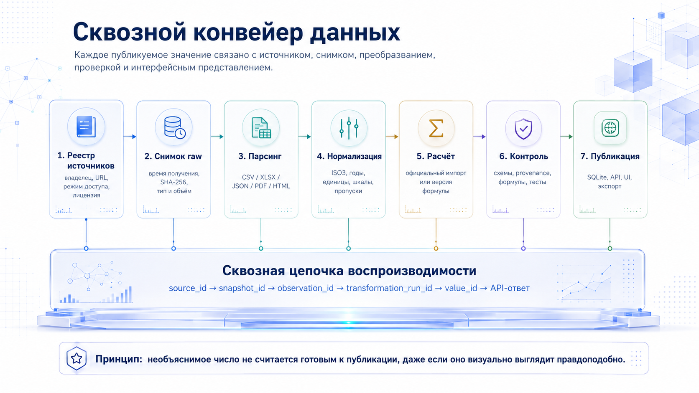
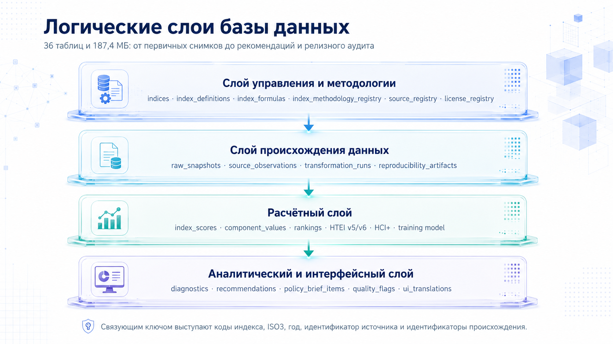
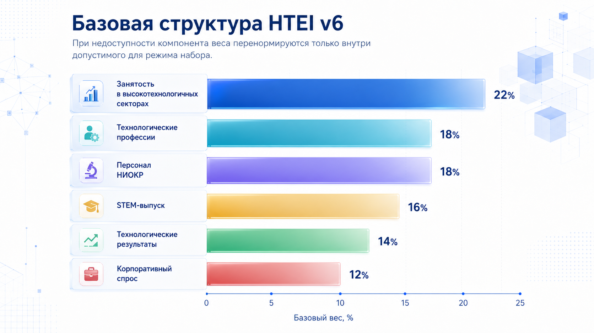

# Научная документация GIR

**Полная методология портфеля из 44 индексных, рейтинговых и исследовательских модулей, данных, вычислений, интерфейсов и процедур проверки**

Редакция T24 от 20 июля 2026 г.

> **Статус.** Документ описывает фактически реализованную полную FastAPI-версию GIR. Он различает официальные значения, официальные многомерные системы, статистические ряды, авторские модели GIR и производные страновые агрегации.

# Статус документа и правила чтения

Документ описывает фактически реализованную FastAPI-версию GIR. Он не является рекламным текстом, не подменяет официальные методологии издателей и не присваивает платформе авторство над официальными индексами. Для каждого модуля отдельно фиксируются объект измерения, официальный или производный статус, формула, единица наблюдения, состояние данных, provenance и границы интерпретации.

| **Параметр** | **Состояние** |
| --- | --- |
| Тематические направления | 8 |
| Модули | 44 |
| Числовые выпуски | 44 |
| Source-gated | 0 |
| Страны и территории | 238 |
| Таблицы SQLite | 239 |
| Источники / лицензионные политики | 62 / 62 |
| Snapshots / reproducibility artifacts | 314 / 437 |
| Data Explorer | 60 наборов, 1,702,900 строк |

# 1. Резюме проекта

GIR — междисциплинарная инфраструктура сравнительного анализа стран. Платформа объединяет официальные международные индексы, университетские рейтинги, статистические базы, авторский HTEI, модель конкурентоспособности систем подготовки кадров и рекомендации для России. Расширение до 44 модулей не означает создание одного сверхиндекса: исходные шкалы, направления, вселенные и методические ограничения сохраняются.

Пользовательский путь строится от публичного лендинга к профилю страны, сравнению, специализированной странице индекса, Data Explorer, исходному наблюдению и provenance. Операторский путь строится от обнаружения выпуска к staging, валидации, публикации и rollback.

# 2. Цель, задачи и соответствие техническому заданию

Исходная цель — исследование трудовых ресурсов высокотехнологичных отраслей и разработка научно обоснованных рекомендаций для России. GIR сохраняет четыре обязательных результата: интегрированную базу, систему индикаторов с HTEI, модель подготовки кадров и практические рекомендации. Новые тематические модули расширяют контекст, но не заменяют эти результаты.

Единицей анализа может быть страна, экономика, образовательная система, политическое образование, университет, вычислительная система, показатель, компонент или строка первичного источника. Тип единицы всегда хранится явно.

# 3. Методологическая онтология портфеля

GIR различает пять классов продуктов: официальный составной индекс; официальная многомерная система без общего score; официальное семейство статистических рядов; авторская модель GIR; производная агрегация официальных микрострок. Эта классификация определяет, допустимы ли ранжирование, усреднение, временная линия и межиндексный процентиль.

| **Класс**             | **Что разрешено**                                  | **Что запрещено**                        |
|-----------------------|----------------------------------------------------|------------------------------------------|
| Официальный композит  | Публикация официального score, компонентов и места | Подмена официальной формулы упрощённой   |
| Многомерная система   | Выбор конкретного измерения                        | Создание несуществующего overall         |
| Статистические ряды   | Сравнение одной единицы и базы                     | Смешение физических единиц               |
| Авторская модель GIR  | Публикация формулы, весов и аудита устойчивости    | Выдавать результат за продукт источника  |
| Производная агрегация | Прозрачный расчёт из официальных микрострок        | Называть официальным страновым рейтингом |

# 4. Архитектура и жизненный цикл данных

Каждый опубликованный результат проходит реестр источника, snapshot, парсинг, нормализацию, расчёт или импорт, проверки и публикацию. Raw-файл не изменяется; преобразования создают новые сущности с собственными идентификаторами.
$$

value\_ id \rightarrow source\_ id \rightarrow snapshot \rightarrow transformation \rightarrow formula\ version
$$

Центр жизненного цикла данных T23 управляет 62 источниками и 44 модулями. Обновление выполняется только в staging; рабочая SQLite заменяется после integrity, foreign-key, formula, provenance, generated-data и product-loss gates.

# 5. Масштаб и полнота текущей базы

| **Слой** | **Объём** |
| --- | --- |
| Индексные оценки | 13,803 |
| Компонентные значения | 38,890 |
| Исходные наблюдения | 18,803 |
| Формульные записи | 53 документационные записи; 41 строка центрального реестра SQLite |
| Исследовательские наборы | 60 |
| Опубликованные наборы | 50 |
| Source-gated datasets | 8 |
| Строки опубликованных наборов | 1,702,900 |

Число готовых страниц равно 44, а числовые выпуски установлены для всех 44 модулей; на portfolio-уровне 0 source-gated модулей. Source-gated может оставаться только статусом вторичных dataset-слоёв, которым требуется mapping или пакетная регистрация. Готовность интерфейса и наличие данных являются разными состояниями.

# 6. Источники, лицензирование и права распространения

Для каждого источника фиксируются организация, официальный URL, редакция, дата получения, формат, checksum, права на хранение, преобразование, публикацию raw и derived результатов. Ограниченный raw-файл может храниться приватно, тогда как производный страновой слой публикуется при наличии соответствующего права.

Наличие публичной веб-страницы не означает разрешение на scraping или перераспространение. THE, ARWU, Cloudflare и другие gated-источники используют управляемые импортёры и не получают фиктивных данных.

# 7. Структура базы данных и идентификаторы

SQLite содержит 238 предметных и служебных таблиц. Унифицированные таблицы indices, index_scores, components и component_values используются там, где модель действительно совместима. WGI, V-Dem, университетские рейтинги, PISA, экологические панели и другие сложные продукты имеют специализированные таблицы.

Ключевые идентификаторы: source_id, snapshot_id, transformation_id, value_id, formula_version, quality_flag. Они позволяют восстановить путь от пользовательской ячейки до конкретной строки источника.

# 8. Общие вычислительные правила

## 8.1. Min–max нормирование
$$

z_{c,i} = 100 \cdot \frac{x_{c,i} - \min\left( x_{i} \right)}{\max\left( x_{i} \right) - \min\left( x_{i} \right)}
$$

Для отрицательно направленного показателя числитель разворачивается. Нормирование выполняется только внутри явно определённой международной вселенной и не применяется к официальному score, если источник уже публикует готовую шкалу.

## 8.2. Взвешенная агрегация и пропуски
$$

S_{c} = \sum_{i \in A_{c}}^{}{\widetilde{w}}_{i,c}z_{c,i},\quad\quad{\widetilde{w}}_{i,c} = \frac{w_{i}}{\sum_{j \in A_{c}}^{}w_{j}}
$$

Перенормирование допустимо только там, где оно предусмотрено методикой конкретного режима. Отсутствие наблюдения не равно нулю; source-gated и no-country-data являются самостоятельными состояниями.

## 8.3. Ранг и благоприятный процентиль
$$

P_{c} = 100\left( 1 - \frac{r_{c} - 1}{N - 1} \right)
$$

Для обратных шкал место рассчитывается в официальном направлении, а благоприятный процентиль разворачивается только для навигации. Тематические медианы на страницах страны и сравнения не создают новый сводный индекс.

## 8.4. Неопределённость

Стандартные ошибки, доверительные интервалы, V-Dem codelow/codehigh, HTEI score/rank intervals и quality flags сохраняются как отдельный слой. Неопределённость не превращается в скрытый штраф score.

# 9. Правила межстранового и межиндексного сопоставления

Портфель GIR объединяет продукты с разными шкалами, направлениями, единицами наблюдения и международными вселенными. Исходный score остаётся первичным. Нормированные представления служат навигации и сравнительному анализу, но не заменяют официальное значение и не создают единый метаиндекс.

## 9.1. Благоприятный международный процентиль

Для показателя, в котором более высокое место означает более сильную позицию, GIR использует:
$$

P_{c,i} = 100\left( 1 - \frac{r_{c,i} - 1}{N_{i} - 1} \right).
$$

Если официальная шкала имеет обратное направление, GIR сохраняет официальный score и официальный порядок, а разворачивает только благоприятный процентиль. Контекстные показатели без однозначного направления, например милитаризация, исключаются из автоматической диагностики сильных и слабых сторон.

## 9.2. Международная вселенная и peer groups

Место и процентиль существуют только относительно явно заданной вселенной. GIR различает официальную вселенную издателя, сопоставимое ядро методического режима и пользовательскую группу сравнения. Переход от всех стран к БРИКС, G20, ОЭСР или технологическим сопоставлениям не изменяет официальный score, но меняет контекст интерпретации.

Тематический профиль страны использует медиану допустимых благоприятных процентилей:
$$

T_{c,g} = median\left\{ P_{c,i}:i \in g,\mspace{6mu} P_{c,i}\ \text{допустим} \right\}.
$$

$T_{c,g}$ является аналитическим резюме группы и не используется для официального общего ранжирования стран.

## 9.3. Связанные места, диапазоны и неопределённость

Равные опубликованные значения получают одинаковое описательное место. Диапазонные университетские позиции сохраняются в исходном виде; midpoint применяется только в прозрачных производных агрегациях. Стандартные ошибки, доверительные интервалы, V-Dem codelow/codehigh, WGI uncertainty и HTEI score/rank intervals показываются отдельно. Близкие точечные оценки не интерпретируются как доказанное превосходство, если источник не подтверждает статистическую значимость различия.

## 9.4. Время, редакции и методические разрывы

Год публикации, фактический год данных и дата snapshot являются разными полями. Временная линия строится только внутри сопоставимой редакции. HCI 2010–2020 и HCI+, разные поколения LPI, официальный университетский рейтинг и производная страновая агрегация, синхронный рейтинг и ASOF-профиль не соединяются автоматически.

Для асинхронного диагностического профиля место отключается, поскольку компоненты могут относиться к разным фактическим годам.

## 9.5. Отсутствие наблюдения, source-gated и неприменимость

| **Состояние**   | **Методический смысл**                                          |
|-----------------|-----------------------------------------------------------------|
| published       | Числовое наблюдение опубликовано и прошло проверки              |
| no_country_data | Выпуск существует, но выбранная страна или сущность отсутствует |
| source_gated    | Аналитический контур готов, официальный пакет ещё не установлен |
| not_applicable  | Показатель неприменим к выбранной единице анализа               |
| diagnostic      | Значение предназначено для диагностики, а не официального места |

Ни одно состояние не заменяется нулём. Пропуск не включается в среднее и не понижает страну скрытым штрафом.

## 9.6. Корреляция и причинная интерпретация

Data Explorer и межстрановое сравнение используют ранговую корреляцию Спирмена для совместно доступных наблюдений. Коэффициент скрывается при недостаточном числе пар. Даже высокая связь не доказывает причинного воздействия одного индекса на другой: необходимы теоретическая модель, временной порядок и проверка альтернативных объяснений.

# 10. Атлас 44 индексных и рейтинговых модулей

Атлас является нормативной точкой входа в методологию портфеля. Он различает официальный составной индекс, официальную многомерную систему, семейство статистических рядов, авторский индекс GIR и производную страновую агрегацию. Статус числового выпуска берётся из установленной базы, а не из готовности интерфейса.

## 10.1. Ключевые глобальные индексы

Базовые международные ориентиры описывают человеческое развитие, человеческий капитал, талант, инновации, цифровую связанность и технологическую занятость. Они образуют исходный каркас межстрановой диагностики GIR, но не сворачиваются в единый метаиндекс.

### 10.1.1. Индекс человеческого развития (ИЧР)

| **Поле**         | **Содержание**                                                             |
|------------------|----------------------------------------------------------------------------|
| Издатель         | UNDP                                                                       |
| Редакция и охват | Human Development Report 2025; data year 2023                              |
| Тип продукта     | официальный составной индекс                                               |
| Шкала            | 0–1 in the source; 0–100 in GIR presentation                               |
| Направление      | выше — благоприятнее                                                       |
| Архитектура      | Life expectancy, education and gross national income per capita            |
| Состояние GIR    | Опубликован числовой слой: 5,940 наблюдений; основное хранилище `index_scores`; статус `numeric_release`. |
| Источники GIR    | См. provenance строк в `index_scores` и связанных raw/reproducibility artifacts. |

#### Что измеряет

ИЧР измеряет не объём экономики сам по себе, а три базовые возможности человека: долгую и здоровую жизнь, доступ к знаниям и достойный уровень жизни. Доходный индекс использует логарифм ВНД на душу населения, поэтому одинаковый абсолютный прирост дохода имеет меньший вклад на высоких уровнях.

#### Формула и агрегация
$$

HDI = \left( I_{health}\, I_{education}\, I_{income} \right)^{1/3}
$$

#### Реализация в GIR

Модуль доступен по маршруту /#index-HDI. Исходная единица измерения сохраняется; для межиндексной навигации рассчитывается отдельный благоприятный международный процентиль, который не заменяет официальный score. Каждое значение связывается с source ID, snapshot, SHA-256, transformation run, фактическим годом и quality flag.

#### Ограничения интерпретации

Официальный ИЧР рассчитывается UNDP. Диагностические компоненты GIR не являются альтернативным пересчётом и не должны использоваться вместо официального score.

#### Обновление и воспроизводимость

Официальный канал: https://hdr.undp.org/data-center/human-development-index. Центр жизненного цикла данных проверяет новую редакцию, создаёт staging-копию, запускает источник-специфичный импортёр, сравнивает строковые и продуктовые дельты и публикует результат только после integrity, provenance, formula и product-loss gates.

### 10.1.2. Индекс человеческого капитала плюс (HCI+)

| **Поле**         | **Содержание**                                                             |
|------------------|----------------------------------------------------------------------------|
| Издатель         | World Bank                                                                 |
| Редакция и охват | World Bank HCI+ 2026                                                       |
| Тип продукта     | официальный составной индекс                                               |
| Шкала            | 0–325 points                                                               |
| Направление      | выше — благоприятнее                                                       |
| Архитектура      | Health, education and employment pillars                                   |
| Состояние GIR    | Опубликован числовой слой: 158 наблюдений; основное хранилище `index_scores`; статус `numeric_release`. |
| Источники GIR    | См. provenance строк в `index_scores` и связанных raw/reproducibility artifacts. |

#### Что измеряет

HCI+ расширяет традиционное понимание человеческого капитала за счёт совместного представления здоровья, образования и использования навыков в занятости. Три официальных блока суммируются на шкале 0–325; исторический HCI 2020 остаётся отдельным методическим продуктом.

#### Формула и агрегация
$$

{HCI}^{+} = H + E + L
$$

#### Реализация в GIR

Модуль доступен по маршруту /#index-HCI_PLUS. Исходная единица измерения сохраняется; для межиндексной навигации рассчитывается отдельный благоприятный международный процентиль, который не заменяет официальный score. Каждое значение связывается с source ID, snapshot, SHA-256, transformation run, фактическим годом и quality flag.

#### Ограничения интерпретации

Между HCI 2020 и HCI+ существует методический разрыв. Их нельзя соединять одной временной линией без отдельного bridge-study.

#### Обновление и воспроизводимость

Официальный канал: https://www.worldbank.org/en/publication/human-capital. Центр жизненного цикла данных проверяет новую редакцию, создаёт staging-копию, запускает источник-специфичный импортёр, сравнивает строковые и продуктовые дельты и публикует результат только после integrity, provenance, formula и product-loss gates.

### 10.1.3. Глобальный индекс конкурентоспособности талантов (GTCI)

| **Поле**         | **Содержание**                                                                             |
|------------------|--------------------------------------------------------------------------------------------|
| Издатель         | INSEAD / Portulans Institute                                                               |
| Редакция и охват | GTCI 2025                                                                                  |
| Тип продукта     | официальный составной индекс                                                               |
| Шкала            | 0–100                                                                                      |
| Направление      | выше — благоприятнее                                                                       |
| Архитектура      | Enable, Attract, Grow, Retain, Vocational and Technical Skills, Generalist Adaptive Skills |
| Состояние GIR    | Опубликован числовой слой: 135 наблюдений; основное хранилище `index_scores`; статус `numeric_release`. |
| Источники GIR    | См. provenance строк в `index_scores` и связанных raw/reproducibility artifacts. |

#### Что измеряет

GTCI оценивает способность стран создавать условия для талантов, привлекать их, развивать, удерживать и преобразовывать в профессиональные и адаптивные навыки. Выпуск 2025 охватывает 135 стран и 77 показателей.

#### Формула и агрегация

Официальная оценка GTCI 2025 извлечена из таблицы рейтинга; шесть направлений диагностики рассчитаны из официальных рангов по направлениям Enable, Attract, Grow, Retain, VT и GA из таблицы Rankings by Pillar.

#### Реализация в GIR

Модуль доступен по маршруту /#index-GTCI. Исходная единица измерения сохраняется; для межиндексной навигации рассчитывается отдельный благоприятный международный процентиль, который не заменяет официальный score. Каждое значение связывается с source ID, snapshot, SHA-256, transformation run, фактическим годом и quality flag.

#### Ограничения интерпретации

GIR импортирует официальный итоговый score. Если источник публикует только ранги столпов, их преобразование в диагностическую шкалу GIR явно маркируется как производное.

#### Обновление и воспроизводимость

Официальный канал: https://www.insead.edu/global-talent-competitiveness-index. Центр жизненного цикла данных проверяет новую редакцию, создаёт staging-копию, запускает источник-специфичный импортёр, сравнивает строковые и продуктовые дельты и публикует результат только после integrity, provenance, formula и product-loss gates.

### 10.1.4. Глобальный инновационный индекс (GII)

| **Поле**         | **Содержание**                                                                  |
|------------------|---------------------------------------------------------------------------------|
| Издатель         | WIPO                                                                            |
| Редакция и охват | Global Innovation Index 2025                                                    |
| Тип продукта     | официальный составной индекс                                                    |
| Шкала            | 0–100                                                                           |
| Направление      | выше — благоприятнее                                                            |
| Архитектура      | Five input pillars and two output pillars; 78 indicators in the 2025 edition    |
| Состояние GIR    | Опубликован числовой слой: 536 наблюдений; основное хранилище `index_scores`; статус `numeric_release`. |
| Источники GIR    | См. provenance строк в `index_scores` и связанных raw/reproducibility artifacts. |

#### Что измеряет

GII измеряет способность экономики создавать инновационные ресурсы и превращать их в знания, технологии и творческие результаты. GIR сохраняет официальный score и официальные pillar scores WIPO.

#### Формула и агрегация
$$

GII = \frac{Innovation\ Inputs + Innovation\ Outputs}{2}
$$

#### Реализация в GIR

Модуль доступен по маршруту /#index-GII. Исходная единица измерения сохраняется; для межиндексной навигации рассчитывается отдельный благоприятный международный процентиль, который не заменяет официальный score. Каждое значение связывается с source ID, snapshot, SHA-256, transformation run, фактическим годом и quality flag.

#### Ограничения интерпретации

Формула верхнего уровня не заменяет полный официальный процесс нормирования, обработки выбросов и построения индикаторов WIPO.

#### Обновление и воспроизводимость

Официальный канал: https://www.wipo.int/global_innovation_index/en/. Центр жизненного цикла данных проверяет новую редакцию, создаёт staging-копию, запускает источник-специфичный импортёр, сравнивает строковые и продуктовые дельты и публикует результат только после integrity, provenance, formula и product-loss gates.

### 10.1.5. Индекс развития ИКТ (IDI)

| **Поле**         | **Содержание**                                                                  |
|------------------|---------------------------------------------------------------------------------|
| Издатель         | ITU                                                                             |
| Редакция и охват | Installed: IDI 2023–2025; latest official edition checked: IDI 2026             |
| Тип продукта     | официальный составной индекс                                                    |
| Шкала            | 0–100                                                                           |
| Направление      | выше — благоприятнее                                                            |
| Архитектура      | Universal connectivity and meaningful connectivity                              |
| Состояние GIR    | Опубликован числовой слой: 503 наблюдений; основное хранилище `index_scores`; статус `numeric_release`. |
| Источники GIR    | См. provenance строк в `index_scores` и связанных raw/reproducibility artifacts. |

#### Что измеряет

IDI измеряет степень универсальной и содержательной цифровой связанности. Документация различает установленный в GIR выпуск и более новый официальный выпуск ITU: наличие новой редакции у издателя не означает, что она уже опубликована в рабочей базе GIR.

#### Формула и агрегация

Официальная оценка ITU IDI и направления из набора IDI 2025.

#### Реализация в GIR

Модуль доступен по маршруту /#index-IDI. Исходная единица измерения сохраняется; для межиндексной навигации рассчитывается отдельный благоприятный международный процентиль, который не заменяет официальный score. Каждое значение связывается с source ID, snapshot, SHA-256, transformation run, фактическим годом и quality flag.

#### Ограничения интерпретации

Сравнение лет допустимо только в рамках совместимой современной методологии IDI. Фактическая редакция показывается рядом со значением.

#### Обновление и воспроизводимость

Официальный канал: https://www.itu.int/itu-d/reports/statistics/idi2025/. Центр жизненного цикла данных проверяет новую редакцию, создаёт staging-копию, запускает источник-специфичный импортёр, сравнивает строковые и продуктовые дельты и публикует результат только после integrity, provenance, formula и product-loss gates.

### 10.1.6. Индекс занятости в высокотехнологичных отраслях (HTEI)

| **Поле**         | **Содержание**                                                             |
|------------------|----------------------------------------------------------------------------|
| Издатель         | GIR                                                                        |
| Редакция и охват | GIR HTEI v6, 2026                                                          |
| Тип продукта     | авторский составной индекс GIR                                             |
| Шкала            | 0–100                                                                      |
| Направление      | выше — благоприятнее                                                       |
| Архитектура      | Six components and four publication modes                                  |
| Состояние GIR    | Опубликован числовой слой: 1,980 наблюдений; основное хранилище `index_scores`; статус `numeric_release`. |
| Источники GIR    | См. provenance строк в `index_scores` и связанных raw/reproducibility artifacts. |

#### Что измеряет

HTEI — авторский индекс GIR, измеряющий масштаб и качество технологической занятости через отраслевую занятость, технологические профессии, персонал НИОКР, STEM-поток, технологические результаты и корпоративное участие в НИОКР.

#### Формула и агрегация
$$

{HTEI}_{c,t} = \sum_{i \in A_{c,t}}^{}{\widetilde{w}}_{i,c,t}\, z_{c,i,t}
$$

#### Реализация в GIR

Модуль доступен по маршруту /#index-HTEI. Исходная единица измерения сохраняется; для межиндексной навигации рассчитывается отдельный благоприятный международный процентиль, который не заменяет официальный score. Каждое значение связывается с source ID, snapshot, SHA-256, transformation run, фактическим годом и quality flag.

#### Ограничения интерпретации

Основным международным рейтингом является Common Support. Direct Core отражает строгий слой прямых данных, Proxy Extended расширяет охват, а ASOF Diagnostic не ранжируется.

#### Обновление и воспроизводимость

Официальный канал: \#methodology. Центр жизненного цикла данных проверяет новую редакцию, создаёт staging-копию, запускает источник-специфичный импортёр, сравнивает строковые и продуктовые дельты и публикует результат только после integrity, provenance, formula и product-loss gates.

## 10.2. Образование и университеты

Группа соединяет результаты школьного образования и университетские рейтинги. GIR жёстко разводит официальные оценки образовательных систем, официальные строки университетов и авторские страновые агрегации университетских рейтингов.

### 10.2.1. Оценка знаний школьников PISA (PISA)

| **Поле**         | **Содержание**                                                           |
|------------------|--------------------------------------------------------------------------|
| Издатель         | OECD                                                                     |
| Редакция и охват | OECD PISA 2022                                                           |
| Тип продукта     | производная оценка GIR из официальных доменов                            |
| Шкала            | PISA points                                                              |
| Направление      | выше — благоприятнее                                                     |
| Архитектура      | Mathematics, reading and science                                         |
| Состояние GIR    | Опубликован числовой слой: 81 наблюдений; основное хранилище `pisa_school_knowledge_scores`; статус `numeric_release`. |
| Источники GIR    | См. provenance строк в `pisa_school_knowledge_scores` и связанных raw/reproducibility artifacts. |

#### Что измеряет

Официальными остаются три средних результата OECD по математике, чтению и естественным наукам. GIR рассчитывает прозрачное равновзвешенное среднее только для систем, имеющих все три домена в одном цикле.

#### Формула и агрегация
$$

PISA\_ SKI = \frac{M + R + S}{3}
$$

#### Реализация в GIR

Модуль доступен по маршруту /#index-PISA_SKI. Исходная единица измерения сохраняется; для межиндексной навигации рассчитывается отдельный благоприятный международный процентиль, который не заменяет официальный score. Каждое значение связывается с source ID, snapshot, SHA-256, transformation run, фактическим годом и quality flag.

#### Ограничения интерпретации

Описательное место GIR не заменяет проверку статистической значимости различий. Отсутствие результата страны не является нулём.

#### Обновление и воспроизводимость

Официальный канал: https://www.oecd.org/en/about/programmes/pisa.html. Центр жизненного цикла данных проверяет новую редакцию, создаёт staging-копию, запускает источник-специфичный импортёр, сравнивает строковые и продуктовые дельты и публикует результат только после integrity, provenance, formula и product-loss gates.

### 10.2.2. QS: инженерия и технологии (QS)

| **Поле**         | **Содержание**                                                                |
|------------------|-------------------------------------------------------------------------------|
| Издатель         | QS                                                                            |
| Редакция и охват | QS Engineering & Technology 2026                                              |
| Тип продукта     | производная страновая агрегация GIR                                           |
| Шкала            | 0–100 derived country score plus official institution rows                    |
| Направление      | выше — благоприятнее                                                          |
| Архитектура      | Institution count, best rank, median rank and institutional score             |
| Состояние GIR    | Опубликован числовой слой: 2,185 наблюдений; основное хранилище `qs_institution_rankings`; статус `numeric_release`. |
| Источники GIR    | См. provenance строк в `qs_institution_rankings` и связанных raw/reproducibility artifacts. |

#### Что измеряет

QS публикует рейтинг университетов, а не официальный страновой рейтинг. GIR агрегирует архивированные университетские строки в воспроизводимый профиль национальной системы и сохраняет университетский слой отдельно.

#### Формула и агрегация
$$

{QS}_{country} = 0.25B^{*} + 0.25R_{best}^{*} + 0.25R_{median}^{*} + 0.25S_{QS}^{*}
$$

#### Реализация в GIR

Модуль доступен по маршруту /#index-QS_ET. Исходная единица измерения сохраняется; для межиндексной навигации рассчитывается отдельный благоприятный международный процентиль, который не заменяет официальный score. Каждое значение связывается с source ID, snapshot, SHA-256, transformation run, фактическим годом и quality flag.

#### Ограничения интерпретации

Страновой score является производным GIR. Связанные и диапазонные места сохраняются, а midpoint используется только как вычислительная аппроксимация.

#### Обновление и воспроизводимость

Официальный канал: https://www.topuniversities.com/subject-rankings/engineering-technology. Центр жизненного цикла данных проверяет новую редакцию, создаёт staging-копию, запускает источник-специфичный импортёр, сравнивает строковые и продуктовые дельты и публикует результат только после integrity, provenance, formula и product-loss gates.

### 10.2.3. THE: инженерные науки (THE)

| **Поле**         | **Содержание**                                                                                                                 |
|------------------|--------------------------------------------------------------------------------------------------------------------------------|
| Издатель         | Times Higher Education                                                                                                         |
| Редакция и охват | THE Engineering 2026                                                                                                           |
| Тип продукта     | готовая страновая агрегация; источник ограничен                                                                                |
| Шкала            | 0–100 derived country score after authorised import                                                                            |
| Направление      | выше — благоприятнее                                                                                                           |
| Архитектура      | Breadth, best rank, median rank and five-pillar profile                                                                        |
| Состояние GIR    | Опубликован числовой слой: 1,555 наблюдений; основное хранилище `the_engineering_institution_rankings`; статус `numeric_release`. |
| Источники GIR    | См. provenance строк в `the_engineering_institution_rankings` и связанных raw/reproducibility artifacts. |

#### Что измеряет

THE Engineering оценивает университеты по преподаванию, исследовательской среде, качеству исследований, индустрии и международной открытости. GIR подготовил отдельную страновую агрегацию, но числовой слой публикуется только после разрешённого официального импорта.

#### Формула и агрегация
$$

{THE}_{country} = 0.25B^{*} + 0.25R_{best}^{*} + 0.25R_{median}^{*} + 0.25P^{*}
$$

#### Реализация в GIR

Модуль доступен по маршруту /#index-THE_ENG. Исходная единица измерения сохраняется; для межиндексной навигации рассчитывается отдельный благоприятный международный процентиль, который не заменяет официальный score. Каждое значение связывается с source ID, snapshot, SHA-256, transformation run, фактическим годом и quality flag.

#### Ограничения интерпретации

Это не официальный страновой рейтинг THE. В текущем internal offline academic release числовой слой установлен; raw/source files остаются локальными, а производная страновая агрегация не является официальным рейтингом издателя.

#### Обновление и воспроизводимость

Официальный канал: https://www.timeshighereducation.com/world-university-rankings/2026/subject-ranking/engineering. Центр жизненного цикла данных проверяет новую редакцию, создаёт staging-копию, запускает источник-специфичный импортёр, сравнивает строковые и продуктовые дельты и публикует результат только после integrity, provenance, formula и product-loss gates.

### 10.2.4. ARWU: исследовательские университеты (ARWU)

| **Поле**         | **Содержание**                                                                                                                 |
|------------------|--------------------------------------------------------------------------------------------------------------------------------|
| Издатель         | ShanghaiRanking                                                                                                                |
| Редакция и охват | ARWU 2025                                                                                                                      |
| Тип продукта     | готовая страновая агрегация; источник ограничен                                                                                |
| Шкала            | 0–100 derived country score after authorised import                                                                            |
| Направление      | выше — благоприятнее                                                                                                           |
| Архитектура      | Breadth, elite depth, best rank and median rank                                                                                |
| Состояние GIR    | Опубликован числовой слой: 1,000 наблюдений; основное хранилище `arwu_institution_rankings`; статус `numeric_release`. |
| Источники GIR    | См. provenance строк в `arwu_institution_rankings` и связанных raw/reproducibility artifacts. |

#### Что измеряет

ARWU использует шесть официальных университетских индикаторов исследовательской результативности. GIR не воспроизводит университетскую формулу ShanghaiRanking, а строит отдельный страновой профиль масштаба и глубины системы.

#### Формула и агрегация
$$

{ARWU}_{country} = 0.25B^{*} + 0.25D_{elite}^{*} + 0.25R_{best}^{*} + 0.25R_{median}^{*}
$$

#### Реализация в GIR

Модуль доступен по маршруту /#index-ARWU. Исходная единица измерения сохраняется; для межиндексной навигации рассчитывается отдельный благоприятный международный процентиль, который не заменяет официальный score. Каждое значение связывается с source ID, snapshot, SHA-256, transformation run, фактическим годом и quality flag.

#### Ограничения интерпретации

Для публикации требуется полный разрешённый top-1000. Диапазонные места сохраняются; midpoint не считается точным рангом.

#### Обновление и воспроизводимость

Официальный канал: https://www.shanghairanking.com/rankings/arwu/2025. Центр жизненного цикла данных проверяет новую редакцию, создаёт staging-копию, запускает источник-специфичный импортёр, сравнивает строковые и продуктовые дельты и публикует результат только после integrity, provenance, formula и product-loss gates.

## 10.3. Государство и институты

Институциональный блок объединяет коррупцию, свободу прессы, верховенство права, качество управления и модели демократии. Многомерные системы WGI и V-Dem не получают искусственного общего балла.

### 10.3.1. Индекс восприятия коррупции (CPI)

| **Поле**         | **Содержание**                                                                  |
|------------------|---------------------------------------------------------------------------------|
| Издатель         | Transparency International                                                      |
| Редакция и охват | Corruption Perceptions Index 2025                                               |
| Тип продукта     | официальный составной индекс                                                    |
| Шкала            | 0–100                                                                           |
| Направление      | выше — благоприятнее                                                            |
| Архитектура      | Standardised expert and business-assessment sources                             |
| Состояние GIR    | Опубликован числовой слой: 2,494 наблюдений; основное хранилище `cpi_results`; статус `numeric_release`. |
| Источники GIR    | См. provenance строк в `cpi_results` и связанных raw/reproducibility artifacts. |

#### Что измеряет

CPI измеряет восприятие коррупции в государственном секторе. Выпуск 2025 охватывает 182 страны и территории и использует 13 источников; для включения страны требуется не менее трёх источников.

#### Формула и агрегация

CPI = взвешенное среднее стандартизированных оценок допущенных источников на шкале 0–100.

#### Реализация в GIR

Модуль доступен по маршруту /#index-CPI. Исходная единица измерения сохраняется; для межиндексной навигации рассчитывается отдельный благоприятный международный процентиль, который не заменяет официальный score. Каждое значение связывается с source ID, snapshot, SHA-256, transformation run, фактическим годом и quality flag.

#### Ограничения интерпретации

CPI не измеряет все формы коррупции и не является прямой частотой коррупционных событий. GIR сохраняет официальные score, места и первичные source scores.

#### Обновление и воспроизводимость

Официальный канал: https://www.transparency.org/en/cpi. Центр жизненного цикла данных проверяет новую редакцию, создаёт staging-копию, запускает источник-специфичный импортёр, сравнивает строковые и продуктовые дельты и публикует результат только после integrity, provenance, formula и product-loss gates.

### 10.3.2. Индекс свободы прессы (WPFI)

| **Поле**         | **Содержание**                                                                           |
|------------------|------------------------------------------------------------------------------------------|
| Издатель         | Reporters Without Borders                                                                |
| Редакция и охват | World Press Freedom Index 2026                                                           |
| Тип продукта     | официальный составной индекс                                                             |
| Шкала            | 0–100; lower source score corresponds to greater freedom in the current RSF presentation |
| Направление      | ниже — благоприятнее                                                                     |
| Архитектура      | Political, economic, legislative, social and security indicators                         |
| Состояние GIR    | Опубликован числовой слой: 900 наблюдений; основное хранилище `wpfi_results`; статус `numeric_release`. |
| Источники GIR    | См. provenance строк в `wpfi_results` и связанных raw/reproducibility artifacts. |

#### Что измеряет

WPFI оценивает условия работы журналистики в 180 странах по пяти контекстным измерениям. GIR сохраняет направление официальной шкалы и отдельно рассчитывает благоприятный процентиль для межиндексного сравнения.

#### Формула и агрегация

Официальный балл WPFI импортируется вместе с пятью контекстуальными индикаторами; GIR не пересчитывает итоговую формулу RSF.

#### Реализация в GIR

Модуль доступен по маршруту /#index-WPFI. Исходная единица измерения сохраняется; для межиндексной навигации рассчитывается отдельный благоприятный международный процентиль, который не заменяет официальный score. Каждое значение связывается с source ID, snapshot, SHA-256, transformation run, фактическим годом и quality flag.

#### Ограничения интерпретации

Изменения методологии и источников опроса требуют осторожности при длинных временных сравнениях. Низкое место и высокий score не должны визуально трактоваться как положительный результат.

#### Обновление и воспроизводимость

Официальный канал: https://rsf.org/en/index. Центр жизненного цикла данных проверяет новую редакцию, создаёт staging-копию, запускает источник-специфичный импортёр, сравнивает строковые и продуктовые дельты и публикует результат только после integrity, provenance, formula и product-loss gates.

### 10.3.3. Индекс верховенства права WJP (WJP)

| **Поле**         | **Содержание**                                                             |
|------------------|----------------------------------------------------------------------------|
| Издатель         | World Justice Project                                                      |
| Редакция и охват | WJP Rule of Law Index 2025                                                 |
| Тип продукта     | официальный многомерный индекс                                             |
| Шкала            | 0–1                                                                        |
| Направление      | выше — благоприятнее                                                       |
| Архитектура      | Eight factors and detailed subfactors                                      |
| Состояние GIR    | Опубликован числовой слой: 1,484 наблюдений; основное хранилище `roli_results`; статус `numeric_release`. |
| Источники GIR    | См. provenance строк в `roli_results` и связанных raw/reproducibility artifacts. |

#### Что измеряет

WJP измеряет верховенство права через ограничения государственной власти, отсутствие коррупции, открытость правительства, фундаментальные права, порядок и безопасность, правоприменение и гражданское и уголовное правосудие.

#### Формула и агрегация
$$

ROLI = \frac{1}{8}\sum_{f = 1}^{8}F_{f}
$$

#### Реализация в GIR

Модуль доступен по маршруту /#index-ROLI. Исходная единица измерения сохраняется; для межиндексной навигации рассчитывается отдельный благоприятный международный процентиль, который не заменяет официальный score. Каждое значение связывается с source ID, snapshot, SHA-256, transformation run, фактическим годом и quality flag.

#### Ограничения интерпретации

GIR сохраняет факторы и субфакторы. Итоговое место не заменяет анализ профиля: страны с близким score могут иметь противоположные институциональные конфигурации.

#### Обновление и воспроизводимость

Официальный канал: https://worldjusticeproject.org/rule-of-law-index. Центр жизненного цикла данных проверяет новую редакцию, создаёт staging-копию, запускает источник-специфичный импортёр, сравнивает строковые и продуктовые дельты и публикует результат только после integrity, provenance, formula и product-loss gates.

### 10.3.4. Показатели государственного управления (WGI)

| **Поле**         | **Содержание**                                                                  |
|------------------|---------------------------------------------------------------------------------|
| Издатель         | World Bank                                                                      |
| Редакция и охват | WGI 2025 revision; data 1996–2024                                               |
| Тип продукта     | официальная многомерная система без overall                                     |
| Шкала            | standardised estimates and absolute 0–100 scores with uncertainty               |
| Направление      | выше — благоприятнее                                                            |
| Архитектура      | Six independent governance dimensions and 35 source families                    |
| Состояние GIR    | Опубликован числовой слой: 32,403 наблюдений; основное хранилище `wgi_dimension_values`; статус `numeric_release`. |
| Источники GIR    | См. provenance строк в `wgi_dimension_values` и связанных raw/reproducibility artifacts. |

#### Что измеряет

WGI публикует шесть самостоятельных измерений качества управления и их неопределённость. Пересмотренная методология 2025 года использует модель ненаблюдаемых компонентов и предоставляет как стандартизованные estimates, так и абсолютные шкалы.

#### Формула и агрегация

WGI публикует шесть самостоятельных измерений, оцениваемых пересмотренной моделью ненаблюдаемых компонентов. GIR импортирует официальный стандартизованный estimate, абсолютный score 0–100, стандартные ошибки, 90%-е интервалы и доступные источниковые средние. Единый WGI score и общая система весов между шестью измерениями не конструируются.

#### Реализация в GIR

Модуль доступен по маршруту /#index-WGI. Исходная единица измерения сохраняется; для межиндексной навигации рассчитывается отдельный благоприятный международный процентиль, который не заменяет официальный score. Каждое значение связывается с source ID, snapshot, SHA-256, transformation run, фактическим годом и quality flag.

#### Ограничения интерпретации

GIR не создаёт общий WGI score и не усредняет шесть измерений. Ранги GIR рассчитываются только внутри одного измерения и года.

#### Обновление и воспроизводимость

Официальный канал: https://www.worldbank.org/en/publication/worldwide-governance-indicators. Центр жизненного цикла данных проверяет новую редакцию, создаёт staging-копию, запускает источник-специфичный импортёр, сравнивает строковые и продуктовые дельты и публикует результат только после integrity, provenance, formula и product-loss gates.

### 10.3.5. Индексы демократии V-Dem (V-Dem)

| **Поле**         | **Содержание**                                                                    |
|------------------|-----------------------------------------------------------------------------------|
| Издатель         | V-Dem Institute                                                                   |
| Редакция и охват | V-Dem Dataset v16, published 2026; data through 2025                              |
| Тип продукта     | официальная многомерная система без overall                                       |
| Шкала            | 0–1 with Bayesian uncertainty intervals                                           |
| Направление      | выше — благоприятнее                                                              |
| Архитектура      | Electoral, liberal, participatory, deliberative and egalitarian democracy indices |
| Состояние GIR    | Опубликован числовой слой: 118,338 наблюдений; основное хранилище `vdem_index_values`; статус `numeric_release`. |
| Источники GIR    | См. provenance строк в `vdem_index_values` и связанных raw/reproducibility artifacts. |

#### Что измеряет

V-Dem представляет пять разных концептуальных моделей демократии, построенных на экспертном кодировании и байесовской измерительной модели. GIR импортирует score, standard deviation и codelow/codehigh.

#### Формула и агрегация

V-Dem публикует пять отдельных высокоуровневых индексов демократии. GIR импортирует официальный score каждого индекса, нижнюю и верхнюю границы интервала кодировочной неопределённости и стандартное отклонение. Межиндексное среднее и единый рейтинг демократии не рассчитываются.

#### Реализация в GIR

Модуль доступен по маршруту /#index-VDEM. Исходная единица измерения сохраняется; для межиндексной навигации рассчитывается отдельный благоприятный международный процентиль, который не заменяет официальный score. Каждое значение связывается с source ID, snapshot, SHA-256, transformation run, фактическим годом и quality flag.

#### Ограничения интерпретации

Пять индексов нельзя усреднять в единый показатель демократии. Неопределённость кодирования должна рассматриваться вместе с точечной оценкой.

#### Обновление и воспроизводимость

Официальный канал: https://www.v-dem.net/data/the-v-dem-dataset/. Центр жизненного цикла данных проверяет новую редакцию, создаёт staging-копию, запускает источник-специфичный импортёр, сравнивает строковые и продуктовые дельты и публикует результат только после integrity, provenance, formula и product-loss gates.

## 10.4. Цифровизация, ИИ и вычислительные мощности

Цифровой блок охватывает сетевую готовность, электронное государство, кибербезопасность, готовность к ИИ, качество интернета и высокопроизводительные вычисления. Физические единицы и официальные уровни зрелости сохраняются без насильственной унификации.

### 10.4.1. Индекс сетевой готовности (NRI)

| **Поле**         | **Содержание**                                                             |
|------------------|----------------------------------------------------------------------------|
| Издатель         | Portulans Institute                                                        |
| Редакция и охват | Network Readiness Index 2025                                               |
| Тип продукта     | официальный составной индекс                                               |
| Шкала            | 0–100                                                                      |
| Направление      | выше — благоприятнее                                                       |
| Архитектура      | Technology, People, Governance and Impact; 12 subpillars                   |
| Состояние GIR    | Опубликован числовой слой: 127 наблюдений; основное хранилище `nri_country_metadata`; статус `numeric_release`. |
| Источники GIR    | См. provenance строк в `nri_country_metadata` и связанных raw/reproducibility artifacts. |

#### Что измеряет

NRI оценивает способность экономики использовать цифровые технологии через технологическую базу, людей, управление и воздействие. Вложенная структура содержит четыре столпа и по три подстолпа в каждом.

#### Формула и агрегация
$$

NRI = \frac{T + P + G + I}{4}
$$

#### Реализация в GIR

Модуль доступен по маршруту /#index-NRI. Исходная единица измерения сохраняется; для межиндексной навигации рассчитывается отдельный благоприятный международный процентиль, который не заменяет официальный score. Каждое значение связывается с source ID, snapshot, SHA-256, transformation run, фактическим годом и quality flag.

#### Ограничения интерпретации

Официальная редакция 2025 охватывает 127 экономик. GIR сохраняет официальные score и компонентный профиль; missing values не заменяются нулями.

#### Обновление и воспроизводимость

Официальный канал: https://networkreadinessindex.org/. Центр жизненного цикла данных проверяет новую редакцию, создаёт staging-копию, запускает источник-специфичный импортёр, сравнивает строковые и продуктовые дельты и публикует результат только после integrity, provenance, formula и product-loss gates.

### 10.4.2. Индекс развития электронного правительства (EGDI)

| **Поле**         | **Содержание**                                                             |
|------------------|----------------------------------------------------------------------------|
| Издатель         | United Nations                                                             |
| Редакция и охват | UN E-Government Survey 2024                                                |
| Тип продукта     | официальный составной индекс                                               |
| Шкала            | 0–1                                                                        |
| Направление      | выше — благоприятнее                                                       |
| Архитектура      | Online Service, Telecommunication Infrastructure and Human Capital indices |
| Состояние GIR    | Опубликован числовой слой: 193 наблюдений; основное хранилище `egdi_country_metadata`; статус `numeric_release`. |
| Источники GIR    | См. provenance строк в `egdi_country_metadata` и связанных raw/reproducibility artifacts. |

#### Что измеряет

EGDI описывает готовность и способность государства предоставлять цифровые публичные услуги. Выпуск охватывает все 193 государства — члена ООН.

#### Формула и агрегация
$$

EGDI = \frac{OSI + TII + HCI}{3}
$$

#### Реализация в GIR

Модуль доступен по маршруту /#index-EGDI. Исходная единица измерения сохраняется; для межиндексной навигации рассчитывается отдельный благоприятный международный процентиль, который не заменяет официальный score. Каждое значение связывается с source ID, snapshot, SHA-256, transformation run, фактическим годом и quality flag.

#### Ограничения интерпретации

Верхнеуровневое среднее не заменяет официальную стандартизацию и нормирование подиндексов. GIR воспроизводит только согласование опубликованных OSI, TII и HCI.

#### Обновление и воспроизводимость

Официальный канал: https://publicadministration.un.org/egovkb/en-us/About/Overview/-E-Government-Development-Index. Центр жизненного цикла данных проверяет новую редакцию, создаёт staging-копию, запускает источник-специфичный импортёр, сравнивает строковые и продуктовые дельты и публикует результат только после integrity, provenance, formula и product-loss gates.

### 10.4.3. Глобальный индекс кибербезопасности ITU (GCI)

| **Поле**         | **Содержание**                                                                 |
|------------------|--------------------------------------------------------------------------------|
| Издатель         | ITU                                                                            |
| Редакция и охват | ITU Global Cybersecurity Index 2024                                            |
| Тип продукта     | официальная модель зрелости                                                    |
| Шкала            | 0–100 and five maturity tiers                                                  |
| Направление      | выше — благоприятнее                                                           |
| Архитектура      | Legal, technical, organisational, capacity-development and cooperation pillars |
| Состояние GIR    | Опубликован числовой слой: 194 наблюдений; основное хранилище `gci_country_scores`; статус `numeric_release`. |
| Источники GIR    | См. provenance строк в `gci_country_scores` и связанных raw/reproducibility artifacts. |

#### Что измеряет

GCI измеряет национальные обязательства в сфере кибербезопасности. Каждый из пяти столпов имеет максимум 20 баллов, а итог определяет официальный уровень зрелости.

#### Формула и агрегация
$$

GCI = LS + TS + OS + CDS + CS
$$

#### Реализация в GIR

Модуль доступен по маршруту /#index-GCI. Исходная единица измерения сохраняется; для межиндексной навигации рассчитывается отдельный благоприятный международный процентиль, который не заменяет официальный score. Каждое значение связывается с source ID, snapshot, SHA-256, transformation run, фактическим годом и quality flag.

#### Ограничения интерпретации

ITU акцентирует уровни зрелости, а не обычный линейный рейтинг. GIR не предполагает равных весов индикаторов внутри столпов.

#### Обновление и воспроизводимость

Официальный канал: https://www.itu.int/epublications/publication/global-cybersecurity-index-2024. Центр жизненного цикла данных проверяет новую редакцию, создаёт staging-копию, запускает источник-специфичный импортёр, сравнивает строковые и продуктовые дельты и публикует результат только после integrity, provenance, formula и product-loss gates.

### 10.4.4. Индекс готовности государства к ИИ (GARI)

| **Поле**         | **Содержание**                                                             |
|------------------|----------------------------------------------------------------------------|
| Издатель         | Oxford Insights                                                            |
| Редакция и охват | Government AI Readiness Index 2025, corrected January 2026                 |
| Тип продукта     | официальный порядок с reconciliation GIR                                   |
| Шкала            | 0–100                                                                      |
| Направление      | выше — благоприятнее                                                       |
| Архитектура      | Six pillars, 14 dimensions and 69 declared indicators                      |
| Состояние GIR    | Опубликован числовой слой: 195 наблюдений; основное хранилище `gari_country_scores`; статус `numeric_release`. |
| Источники GIR    | См. provenance строк в `gari_country_scores` и связанных raw/reproducibility artifacts. |

#### Что измеряет

GARI оценивает способность государства использовать ИИ в общественных интересах. GIR использует исправленный официальный порядок и отдельно показывает пересчитанный score из опубликованных округлённых столпов.

#### Формула и агрегация
$$

{GARI}^{*} = 0.10PC + 0.25AI + 0.15GOV + 0.15PSA + 0.25DEV + 0.10RES
$$

#### Реализация в GIR

Модуль доступен по маршруту /#index-GARI. Исходная единица измерения сохраняется; для межиндексной навигации рассчитывается отдельный благоприятный международный процентиль, который не заменяет официальный score. Каждое значение связывается с source ID, snapshot, SHA-256, transformation run, фактическим годом и quality flag.

#### Ограничения интерпретации

Официальный ранг имеет приоритет над сортировкой пересчитанных округлённых значений. Звёздочка указывает на reconciliation GIR.

#### Обновление и воспроизводимость

Официальный канал: https://oxfordinsights.com/ai-readiness/ai-readiness-index/. Центр жизненного цикла данных проверяет новую редакцию, создаёт staging-копию, запускает источник-специфичный импортёр, сравнивает строковые и продуктовые дельты и публикует результат только после integrity, provenance, formula и product-loss gates.

### 10.4.5. Индекс готовности к ИИ МВФ (AIPI)

| **Поле**         | **Содержание**                                                                                             |
|------------------|------------------------------------------------------------------------------------------------------------|
| Издатель         | IMF                                                                                                        |
| Редакция и охват | IMF AI Preparedness Index 2023, released 2024                                                              |
| Тип продукта     | официальный составной индекс                                                                               |
| Шкала            | 0–1 (also displayed as 0–100)                                                                              |
| Направление      | выше — благоприятнее                                                                                       |
| Архитектура      | Digital infrastructure; human capital and labour policy; innovation and integration; regulation and ethics |
| Состояние GIR    | Опубликован числовой слой: 174 наблюдений; основное хранилище `aipi_country_scores`; статус `numeric_release`. |
| Источники GIR    | См. provenance строк в `aipi_country_scores` и связанных raw/reproducibility artifacts. |

#### Что измеряет

AIPI оценивает готовность экономики к последствиям и возможностям ИИ. МВФ нормирует исходные показатели к шкале 0–1, усредняет их внутри четырёх измерений и затем усредняет измерения.

#### Формула и агрегация
$$

AIPI = 0.25DI + 0.25HC + 0.25II + 0.25RE
$$

#### Реализация в GIR

Модуль доступен по маршруту /#index-AIPI. Исходная единица измерения сохраняется; для межиндексной навигации рассчитывается отдельный благоприятный международный процентиль, который не заменяет официальный score. Каждое значение связывается с source ID, snapshot, SHA-256, transformation run, фактическим годом и quality flag.

#### Ограничения интерпретации

AIPI не является прогнозом экономического эффекта ИИ. GIR сохраняет официальные значения и не превращает аналитическую сортировку в официальный рейтинг МВФ.

#### Обновление и воспроизводимость

Официальный канал: https://www.imf.org/external/datamapper/AI_PI@AIPI/. Центр жизненного цикла данных проверяет новую редакцию, создаёт staging-копию, запускает источник-специфичный импортёр, сравнивает строковые и продуктовые дельты и публикует результат только после integrity, provenance, formula и product-loss gates.

### 10.4.6. Индекс качества интернета Cloudflare (IQI)

| **Поле**         | **Содержание**                                                                                                                 |
|------------------|--------------------------------------------------------------------------------------------------------------------------------|
| Издатель         | Cloudflare Radar                                                                                                               |
| Редакция и охват | Cloudflare Radar Internet Quality Index, rolling API                                                                           |
| Тип продукта     | семейство официальных метрик                                                                                     |
| Шкала            | physical percentiles                                                                                                           |
| Направление      | зависит от выбранной метрики                                                                                                   |
| Архитектура      | Bandwidth, latency and DNS response time; p25, p50 and p75                                                                     |
| Состояние GIR    | Опубликован числовой слой: 1,989 наблюдений; основное хранилище `cf_iqi_observations`; статус `numeric_release`. |
| Источники GIR    | См. provenance строк в `cf_iqi_observations` и связанных raw/reproducibility artifacts. |

#### Что измеряет

IQI предоставляет распределения пропускной способности, задержки и времени ответа DNS. Это семейство физических метрик, а не единый композит.

#### Формула и агрегация

Составной балл не рассчитывается: отдельно публикуются p25, p50 и p75 для BANDWIDTH, LATENCY и DNS.

#### Реализация в GIR

Модуль доступен по маршруту /#index-CF_IQI. Исходная единица измерения сохраняется; для межиндексной навигации рассчитывается отдельный благоприятный международный процентиль, который не заменяет официальный score. Каждое значение связывается с source ID, snapshot, SHA-256, transformation run, фактическим годом и quality flag.

#### Ограничения интерпретации

Направление различается: для bandwidth выше лучше, для latency и DNS ниже лучше. В текущем internal offline academic release опубликованы официальные метрики Cloudflare Radar IQI; GIR не создаёт искусственный composite.

#### Обновление и воспроизводимость

Официальный канал: https://radar.cloudflare.com/quality. Центр жизненного цикла данных проверяет новую редакцию, создаёт staging-копию, запускает источник-специфичный импортёр, сравнивает строковые и продуктовые дельты и публикует результат только после integrity, provenance, formula и product-loss gates.

### 10.4.7. Страновая агрегация TOP500 (TOP500)

| **Поле**         | **Содержание**                                                           |
|------------------|--------------------------------------------------------------------------|
| Издатель         | TOP500                                                                   |
| Редакция и охват | TOP500 June 2026 and Green500                                            |
| Тип продукта     | страновая агрегация GIR системных строк                                  |
| Шкала            | physical units: Rmax, Rpeak, cores, power efficiency                     |
| Направление      | зависит от выбранной метрики                                             |
| Архитектура      | 500 individual systems, country aggregates and Green500 metrics          |
| Состояние GIR    | Опубликован числовой слой: 500 наблюдений; основное хранилище `top500_systems`; статус `numeric_release`. |
| Источники GIR    | См. provenance строк в `top500_systems` и связанных raw/reproducibility artifacts. |

#### Что измеряет

TOP500 ранжирует отдельные вычислительные системы по HPL, а не страны. GIR создаёт вектор страновых агрегатов без единого итогового score.

#### Формула и агрегация
$$

\mathbf{T}_{country} = \left( \sum R_{max},\ n,\ \sum R_{peak},\ share_{world},\ cores,\ efficiency \right)
$$

#### Реализация в GIR

Модуль доступен по маршруту /#index-TOP500. Исходная единица измерения сохраняется; для межиндексной навигации рассчитывается отдельный благоприятный международный процентиль, который не заменяет официальный score. Каждое значение связывается с source ID, snapshot, SHA-256, transformation run, фактическим годом и quality flag.

#### Ограничения интерпретации

HPL отражает производительность решения плотной системы линейных уравнений и не измеряет все виды вычислительной нагрузки. Страновой порядок зависит от выбранной метрики.

#### Обновление и воспроизводимость

Официальный канал: https://www.top500.org/statistics/list/. Центр жизненного цикла данных проверяет новую редакцию, создаёт staging-копию, запускает источник-специфичный импортёр, сравнивает строковые и продуктовые дельты и публикует результат только после integrity, provenance, formula и product-loss gates.

## 10.5. Экономика и финансы

Экономико-финансовый блок соединяет производственные возможности, деловую среду, экономическую сложность, глобализацию, финансовое развитие и финансовую доступность. Несколько продуктов являются системами показателей, а не одним рейтингом.

### 10.5.1. Индекс производственного потенциала UNCTAD (PCI)

| **Поле**         | **Содержание**                                                                                                                 |
|------------------|--------------------------------------------------------------------------------------------------------------------------------|
| Издатель         | UNCTAD                                                                                                                         |
| Редакция и охват | UNCTAD PCI 2000–2024                                                                                                           |
| Тип продукта     | официальный индекс                                                                                               |
| Шкала            | 0–100                                                                                                                          |
| Направление      | выше — благоприятнее                                                                                                           |
| Архитектура      | 43 indicators in eight categories                                                                                              |
| Состояние GIR    | Опубликован числовой слой: 59,085 наблюдений; основное хранилище `pci_observations`; статус `numeric_release`. |
| Источники GIR    | См. provenance строк в `pci_observations` и связанных raw/reproducibility artifacts. |

#### Что измеряет

PCI измеряет способность экономики производить товары и услуги через человеческий и природный капитал, энергетику, транспорт, ИКТ, институты, частный сектор и структурные изменения.

#### Формула и агрегация

Официальное итоговое значение и категории PCI импортируются из выпуска UNCTAD; GIR не пересчитывает официальный индекс.

#### Реализация в GIR

Модуль доступен по маршруту /#index-UNCTAD_PCI. Исходная единица измерения сохраняется; для межиндексной навигации рассчитывается отдельный благоприятный международный процентиль, который не заменяет официальный score. Каждое значение связывается с source ID, snapshot, SHA-256, transformation run, фактическим годом и quality flag.

#### Ограничения интерпретации

GIR не пересчитывает официальный индекс. Официальный выпуск установлен; модуль и детальный набор опубликованы с provenance.

#### Обновление и воспроизводимость

Официальный канал: https://unctadstat.unctad.org/datacentre/reportInfo/US.PCI. Центр жизненного цикла данных проверяет новую редакцию, создаёт staging-копию, запускает источник-специфичный импортёр, сравнивает строковые и продуктовые дельты и публикует результат только после integrity, provenance, formula и product-loss gates.

### 10.5.2. Business Ready (B-READY)

| **Поле**         | **Содержание**                                                                                                                 |
|------------------|--------------------------------------------------------------------------------------------------------------------------------|
| Издатель         | World Bank                                                                                                                     |
| Редакция и охват | World Bank B-READY 2025                                                                                                        |
| Тип продукта     | официальная многомерная система                                                                                  |
| Шкала            | 0–100 by topic and pillar                                                                                                      |
| Направление      | выше — благоприятнее                                                                                                           |
| Архитектура      | Ten business-life-cycle topics and three pillars                                                                               |
| Состояние GIR    | Опубликован числовой слой: 4,343 наблюдений; основное хранилище `bready_scores`; статус `numeric_release`. |
| Источники GIR    | См. provenance строк в `bready_scores` и связанных raw/reproducibility artifacts. |

#### Что измеряет

B-READY оценивает деловую среду через нормативную базу, государственные услуги и операционную эффективность по десяти темам жизненного цикла фирмы.

#### Формула и агрегация
$$

S_{topic} = \frac{R_{framework} + P_{services} + E_{operational}}{3}
$$

#### Реализация в GIR

Модуль доступен по маршруту /#index-BREADY. Исходная единица измерения сохраняется; для межиндексной навигации рассчитывается отдельный благоприятный международный процентиль, который не заменяет официальный score. Каждое значение связывается с source ID, snapshot, SHA-256, transformation run, фактическим годом и quality flag.

#### Ограничения интерпретации

GIR запрещает синтетическое усреднение всех десяти тем в новый overall score, если такой показатель не опубликован Всемирным банком.

#### Обновление и воспроизводимость

Официальный канал: https://www.worldbank.org/en/businessready. Центр жизненного цикла данных проверяет новую редакцию, создаёт staging-копию, запускает источник-специфичный импортёр, сравнивает строковые и продуктовые дельты и публикует результат только после integrity, provenance, formula и product-loss gates.

### 10.5.3. Индекс экономической сложности (ECI)

| **Поле**         | **Содержание**                                                                                                                 |
|------------------|--------------------------------------------------------------------------------------------------------------------------------|
| Издатель         | Harvard Growth Lab                                                                                                             |
| Редакция и охват | Harvard Growth Lab Atlas, current release connector                                                                            |
| Тип продукта     | официальный индекс                                                                                               |
| Шкала            | standardised index                                                                                                             |
| Направление      | выше — благоприятнее                                                                                                           |
| Архитектура      | Country–product matrix, diversity and ubiquity                                                                                 |
| Состояние GIR    | Опубликован числовой слой: 5,693 наблюдений; основное хранилище `eci_observations`; статус `numeric_release`. |
| Источники GIR    | См. provenance строк в `eci_observations` и связанных raw/reproducibility artifacts. |

#### Что измеряет

ECI оценивает объём производственного знания, проявляющийся в разнообразии и редкости экспортной корзины. Технически это собственный вектор матрицы взаимосвязей стран и продуктов.

#### Формула и агрегация
$$

ECI = \text{eigenvector}_{2}\left( {\widetilde{M}}_{cc\prime} \right)
$$

#### Реализация в GIR

Модуль доступен по маршруту /#index-ECI. Исходная единица измерения сохраняется; для межиндексной навигации рассчитывается отдельный благоприятный международный процентиль, который не заменяет официальный score. Каждое значение связывается с source ID, snapshot, SHA-256, transformation run, фактическим годом и quality flag.

#### Ограничения интерпретации

GIR импортирует официальный ECI и не пересчитывает глобальную торговую матрицу. Место и процентиль GIR обозначаются как производные.

#### Обновление и воспроизводимость

Официальный канал: https://atlas.hks.harvard.edu/rankings. Центр жизненного цикла данных проверяет новую редакцию, создаёт staging-копию, запускает источник-специфичный импортёр, сравнивает строковые и продуктовые дельты и публикует результат только после integrity, provenance, formula и product-loss gates.

### 10.5.4. Индекс глобализации KOF (KOF)

| **Поле**         | **Содержание**                                                                                                                 |
|------------------|--------------------------------------------------------------------------------------------------------------------------------|
| Издатель         | KOF Swiss Economic Institute                                                                                                   |
| Редакция и охват | KOF Globalisation Index, data 1970–2023                                                                                        |
| Тип продукта     | официальный индекс                                                                                               |
| Шкала            | 1–100                                                                                                                          |
| Направление      | выше — благоприятнее                                                                                                           |
| Архитектура      | Economic, social and political; de facto and de jure; 42 variables                                                             |
| Состояние GIR    | Опубликован числовой слой: 280,421 наблюдений; основное хранилище `kof_observations`; статус `numeric_release`. |
| Источники GIR    | См. provenance строк в `kof_observations` и связанных raw/reproducibility artifacts. |

#### Что измеряет

KOF измеряет экономическую, социальную и политическую глобализацию, разделяя фактические потоки и нормативно-институциональные условия.

#### Формула и агрегация
$$

KOF = \sum_{j}^{}w_{j}\, p_{j},\quad w_{j}\ \text{estimated by PCA}
$$

#### Реализация в GIR

Модуль доступен по маршруту /#index-KOF_GLOBAL. Исходная единица измерения сохраняется; для межиндексной навигации рассчитывается отдельный благоприятный международный процентиль, который не заменяет официальный score. Каждое значение связывается с source ID, snapshot, SHA-256, transformation run, фактическим годом и quality flag.

#### Ограничения интерпретации

Веса статистически определяются методом главных компонент и могут обновляться между редакциями. Межгодовой анализ должен использовать согласованную ретроспективную панель.

#### Обновление и воспроизводимость

Официальный канал: https://kof.ethz.ch/en/forecasts-and-indicators/indicators/kof-globalisation-index.html. Центр жизненного цикла данных проверяет новую редакцию, создаёт staging-копию, запускает источник-специфичный импортёр, сравнивает строковые и продуктовые дельты и публикует результат только после integrity, provenance, formula и product-loss gates.

### 10.5.5. Индекс финансового развития МВФ (FDI)

| **Поле**         | **Содержание**                                                                                                                 |
|------------------|--------------------------------------------------------------------------------------------------------------------------------|
| Издатель         | IMF                                                                                                                            |
| Редакция и охват | IMF Financial Development Index, annual from 1980                                                                              |
| Тип продукта     | официальная иерархия индексов                                                                                    |
| Шкала            | 0–1                                                                                                                            |
| Направление      | выше — благоприятнее                                                                                                           |
| Архитектура      | Overall; institutions and markets; depth, access and efficiency                                                                |
| Состояние GIR    | Опубликован числовой слой: 70,848 наблюдений; основное хранилище `fdi_observations`; статус `numeric_release`. |
| Источники GIR    | См. provenance строк в `fdi_observations` и связанных raw/reproducibility artifacts. |

#### Что измеряет

Система МВФ содержит девять взаимосвязанных индексов финансового развития: общий индекс, институты и рынки, а также их глубину, доступность и эффективность.

#### Формула и агрегация
$$

FD = \mathcal{A}(FI,FM),\quad FI = \mathcal{A}(FID,FIA,FIE),\quad FM = \mathcal{A}(FMD,FMA,FME)
$$

#### Реализация в GIR

Модуль доступен по маршруту /#index-IMF_FDI. Исходная единица измерения сохраняется; для межиндексной навигации рассчитывается отдельный благоприятный международный процентиль, который не заменяет официальный score. Каждое значение связывается с source ID, snapshot, SHA-256, transformation run, фактическим годом и quality flag.

#### Ограничения интерпретации

GIR сохраняет официальную иерархию и не подменяет её единичным банковским показателем. Официальный числовой слой импортирован; raw/source files остаются локальными.

#### Обновление и воспроизводимость

Официальный канал: https://www.imf.org/external/datamapper/FDI@FDI/. Центр жизненного цикла данных проверяет новую редакцию, создаёт staging-копию, запускает источник-специфичный импортёр, сравнивает строковые и продуктовые дельты и публикует результат только после integrity, provenance, formula и product-loss gates.

### 10.5.6. Global Findex (Findex)

| **Поле**         | **Содержание**                                                                                                                 |
|------------------|--------------------------------------------------------------------------------------------------------------------------------|
| Издатель         | World Bank                                                                                                                     |
| Редакция и охват | Global Findex 2025, survey wave 2024                                                                                           |
| Тип продукта     | официальная система показателей                                                                                  |
| Шкала            | indicator-specific percentages and values                                                                                      |
| Направление      | зависит от показателя                                                                                                          |
| Архитектура      | Almost 300 indicators across account ownership, payments, saving, borrowing, resilience and digital access                     |
| Состояние GIR    | Опубликован числовой слой: 385,599 наблюдений; основное хранилище `findex_observations`; статус `numeric_release`. |
| Источники GIR    | См. provenance строк в `findex_observations` и связанных raw/reproducibility artifacts. |

#### Что измеряет

Global Findex — многомерная обследовательская база, а не единый индекс. Она позволяет анализировать финансовую и цифровую доступность, социальные различия и динамику волн 2011–2024.

#### Формула и агрегация

Официальные показатели Global Findex импортируются по отдельности; общей формулы индекса не существует.

#### Реализация в GIR

Модуль доступен по маршруту /#index-GLOBAL_FINDEX. Исходная единица измерения сохраняется; для межиндексной навигации рассчитывается отдельный благоприятный международный процентиль, который не заменяет официальный score. Каждое значение связывается с source ID, snapshot, SHA-256, transformation run, фактическим годом и quality flag.

#### Ограничения интерпретации

GIR не создаёт синтетический Findex score. Сравнение требует выбора одного показателя, популяционной группы и волны.

#### Обновление и воспроизводимость

Официальный канал: https://www.worldbank.org/en/publication/globalfindex. Центр жизненного цикла данных проверяет новую редакцию, создаёт staging-копию, запускает источник-специфичный импортёр, сравнивает строковые и продуктовые дельты и публикует результат только после integrity, provenance, formula и product-loss gates.

## 10.6. Общество и человеческое развитие

Социальный блок описывает социальный прогресс, достижение ЦУР, субъективное благополучие, гендерный разрыв и охват медицинскими услугами. В нём особенно важно различать нормативные композиты, обследовательские средние и официальные индикаторы ЦУР.

### 10.6.1. Индекс социального прогресса (SPI)

| **Поле**         | **Содержание**                                                                                                                 |
|------------------|--------------------------------------------------------------------------------------------------------------------------------|
| Издатель         | Social Progress Imperative                                                                                                     |
| Редакция и охват | AlTi Global Social Progress Index 2025                                                                                         |
| Тип продукта     | официальный индекс                                                                                               |
| Шкала            | 0–100                                                                                                                          |
| Направление      | выше — благоприятнее                                                                                                           |
| Архитектура      | 57 indicators; Basic Human Needs, Foundations of Wellbeing and Opportunity                                                     |
| Состояние GIR    | Опубликован числовой слой: 171 наблюдений; основное хранилище `spi_scores`; статус `numeric_release`. |
| Источники GIR    | См. provenance строк в `spi_scores` и связанных raw/reproducibility artifacts. |

#### Что измеряет

SPI измеряет социальные и экологические результаты независимо от объёма ВВП. Три измерения раскрываются через компоненты и 57 индикаторов; выпуск 2025 охватывает 170 стран.

#### Формула и агрегация
$$

SPI = \frac{BHN + FW + OP}{3}
$$

#### Реализация в GIR

Модуль доступен по маршруту /#index-SPI. Исходная единица измерения сохраняется; для межиндексной навигации рассчитывается отдельный благоприятный международный процентиль, который не заменяет официальный score. Каждое значение связывается с source ID, snapshot, SHA-256, transformation run, фактическим годом и quality flag.

#### Ограничения интерпретации

Официальный набор пока не загружен в production SQLite. GIR не заполняет пропуски демонстрационными значениями.

#### Обновление и воспроизводимость

Официальный канал: https://www.socialprogress.org/social-progress-index. Центр жизненного цикла данных проверяет новую редакцию, создаёт staging-копию, запускает источник-специфичный импортёр, сравнивает строковые и продуктовые дельты и публикует результат только после integrity, provenance, formula и product-loss gates.

### 10.6.2. Индекс достижения ЦУР (SDG)

| **Поле**         | **Содержание**                                                                                                                 |
|------------------|--------------------------------------------------------------------------------------------------------------------------------|
| Издатель         | Sustainable Development Solutions Network                                                                                      |
| Редакция и охват | Sustainable Development Report 2026                                                                                            |
| Тип продукта     | международный исследовательский индекс                                                                           |
| Шкала            | 0–100                                                                                                                          |
| Направление      | выше — благоприятнее                                                                                                           |
| Архитектура      | 17 SDGs and 123 indicators; 108 trend indicators                                                                               |
| Состояние GIR    | Опубликован числовой слой: 5,211 наблюдений; основное хранилище `sdg_country_results`; статус `numeric_release`. |
| Источники GIR    | См. provenance строк в `sdg_country_results` и связанных raw/reproducibility artifacts. |

#### Что измеряет

SDG Index оценивает дистанцию до достижения 17 Целей устойчивого развития и дополняется dashboard ratings и трендами. Это исследовательский продукт SDSN, дополняющий официальную систему индикаторов ООН.

#### Формула и агрегация
$$

SDG\ Index = \frac{1}{17}\sum_{g = 1}^{17}S_{g}
$$

#### Реализация в GIR

Модуль доступен по маршруту /#index-SDG. Исходная единица измерения сохраняется; для межиндексной навигации рассчитывается отдельный благоприятный международный процентиль, который не заменяет официальный score. Каждое значение связывается с source ID, snapshot, SHA-256, transformation run, фактическим годом и quality flag.

#### Ограничения интерпретации

Состав показателей меняется между выпусками. Для временного сравнения следует использовать ретроспективно согласованные ряды, а не просто сопоставлять места разных изданий.

#### Обновление и воспроизводимость

Официальный канал: https://dashboards.sdgindex.org/. Центр жизненного цикла данных проверяет новую редакцию, создаёт staging-копию, запускает источник-специфичный импортёр, сравнивает строковые и продуктовые дельты и публикует результат только после integrity, provenance, formula и product-loss gates.

### 10.6.3. Всемирный доклад о счастье (WHR)

| **Поле**         | **Содержание**                                                                                                                 |
|------------------|--------------------------------------------------------------------------------------------------------------------------------|
| Издатель         | Wellbeing Research Centre                                                                                                      |
| Редакция и охват | World Happiness Report 2026                                                                                                    |
| Тип продукта     | официальный доклад и обследовательское среднее                                                                   |
| Шкала            | 0–10 Cantril Ladder                                                                                                            |
| Направление      | выше — благоприятнее                                                                                                           |
| Архитектура      | National mean life evaluation; explanatory factors shown separately                                                            |
| Состояние GIR    | Опубликован числовой слой: 2,116 наблюдений; основное хранилище `whr_results`; статус `numeric_release`. |
| Источники GIR    | См. provenance строк в `whr_results` и связанных raw/reproducibility artifacts. |

#### Что измеряет

Рейтинг WHR основан на средних оценках собственной жизни по шкале Кантрила 0–10. Шесть объясняющих факторов используются для интерпретации различий, но не являются компонентами, из которых механически складывается рейтинг.

#### Формула и агрегация
$$

{\bar{L}}_{c} = \frac{\sum_{i}^{}w_{i}L_{i}}{\sum_{i}^{}w_{i}}
$$

#### Реализация в GIR

Модуль доступен по маршруту /#index-WHR. Исходная единица измерения сохраняется; для межиндексной навигации рассчитывается отдельный благоприятный международный процентиль, который не заменяет официальный score. Каждое значение связывается с source ID, snapshot, SHA-256, transformation run, фактическим годом и quality flag.

#### Ограничения интерпретации

Рейтинг отражает субъективную оценку жизни и обследовательскую неопределённость. GIR не заменяет её индексом материального благополучия.

#### Обновление и воспроизводимость

Официальный канал: https://worldhappiness.report/. Центр жизненного цикла данных проверяет новую редакцию, создаёт staging-копию, запускает источник-специфичный импортёр, сравнивает строковые и продуктовые дельты и публикует результат только после integrity, provenance, formula и product-loss gates.

### 10.6.4. Глобальный индекс гендерного разрыва (GGGI)

| **Поле**         | **Содержание**                                                                                                                 |
|------------------|--------------------------------------------------------------------------------------------------------------------------------|
| Издатель         | World Economic Forum                                                                                                           |
| Редакция и охват | Global Gender Gap Index 2025                                                                                                   |
| Тип продукта     | официальный индекс                                                                                               |
| Шкала            | 0–1 or percent of gap closed                                                                                                   |
| Направление      | выше — благоприятнее                                                                                                           |
| Архитектура      | 14 indicators in four subindices                                                                                               |
| Состояние GIR    | Опубликован числовой слой: 148 наблюдений; основное хранилище `gggi_results`; статус `numeric_release`. |
| Источники GIR    | См. provenance строк в `gggi_results` и связанных raw/reproducibility artifacts. |

#### Что измеряет

GGGI измеряет разрывы между женщинами и мужчинами в экономике, образовании, здоровье и политике. Отношения выше паритета обрезаются до 1, поскольку индекс измеряет закрытие разрыва, а не преимущество одной группы.

#### Формула и агрегация
$$

GGGI = \frac{ECO + EDU + HEALTH + POL}{4}
$$

#### Реализация в GIR

Модуль доступен по маршруту /#index-GGGI. Исходная единица измерения сохраняется; для межиндексной навигации рассчитывается отдельный благоприятный международный процентиль, который не заменяет официальный score. Каждое значение связывается с source ID, snapshot, SHA-256, transformation run, фактическим годом и quality flag.

#### Ограничения интерпретации

Индекс не измеряет абсолютный уровень ресурсов и благосостояния. Страна может иметь высокий паритет при низких результатах для обоих полов.

#### Обновление и воспроизводимость

Официальный канал: https://www.weforum.org/publications/global-gender-gap-report-2025/. Центр жизненного цикла данных проверяет новую редакцию, создаёт staging-копию, запускает источник-специфичный импортёр, сравнивает строковые и продуктовые дельты и публикует результат только после integrity, provenance, formula и product-loss gates.

### 10.6.5. Индекс охвата основными медицинскими услугами (UHC)

| **Поле**         | **Содержание**                                                                                                                 |
|------------------|--------------------------------------------------------------------------------------------------------------------------------|
| Издатель         | WHO                                                                                                                            |
| Редакция и охват | WHO UHC Service Coverage Index; latest global update through 2023                                                              |
| Тип продукта     | официальный индикатор ЦУР                                                                                        |
| Шкала            | 0–100                                                                                                                          |
| Направление      | выше — благоприятнее                                                                                                           |
| Архитектура      | 14 tracer indicators in four service-coverage domains                                                                          |
| Состояние GIR    | Опубликован числовой слой: 4,968 наблюдений; основное хранилище `uhc_results`; статус `numeric_release`. |
| Источники GIR    | См. provenance строк в `uhc_results` и связанных raw/reproducibility artifacts. |

#### Что измеряет

UHC SCI является индикатором ЦУР 3.8.1 и агрегирует 14 трассирующих показателей услуг в областях репродуктивного и детского здоровья, инфекционных и неинфекционных заболеваний, а также мощности и доступности системы.

#### Формула и агрегация
$$

UHC\ SCI = \left( \prod_{i = 1}^{14}x_{i} \right)^{1/14}
$$

#### Реализация в GIR

Модуль доступен по маршруту /#index-UHC_SCI. Исходная единица измерения сохраняется; для межиндексной навигации рассчитывается отдельный благоприятный международный процентиль, который не заменяет официальный score. Каждое значение связывается с source ID, snapshot, SHA-256, transformation run, фактическим годом и quality flag.

#### Ограничения интерпретации

Набор трассеров не является исчерпывающей корзиной медицинских услуг. Индекс следует анализировать вместе с показателем финансовой защиты 3.8.2.

#### Обновление и воспроизводимость

Официальный канал: https://www.who.int/data/gho/data/themes/topics/service-coverage. Центр жизненного цикла данных проверяет новую редакцию, создаёт staging-копию, запускает источник-специфичный импортёр, сравнивает строковые и продуктовые дельты и публикует результат только после integrity, provenance, formula и product-loss gates.

## 10.7. Экология и устойчивость

Экологическая группа объединяет качество окружающей среды, климатическую уязвимость и готовность, энергетический переход и структурный риск бедствий. Направление шкалы WorldRiskIndex противоположно большинству индексов.

### 10.7.1. Индекс экологической эффективности (EPI)

| **Поле**         | **Содержание**                                                             |
|------------------|----------------------------------------------------------------------------|
| Издатель         | Yale / Columbia                                                            |
| Редакция и охват | Environmental Performance Index 2026                                       |
| Тип продукта     | официальный составной индекс                                               |
| Шкала            | 0–100                                                                      |
| Направление      | выше — благоприятнее                                                       |
| Архитектура      | 47 indicators, 12 issue categories and three policy objectives             |
| Состояние GIR    | Опубликован числовой слой: 11,151 наблюдений; основное хранилище `giip/static/epi/manifest.json:country_component_rows`; статус `numeric_release`. |
| Источники GIR    | См. provenance строк в `giip/static/epi/manifest.json:country_component_rows` и связанных raw/reproducibility artifacts. |

#### Что измеряет

EPI оценивает экологическое здоровье, состояние экосистем и климатическую политику. GIR раскрывает официальную иерархию от итогового score до целей, категорий и индикаторов.

#### Формула и агрегация
$$

EPI = \sum_{j}^{}w_{j}S_{j}
$$

#### Реализация в GIR

Модуль доступен по маршруту /#index-EPI. Исходная единица измерения сохраняется; для межиндексной навигации рассчитывается отдельный благоприятный международный процентиль, который не заменяет официальный score. Каждое значение связывается с source ID, snapshot, SHA-256, transformation run, фактическим годом и quality flag.

#### Ограничения интерпретации

Состав и веса меняются между выпусками; места разных редакций не образуют автоматически сопоставимый ряд. Для динамики используется опубликованный десяти-летний trend.

#### Обновление и воспроизводимость

Официальный канал: https://epi.yale.edu/. Центр жизненного цикла данных проверяет новую редакцию, создаёт staging-копию, запускает источник-специфичный импортёр, сравнивает строковые и продуктовые дельты и публикует результат только после integrity, provenance, formula и product-loss gates.

### 10.7.2. Страновой индекс ND-GAIN (ND-GAIN)

| **Поле**         | **Содержание**                                                                   |
|------------------|----------------------------------------------------------------------------------|
| Издатель         | University of Notre Dame                                                         |
| Редакция и охват | ND-GAIN Country Index; GIR historical panel 1995–2021 plus current release layer |
| Тип продукта     | официальный составной индекс                                                     |
| Шкала            | 0–100                                                                            |
| Направление      | выше — благоприятнее                                                             |
| Архитектура      | Vulnerability and readiness; 45 indicators                                       |
| Состояние GIR    | Опубликован числовой слой: 4,995 наблюдений; основное хранилище `giip/static/nd-gain/manifest.json:observation_rows`; статус `numeric_release`. |
| Источники GIR    | См. provenance строк в `giip/static/nd-gain/manifest.json:observation_rows` и связанных raw/reproducibility artifacts. |

#### Что измеряет

ND-GAIN сопоставляет климатическую уязвимость страны с её готовностью использовать инвестиции и принимать адаптационные меры. Уязвимость и готовность должны читаться вместе.

#### Формула и агрегация
$$

ND - GAIN = 50(R - V + 1)
$$

#### Реализация в GIR

Модуль доступен по маршруту /#index-ND_GAIN. Исходная единица измерения сохраняется; для межиндексной навигации рассчитывается отдельный благоприятный международный процентиль, который не заменяет официальный score. Каждое значение связывается с source ID, snapshot, SHA-256, transformation run, фактическим годом и quality flag.

#### Ограничения интерпретации

Архивная панель и текущий официальный выпуск остаются отдельными редакциями до проверки методического bridge. Отрицательное направление уязвимости учитывается в интерпретации.

#### Обновление и воспроизводимость

Официальный канал: https://gain.nd.edu/our-work/country-index/. Центр жизненного цикла данных проверяет новую редакцию, создаёт staging-копию, запускает источник-специфичный импортёр, сравнивает строковые и продуктовые дельты и публикует результат только после integrity, provenance, formula и product-loss gates.

### 10.7.3. Индекс энергетического перехода (ETI)

| **Поле**         | **Содержание**                                                             |
|------------------|----------------------------------------------------------------------------|
| Издатель         | World Economic Forum / Accenture                                           |
| Редакция и охват | Energy Transition Index 2026                                               |
| Тип продукта     | официальный составной индекс                                               |
| Шкала            | 0–100                                                                      |
| Направление      | выше — благоприятнее                                                       |
| Архитектура      | System Performance and Transition Readiness; 44 indicators                 |
| Состояние GIR    | Опубликован числовой слой: 360 наблюдений; основное хранилище `giip/static/eti-transition/manifest.json:score_observations`; статус `numeric_release`. |
| Источники GIR    | См. provenance строк в `giip/static/eti-transition/manifest.json:score_observations` и связанных raw/reproducibility artifacts. |

#### Что измеряет

ETI оценивает одновременно текущее состояние энергетической системы и институционально-инвестиционную готовность к переходу. GIR сохраняет headline score, два подиндекса и доступные индикаторы.

#### Формула и агрегация
$$

ETI = 0.6\, SP + 0.4\, TR
$$

#### Реализация в GIR

Модуль доступен по маршруту /#index-ETI. Исходная единица измерения сохраняется; для межиндексной навигации рассчитывается отдельный благоприятный международный процентиль, который не заменяет официальный score. Каждое значение связывается с source ID, snapshot, SHA-256, transformation run, фактическим годом и quality flag.

#### Ограничения интерпретации

Высокая текущая результативность не гарантирует готовность к будущему переходу и наоборот. Два измерения должны интерпретироваться отдельно.

#### Обновление и воспроизводимость

Официальный канал: https://www.weforum.org/publications/energy-transition-index-2026/. Центр жизненного цикла данных проверяет новую редакцию, создаёт staging-копию, запускает источник-специфичный импортёр, сравнивает строковые и продуктовые дельты и публикует результат только после integrity, provenance, formula и product-loss gates.

### 10.7.4. Всемирный индекс риска (WRI)

| **Поле**         | **Содержание**                                                                                    |
|------------------|---------------------------------------------------------------------------------------------------|
| Издатель         | Bündnis Entwicklung Hilft / IFHV                                                                  |
| Редакция и охват | WorldRiskIndex 2025                                                                               |
| Тип продукта     | официальный индекс риска                                                                          |
| Шкала            | risk score; higher is worse                                                                       |
| Направление      | ниже — благоприятнее                                                                              |
| Архитектура      | Exposure and vulnerability; vulnerability combines susceptibility, coping and adaptation deficits |
| Состояние GIR    | Опубликован числовой слой: 5,018 наблюдений; основное хранилище `giip/static/world-risk/manifest.json:records`; статус `numeric_release`. |
| Источники GIR    | См. provenance строк в `giip/static/world-risk/manifest.json:records` и связанных raw/reproducibility artifacts. |

#### Что измеряет

WorldRiskIndex оценивает структурный риск бедствий как сочетание экспозиции и социальной уязвимости. GIR разворачивает международный благоприятный процентиль, но сохраняет исходную шкалу риска.

#### Формула и агрегация
$$

W = \sqrt{E \cdot V},\quad\quad V = \sqrt[3]{S \cdot C \cdot A}
$$

#### Реализация в GIR

Модуль доступен по маршруту /#index-WORLD_RISK_INDEX. Исходная единица измерения сохраняется; для межиндексной навигации рассчитывается отдельный благоприятный международный процентиль, который не заменяет официальный score. Каждое значение связывается с source ID, snapshot, SHA-256, transformation run, фактическим годом и quality flag.

#### Ограничения интерпретации

Текущий отчётный score и гармонизированный trend-набор выполняют разные функции и могут различаться. Они не смешиваются скрыто.

#### Обновление и воспроизводимость

Официальный канал: https://weltrisikobericht.de/worldriskreport/. Центр жизненного цикла данных проверяет новую редакцию, создаёт staging-копию, запускает источник-специфичный импортёр, сравнивает строковые и продуктовые дельты и публикует результат только после integrity, provenance, formula и product-loss gates.

## 10.8. Безопасность и международная связанность

Группа безопасности и связанности соединяет миролюбие, милитаризацию, организованную преступность, военные расходы, международные потоки, логистику и морскую связанность. Контекстные показатели не маркируются автоматически как хорошие или плохие.

### 10.8.1. Глобальный индекс миролюбия (GPI)

| **Поле**         | **Содержание**                                                             |
|------------------|----------------------------------------------------------------------------|
| Издатель         | Institute for Economics & Peace                                            |
| Редакция и охват | Global Peace Index 2026                                                    |
| Тип продукта     | официальный составной индекс                                               |
| Шкала            | 1–5 approximately; lower is more peaceful                                  |
| Направление      | ниже — благоприятнее                                                       |
| Архитектура      | 23 indicators in societal safety, ongoing conflict and militarisation      |
| Состояние GIR    | Опубликован числовой слой: 163 наблюдений; основное хранилище `gpi_country_scores`; статус `numeric_release`. |
| Источники GIR    | См. provenance строк в `gpi_country_scores` и связанных raw/reproducibility artifacts. |

#### Что измеряет

GPI измеряет относительную миролюбивость через безопасность общества, внутренние и международные конфликты и милитаризацию. GIR показывает официальный score и домены.

#### Формула и агрегация
$$

GPI = 0.6\, P_{internal} + 0.4\, P_{external}
$$

#### Реализация в GIR

Модуль доступен по маршруту /#index-GPI. Исходная единица измерения сохраняется; для межиндексной навигации рассчитывается отдельный благоприятный международный процентиль, который не заменяет официальный score. Каждое значение связывается с source ID, snapshot, SHA-256, transformation run, фактическим годом и quality flag.

#### Ограничения интерпретации

Низкий score является благоприятным; это учитывается только в сравнительном процентиле. Платформа не пересчитывает официальный индекс IEP.

#### Обновление и воспроизводимость

Официальный канал: https://www.visionofhumanity.org/maps/. Центр жизненного цикла данных проверяет новую редакцию, создаёт staging-копию, запускает источник-специфичный импортёр, сравнивает строковые и продуктовые дельты и публикует результат только после integrity, provenance, formula и product-loss gates.

### 10.8.2. Глобальный индекс милитаризации (GMI)

| **Поле**         | **Содержание**                                                                |
|------------------|-------------------------------------------------------------------------------|
| Издатель         | BICC                                                                          |
| Редакция и охват | Integrated numeric snapshot: GMI 2022; current methodology maintained by BICC |
| Тип продукта     | официальный контекстный индекс                                                |
| Шкала            | published GMI score                                                           |
| Направление      | контекстный показатель                                                        |
| Архитектура      | Expenditure, personnel and heavy weapons                                      |
| Состояние GIR    | Опубликован числовой слой: 149 наблюдений; основное хранилище `gmi_country_scores`; статус `numeric_release`. |
| Источники GIR    | См. provenance строк в `gmi_country_scores` и связанных raw/reproducibility artifacts. |

#### Что измеряет

GMI сопоставляет военные ресурсы государства с ресурсами общества. Он измеряет степень милитаризации, но не имеет однозначной нормативной направленности.

#### Формула и агрегация

Официальный взвешенный композит BICC по шести показателям в трёх категориях; GIR не пересчитывает формулу.

#### Реализация в GIR

Модуль доступен по маршруту /#index-GMI. Исходная единица измерения сохраняется; для межиндексной навигации рассчитывается отдельный благоприятный международный процентиль, который не заменяет официальный score. Каждое значение связывается с source ID, snapshot, SHA-256, transformation run, фактическим годом и quality flag.

#### Ограничения интерпретации

Числовой слой 2022 нельзя называть выпуском 2025. Высокая или низкая милитаризация требует контекстной интерпретации и не включается автоматически в сильные и слабые стороны.

#### Обновление и воспроизводимость

Официальный канал: https://gmi.bicc.de/. Центр жизненного цикла данных проверяет новую редакцию, создаёт staging-копию, запускает источник-специфичный импортёр, сравнивает строковые и продуктовые дельты и публикует результат только после integrity, provenance, formula и product-loss gates.

### 10.8.3. Глобальный индекс организованной преступности (GOCI)

| **Поле**         | **Содержание**                                                               |
|------------------|------------------------------------------------------------------------------|
| Издатель         | Global Initiative Against Transnational Organized Crime                      |
| Редакция и охват | Global Organized Crime Index 2025; historical editions 2021 and 2023         |
| Тип продукта     | официальная многомерная система без overall                                  |
| Шкала            | 1–10                                                                         |
| Направление      | зависит от выбранной метрики                                                 |
| Архитектура      | Criminality, criminal markets, criminal actors and resilience; 36 indicators |
| Состояние GIR    | Опубликован числовой слой: 579 наблюдений; основное хранилище `goci_country_scores`; статус `numeric_release`. |
| Источники GIR    | См. provenance строк в `goci_country_scores` и связанных raw/reproducibility artifacts. |

#### Что измеряет

GOCI одновременно описывает криминальность и способность общества противостоять организованной преступности. GIR не сворачивает эти разнонаправленные измерения в синтетический общий балл.

#### Формула и агрегация

Криминальность = среднее рынков и акторов; рынки, акторы и устойчивость — простые средние доступных официальных индикаторов. Криминальность и устойчивость не объединяются.

#### Реализация в GIR

Модуль доступен по маршруту /#index-GOCI. Исходная единица измерения сохраняется; для межиндексной навигации рассчитывается отдельный благоприятный международный процентиль, который не заменяет официальный score. Каждое значение связывается с source ID, snapshot, SHA-256, transformation run, фактическим годом и quality flag.

#### Ограничения интерпретации

Модель криминальности расширялась между 2021 и 2023 годами, поэтому прямое сравнение общего значения требует осторожности. Устойчивость и криминальность интерпретируются отдельно.

#### Обновление и воспроизводимость

Официальный канал: https://ocindex.net/. Центр жизненного цикла данных проверяет новую редакцию, создаёт staging-копию, запускает источник-специфичный импортёр, сравнивает строковые и продуктовые дельты и публикует результат только после integrity, provenance, formula и product-loss gates.

### 10.8.4. Военные расходы SIPRI (SIPRI)

| **Поле**         | **Содержание**                                                                                                                 |
|------------------|--------------------------------------------------------------------------------------------------------------------------------|
| Издатель         | SIPRI                                                                                                                          |
| Редакция и охват | SIPRI Military Expenditure Database, annual series through 2025                                                                |
| Тип продукта     | официальная статистическая база                                                                                  |
| Шкала            | currency, constant prices, GDP share and per-capita units                                                                      |
| Направление      | контекстный показатель                                                                                                         |
| Архитектура      | Multiple official expenditure series                                                                                           |
| Состояние GIR    | Опубликован числовой слой: 55,003 наблюдений; основное хранилище `sipri_milex_values`; статус `numeric_release`. |
| Источники GIR    | См. provenance строк в `sipri_milex_values` и связанных raw/reproducibility artifacts. |

#### Что измеряет

SIPRI публикует официальные оценки военных расходов в нескольких ценовых и относительных представлениях. GIR не создаёт композитный индекс и требует явного выбора серии.

#### Формула и агрегация

GIR сохраняет официальные серии SIPRI; единого композитного индекса не создаётся.

#### Реализация в GIR

Модуль доступен по маршруту /#index-SIPRI_MILEX. Исходная единица измерения сохраняется; для межиндексной навигации рассчитывается отдельный благоприятный международный процентиль, который не заменяет официальный score. Каждое значение связывается с source ID, snapshot, SHA-256, transformation run, фактическим годом и quality flag.

#### Ограничения интерпретации

Военные расходы характеризуют ресурсный вход, но не являются прямой оценкой военной мощи, эффективности или безопасности.

#### Обновление и воспроизводимость

Официальный канал: https://www.sipri.org/databases/milex. Центр жизненного цикла данных проверяет новую редакцию, создаёт staging-копию, запускает источник-специфичный импортёр, сравнивает строковые и продуктовые дельты и публикует результат только после integrity, provenance, formula и product-loss gates.

### 10.8.5. Глобальный индекс связанности DHL (DHL GCI)

| **Поле**         | **Содержание**                                                                                                                 |
|------------------|--------------------------------------------------------------------------------------------------------------------------------|
| Издатель         | DHL / NYU Stern                                                                                                                |
| Редакция и охват | DHL Global Connectedness Report 2026                                                                                           |
| Тип продукта     | официальный индекс                                                                                               |
| Шкала            | 0–100                                                                                                                          |
| Направление      | выше — благоприятнее                                                                                                           |
| Архитектура      | Depth and breadth across trade, capital, information and people flows                                                          |
| Состояние GIR    | Опубликован числовой слой: 17,125 наблюдений; основное хранилище `dhl_gci_scores`; статус `numeric_release`. |
| Источники GIR    | См. provenance строк в `dhl_gci_scores` и связанных raw/reproducibility artifacts. |

#### Что измеряет

DHL GCI измеряет глубину международных потоков относительно размера экономики и широту их географического распределения. Четыре типа потоков сохраняются отдельно.

#### Формула и агрегация
$$

GCI = 2\sqrt{D\, B}
$$

#### Реализация в GIR

Модуль доступен по маршруту /#index-DHL_GCI. Исходная единица измерения сохраняется; для межиндексной навигации рассчитывается отдельный благоприятный международный процентиль, который не заменяет официальный score. Каждое значение связывается с source ID, snapshot, SHA-256, transformation run, фактическим годом и quality flag.

#### Ограничения интерпретации

GIR сохраняет официальные score и проверяет формульное соотношение, но числовой слой установлен из разрешённого локального файла; raw/source files остаются локальными.

#### Обновление и воспроизводимость

Официальный канал: https://www.dhl.com/global-en/microsites/core/global-connectedness/report.html. Центр жизненного цикла данных проверяет новую редакцию, создаёт staging-копию, запускает источник-специфичный импортёр, сравнивает строковые и продуктовые дельты и публикует результат только после integrity, provenance, formula и product-loss gates.

### 10.8.6. Показатели эффективности логистики Всемирного банка (World Bank Logistics Performance Indicators; LPI)

| **Поле**         | **Содержание**                                                                  |
|------------------|---------------------------------------------------------------------------------|
| Издатель         | World Bank                                                                      |
| Редакция и охват | Survey-based LPI 2007–2023 and World Bank LPI 2.0                               |
| Тип продукта     | два официальных методических продукта                                           |
| Шкала            | legacy 1–5; LPI 2.0 metric-specific                                             |
| Направление      | зависит от слоя                                                                 |
| Архитектура      | Legacy six-component survey and 21 operational LPI 2.0 indicators               |
| Состояние GIR    | Опубликован числовой слой: 12,327 наблюдений; основное хранилище `wb_lpi2_observations`; статус `numeric_release`. |
| Источники GIR    | См. provenance строк в `wb_lpi2_observations` и связанных raw/reproducibility artifacts. |

#### Что измеряет

GIR разводит исторический опросный LPI и новый LPI 2.0. Первый имеет официальный общий score и шесть компонентов; второй состоит из отдельных показателей фактических логистических потоков без общего рейтинга.

#### Формула и агрегация

Официальный общий score и шесть компонентов исторического опросного LPI импортируются без локального пересчёта.

#### Реализация в GIR

Модуль доступен по маршруту /#index-WORLD_BANK_LPI. Исходная единица измерения сохраняется; для межиндексной навигации рассчитывается отдельный благоприятный международный процентиль, который не заменяет официальный score. Каждое значение связывается с source ID, snapshot, SHA-256, transformation run, фактическим годом и quality flag.

#### Ограничения интерпретации

Две системы нельзя соединять одной временной линией или подменять друг другом. В LPI 2.0 место рассчитывается только внутри конкретной метрики и года.

#### Обновление и воспроизводимость

Официальный канал: https://lpi.worldbank.org/. Центр жизненного цикла данных проверяет новую редакцию, создаёт staging-копию, запускает источник-специфичный импортёр, сравнивает строковые и продуктовые дельты и публикует результат только после integrity, provenance, formula и product-loss gates.

### 10.8.7. Индекс связанности линейного судоходства UNCTAD (LSCI)

| **Поле**         | **Содержание**                                                                                                                 |
|------------------|--------------------------------------------------------------------------------------------------------------------------------|
| Издатель         | UN Trade and Development                                                                                                       |
| Редакция и охват | UNCTAD Liner Shipping Connectivity Index, quarterly/annual series                                                              |
| Тип продукта     | официальный индекс                                                                                               |
| Шкала            | official LSCI scale                                                                                                            |
| Направление      | выше — благоприятнее                                                                                                           |
| Архитектура      | Country connectivity to global liner-shipping networks                                                                         |
| Состояние GIR    | Опубликован числовой слой: 14,546 наблюдений; основное хранилище `unctad_lsci_observations`; статус `numeric_release`. |
| Источники GIR    | См. provenance строк в `unctad_lsci_observations` и связанных raw/reproducibility artifacts. |

#### Что измеряет

LSCI измеряет положение страны в глобальной сети контейнерного линейного судоходства. GIR сохраняет официальную шкалу, динамику и производные места внутри одного среза.

#### Формула и агрегация

Официальный score LSCI импортируется без пересчёта; место и изменения производны GIR.

#### Реализация в GIR

Модуль доступен по маршруту /#index-UNCTAD_LSCI. Исходная единица измерения сохраняется; для межиндексной навигации рассчитывается отдельный благоприятный международный процентиль, который не заменяет официальный score. Каждое значение связывается с source ID, snapshot, SHA-256, transformation run, фактическим годом и quality flag.

#### Ограничения интерпретации

Страновой LSCI нельзя смешивать с портовым PLSCI или двусторонним индексом связанности. Официальный числовой слой импортирован; raw/source files остаются локальными.

#### Обновление и воспроизводимость

Официальный канал: https://unctadstat.unctad.org/insights/theme/111. Центр жизненного цикла данных проверяет новую редакцию, создаёт staging-копию, запускает источник-специфичный импортёр, сравнивает строковые и продуктовые дельты и публикует результат только после integrity, provenance, formula и product-loss gates.

# 11. Авторский индекс HTEI v6

HTEI связывает международные статистические источники с диагностикой технологических кадров. Базовая структура состоит из шести компонентов с весами 22%, 18%, 18%, 16%, 14% и 12%.
$$

{HTEI}_{c,t} = 0.22Z_{HTE} + 0.18Z_{TECH} + 0.18Z_{RD} + 0.16Z_{STEM} + 0.14Z_{OUT} + 0.12Z_{BERD}
$$

Четыре режима решают разные задачи: Direct Core максимизирует строгость прямых данных; Common Support задаёт основную фиксированную международную вселенную; Proxy Extended расширяет охват; ASOF Diagnostic использует последние доступные годы и не ранжируется.

Confidence, coverage, freshness and intervals характеризуют доказательную устойчивость, но не изменяют substantive score. Веса, режимы, proxy crosswalks и sensitivity audit публикуются вместе с результатом.

# 12. Модель конкурентоспособности систем подготовки кадров

Модель объединяет институциональную среду, образовательную инфраструктуру, корпоративные стратегии и международное сотрудничество. Каждый блок имеет вес 25%; итоговая оценка воспроизводится суммой четырёх вкладов.
$$

T_{c} = 0.25I_{c} + 0.25E_{c} + 0.25C_{c} + 0.25M_{c}
$$

Для России диагностическая модель связана с восемью структурированными мерами, KPI, ответственными акторами и аналитической дорожной картой. Сценарный анализ весов является тестом устойчивости, а не альтернативным официальным рейтингом.

# 13. Комплексный профиль страны v3

Страновой workspace объединяет 44 модуля через восемь тематических измерений. Он показывает исходный score и единицу, международное место, благоприятный процентиль, фактический год, свежесть, официальный или производный статус и provenance.

Три состояния — опубликовано, source-gated и нет наблюдения для страны — визуально и семантически разделены. Средние тематические позиции рассчитываются только по сопоставимым направленным процентилям и не являются новым индексом страны.

# 14. Межстрановое сравнение v2

Сравнительный workspace поддерживает до восьми выбранных стран, матрицу 44 × страны, распределение, scatterplot, корреляционную матрицу, динамику и качество данных. Исходные шкалы сохраняются; цвет ячейки кодирует только международный процентиль.

Корреляции рассчитываются по совместно доступным наблюдениям и скрываются при недостаточной выборке. Они не интерпретируются причинно.

# 15. Data Explorer v3

Explorer имеет два уровня: «Портфель 44» для итоговых международных показателей и «Детальные данные» для компонентов и исходных наблюдений. В каталоге 60 наборов, из которых 38 опубликованы и 22 source-gated; опубликованный слой содержит 409 747 строк.

Состояние выборки сохраняется в URL. CSV выгружает только текущую выборку. Каждая строка может открыть provenance; source-gated запрос возвращает HTTP 409 с объяснением, а не пустую таблицу.

# 16. Центр жизненного цикла данных v2

Центр управляет 62 источниками, 44 модулями и 60 наборами Explorer. Dry-run строит DAG зависимостей и показывает затрагиваемые индексы, страницы, файлы, права и блокирующие условия до создания staging.
$$

source\ release \rightarrow staging \rightarrow validation \rightarrow product\ diff \rightarrow atomic\ publish \rightarrow rollback
$$

Публикация включает SQLite и файловые наборы. Перед заменой рабочей версии проверяются checksum, целостность, внешние ключи, формулы, provenance, отсутствие synthetic data, сохранность продуктов и конкурентное изменение рабочей базы.

# 17. Университетская география

Для QS сопоставлены 627 уникальных университетов; координаты редакции 2026 покрывают все 556 строк. По умолчанию это центры городов или агломераций WGS84, а не точные контуры кампусов.

Перенос координаты между QS, THE и ARWU допустим только при однозначном совпадении нормализованного названия и ISO3. Визуальное разведение точек одного города не меняет сохранённую координату.

# 18. Национальная и корпоративная статистика

Национальные статистические API и корпоративная отчётность используются как дополнительные доказательные слои. Они не подменяют международную вселенную официального индекса и не включаются в HTEI без явно зарегистрированного crosswalk и правила выбора.

# 19. API, экспорт и интеграция

FastAPI предоставляет специализированные workspaces, portfolio endpoints, Data Explorer, provenance, CSV и operator endpoints. Тяжёлый /api/app-data сохраняется только для старых маршрутов; новые общие страницы используют компактные route-specific payloads.

# 20. Интерфейс, доступность и математический рендеринг

T24 вводит единый локальный математический слой KaTeX. Формулы в Wiki и динамических рабочих пространствах преобразуются в нативный MathML, сохраняют исходную запись в aria-label и не зависят от внешнего CDN. Центральная таблица index_formulas содержит 41 строку; документационный реестр дополняет её специализированными правилами и многомерными системами, для которых единая формула неприменима.

Интерфейс поддерживает keyboard navigation, focus-visible, reduced motion, text alternatives for graphics, accessible tables and mobile layouts. Существенные значения не должны быть доступны только через hover.

# 21. Контроль качества и релизные шлюзы

Проверки разделены на научные, данные, интерфейс, эксплуатацию и поставку. Успешный unit test не заменяет проверку формулы, provenance или browser flow; screenshot не заменяет воспроизводимый Playwright evidence.

Текущий публичный документ не объявляет живой customer_release_ready. Operational status определяется отдельным release-gate установленной сборки.

# 22. Ограничения и корректная интерпретация

1.  Место зависит от состава международной вселенной.

2.  Одинаковое место не означает статистически равные результаты.

3.  Отсутствие данных не является нулём.

4.  Source-gated не означает низкое качество страны.

5.  Редакции с изменившейся методикой нельзя соединять без bridge.

6.  Корреляция не доказывает причинность.

7.  Производная страновая агрегация не является официальным рейтингом издателя.

8.  Качество и свежесть характеризуют доказательную базу, но не должны скрыто штрафовать score.

# 23. Управление, авторство и ответственность

Официальные показатели принадлежат соответствующим издателям. GIR отвечает за интеграцию, хранение snapshots, прозрачность преобразований, авторские модели и корректность публичных обозначений. HTEI, модель подготовки кадров, производные страновые агрегации и рекомендации должны быть ясно атрибутированы GIR / ФНИСЦ РАН — МГИМО.

# 24. Заключение

GIR является не каталогом рейтингов, а воспроизводимой системой, где единичное значение связано с источником, формулой, качеством, международным контекстом и пользовательским выводом. Полный портфель расширяет предметную область, но научная корректность обеспечивается отказом от искусственного общего индекса, сохранением исходных единиц и явным разделением официальных и авторских результатов.

# Приложение A. Матрица состояния 44 модулей

| **Code** | **Группа** | **Модуль** | **Статус данных** | **Наблюдения** | **Основное хранилище** |
| --- | --- | --- | --- | --- | --- |
| HDI | Ключевые глобальные индексы | Human Development Index | числовой выпуск | 5,940 | index_scores |
| HCI_PLUS | Ключевые глобальные индексы | Human Capital Index Plus | числовой выпуск | 158 | index_scores |
| GTCI | Ключевые глобальные индексы | Global Talent Competitiveness Index | числовой выпуск | 135 | index_scores |
| GII | Ключевые глобальные индексы | Global Innovation Index | числовой выпуск | 536 | index_scores |
| IDI | Ключевые глобальные индексы | ICT Development Index | числовой выпуск | 503 | index_scores |
| HTEI | Ключевые глобальные индексы | High-Tech Employment Index | числовой выпуск | 1,980 | index_scores |
| PISA_SKI | Образование и университеты | OECD PISA School Knowledge | числовой выпуск | 81 | pisa_school_knowledge_scores |
| QS_ET | Образование и университеты | QS Engineering & Technology | числовой выпуск | 2,185 | qs_institution_rankings |
| THE_ENG | Образование и университеты | Times Higher Education Engineering | числовой выпуск | 1,555 | the_engineering_institution_rankings |
| ARWU | Образование и университеты | ShanghaiRanking ARWU | числовой выпуск | 1,000 | arwu_institution_rankings |
| CPI | Государство и институты | Corruption Perceptions Index | числовой выпуск | 2,494 | cpi_results |
| WPFI | Государство и институты | World Press Freedom Index | числовой выпуск | 900 | wpfi_results |
| ROLI | Государство и институты | WJP Rule of Law Index | числовой выпуск | 1,484 | roli_results |
| WGI | Государство и институты | Worldwide Governance Indicators | числовой выпуск | 32,403 | wgi_dimension_values |
| VDEM | Государство и институты | V-Dem Democracy Indices | числовой выпуск | 118,338 | vdem_index_values |
| NRI | Цифровизация, ИИ и вычислительные мощности | Network Readiness Index | числовой выпуск | 127 | nri_country_metadata |
| EGDI | Цифровизация, ИИ и вычислительные мощности | E-Government Development Index | числовой выпуск | 193 | egdi_country_metadata |
| GCI | Цифровизация, ИИ и вычислительные мощности | ITU Global Cybersecurity Index | числовой выпуск | 194 | gci_country_scores |
| GARI | Цифровизация, ИИ и вычислительные мощности | Government AI Readiness Index | числовой выпуск | 195 | gari_country_scores |
| AIPI | Цифровизация, ИИ и вычислительные мощности | IMF AI Preparedness Index | числовой выпуск | 174 | aipi_country_scores |
| CF_IQI | Цифровизация, ИИ и вычислительные мощности | Cloudflare Internet Quality Index | числовой выпуск | 1,989 | cf_iqi_observations |
| TOP500 | Цифровизация, ИИ и вычислительные мощности | TOP500 / Green500 country aggregation | числовой выпуск | 500 | top500_systems |
| UNCTAD_PCI | Экономика и финансы | UNCTAD Productive Capacities Index | числовой выпуск | 59,085 | pci_observations |
| BREADY | Экономика и финансы | World Bank Business Ready | числовой выпуск | 4,343 | bready_scores |
| ECI | Экономика и финансы | Economic Complexity Index | числовой выпуск | 5,693 | eci_observations |
| KOF_GLOBAL | Экономика и финансы | KOF Globalisation Index | числовой выпуск | 280,421 | kof_observations |
| IMF_FDI | Экономика и финансы | IMF Financial Development Index | числовой выпуск | 70,848 | fdi_observations |
| GLOBAL_FINDEX | Экономика и финансы | World Bank Global Findex | числовой выпуск | 385,599 | findex_observations |
| SPI | Общество и человеческое развитие | Social Progress Index | числовой выпуск | 171 | spi_scores |
| SDG | Общество и человеческое развитие | SDG Index | числовой выпуск | 5,211 | sdg_country_results |
| WHR | Общество и человеческое развитие | World Happiness Report | числовой выпуск | 2,116 | whr_results |
| GGGI | Общество и человеческое развитие | Global Gender Gap Index | числовой выпуск | 148 | gggi_results |
| UHC_SCI | Общество и человеческое развитие | WHO UHC Service Coverage Index | числовой выпуск | 4,968 | uhc_results |
| EPI | Экология и устойчивость | Environmental Performance Index | числовой выпуск | 11,151 | giip/static/epi/manifest.json:country_component_rows |
| ND_GAIN | Экология и устойчивость | ND-GAIN Country Index | числовой выпуск | 4,995 | giip/static/nd-gain/manifest.json:observation_rows |
| ETI | Экология и устойчивость | Energy Transition Index | числовой выпуск | 360 | giip/static/eti-transition/manifest.json:score_observations |
| WORLD_RISK_INDEX | Экология и устойчивость | WorldRiskIndex | числовой выпуск | 5,018 | giip/static/world-risk/manifest.json:records |
| GPI | Безопасность и международная связанность | Global Peace Index | числовой выпуск | 163 | gpi_country_scores |
| GMI | Безопасность и международная связанность | Global Militarisation Index | числовой выпуск | 149 | gmi_country_scores |
| GOCI | Безопасность и международная связанность | Global Organized Crime Index | числовой выпуск | 579 | goci_country_scores |
| SIPRI_MILEX | Безопасность и международная связанность | SIPRI Military Expenditure | числовой выпуск | 55,003 | sipri_milex_values |
| DHL_GCI | Безопасность и международная связанность | DHL Global Connectedness Index | числовой выпуск | 17,125 | dhl_gci_scores |
| WORLD_BANK_LPI | Безопасность и международная связанность | World Bank Logistics Performance Indicators | числовой выпуск | 12,327 | wb_lpi2_observations |
| UNCTAD_LSCI | Безопасность и международная связанность | UNCTAD Liner Shipping Connectivity Index | числовой выпуск | 14,546 | unctad_lsci_observations |

# Приложение B. Реестр формул и методических статусов

Реестр ниже не превращает отсутствие простой формулы в недостаток документации. Для официальных многомерных систем и статистических рядов корректным методическим статусом является отсутствие единого композита.

## HDI — Индекс человеческого развития
$$

HDI = \left( I_{health}\, I_{education}\, I_{income} \right)^{1/3}
$$

Официальный индекс ООН, объединяющий здоровье, образование и уровень жизни.

## HCI_PLUS — Индекс человеческого капитала плюс
$$

{HCI}^{+} = H + E + L
$$

Официальные страновые briefs загружены; HCI+ и исторический HCI не образуют непрерывный ряд.

## GTCI — Глобальный индекс конкурентоспособности талантов

Официальная оценка GTCI 2025 извлечена из таблицы рейтинга; шесть направлений диагностики рассчитаны из официальных рангов по направлениям Enable, Attract, Grow, Retain, VT и GA из таблицы Rankings by Pillar.

Официальный индекс конкурентоспособности стран в создании, привлечении, развитии и удержании талантов.

## GII — Глобальный инновационный индекс
$$

GII = \frac{Innovation\ Inputs + Innovation\ Outputs}{2}
$$

Официальная оценка инновационной экосистемы, входных ресурсов и результатов.

## IDI — Индекс развития ИКТ

Официальная оценка ITU IDI и направления из набора IDI 2025.

Официальный индекс цифрового развития и качества значимой связности.

## HTEI — Индекс занятости в высокотехнологичных отраслях
$$

{HTEI}_{c,t} = \sum_{i \in A_{c,t}}^{}{\widetilde{w}}_{i,c,t}\, z_{c,i,t}
$$

Весовая схема зафиксирована утверждённым отчётом по НИР; v6 устраняет влияние качества данных на score и вводит единый common-support рейтинг.

## PISA_SKI — Оценка знаний школьников PISA
$$

PISA\_ SKI = \frac{M + R + S}{3}
$$

Сводная оценка сохраняет шкалу PISA и не переводится в условные 0–100. В рейтинг включаются только системы с тремя доменами одного цикла; ничьи получают competition rank, а процентили рассчитываются по средней позиции группы. Это описательный рейтинг GIR, а не официальный рейтинг ОЭСР. Предупреждения по выборке и сопоставимости публикуются отдельно и не штрафуют score.

## QS_ET — QS: инженерия и технологии
$$

{QS}_{country} = 0.25B^{*} + 0.25R_{best}^{*} + 0.25R_{median}^{*} + 0.25S_{QS}^{*}
$$

Страновая агрегация рейтинга QS по инженерии и технологиям из архивированных строк официального endpoint.

## THE_ENG — THE: инженерные науки
$$

{THE}_{country} = 0.25B^{*} + 0.25R_{best}^{*} + 0.25R_{median}^{*} + 0.25P^{*}
$$

Итоговая страновая оценка разработана GIR для измерения масштаба, пикового уровня, типичной позиции и профиля инженерных университетов. Она не воспроизводит формулу THE для университетов и не должна интерпретироваться как официальная оценка THE страны.

## ARWU — ARWU: исследовательские университеты
$$

{ARWU}_{country} = 0.25B^{*} + 0.25D_{elite}^{*} + 0.25R_{best}^{*} + 0.25R_{median}^{*}
$$

Страновая оценка GIR измеряет масштаб, глубину ведущего сегмента, пиковую и типичную позиции университетской системы. Она использует только полный опубликованный топ-1000 ARWU и не воспроизводит официальную университетскую формулу ShanghaiRanking. Шесть официальных индикаторов показываются отдельным диагностическим слоем и не входят в страновой score из-за неравномерной публичной полноты.

## CPI — Индекс восприятия коррупции

CPI = взвешенное среднее стандартизированных оценок допущенных источников на шкале 0–100.

GIR импортирует официальный итоговый CPI, число источников и доступные исходные оценки. Платформа не заменяет ежегодную процедуру Transparency International упрощённым средним.

## WPFI — Индекс свободы прессы

Официальный балл WPFI импортируется вместе с пятью контекстуальными индикаторами; GIR не пересчитывает итоговую формулу RSF.

Компоненты: политический, экономический, законодательный, социальный и защитный контексты. Итоговый ранг и score сохраняются в официальном направлении шкалы.

## ROLI — Индекс верховенства права WJP
$$

ROLI = \frac{1}{8}\sum_{f = 1}^{8}F_{f}
$$

Иерархия используется для диагностики ограничений власти, отсутствия коррупции, открытости, прав, порядка, исполнения регулирования и правосудия.

## WGI — Показатели государственного управления

WGI публикует шесть самостоятельных измерений, оцениваемых пересмотренной моделью ненаблюдаемых компонентов. GIR импортирует официальный стандартизованный estimate, абсолютный score 0–100, стандартные ошибки, 90%-е интервалы и доступные источниковые средние. Единый WGI score и общая система весов между шестью измерениями не конструируются.

Шесть официальных измерений качества государственного управления Всемирного банка. WGI не публикует единого итогового балла или общего места; GIR сохраняет каждое измерение отдельно, его неопределённость и опубликованные источниковые значения.

## VDEM — Индексы демократии V-Dem

V-Dem публикует пять отдельных высокоуровневых индексов демократии. GIR импортирует официальный score каждого индекса, нижнюю и верхнюю границы интервала кодировочной неопределённости и стандартное отклонение. Межиндексное среднее и единый рейтинг демократии не рассчитываются.

Границы codelow/codehigh охватывают интервал, в котором байесовская измерительная модель V-Dem размещает 68% вероятностной массы; \_sd является опубликованным стандартным отклонением. Ранги GIR производны и рассчитываются внутри одного индекса и года.

## NRI — Индекс сетевой готовности
$$

NRI = \frac{T + P + G + I}{4}
$$

Для 49 индикаторов вес равен 1; для 4.2.3, 4.2.4, 4.3.1 и 4.3.5 вес равен 0,5. Отсутствующие значения исключаются из среднего. В платформе официальные опубликованные значения не заменяются пересчётом; пересчёт используется только как контроль согласованности.

## EGDI — Индекс развития электронного правительства
$$

EGDI = \frac{OSI + TII + HCI}{3}
$$

OSI включает IF 10%, SP 45%, CP 5%, TEC 5% и EPI 35%. TII состоит из четырёх равновзвешенных подиндексов: MS, IU, AM и AF. HCI состоит из пяти равновзвешенных подиндексов AL, GER, EYS, MYS и EGL. Платформа воспроизводит только верхнеуровневое среднее опубликованных OSI/TII/HCI; внутренние нормализации не заменяются упрощённой арифметикой.

## GCI — Глобальный индекс кибербезопасности ITU
$$

GCI = LS + TS + OS + CDS + CS
$$

Индикаторные значения 0–1 уже отражают веса вопросов, рекомендованные экспертной группой ITU. GIR не предполагает равных весов внутри столпов и не создаёт страновой рейтинг. Пороговые уровни: T1 ≥95; T2 ≥85; T3 ≥55; T4 ≥20; T5 \<20.

## GARI — Индекс готовности государства к ИИ
$$

{GARI}^{*} = 0.10PC + 0.25AI + 0.15GOV + 0.15PSA + 0.25DEV + 0.10RES
$$

Звёздочка обозначает расчёт GIR из шести официальных столпов, напечатанных с двумя знаками. Официальный ранг берётся непосредственно из исправленного отчёта и имеет приоритет при расхождении сортировки округлённых значений.

## AIPI — Индекс готовности к ИИ МВФ
$$

AIPI = 0.25DI + 0.25HC + 0.25II + 0.25RE
$$

МВФ нормирует исходные субиндикаторы к шкале 0–1 и усредняет их внутри каждого измерения. Четыре измерения также усредняются. Машиночитаемый файл публикует вклад каждого измерения на шкале 0–0,25; GIR сохраняет вклад и отдельно восстанавливает измерение 0–1 как c/0,25.

## CF_IQI — Индекс качества интернета Cloudflare

Составной балл не рассчитывается: отдельно публикуются p25, p50 и p75 для BANDWIDTH, LATENCY и DNS.

Направление интерпретации различается: для пропускной способности выше лучше, для задержки и DNS ниже лучше. Любая сортировка GIR должна выбирать одну метрику, один перцентиль и один датированный срез.

## TOP500 — Страновая агрегация TOP500
$$

\mathbf{T}_{country} = \left( \sum R_{max},\ n,\ \sum R_{peak},\ share_{world},\ cores,\ efficiency \right)
$$

Официальные места относятся только к системам. Страновые порядки GIR зависят от явно выбранной метрики и снимка.

## UNCTAD_PCI — Индекс производственного потенциала UNCTAD

Официальное итоговое значение и категории PCI импортируются из выпуска UNCTAD; GIR не пересчитывает официальный индекс.

Ранг и процентиль рассчитываются только как описательные представления внутри одной редакции.

## BREADY — Business Ready
$$

S_{topic} = \frac{R_{framework} + P_{services} + E_{operational}}{3}
$$

GIR запрещает синтетическое усреднение десяти тем и трёх столпов.

## ECI — Индекс экономической сложности
$$

ECI = \text{eigenvector}_{2}\left( {\widetilde{M}}_{cc\prime} \right)
$$

Матрица торговли и итерационная процедура источника в GIR не пересчитываются; производными являются только явно обозначенные rank и percentile.

## KOF_GLOBAL — Индекс глобализации KOF
$$

KOF = \sum_{j}^{}w_{j}\, p_{j},\quad w_{j}\ \text{estimated by PCA}
$$

Официальные веса и агрегация документируются по методологии KOF и не пересчитываются платформой.

## IMF_FDI — Индекс финансового развития МВФ
$$

FD = \mathcal{A}(FI,FM),\quad FI = \mathcal{A}(FID,FIA,FIE),\quad FM = \mathcal{A}(FMD,FMA,FME)
$$

Структура институтов и рынков, глубины, доступности и эффективности сохраняется без скрытого перевзвешивания.

## GLOBAL_FINDEX — Global Findex

Официальные показатели Global Findex импортируются по отдельности; общей формулы индекса не существует.

Значения сохраняются в исходных единицах и волнах обследования; свёртка в единый score запрещена.

## SPI — Индекс социального прогресса
$$

SPI = \frac{BHN + FW + OP}{3}
$$

Индекс ориентирован на социальные результаты и не включает экономические показатели как непосредственные компоненты итогового score.

## SDG — Индекс достижения ЦУР
$$

SDG\ Index = \frac{1}{17}\sum_{g = 1}^{17}S_{g}
$$

GIR импортирует официальный общий индекс, 17 целевых профилей, тренды и индикаторные значения; spillover score хранится отдельно.

## WHR — Всемирный доклад о счастье
$$

{\bar{L}}_{c} = \frac{\sum_{i}^{}w_{i}L_{i}}{\sum_{i}^{}w_{i}}
$$

Шесть часто показываемых факторов используются для объяснения межстрановых различий и не суммируются GIR в официальный score.

## GGGI — Глобальный индекс гендерного разрыва
$$

GGGI = \frac{ECO + EDU + HEALTH + POL}{4}
$$

Измерения: экономика, образование, здоровье и политическое участие. Индекс измеряет разрывы, а не абсолютный уровень ресурсов.

## UHC_SCI — Индекс охвата основными медицинскими услугами
$$

UHC\ SCI = \left( \prod_{i = 1}^{14}x_{i} \right)^{1/14}
$$

Индекс объединяет 14 трассирующих показателей по четырём областям: репродуктивное и детское здоровье, инфекционные заболевания, неинфекционные заболевания, потенциал и доступность услуг.

## EPI — Индекс экологической эффективности
$$

EPI = \sum_{j}^{}w_{j}S_{j}
$$

GIR сохраняет итоговый score, три цели политики, категории, индикаторы, веса и десятилетнее изменение из официального выпуска.

## ND_GAIN — Страновой индекс ND-GAIN
$$

ND - GAIN = 50(R - V + 1)
$$

Уязвимость и готовность сохраняются отдельно; архивная панель и текущий выпуск не соединяются без проверки сопоставимости.

## ETI — Индекс энергетического перехода
$$

ETI = 0.6\, SP + 0.4\, TR
$$

Два верхнеуровневых блока и 44 активных индикатора сохраняются как отдельная диагностическая структура.

## WORLD_RISK_INDEX — Всемирный индекс риска
$$

W = \sqrt{E \cdot V},\quad\quad V = \sqrt[3]{S \cdot C \cdot A}
$$

E — экспозиция; S — восприимчивость; C — недостаток потенциала реагирования; A — недостаток адаптационного потенциала.

## GPI — Глобальный индекс миролюбия
$$

GPI = 0.6\, P_{internal} + 0.4\, P_{external}
$$

Методика IEP использует 23 показателя и три домена; внутренний мир имеет вес 60%, внешний — 40%.

## GMI — Глобальный индекс милитаризации

Официальный взвешенный композит BICC по шести показателям в трёх категориях; GIR не пересчитывает формулу.

Сохраняются опубликованные целый балл, уникальный ранг и три компонентных значения. Равенство округлённых баллов не означает ничью.

## GOCI — Глобальный индекс организованной преступности

Криминальность = среднее рынков и акторов; рынки, акторы и устойчивость — простые средние доступных официальных индикаторов. Криминальность и устойчивость не объединяются.

GIR сохраняет официальные баллы. Места являются производными стандартными соревновательными рангами по отображаемым баллам.

## SIPRI_MILEX — Военные расходы SIPRI

GIR сохраняет официальные серии SIPRI; единого композитного индекса не создаётся.

Места и изменения являются производными GIR внутри одной совместимой серии.

## DHL_GCI — Глобальный индекс связанности DHL
$$

GCI = 2\sqrt{D\, B}
$$

GIR сохраняет опубликованные баллы и ранги, проверяет формульное соотношение и выводит уровни 0–100 умножением компонентов на 2.

## WORLD_BANK_LPI — Показатели эффективности логистики Всемирного банка

Официальный общий score и шесть компонентов исторического опросного LPI импортируются без локального пересчёта.

Версия формулы сохранена для совместимости с идентификаторами строк интегрированного пакета; научный смысл совпадает с официальным импортируемым слоем.

## UNCTAD_LSCI — Индекс связанности линейного судоходства UNCTAD

Официальный score LSCI импортируется без пересчёта; место и изменения производны GIR.

Страновой LSCI не смешивается с PLSCI или двусторонним индексом.

# Приложение C. Глоссарий

**Source-gated.** аналитический контур готов, но числовой выпуск ожидает официальный или разрешённый пакет

**Snapshot.** неизменяемая локальная копия полученного источника с SHA-256

**Provenance.** цепочка происхождения от опубликованного значения до источника и преобразования

**Transformation run.** идентифицированный запуск нормализации, импорта или расчёта

**Official score.** значение, опубликованное организацией-издателем

**Derived score.** прозрачный результат расчёта GIR из официальных наблюдений

**Favourable percentile.** навигационная шкала международного положения с учётом направления показателя

**ASOF.** диагностический профиль по последним доступным годам, не синхронный рейтинг

**Quality flag.** явная характеристика полноты, сопоставимости или ограничения значения

# Приложение D. Реестр источников и прав распространения

Реестр формируется из рабочей SQLite. Он связывает научный источник с официальным каналом, действующей редакцией, способом получения, snapshot, лицензией и операционной политикой. Наличие URL не означает право на автоматическое извлечение или перераспространение.

Машиночитаемые версии: [JSON](/static/methodology/downloads/GIR_source_license_register_T24.json) · [CSV](/static/methodology/downloads/GIR_source_license_register_T24.csv)

## D.1. BICC_GMI — Global Militarisation Index

| **Поле**                                   | **Значение**                                           |
|--------------------------------------------|--------------------------------------------------------|
| Организация                                | Bonn International Centre for Conflict Studies (BICC)  |
| Официальный канал                          | https://gmi.bicc.de/ranking-table?year=2022            |
| Режим доступа                              | official_metadata_methodology_and_ranking_reference    |
| Периодичность                              | annual                                                 |
| Автоматизация                              | latest_report_catalogued_numeric_snapshot_not_captured |
| Роль                                       | numeric_source                                         |
| Редакция / получение                       | 2025 / 2026-07-17T09:14:00Z                            |
| Snapshot                                   | —; 0 снимков                                           |
| Артефакты воспроизводимости                | 0                                                      |
| Хранение / преобразование / redistribution | 1 / 1 / 0                                              |
| Решение для поставки                       | exclude_raw_keep_derived                               |
| Статус правовой проверки                   | authorization_recorded_not_legal_opinion               |
| Условия                                    | https://gmi.bicc.de/                                   |

**Примечание.** BICC is the underlying index creator. No official PDF or direct BICC export is redistributed in this patch. \| Normalised to central GIR include/exclude_raw_keep_derived policy; operator rights recorded.

## D.2. CLOUDFLARE_RADAR_IQI — Cloudflare Radar Internet Quality Index (IQI)

| **Поле**                                   | **Значение**                                                                        |
|--------------------------------------------|-------------------------------------------------------------------------------------|
| Организация                                | Cloudflare, Inc.                                                                    |
| Официальный канал                          | https://api.cloudflare.com/client/v4/radar/quality/iqi/summary                      |
| Режим доступа                              | official REST API; free Cloudflare API token with Account \> Radar \> Read required |
| Периодичность                              | continuous rolling observations                                                     |
| Автоматизация                              | credential_required_source_contract_installed_no_bundled_measurements               |
| Роль                                       | numeric_source                                                                      |
| Редакция / получение                       | 2026 / —                                                                            |
| Snapshot                                   | —; 0 снимков                                                                        |
| Артефакты воспроизводимости                | 0                                                                                   |
| Хранение / преобразование / redistribution | 1 / 1 / 0                                                                           |
| Решение для поставки                       | exclude_all_measurements_keep_connector_and_source_contract                         |
| Статус правовой проверки                   | noncommercial_restriction_requires_legal_review_for_customer_deployment             |
| Условия                                    | https://creativecommons.org/licenses/by-nc/4.0/                                     |

**Примечание.** Radar API data is CC BY-NC 4.0. This patch ships no measurements. Commercial customer deployment requires separate permission/legal review. This registry entry is not legal advice.

## D.3. CORPORATE_REPORTS_HTEI — Corporate reporting evidence register for high-technology workforce strategy

| **Поле**                                   | **Значение**                                            |
|--------------------------------------------|---------------------------------------------------------|
| Организация                                | Public companies and reporting issuers                  |
| Официальный канал                          | local:methodology/corporate-report-register             |
| Режим доступа                              | checksum-verified official report register              |
| Периодичность                              | curated per release                                     |
| Автоматизация                              | implemented_audit_register                              |
| Роль                                       | audit_register                                          |
| Редакция / получение                       | 2026 / 2026-07-09T17:25:48+00:00                        |
| Snapshot                                   | CORPORATE_REPORTS_HTEI:2026:33177cbd6af45e2b; 1 снимков |
| Артефакты воспроизводимости                | 2                                                       |
| Хранение / преобразование / redistribution | 1 / 1 / 0                                               |
| Решение для поставки                       | exclude_raw_keep_derived                                |
| Статус правовой проверки                   | project_policy_approved                                 |
| Условия                                    | local:docs/DATA_DISTRIBUTION_POLICY.md                  |

**Примечание.** Conservative archive policy. This record documents distribution handling and is not a substitute for legal advice.

## D.4. DHL_GCI — DHL Global Connectedness Report 2026 — scores and ranks 2001–2024

| **Поле**                                   | **Значение**                                             |
|--------------------------------------------|----------------------------------------------------------|
| Организация                                | DHL Group / DHL Initiative on Globalization at NYU Stern |
| Официальный канал                          | https://ultraviolet.library.nyu.edu/records/rm518-hve77  |
| Режим доступа                              | metadata_only_until_operator_authorized_local_import     |
| Периодичность                              | biennial_report_with_periodic_tracker_updates            |
| Автоматизация                              | implemented_permission_gated_local_official_csv_import   |
| Роль                                       | numeric_source                                           |
| Редакция / получение                       | 2026 / 2026-07-17T00:00:00Z                              |
| Snapshot                                   | —; 0 снимков                                             |
| Артефакты воспроизводимости                | 0                                                        |
| Хранение / преобразование / redistribution | 1 / 1 / 0                                                |
| Решение для поставки                       | exclude_raw_keep_derived                                 |
| Статус правовой проверки                   | authorization_recorded_not_legal_opinion                 |
| Условия                                    | https://www.dhl.com/global-en/footer/terms-of-use.html   |

**Примечание.** All Rights Reserved. This software gate does not itself grant data-use rights. \| Normalised to central GIR include/exclude_raw_keep_derived policy; operator rights recorded.

## D.5. EUROSTAT_HTEC — Eurostat high-technology sectors, HRST and R&D datasets

| **Поле**                                   | **Значение**                                                         |
|--------------------------------------------|----------------------------------------------------------------------|
| Организация                                | Eurostat                                                             |
| Официальный канал                          | https://ec.europa.eu/eurostat/api/dissemination/statistics/1.0/data/ |
| Режим доступа                              | official Eurostat Statistics API                                     |
| Периодичность                              | regular                                                              |
| Автоматизация                              | implemented_official_json_api                                        |
| Роль                                       | numeric_source                                                       |
| Редакция / получение                       | 2025 / 2026-07-10T11:05:55+00:00                                     |
| Snapshot                                   | EUROSTAT_HTEC:2025:7938563ae48e0c7d; 2 снимков                       |
| Артефакты воспроизводимости                | 2                                                                    |
| Хранение / преобразование / redistribution | 1 / 1 / 1                                                            |
| Решение для поставки                       | include                                                              |
| Статус правовой проверки                   | project_policy_approved                                              |
| Условия                                    | https://ec.europa.eu/eurostat/about-us/policies/copyright            |

**Примечание.** Conservative archive policy. This record documents distribution handling and is not a substitute for legal advice.

## D.6. GEONAMES — GeoNames geographical database

| **Поле**                                   | **Значение**                                      |
|--------------------------------------------|---------------------------------------------------|
| Организация                                | GeoNames                                          |
| Официальный канал                          | https://www.geonames.org/                         |
| Режим доступа                              | bulk_download_and_web_services                    |
| Периодичность                              | daily                                             |
| Автоматизация                              | bundled_reference_with_operator_refresh           |
| Роль                                       | numeric_source                                    |
| Редакция / получение                       | 2026 / 2026-07-17T00:00:00+00:00                  |
| Snapshot                                   | GEONAMES_QS_CITY_CENTROIDS_2026_GIR_V1; 1 снимков |
| Артефакты воспроизводимости                | 2                                                 |
| Хранение / преобразование / redistribution | 1 / 1 / 1                                         |
| Решение для поставки                       | include                                           |
| Статус правовой проверки                   | project_policy_approved                           |
| Условия                                    | https://www.geonames.org/export/                  |

**Примечание.** GeoNames publishes the gazetteer under CC BY 4.0 and permits commercial use with attribution. GIR publishes a derived institution-to-city crosswalk and discloses that coordinates are approximate WGS84 city centroids. This project policy record is not legal advice.

## D.7. GITOC_GOCI — Global Organized Crime Index official open-data workbook

| **Поле**                                   | **Значение**                                                     |
|--------------------------------------------|------------------------------------------------------------------|
| Организация                                | Global Initiative Against Transnational Organized Crime (GI-TOC) |
| Официальный канал                          | https://ocindex.net/assets/downloads/global_oc_index.xlsx        |
| Режим доступа                              | official_open_data_excel_workbook                                |
| Периодичность                              | biennial                                                         |
| Автоматизация                              | implemented_official_open_data_workbook                          |
| Роль                                       | numeric_source                                                   |
| Редакция / получение                       | 2025 / 2026-07-17T12:23:35Z                                      |
| Snapshot                                   | GITOC_GOCI:2025:0bdfe8943de5a82b; 1 снимков                      |
| Артефакты воспроизводимости                | 1                                                                |
| Хранение / преобразование / redistribution | 1 / 1 / 1                                                        |
| Решение для поставки                       | include                                                          |
| Статус правовой проверки                   | authorization_recorded_not_legal_opinion                         |
| Условия                                    | https://ocindex.net/downloads                                    |

**Примечание.** The official page labels the database Open data and invites download, but no formal machine-readable licence was identified. Review redistribution terms before commercial release packaging. \| Normalised to central GIR include/exclude_raw_keep_derived policy; operator rights recorded.

## D.8. HARVARD_GROWTH_LAB_ATLAS_ECI — Economic Complexity Index

| **Поле**                                   | **Значение**                                   |
|--------------------------------------------|------------------------------------------------|
| Организация                                | Growth Lab at Harvard University               |
| Официальный канал                          | https://atlas.hks.harvard.edu/data-downloads/  |
| Режим доступа                              | official GraphQL API or official data snapshot |
| Периодичность                              | annual with interim revisions                  |
| Автоматизация                              | metadata_ready_awaiting_verified_local_import  |
| Роль                                       | numeric_source                                 |
| Редакция / получение                       | — / —                                          |
| Snapshot                                   | —; 0 снимков                                   |
| Артефакты воспроизводимости                | 0                                              |
| Хранение / преобразование / redistribution | 1 / 1 / 0                                      |
| Решение для поставки                       | exclude_raw_keep_derived                       |
| Статус правовой проверки                   | pending_legal_review                           |
| Условия                                    | https://atlas.hks.harvard.edu/data-downloads/  |

**Примечание.** Conservative source-handling policy for the Economy & Finance module family; dataset-specific terms remain authoritative.

## D.9. HTEI_FINAL_V6 — HTEI final comparison methodology v6

| **Поле**                                   | **Значение**                                |
|--------------------------------------------|---------------------------------------------|
| Организация                                | MGIMO / FNISC RAS                           |
| Официальный канал                          | local:docs/HTEI_METHODOLOGY_V6.md           |
| Режим доступа                              | derived from archived official observations |
| Периодичность                              | annual                                      |
| Автоматизация                              | automated                                   |
| Роль                                       | numeric_source                              |
| Редакция / получение                       | 2026 / 2026-07-11T00:00:00+00:00            |
| Snapshot                                   | HTEI_FINAL_V6:2026; 1 снимков               |
| Артефакты воспроизводимости                | 1                                           |
| Хранение / преобразование / redistribution | 1 / 1 / 1                                   |
| Решение для поставки                       | include                                     |
| Статус правовой проверки                   | project_policy_approved                     |
| Условия                                    | local:docs/HTEI_METHODOLOGY_V6.md           |

**Примечание.** Conservative archive policy. This record documents distribution handling and is not a substitute for legal advice.

## D.10. HTEI_MULTI_SOURCE — Legacy HTEI observation-staging manifest (superseded by scientific v5)

| **Поле**                                   | **Значение**                                       |
|--------------------------------------------|----------------------------------------------------|
| Организация                                | MGIMO / FNISC RAS                                  |
| Официальный канал                          | local:methodology/htei-observation-staging-v3      |
| Режим доступа                              | computed manifest from official archived snapshots |
| Периодичность                              | per release build                                  |
| Автоматизация                              | implemented_reproducible_transform                 |
| Роль                                       | qualitative_evidence                               |
| Редакция / получение                       | 2026 / 2026-07-10T11:14:08+00:00                   |
| Snapshot                                   | HTEI_MULTI_SOURCE:2026:9478115b63487ee0; 3 снимков |
| Артефакты воспроизводимости                | 3                                                  |
| Хранение / преобразование / redistribution | 1 / 1 / 1                                          |
| Решение для поставки                       | include                                            |
| Статус правовой проверки                   | project_policy_approved                            |
| Условия                                    | local:docs/HTEI_METHODOLOGY_V6.md                  |

**Примечание.** Conservative archive policy. This record documents distribution handling and is not a substitute for legal advice.

## D.11. HTEI_SCIENTIFIC_V5 — HTEI scientific methodology v5

| **Поле**                                   | **Значение**                                        |
|--------------------------------------------|-----------------------------------------------------|
| Организация                                | MGIMO / FNISC RAS project team                      |
| Официальный канал                          | local:docs/HTEI_METHODOLOGY_V5.md                   |
| Режим доступа                              | local reproducible transform                        |
| Периодичность                              | on every official-source refresh                    |
| Автоматизация                              | implemented_reproducible_scientific_transform       |
| Роль                                       | numeric_source                                      |
| Редакция / получение                       | 2026 / 2026-07-10T20:08:17+00:00                    |
| Snapshot                                   | HTEI_SCIENTIFIC_V5:2026:a49882386ca873a0; 1 снимков |
| Артефакты воспроизводимости                | 1                                                   |
| Хранение / преобразование / redistribution | 1 / 1 / 1                                           |
| Решение для поставки                       | include                                             |
| Статус правовой проверки                   | project_policy_approved                             |
| Условия                                    | local:docs/HTEI_METHODOLOGY_V6.md                   |

**Примечание.** Conservative archive policy. This record documents distribution handling and is not a substitute for legal advice.

## D.12. IEP_GPI — Global Peace Index 2026

| **Поле**                                   | **Значение**                                                                                   |
|--------------------------------------------|------------------------------------------------------------------------------------------------|
| Организация                                | Institute for Economics & Peace                                                                |
| Официальный канал                          | https://www.visionofhumanity.org/wp-content/uploads/2026/06/Global-Peace-Index-2026-Report.pdf |
| Режим доступа                              | official_pdf_report_with_verified_country_table_extract                                        |
| Периодичность                              | annual                                                                                         |
| Автоматизация                              | implemented_official_pdf_extract                                                               |
| Роль                                       | numeric_source                                                                                 |
| Редакция / получение                       | 2026 / 2026-07-16T20:42:15Z                                                                    |
| Snapshot                                   | IEP_GPI:2026:ad3ab8ddc8163420; 1 снимков                                                       |
| Артефакты воспроизводимости                | 1                                                                                              |
| Хранение / преобразование / redistribution | 1 / 1 / 1                                                                                      |
| Решение для поставки                       | include                                                                                        |
| Статус правовой проверки                   | authorization_recorded_not_legal_opinion                                                       |
| Условия                                    | https://www.visionofhumanity.org/maps/                                                         |

**Примечание.** The official report PDF is not included. Review redistribution terms before any public data export beyond attributed country-level values. \| Normalised to central GIR include/exclude_raw_keep_derived policy; operator rights recorded.

## D.13. ILOSTAT_HTEI — ILOSTAT bulk labour force indicators for HTEI

| **Поле**                                   | **Значение**                                               |
|--------------------------------------------|------------------------------------------------------------|
| Организация                                | International Labour Organization                          |
| Официальный канал                          | https://rplumber.ilo.org/files/website/bulk/indicator.html |
| Режим доступа                              | official bulk CSV API                                      |
| Периодичность                              | regular                                                    |
| Автоматизация                              | implemented_official_bulk_csv                              |
| Роль                                       | numeric_source                                             |
| Редакция / получение                       | 2025 / 2026-07-09T17:25:10+00:00                           |
| Snapshot                                   | ILOSTAT_HTEI:2025:1e92f6f00fc35885; 1 снимков              |
| Артефакты воспроизводимости                | 1                                                          |
| Хранение / преобразование / redistribution | 1 / 1 / 1                                                  |
| Решение для поставки                       | include                                                    |
| Статус правовой проверки                   | project_policy_approved                                    |
| Условия                                    | https://www.ilo.org/about-ilo/legal-notice                 |

**Примечание.** Conservative archive policy. This record documents distribution handling and is not a substitute for legal advice.

## D.14. IMF_AIPI — Artificial Intelligence Preparedness Index

| **Поле**                                   | **Значение**                                                                 |
|--------------------------------------------|------------------------------------------------------------------------------|
| Организация                                | International Monetary Fund                                                  |
| Официальный канал                          | https://data360files.worldbank.org/data360-data/data/IMF_AI/IMF_AI_WIDEF.csv |
| Режим доступа                              | IMF dataset delivered as a public World Bank Data360 CSV                     |
| Периодичность                              | irregular                                                                    |
| Автоматизация                              | implemented_verified_derived_export_with_optional_official_download_recheck  |
| Роль                                       | numeric_source                                                               |
| Редакция / получение                       | 2023 / 2026-07-18T09:40:00+00:00                                             |
| Snapshot                                   | IMF_AIPI:2023:1eb1ed4c7fa23ca6; 1 снимков                                    |
| Артефакты воспроизводимости                | 2                                                                            |
| Хранение / преобразование / redistribution | 1 / 1 / 1                                                                    |
| Решение для поставки                       | exclude_raw_keep_derived                                                     |
| Статус правовой проверки                   | project_policy_conservative                                                  |
| Условия                                    | https://www.imf.org/en/about/copyright-and-terms                             |

**Примечание.** IMF statistical data terms permit reuse subject to attribution and stated conditions. The cumulative patch nevertheless excludes the raw Data360 CSV and IMF PDFs, retaining a deterministic factual export, source hashes and a retrieval recipe. This project record is not legal advice.

## D.15. IMF_FINANCIAL_DEVELOPMENT_INDEX — Financial Development Index

| **Поле**                                   | **Значение**                                                             |
|--------------------------------------------|--------------------------------------------------------------------------|
| Организация                                | International Monetary Fund                                              |
| Официальный канал                          | https://api.imf.org/external/sdmx/3.0/data/dataflow/IMF.MCM/FDI/1.0.0/\* |
| Режим доступа                              | official SDMX API or official data export                                |
| Периодичность                              | annual                                                                   |
| Автоматизация                              | metadata_ready_awaiting_verified_local_import                            |
| Роль                                       | numeric_source                                                           |
| Редакция / получение                       | — / —                                                                    |
| Snapshot                                   | —; 0 снимков                                                             |
| Артефакты воспроизводимости                | 0                                                                        |
| Хранение / преобразование / redistribution | 1 / 1 / 0                                                                |
| Решение для поставки                       | exclude_raw_keep_derived                                                 |
| Статус правовой проверки                   | pending_legal_review                                                     |
| Условия                                    | https://www.imf.org/en/about/copyright-and-terms                         |

**Примечание.** Conservative source-handling policy for the Economy & Finance module family; dataset-specific terms remain authoritative.

## D.16. ITU_GCI — Global Cybersecurity Index 2024 (fifth edition)

| **Поле**                                   | **Значение**                                                                                           |
|--------------------------------------------|--------------------------------------------------------------------------------------------------------|
| Организация                                | International Telecommunication Union; machine-readable delivery via World Bank Data360                |
| Официальный канал                          | https://www.itu.int/en/ITU-D/Cybersecurity/Documents/GCIv5/2401416_1b_Global-Cybersecurity-Index-E.pdf |
| Режим доступа                              | official report plus public machine-readable Data360 mirror of the ITU dataset                         |
| Периодичность                              | edition-based                                                                                          |
| Автоматизация                              | implemented_verified_derived_export_and_hash_locked_source_recipe                                      |
| Роль                                       | numeric_source                                                                                         |
| Редакция / получение                       | 2024 / 2026-07-17T16:45:00+00:00                                                                       |
| Snapshot                                   | ITU_GCI:2024:3a26fe025c436d22; 1 снимков                                                               |
| Артефакты воспроизводимости                | 2                                                                                                      |
| Хранение / преобразование / redistribution | 1 / — / 0                                                                                              |
| Решение для поставки                       | exclude_raw_keep_derived                                                                               |
| Статус правовой проверки                   | project_policy_conservative                                                                            |
| Условия                                    | https://www.itu.int/en/about/Pages/terms-of-use.aspx                                                   |

**Примечание.** The patch excludes the raw report and Data360 CSV. It includes factual derived rows, expected source hashes and a deterministic download recipe. This project record is not legal advice.

## D.17. ITU_IDI — ITU ICT Development Index 2025 dataset

| **Поле**                                   | **Значение**                                                                                         |
|--------------------------------------------|------------------------------------------------------------------------------------------------------|
| Организация                                | ITU                                                                                                  |
| Официальный канал                          | https://www.itu.int/itu-d/reports/statistics/wp-content/uploads/sites/5/2025/06/IDIDataset_2025.xlsx |
| Режим доступа                              | official downloadable XLSX                                                                           |
| Периодичность                              | annual                                                                                               |
| Автоматизация                              | implemented_official_download                                                                        |
| Роль                                       | numeric_source                                                                                       |
| Редакция / получение                       | 2025 / 2026-07-09T05:00:13+00:00                                                                     |
| Snapshot                                   | ITU_IDI:2025:136cd8261e7a9a37; 1 снимков                                                             |
| Артефакты воспроизводимости                | 2                                                                                                    |
| Хранение / преобразование / redistribution | 1 / 1 / 0                                                                                            |
| Решение для поставки                       | exclude_raw_keep_derived                                                                             |
| Статус правовой проверки                   | project_policy_approved                                                                              |
| Условия                                    | https://www.itu.int/en/about/Pages/terms-of-use.aspx                                                 |

**Примечание.** Conservative archive policy. This record documents distribution handling and is not a substitute for legal advice.

## D.18. KOF_ETH_GLOBALISATION_INDEX — KOF Globalisation Index

| **Поле**                                   | **Значение**                                                                                                       |
|--------------------------------------------|--------------------------------------------------------------------------------------------------------------------|
| Организация                                | KOF Swiss Economic Institute, ETH Zurich                                                                           |
| Официальный канал                          | https://ethz.ch/content/dam/ethz/special-interest/dual/kof-dam/documents/Globalization/2025/KOFGI_2025_public.xlsx |
| Режим доступа                              | official downloadable workbook                                                                                     |
| Периодичность                              | annual                                                                                                             |
| Автоматизация                              | metadata_ready_awaiting_verified_local_import                                                                      |
| Роль                                       | numeric_source                                                                                                     |
| Редакция / получение                       | — / —                                                                                                              |
| Snapshot                                   | —; 0 снимков                                                                                                       |
| Артефакты воспроизводимости                | 0                                                                                                                  |
| Хранение / преобразование / redistribution | 1 / 1 / 0                                                                                                          |
| Решение для поставки                       | exclude_raw_keep_derived                                                                                           |
| Статус правовой проверки                   | pending_legal_review                                                                                               |
| Условия                                    | https://kof.ethz.ch/footer/disclaimer-copyright.html                                                               |

**Примечание.** Conservative source-handling policy for the Economy & Finance module family; dataset-specific terms remain authoritative.

## D.19. NATIONAL_STATS_HTEI — Curated national statistical office evidence register for HTEI

| **Поле**                                   | **Значение**                                         |
|--------------------------------------------|------------------------------------------------------|
| Организация                                | National statistical offices                         |
| Официальный канал                          | local:methodology/national-statistics-register       |
| Режим доступа                              | checksum-verified official-file register             |
| Периодичность                              | curated per release                                  |
| Автоматизация                              | implemented_audit_register                           |
| Роль                                       | audit_register                                       |
| Редакция / получение                       | 2026 / 2026-07-09T17:25:48+00:00                     |
| Snapshot                                   | NATIONAL_STATS_HTEI:2026:c7115d3d4f492094; 1 снимков |
| Артефакты воспроизводимости                | 2                                                    |
| Хранение / преобразование / redistribution | 1 / 1 / 0                                            |
| Решение для поставки                       | exclude_raw_keep_derived                             |
| Статус правовой проверки                   | project_policy_approved                              |
| Условия                                    | local:docs/DATA_DISTRIBUTION_POLICY.md               |

**Примечание.** Conservative archive policy. This record documents distribution handling and is not a substitute for legal advice.

## D.20. NATIONAL_STATS_NUMERIC — National statistics numeric layer

| **Поле**                                   | **Значение**                                                               |
|--------------------------------------------|----------------------------------------------------------------------------|
| Организация                                | National statistical offices                                               |
| Официальный канал                          | local:configs/national_statistics_sources.release.json                     |
| Режим доступа                              | official CSV/JSON endpoints                                                |
| Периодичность                              | source-specific                                                            |
| Автоматизация                              | configured                                                                 |
| Роль                                       | numeric_source                                                             |
| Редакция / получение                       | 2024 / 2026-07-11T11:47:37+00:00                                           |
| Snapshot                                   | NATIONAL_STATS_NUMERIC:STATFIN_RD_FTE_11SV:20260711T114737+0000; 4 снимков |
| Артефакты воспроизводимости                | 8                                                                          |
| Хранение / преобразование / redistribution | 1 / 1 / 0                                                                  |
| Решение для поставки                       | exclude_raw_keep_derived                                                   |
| Статус правовой проверки                   | project_policy_approved                                                    |
| Условия                                    | local:docs/DATA_DISTRIBUTION_POLICY.md                                     |

**Примечание.** Conservative archive policy. This record documents distribution handling and is not a substitute for legal advice.

## D.21. ND_GAIN_ARCHIVAL_PANEL_1995_2021 — ND-GAIN archival headline panel 1995–2021

| **Поле**                                   | **Значение**                                                                                                                             |
|--------------------------------------------|------------------------------------------------------------------------------------------------------------------------------------------|
| Организация                                | Notre Dame Global Adaptation Initiative; verified mirror by 360info                                                                      |
| Официальный канал                          | https://github.com/360-info/report-climate-resilience-vulnerability/raw/refs/heads/main/data/ndgain-readiness-vulnerability-allyears.csv |
| Режим доступа                              | checksummed bundled CSV mirror; provenance-separated from current release                                                                |
| Периодичность                              | archival_fixed_release                                                                                                                   |
| Автоматизация                              | implemented_archival_panel_backend_and_frontend                                                                                          |
| Роль                                       | numeric_source                                                                                                                           |
| Редакция / получение                       | 2021 / 2026-07-17T07:55:00+00:00                                                                                                         |
| Snapshot                                   | ND_GAIN_ARCHIVAL_PANEL_1995_2021:2021:9354ff788765f79f; 1 снимков                                                                        |
| Артефакты воспроизводимости                | 2                                                                                                                                        |
| Хранение / преобразование / redistribution | 1 / 1 / 1                                                                                                                                |
| Решение для поставки                       | include                                                                                                                                  |
| Статус правовой проверки                   | project_policy_approved                                                                                                                  |
| Условия                                    | https://gain-new.crc.nd.edu/about/download                                                                                               |

**Примечание.** Imported from the reviewed ecology patch; original scientific and licensing boundaries preserved.

## D.22. NOTRE_DAME_ND_GAIN_COUNTRY_INDEX_2026 — ND-GAIN Country Index 2026 official release descriptor and technical report

| **Поле**                                   | **Значение**                                                                    |
|--------------------------------------------|---------------------------------------------------------------------------------|
| Организация                                | Notre Dame Global Adaptation Initiative, University of Notre Dame               |
| Официальный канал                          | https://gain.nd.edu/assets/647440/ndgain_countryindex_2026.zip                  |
| Режим доступа                              | official downloadable archive; bundled technical report; deterministic importer |
| Периодичность                              | annual_or_publisher_schedule                                                    |
| Автоматизация                              | release_descriptor_and_local_importer_implemented                               |
| Роль                                       | numeric_source                                                                  |
| Редакция / получение                       | 2026 / 2026-06-26T00:00:00+00:00                                                |
| Snapshot                                   | NOTRE_DAME_ND_GAIN_COUNTRY_INDEX_2026:2026:5b6637f86ae33d63; 1 снимков          |
| Артефакты воспроизводимости                | 2                                                                               |
| Хранение / преобразование / redistribution | 1 / 1 / 1                                                                       |
| Решение для поставки                       | include                                                                         |
| Статус правовой проверки                   | project_policy_approved                                                         |
| Условия                                    | https://gain.nd.edu/our-work/country-index/download-data/                       |

**Примечание.** Imported from the reviewed ecology patch; original scientific and licensing boundaries preserved.

## D.23. OECD_HTEI — OECD Data Explorer SDMX datasets for R&D and business technology capacity

| **Поле**                                   | **Значение**                                        |
|--------------------------------------------|-----------------------------------------------------|
| Организация                                | OECD                                                |
| Официальный канал                          | https://sdmx.oecd.org/public/rest/v1/               |
| Режим доступа                              | official SDMX CSV API                               |
| Периодичность                              | regular                                             |
| Автоматизация                              | implemented_official_sdmx_api                       |
| Роль                                       | numeric_source                                      |
| Редакция / получение                       | 2025 / 2026-07-09T17:25:18+00:00                    |
| Snapshot                                   | OECD_HTEI:2025:41699485c3cff3a6; 1 снимков          |
| Артефакты воспроизводимости                | 2                                                   |
| Хранение / преобразование / redistribution | 1 / 1 / 0                                           |
| Решение для поставки                       | exclude_raw_keep_derived                            |
| Статус правовой проверки                   | project_policy_approved                             |
| Условия                                    | https://www.oecd.org/en/about/terms-conditions.html |

**Примечание.** Conservative archive policy. This record documents distribution handling and is not a substitute for legal advice.

## D.24. OECD_PISA — OECD PISA student performance

| **Поле**                                   | **Значение**                                                   |
|--------------------------------------------|----------------------------------------------------------------|
| Организация                                | OECD                                                           |
| Официальный канал                          | https://www.oecd.org/en/data/datasets/pisa-2022-database.html  |
| Режим доступа                              | official public database, downloadable tables and SDMX API     |
| Периодичность                              | triennial                                                      |
| Автоматизация                              | implemented_official_seed_and_import                           |
| Роль                                       | numeric_source                                                 |
| Редакция / получение                       | 2022 / 2026-07-17T00:00:00+00:00                               |
| Snapshot                                   | OECD_PISA:2022:67398b2bc3c8d985; 1 снимков                     |
| Артефакты воспроизводимости                | 1                                                              |
| Хранение / преобразование / redistribution | 1 / 1 / 1                                                      |
| Решение для поставки                       | include                                                        |
| Статус правовой проверки                   | project_policy_approved                                        |
| Условия                                    | https://www.oecd.org/en/about/oecd-open-by-default-policy.html |

**Примечание.** Project distribution decision based on the cited OECD open-access terms; this is not legal advice. Do not use the OECD logo or imply endorsement. Third-party materials remain outside the licence.

## D.25. OXFORD_INSIGHTS_GARI — Government AI Readiness Index 2025

| **Поле**                                   | **Значение**                                                                                              |
|--------------------------------------------|-----------------------------------------------------------------------------------------------------------|
| Организация                                | Oxford Insights                                                                                           |
| Официальный канал                          | https://oxfordinsights.com/wp-content/uploads/2026/01/2025-Government-AI-Readiness-Index-Report_01_26.pdf |
| Режим доступа                              | official corrected PDF report and methodology                                                             |
| Периодичность                              | annual                                                                                                    |
| Автоматизация                              | implemented_verified_derived_export_with_optional_pdf_recheck                                             |
| Роль                                       | numeric_source                                                                                            |
| Редакция / получение                       | 2025 / 2026-07-17T21:45:00+00:00                                                                          |
| Snapshot                                   | OXFORD_INSIGHTS_GARI:2025:e31993095b7209e3; 1 снимков                                                     |
| Артефакты воспроизводимости                | 2                                                                                                         |
| Хранение / преобразование / redistribution | 1 / 1 / 1                                                                                                 |
| Решение для поставки                       | exclude_raw_keep_derived                                                                                  |
| Статус правовой проверки                   | project_policy_approved                                                                                   |
| Условия                                    | https://creativecommons.org/licenses/by-sa/4.0/                                                           |

**Примечание.** Raw official PDFs are conservatively excluded although the report states CC BY-SA 4.0; hashes, recipe and factual export are delivered.

## D.26. PORTULANS_GTCI — Global Talent Competitiveness Index 2025 report

| **Поле**                                   | **Значение**                                                                   |
|--------------------------------------------|--------------------------------------------------------------------------------|
| Организация                                | INSEAD / Portulans Institute                                                   |
| Официальный канал                          | https://portulansinstitute.org/wp-content/uploads/2025/11/GTCI_2025_report.pdf |
| Режим доступа                              | official PDF report extraction                                                 |
| Периодичность                              | annual                                                                         |
| Автоматизация                              | implemented_official_pdf_extract                                               |
| Роль                                       | numeric_source                                                                 |
| Редакция / получение                       | 2025 / 2026-07-09T05:00:09+00:00                                               |
| Snapshot                                   | PORTULANS_GTCI:2025:4e77bd2b04217ff5; 1 снимков                                |
| Артефакты воспроизводимости                | 2                                                                              |
| Хранение / преобразование / redistribution | 1 / 1 / 0                                                                      |
| Решение для поставки                       | exclude_raw_keep_derived                                                       |
| Статус правовой проверки                   | project_policy_approved                                                        |
| Условия                                    | https://www.insead.edu/about-insead/website-terms-use                          |

**Примечание.** Conservative archive policy. This record documents distribution handling and is not a substitute for legal advice.

## D.27. PORTULANS_NRI — Network Readiness Index 2025 report

| **Поле**                                   | **Значение**                                                              |
|--------------------------------------------|---------------------------------------------------------------------------|
| Организация                                | Portulans Institute                                                       |
| Официальный канал                          | https://download.networkreadinessindex.org/reports/data/2025/nri-2025.pdf |
| Режим доступа                              | official downloadable PDF                                                 |
| Периодичность                              | annual                                                                    |
| Автоматизация                              | implemented_verified_derived_export_and_official_pdf_parser               |
| Роль                                       | numeric_source                                                            |
| Редакция / получение                       | 2025 / 2026-07-16T20:39:20+00:00                                          |
| Snapshot                                   | PORTULANS_NRI:2025:51e8fd14f3b04612; 1 снимков                            |
| Артефакты воспроизводимости                | 2                                                                         |
| Хранение / преобразование / redistribution | 1 / — / 0                                                                 |
| Решение для поставки                       | exclude_raw_keep_derived                                                  |
| Статус правовой проверки                   | project_policy_conservative                                               |
| Условия                                    | https://creativecommons.org/licenses/by-nc-nd/3.0/                        |

**Примечание.** The official report states CC BY-NC-ND 3.0 terms. In accordance with GIR’s conservative distribution policy, the patch excludes the raw PDF and includes factual derived rows plus a deterministic official-host download recipe. Transformation permission remains unresolved pending legal review; this project record is not legal advice.

## D.28. QS_ET — QS World University Rankings by Subject: Engineering & Technology

| **Поле**                                   | **Значение**                                                                       |
|--------------------------------------------|------------------------------------------------------------------------------------|
| Организация                                | QS Quacquarelli Symonds                                                            |
| Официальный канал                          | https://www.topuniversities.com/university-subject-rankings/engineering-technology |
| Режим доступа                              | official public JSON endpoint archive                                              |
| Периодичность                              | annual                                                                             |
| Автоматизация                              | implemented_official_web_endpoint                                                  |
| Роль                                       | numeric_source                                                                     |
| Редакция / получение                       | 2026 / 2026-07-09T11:57:08+00:00                                                   |
| Snapshot                                   | QS_ET:2026:14f3abf0a83ef973; 79 снимков                                            |
| Артефакты воспроизводимости                | 158                                                                                |
| Хранение / преобразование / redistribution | 1 / 1 / 0                                                                          |
| Решение для поставки                       | exclude_raw_keep_derived                                                           |
| Статус правовой проверки                   | project_policy_approved                                                            |
| Условия                                    | https://www.topuniversities.com/terms-and-conditions                               |

**Примечание.** Conservative archive policy. This record documents distribution handling and is not a substitute for legal advice.

## D.29. SEC_EDGAR_CORPORATE_NUMERIC — SEC EDGAR Company Facts

| **Поле**                                   | **Значение**                                                                |
|--------------------------------------------|-----------------------------------------------------------------------------|
| Организация                                | U.S. Securities and Exchange Commission                                     |
| Официальный канал                          | https://www.sec.gov/search-filings/edgar-application-programming-interfaces |
| Режим доступа                              | official JSON API                                                           |
| Периодичность                              | daily                                                                       |
| Автоматизация                              | automated                                                                   |
| Роль                                       | numeric_source                                                              |
| Редакция / получение                       | 2026 / 2026-07-11T11:48:17+00:00                                            |
| Snapshot                                   | SEC_EDGAR_CORPORATE_NUMERIC:TSM:20260711T114817+0000; 8 снимков             |
| Артефакты воспроизводимости                | 16                                                                          |
| Хранение / преобразование / redistribution | 1 / 1 / 0                                                                   |
| Решение для поставки                       | exclude_raw_keep_derived                                                    |
| Статус правовой проверки                   | project_policy_approved                                                     |
| Условия                                    | https://www.sec.gov/about/privacy-information#security                      |

**Примечание.** Conservative archive policy. This record documents distribution handling and is not a substitute for legal advice.

## D.30. SHANGHAI_ARWU — Academic Ranking of World Universities (ARWU) 2025

| **Поле**                                   | **Значение**                                                                                                                                 |
|--------------------------------------------|----------------------------------------------------------------------------------------------------------------------------------------------|
| Организация                                | ShanghaiRanking Consultancy                                                                                                                  |
| Официальный канал                          | https://www.shanghairanking.com/rankings/arwu/2025                                                                                           |
| Режим доступа                              | user-supplied official Excel/CSV download, licensed ARWU Tracker export, or written-permission export; automated website extraction disabled |
| Периодичность                              | annual                                                                                                                                       |
| Автоматизация                              | awaiting_authorized_export                                                                                                                   |
| Роль                                       | numeric_source                                                                                                                               |
| Редакция / получение                       | 2025 / —                                                                                                                                     |
| Snapshot                                   | —; 0 снимков                                                                                                                                 |
| Артефакты воспроизводимости                | 0                                                                                                                                            |
| Хранение / преобразование / redistribution | 0 / 0 / 0                                                                                                                                    |
| Решение для поставки                       | exclude_raw_keep_derived                                                                                                                     |
| Статус правовой проверки                   | authorization_required                                                                                                                       |
| Условия                                    | https://www.shanghairanking.com/rankings/arwu/2025                                                                                           |

**Примечание.** The public site is copyrighted and ARWU Tracker is a separate data product. Automated extraction is disabled; raw redistribution remains disabled unless separately documented.

## D.31. SIPRI_MILEX — SIPRI Military Expenditure Database 1949–2025, workbook v1.2

| **Поле**                                   | **Значение**                                                                   |
|--------------------------------------------|--------------------------------------------------------------------------------|
| Организация                                | Stockholm International Peace Research Institute (SIPRI)                       |
| Официальный канал                          | https://www.sipri.org/sites/default/files/SIPRI-Milex-data-1949-2025_v1.2.xlsx |
| Режим доступа                              | metadata_only_until_operator_authorized_local_import                           |
| Периодичность                              | annual                                                                         |
| Автоматизация                              | implemented_permission_gated_local_official_workbook_import                    |
| Роль                                       | numeric_source                                                                 |
| Редакция / получение                       | 2026 / 2026-07-17T00:00:00Z                                                    |
| Snapshot                                   | —; 0 снимков                                                                   |
| Артефакты воспроизводимости                | 0                                                                              |
| Хранение / преобразование / redistribution | 1 / 1 / 0                                                                      |
| Решение для поставки                       | exclude_raw_keep_derived                                                       |
| Статус правовой проверки                   | authorization_recorded_not_legal_opinion                                       |
| Условия                                    | https://www.sipri.org/about/terms-and-conditions                               |

**Примечание.** The patch contains metadata/importer code only. Rights are updated from a local operator attestation. \| Normalised to central GIR include/exclude_raw_keep_derived policy; operator rights recorded.

## D.32. SPECIALIZED_RATINGS_HTEI — Specialized rankings evidence used by HTEI and training-system model

| **Поле**                                   | **Значение**                                              |
|--------------------------------------------|-----------------------------------------------------------|
| Организация                                | QS, WIPO, Portulans and other official ranking publishers |
| Официальный канал                          | local:methodology/specialized-ratings-register            |
| Режим доступа                              | derived from archived official ranking snapshots          |
| Периодичность                              | annual                                                    |
| Автоматизация                              | implemented_audit_register                                |
| Роль                                       | audit_register                                            |
| Редакция / получение                       | 2026 / 2026-07-09T17:25:48+00:00                          |
| Snapshot                                   | SPECIALIZED_RATINGS_HTEI:2026:b0a6848a4a8e5ab3; 1 снимков |
| Артефакты воспроизводимости                | 2                                                         |
| Хранение / преобразование / redistribution | 1 / 1 / 0                                                 |
| Решение для поставки                       | exclude_raw_keep_derived                                  |
| Статус правовой проверки                   | project_policy_approved                                   |
| Условия                                    | local:docs/DATA_DISTRIBUTION_POLICY.md                    |

**Примечание.** Conservative archive policy. This record documents distribution handling and is not a substitute for legal advice.

## D.33. SRC_CPI_TI — Corruption Perceptions Index official results

| **Поле**                                   | **Значение**                                                   |
|--------------------------------------------|----------------------------------------------------------------|
| Организация                                | Transparency International                                     |
| Официальный канал                          | https://images.transparencycdn.org/images/CPI2025_Results.xlsx |
| Режим доступа                              | official_open_download                                         |
| Периодичность                              | annual                                                         |
| Автоматизация                              | controlled_fetch_or_manual_import                              |
| Роль                                       | numeric_source                                                 |
| Редакция / получение                       | — / —                                                          |
| Snapshot                                   | —; 0 снимков                                                   |
| Артефакты воспроизводимости                | 0                                                              |
| Хранение / преобразование / redistribution | 1 / 1 / 1                                                      |
| Решение для поставки                       | include                                                        |
| Статус правовой проверки                   | project_policy_approved                                        |
| Условия                                    | https://creativecommons.org/licenses/by/4.0/                   |

**Примечание.** Open-data source registered conservatively; official scores and ranks are not recomputed.

## D.34. SRC_GGGI_WEF — Global Gender Gap Report official dashboard export

| **Поле**                                   | **Значение**                                                        |
|--------------------------------------------|---------------------------------------------------------------------|
| Организация                                | World Economic Forum                                                |
| Официальный канал                          | https://www.weforum.org/publications/global-gender-gap-report-2025/ |
| Режим доступа                              | official_dashboard_or_authorized_export                             |
| Периодичность                              | annual                                                              |
| Автоматизация                              | manual_import                                                       |
| Роль                                       | numeric_source                                                      |
| Редакция / получение                       | — / —                                                               |
| Snapshot                                   | —; 0 снимков                                                        |
| Артефакты воспроизводимости                | 0                                                                   |
| Хранение / преобразование / redistribution | 0 / 0 / 0                                                           |
| Решение для поставки                       | exclude_raw_keep_derived                                            |
| Статус правовой проверки                   | pending_legal_review                                                |
| Условия                                    | https://www.weforum.org/about/privacy-and-terms-of-use/             |

**Примечание.** Dormant connector awaiting an authorised structured export.

## D.35. SRC_ROLI_WJP — WJP Rule of Law Index official historical workbook

| **Поле**                                   | **Значение**                                                                                                     |
|--------------------------------------------|------------------------------------------------------------------------------------------------------------------|
| Организация                                | World Justice Project                                                                                            |
| Официальный канал                          | https://worldjusticeproject.org/rule-of-law-index/downloads/2025_wjp_rule_of_law_index_HISTORICAL_DATA_FILE.xlsx |
| Режим доступа                              | official_export_with_operator_authorisation                                                                      |
| Периодичность                              | annual                                                                                                           |
| Автоматизация                              | awaiting_authorized_export                                                                                       |
| Роль                                       | numeric_source                                                                                                   |
| Редакция / получение                       | — / —                                                                                                            |
| Snapshot                                   | —; 0 снимков                                                                                                     |
| Артефакты воспроизводимости                | 0                                                                                                                |
| Хранение / преобразование / redistribution | 0 / 0 / 0                                                                                                        |
| Решение для поставки                       | exclude_raw_keep_derived                                                                                         |
| Статус правовой проверки                   | pending_legal_review                                                                                             |
| Условия                                    | https://worldjusticeproject.org/resources/copyright-policy                                                       |

**Примечание.** Dormant until an operator-approved rights record and official workbook are supplied.

## D.36. SRC_SDG_SDSN_GLOBAL — Sustainable Development Report official database

| **Поле**                                   | **Значение**                                                        |
|--------------------------------------------|---------------------------------------------------------------------|
| Организация                                | SDSN SDG Transformation Center                                      |
| Официальный канал                          | https://dashboards.sdgindex.org/static/downloads/database_2026.xlsx |
| Режим доступа                              | official_free_download                                              |
| Периодичность                              | annual                                                              |
| Автоматизация                              | controlled_fetch_or_manual_import                                   |
| Роль                                       | numeric_source                                                      |
| Редакция / получение                       | — / —                                                               |
| Snapshot                                   | —; 0 снимков                                                        |
| Артефакты воспроизводимости                | 0                                                                   |
| Хранение / преобразование / redistribution | 0 / 0 / 0                                                           |
| Решение для поставки                       | exclude_raw_keep_derived                                            |
| Статус правовой проверки                   | pending_legal_review                                                |
| Условия                                    | https://sdgtransformationcenter.org/legal                           |

**Примечание.** Dormant until the operator records the applicable edition terms.

## D.37. SRC_SPI_GLOBAL — Global Social Progress Index authorized export

| **Поле**                                   | **Значение**                                                 |
|--------------------------------------------|--------------------------------------------------------------|
| Организация                                | Social Progress Imperative                                   |
| Официальный канал                          | https://www.socialprogress.org/social-progress-index         |
| Режим доступа                              | premium_authorized_export                                    |
| Периодичность                              | annual                                                       |
| Автоматизация                              | manual_import                                                |
| Роль                                       | numeric_source                                               |
| Редакция / получение                       | — / —                                                        |
| Snapshot                                   | —; 0 снимков                                                 |
| Артефакты воспроизводимости                | 0                                                            |
| Хранение / преобразование / redistribution | 0 / 0 / 0                                                    |
| Решение для поставки                       | exclude_raw_keep_derived                                     |
| Статус правовой проверки                   | pending_legal_review                                         |
| Условия                                    | https://www.socialprogress.org/premium-tools-for-changemaker |

**Примечание.** Dormant connector; rights are not inferred by GIR.

## D.38. SRC_UHC_WHO_WORLD_BANK — UHC Service Coverage Index official Data360 release

| **Поле**                                   | **Значение**                                                                 |
|--------------------------------------------|------------------------------------------------------------------------------|
| Организация                                | World Health Organization and World Bank                                     |
| Официальный канал                          | https://data360files.worldbank.org/data360-data/data/WB_UHC/WB_UHC_WIDEF.csv |
| Режим доступа                              | official_open_download                                                       |
| Периодичность                              | annual                                                                       |
| Автоматизация                              | controlled_fetch_or_manual_import                                            |
| Роль                                       | numeric_source                                                               |
| Редакция / получение                       | — / —                                                                        |
| Snapshot                                   | —; 0 снимков                                                                 |
| Артефакты воспроизводимости                | 0                                                                            |
| Хранение / преобразование / redistribution | 1 / 1 / 1                                                                    |
| Решение для поставки                       | include                                                                      |
| Статус правовой проверки                   | project_policy_approved                                                      |
| Условия                                    | https://creativecommons.org/licenses/by/4.0/                                 |

**Примечание.** Open-data source registered conservatively; import still requires snapshot and SHA-256.

## D.39. SRC_WHR_FIGURE_2_1 — World Happiness Report Figure 2.1 official data

| **Поле**                                   | **Значение**                                                   |
|--------------------------------------------|----------------------------------------------------------------|
| Организация                                | Wellbeing Research Centre, University of Oxford                |
| Официальный канал                          | https://files.worldhappiness.report/WHR26_Data_Figure_2.1.xlsx |
| Режим доступа                              | official_free_download                                         |
| Периодичность                              | annual                                                         |
| Автоматизация                              | controlled_fetch_or_manual_import                              |
| Роль                                       | numeric_source                                                 |
| Редакция / получение                       | — / —                                                          |
| Snapshot                                   | —; 0 снимков                                                   |
| Артефакты воспроизводимости                | 0                                                              |
| Хранение / преобразование / redistribution | 0 / 0 / 0                                                      |
| Решение для поставки                       | exclude_raw_keep_derived                                       |
| Статус правовой проверки                   | pending_legal_review                                           |
| Условия                                    | https://www.worldhappiness.report/data-sharing/                |

**Примечание.** Dormant until the operator records the release-specific data-use basis.

## D.40. SRC_WPFI_RSF — World Press Freedom Index official annual export

| **Поле**                                   | **Значение**                                                                 |
|--------------------------------------------|------------------------------------------------------------------------------|
| Организация                                | Reporters Without Borders (RSF)                                              |
| Официальный канал                          | https://rsf.org/sites/default/files/import_classement/2026.csv               |
| Режим доступа                              | official_export_with_operator_authorisation                                  |
| Периодичность                              | annual                                                                       |
| Автоматизация                              | awaiting_authorized_export                                                   |
| Роль                                       | numeric_source                                                               |
| Редакция / получение                       | — / —                                                                        |
| Snapshot                                   | —; 0 снимков                                                                 |
| Артефакты воспроизводимости                | 0                                                                            |
| Хранение / преобразование / redistribution | 0 / 0 / 0                                                                    |
| Решение для поставки                       | exclude_raw_keep_derived                                                     |
| Статус правовой проверки                   | pending_legal_review                                                         |
| Условия                                    | https://rsf.org/en/methodology-used-compiling-world-press-freedom-index-2026 |

**Примечание.** Dormant until a rights record and official export are supplied.

## D.41. THE_ENG — THE Engineering 2026

| **Поле**                                   | **Значение**                                                                                    |
|--------------------------------------------|-------------------------------------------------------------------------------------------------|
| Организация                                | THE World Universities Insights Limited                                                         |
| Официальный канал                          | https://www.timeshighereducation.com/world-university-rankings/2026/subject-ranking/engineering |
| Режим доступа                              | authorised official CSV/XLSX export supplied by the user; automated website extraction disabled |
| Периодичность                              | annual                                                                                          |
| Автоматизация                              | awaiting_authorized_export                                                                      |
| Роль                                       | numeric_source                                                                                  |
| Редакция / получение                       | 2026 / —                                                                                        |
| Snapshot                                   | —; 0 снимков                                                                                    |
| Артефакты воспроизводимости                | 0                                                                                               |
| Хранение / преобразование / redistribution | 0 / 0 / 0                                                                                       |
| Решение для поставки                       | exclude_raw_keep_derived                                                                        |
| Статус правовой проверки                   | authorization_required                                                                          |
| Условия                                    | https://www.timeshighereducation.com/website-terms-of-use                                       |

**Примечание.** THE website content must not be scraped or redistributed. Import requires a separately authorised export and explicit rights confirmations.

## D.42. TOP500_ORG_GREEN500 — 67th Green500 List — June 2026

| **Поле**                                   | **Значение**                                               |
|--------------------------------------------|------------------------------------------------------------|
| Организация                                | TOP500.org                                                 |
| Официальный канал                          | https://top500.org/files/green500/green500_top_202606.xlsx |
| Режим доступа                              | official downloadable XLSX                                 |
| Периодичность                              | semiannual                                                 |
| Автоматизация                              | implemented_official_xlsx                                  |
| Роль                                       | numeric_source                                             |
| Редакция / получение                       | 2026 / 2026-07-18T15:30:00+00:00                           |
| Snapshot                                   | TOP500_ORG_GREEN500:2026:c185690b57a00697; 1 снимков       |
| Артефакты воспроизводимости                | 2                                                          |
| Хранение / преобразование / redistribution | 1 / 1 / —                                                  |
| Решение для поставки                       | exclude_raw_keep_derived_attributed                        |
| Статус правовой проверки                   | project_policy_conservative_review                         |
| Условия                                    | https://top500.org/lists/green500/2026/06/                 |

**Примечание.** The list is described as freely available, but no explicit open-data licence was located. Raw XLSX is excluded. This is not legal advice.

## D.43. TOP500_ORG_TOP500 — 67th TOP500 List — June 2026

| **Поле**                                   | **Значение**                                                        |
|--------------------------------------------|---------------------------------------------------------------------|
| Организация                                | TOP500.org                                                          |
| Официальный канал                          | https://top500.org/lists/top500/2026/06/download/TOP500_202606.xlsx |
| Режим доступа                              | official downloadable XLSX                                          |
| Периодичность                              | semiannual                                                          |
| Автоматизация                              | implemented_official_xlsx                                           |
| Роль                                       | numeric_source                                                      |
| Редакция / получение                       | 2026 / 2026-07-18T15:30:00+00:00                                    |
| Snapshot                                   | TOP500_ORG_TOP500:2026:0951c19a44040d32; 1 снимков                  |
| Артефакты воспроизводимости                | 2                                                                   |
| Хранение / преобразование / redistribution | 1 / 1 / —                                                           |
| Решение для поставки                       | exclude_raw_keep_derived_attributed                                 |
| Статус правовой проверки                   | project_policy_conservative_review                                  |
| Условия                                    | https://top500.org/lists/top500/2026/06/                            |

**Примечание.** The list is described as freely available, but no explicit open-data licence was located. Raw XLSX is excluded. This is not legal advice.

## D.44. UIS_HTEI — UNESCO UIS Data API: STEM tertiary graduates

| **Поле**                                   | **Значение**                                          |
|--------------------------------------------|-------------------------------------------------------|
| Организация                                | UNESCO Institute for Statistics                       |
| Официальный канал                          | https://api.uis.unesco.org/api/public/data/indicators |
| Режим доступа                              | official version-pinned UIS Data API                  |
| Периодичность                              | regular                                               |
| Автоматизация                              | implemented_official_api                              |
| Роль                                       | numeric_source                                        |
| Редакция / получение                       | 2026 / 2026-07-10T11:03:46+00:00                      |
| Snapshot                                   | UIS_HTEI:2026:866318c2b5765ca9; 2 снимков             |
| Артефакты воспроизводимости                | 2                                                     |
| Хранение / преобразование / redistribution | 1 / 1 / 1                                             |
| Решение для поставки                       | include                                               |
| Статус правовой проверки                   | project_policy_approved                               |
| Условия                                    | https://www.unesco.org/en/open-access/cc-sa           |

**Примечание.** Conservative archive policy. This record documents distribution handling and is not a substitute for legal advice.

## D.45. UNCTAD_LSCI — Liner shipping: Connectivity index - Quarterly (analytical)

| **Поле**                                   | **Значение**                                                   |
|--------------------------------------------|----------------------------------------------------------------|
| Организация                                | United Nations Conference on Trade and Development (UNCTAD)    |
| Официальный канал                          | https://unctadstat-api.unctad.org/bulkdownload/US.LSCI/US_LSCI |
| Режим доступа                              | official bulk 7z with verified CSV member                      |
| Периодичность                              | quarterly                                                      |
| Автоматизация                              | implemented_verified_official_bulk_import                      |
| Роль                                       | numeric_source                                                 |
| Редакция / получение                       | 2026 / 2026-07-20T19:16:32Z                                    |
| Snapshot                                   | UNCTAD_LSCI:2026Q2:c777d645cbc437ea; 1 снимок                  |
| Артефакты воспроизводимости                | 0                                                              |
| Хранение / преобразование / redistribution | 1 / 1 / 0                                                      |
| Решение для поставки                       | exclude_raw_keep_derived                                       |
| Статус правовой проверки                   | approved                                                       |
| Условия                                    | https://unctadstat.unctad.org/EN/FAQ.html                      |

**Примечание.** Официальный bulk CSV установлен, проверен по SHA-256 и опубликован с атрибуцией UNCTAD.

## D.46. UNCTAD_PCI — Productive Capacities Index

| **Поле**                                   | **Значение**                                                  |
|--------------------------------------------|---------------------------------------------------------------|
| Организация                                | United Nations Trade and Development (UNCTAD)                 |
| Официальный канал                          | https://unctadstat-api.unctad.org/bulkdownload/US.PCI/US_PCI |
| Режим доступа                              | official bulk 7z with verified CSV member                    |
| Периодичность                              | annual                                                        |
| Автоматизация                              | implemented_verified_official_bulk_import                    |
| Роль                                       | numeric_source                                                |
| Редакция / получение                       | 2024 / 2026-07-20T19:05:36Z                                  |
| Snapshot                                   | UNCTAD_PCI:2024:0adab3c00978c686; 1 снимок                   |
| Артефакты воспроизводимости                | 0                                                             |
| Хранение / преобразование / redistribution | 1 / 1 / 1                                                     |
| Решение для поставки                       | include                                                       |
| Статус правовой проверки                   | pending_legal_review                                          |
| Условия                                    | https://unctadstat.unctad.org/EN/About.html                   |

**Примечание.** Conservative source-handling policy for the Economy & Finance module family; dataset-specific terms remain authoritative.

## D.47. UNDP_HDR — UNDP Human Development Reports Data Center

| **Поле**                                   | **Значение**                                                                                       |
|--------------------------------------------|----------------------------------------------------------------------------------------------------|
| Организация                                | UNDP                                                                                               |
| Официальный канал                          | https://hdr.undp.org/sites/default/files/2025_HDR/HDR25_Composite_indices_complete_time_series.csv |
| Режим доступа                              | official downloadable CSV                                                                          |
| Периодичность                              | annual                                                                                             |
| Автоматизация                              | implemented_official_download                                                                      |
| Роль                                       | numeric_source                                                                                     |
| Редакция / получение                       | 2025 / 2026-07-09T05:00:02+00:00                                                                   |
| Snapshot                                   | UNDP_HDR:2025:61ed82e5b66c88df; 1 снимков                                                          |
| Артефакты воспроизводимости                | 1                                                                                                  |
| Хранение / преобразование / redistribution | 1 / 1 / 1                                                                                          |
| Решение для поставки                       | include                                                                                            |
| Статус правовой проверки                   | project_policy_approved                                                                            |
| Условия                                    | https://hdr.undp.org/terms-use                                                                     |

**Примечание.** Conservative archive policy. This record documents distribution handling and is not a substitute for legal advice.

## D.48. UN_DESA_EGOV — United Nations E-Government Survey 2024: Technical Appendix

| **Поле**                                   | **Значение**                                                                                                                       |
|--------------------------------------------|------------------------------------------------------------------------------------------------------------------------------------|
| Организация                                | United Nations Department of Economic and Social Affairs (UN DESA)                                                                 |
| Официальный канал                          | https://desapublications.un.org/sites/default/files/publications/2024-10/Technical%20Appendix%20%28Web%20version%29%2030102024.pdf |
| Режим доступа                              | official downloadable PDF and data center                                                                                          |
| Периодичность                              | biennial                                                                                                                           |
| Автоматизация                              | implemented_verified_derived_export_and_official_pdf_parser                                                                        |
| Роль                                       | numeric_source                                                                                                                     |
| Редакция / получение                       | 2024 / 2026-07-17T09:52:05+00:00                                                                                                   |
| Snapshot                                   | UN_DESA_EGOV:2024:b0d8cf1b0ef78e0e; 1 снимков                                                                                      |
| Артефакты воспроизводимости                | 2                                                                                                                                  |
| Хранение / преобразование / redistribution | 1 / — / 0                                                                                                                          |
| Решение для поставки                       | exclude_raw_keep_derived                                                                                                           |
| Статус правовой проверки                   | project_policy_conservative                                                                                                        |
| Условия                                    | https://www.un.org/en/about-us/terms-of-use                                                                                        |

**Примечание.** The raw UN publication is excluded. The patch supplies factual extracted rows and a deterministic official-host recipe. Permission status for broader redistribution remains unresolved pending legal review; this project record is not legal advice.

## D.49. VDEM_V16 — V-Dem Country-Year Dataset v16 — high-level democracy indices

| **Поле**                                   | **Значение**                                                                            |
|--------------------------------------------|-----------------------------------------------------------------------------------------|
| Организация                                | Varieties of Democracy (V-Dem) Institute, University of Gothenburg                      |
| Официальный канал                          | https://github.com/xmarquez/democracyData/tree/a940f616802f9e2f6e484775bdde1e09deaa21db |
| Режим доступа                              | versioned CC BY-SA 4.0 RDA subset with deterministic GIR canonical CSV                  |
| Периодичность                              | annual                                                                                  |
| Автоматизация                              | implemented_versioned_snapshot                                                          |
| Роль                                       | numeric_source                                                                          |
| Редакция / получение                       | 2026 / 2026-07-18T10:15:00+00:00                                                        |
| Snapshot                                   | VDEM_V16:2026:2d9ea9812e86f0f4; 1 снимков                                               |
| Артефакты воспроизводимости                | 2                                                                                       |
| Хранение / преобразование / redistribution | 1 / 1 / 1                                                                               |
| Решение для поставки                       | include_share_alike                                                                     |
| Статус правовой проверки                   | project_policy_approved                                                                 |
| Условия                                    | https://creativecommons.org/licenses/by-sa/4.0/                                         |

**Примечание.** CC BY-SA 4.0 requires attribution and ShareAlike for adapted material. This registry record documents handling and is not legal advice.

## D.50. WEF_ENERGY_TRANSITION_INDEX_2026 — World Economic Forum Energy Transition Index 2026

| **Поле**                                   | **Значение**                                                                                |
|--------------------------------------------|---------------------------------------------------------------------------------------------|
| Организация                                | World Economic Forum, in collaboration with Accenture                                       |
| Официальный канал                          | https://www.weforum.org/publications/energy-transition-index-2026/                          |
| Режим доступа                              | exact official headline table with checksums; authorised detailed-export importer           |
| Периодичность                              | annual                                                                                      |
| Автоматизация                              | implemented_official_headline_backend_frontend_and_authorised_importer                      |
| Роль                                       | numeric_source                                                                              |
| Редакция / получение                       | 2026 / 2026-07-17T00:00:00+00:00                                                            |
| Snapshot                                   | WEF_ENERGY_TRANSITION_INDEX_2026:2026:e6bb163aed2f9a48; 1 снимков                           |
| Артефакты воспроизводимости                | 2                                                                                           |
| Хранение / преобразование / redistribution | 1 / 1 / 0                                                                                   |
| Решение для поставки                       | exclude_raw_keep_derived                                                                    |
| Статус правовой проверки                   | project_policy_approved                                                                     |
| Условия                                    | https://www.weforum.org/about/licence-terms-on-the-use-of-forum-publications-and-materials/ |

**Примечание.** Imported from the reviewed ecology patch; original scientific and licensing boundaries preserved.

## D.51. WIKIPEDIA_GMI_2022_TABLE — Wikipedia GMI 2022 table — permanent revision 1359299505

| **Поле**                                   | **Значение**                                                                                                 |
|--------------------------------------------|--------------------------------------------------------------------------------------------------------------|
| Организация                                | Wikipedia contributors / Wikimedia Foundation                                                                |
| Официальный канал                          | https://en.wikipedia.org/w/index.php?title=List_of_countries_by_Global_Militarization_Index&oldid=1359299505 |
| Режим доступа                              | locked_attributed_secondary_table_snapshot                                                                   |
| Периодичность                              | frozen_revision                                                                                              |
| Автоматизация                              | implemented_complete_secondary_snapshot                                                                      |
| Роль                                       | numeric_source                                                                                               |
| Редакция / получение                       | 2022 / 2026-07-17T09:14:00Z                                                                                  |
| Snapshot                                   | WIKIPEDIA_GMI_2022_TABLE:2022:40df8338aacb6306; 1 снимков                                                    |
| Артефакты воспроизводимости                | 1                                                                                                            |
| Хранение / преобразование / redistribution | 1 / 1 / 1                                                                                                    |
| Решение для поставки                       | include                                                                                                      |
| Статус правовой проверки                   | approved                                                                                                     |
| Условия                                    | https://creativecommons.org/licenses/by-sa/4.0/                                                              |

**Примечание.** The bundled source transcription and normalized derivative retain CC BY-SA 4.0 attribution and share-alike notice. \| Normalised to central GIR include/exclude_raw_keep_derived policy; operator rights recorded.

## D.52. WIPO_GII — WIPO Global Innovation Index 2025 database

| **Поле**                                   | **Значение**                                                               |
|--------------------------------------------|----------------------------------------------------------------------------|
| Организация                                | WIPO                                                                       |
| Официальный канал                          | https://tind.wipo.int/record/58882/files/wipo-pub-2000-2025-gii-tech1.xlsx |
| Режим доступа                              | official downloadable XLSX                                                 |
| Периодичность                              | annual                                                                     |
| Автоматизация                              | implemented_official_download                                              |
| Роль                                       | numeric_source                                                             |
| Редакция / получение                       | 2025 / 2026-07-09T05:00:11+00:00                                           |
| Snapshot                                   | WIPO_GII:2025:29dac5fadb7c1ef3; 4 снимков                                  |
| Артефакты воспроизводимости                | 8                                                                          |
| Хранение / преобразование / redistribution | 1 / 1 / 0                                                                  |
| Решение для поставки                       | exclude_raw_keep_derived                                                   |
| Статус правовой проверки                   | project_policy_approved                                                    |
| Условия                                    | https://www.wipo.int/copyright/en/                                         |

**Примечание.** Conservative archive policy. This record documents distribution handling and is not a substitute for legal advice.

## D.53. WORLD_BANK_COUNTRIES — World Bank Countries API metadata

| **Поле**                                   | **Значение**                                                       |
|--------------------------------------------|--------------------------------------------------------------------|
| Организация                                | World Bank                                                         |
| Официальный канал                          | https://api.worldbank.org/v2/country?format=json&per_page=400      |
| Режим доступа                              | official REST API                                                  |
| Периодичность                              | regular                                                            |
| Автоматизация                              | implemented_official_api                                           |
| Роль                                       | reference_metadata                                                 |
| Редакция / получение                       | 2026 / 2026-07-10T07:37:23+00:00                                   |
| Snapshot                                   | WORLD_BANK_COUNTRIES:2026:752315ee83a4ceb4; 1 снимков              |
| Артефакты воспроизводимости                | 1                                                                  |
| Хранение / преобразование / redistribution | 1 / 1 / 1                                                          |
| Решение для поставки                       | include                                                            |
| Статус правовой проверки                   | project_policy_approved                                            |
| Условия                                    | https://www.worldbank.org/en/about/legal/terms-of-use-for-datasets |

**Примечание.** Conservative archive policy. This record documents distribution handling and is not a substitute for legal advice.

## D.54. WORLD_BANK_GLOBAL_FINDEX — Global Findex Database 2025

| **Поле**                                   | **Значение**                                                        |
|--------------------------------------------|---------------------------------------------------------------------|
| Организация                                | World Bank                                                          |
| Официальный канал                          | https://www.worldbank.org/en/publication/globalfindex/download-data |
| Режим доступа                              | official downloadable CSV/XLSX                                      |
| Периодичность                              | survey waves                                                        |
| Автоматизация                              | metadata_ready_awaiting_verified_local_import                       |
| Роль                                       | numeric_source                                                      |
| Редакция / получение                       | — / —                                                               |
| Snapshot                                   | —; 0 снимков                                                        |
| Артефакты воспроизводимости                | 0                                                                   |
| Хранение / преобразование / redistribution | 1 / 1 / 1                                                           |
| Решение для поставки                       | include                                                             |
| Статус правовой проверки                   | pending_legal_review                                                |
| Условия                                    | https://www.worldbank.org/en/about/legal/terms-of-use-for-datasets  |

**Примечание.** Conservative source-handling policy for the Economy & Finance module family; dataset-specific terms remain authoritative.

## D.55. WORLD_BANK_HCI — World Bank Human Capital Index API

| **Поле**                                   | **Значение**                                                       |
|--------------------------------------------|--------------------------------------------------------------------|
| Организация                                | World Bank                                                         |
| Официальный канал                          | https://api.worldbank.org/v2/source/63                             |
| Режим доступа                              | official REST API                                                  |
| Периодичность                              | irregular                                                          |
| Автоматизация                              | implemented_official_api                                           |
| Роль                                       | numeric_source                                                     |
| Редакция / получение                       | 2020 / 2026-07-09T05:00:03+00:00                                   |
| Snapshot                                   | WORLD_BANK_HCI:2020:936ada2721306c57; 1 снимков                    |
| Артефакты воспроизводимости                | 1                                                                  |
| Хранение / преобразование / redistribution | 1 / 1 / 1                                                          |
| Решение для поставки                       | include                                                            |
| Статус правовой проверки                   | project_policy_approved                                            |
| Условия                                    | https://www.worldbank.org/en/about/legal/terms-of-use-for-datasets |

**Примечание.** Conservative archive policy. This record documents distribution handling and is not a substitute for legal advice.

## D.56. WORLD_BANK_HCIPLUS — HCI+ 2026 country briefs

| **Поле**                                   | **Значение**                                                                                  |
|--------------------------------------------|-----------------------------------------------------------------------------------------------|
| Организация                                | World Bank                                                                                    |
| Официальный канал                          | https://humancapital.worldbank.org/en/country-briefs                                          |
| Режим доступа                              | official country-brief PDFs                                                                   |
| Периодичность                              | edition based                                                                                 |
| Автоматизация                              | automated                                                                                     |
| Роль                                       | numeric_source                                                                                |
| Редакция / получение                       | 2026 / 2026-07-11T12:05:47+00:00                                                              |
| Snapshot                                   | WORLD_BANK_HCIPLUS:INDEX:20260711T114545+0000; 160 снимков                                    |
| Артефакты воспроизводимости                | 160                                                                                           |
| Хранение / преобразование / redistribution | 1 / 1 / 1                                                                                     |
| Решение для поставки                       | include                                                                                       |
| Статус правовой проверки                   | project_policy_approved                                                                       |
| Условия                                    | https://openknowledge.worldbank.org/entities/publication/dfa7e24c-72f4-4903-88af-346f89875842 |

**Примечание.** Conservative archive policy. This record documents distribution handling and is not a substitute for legal advice.

## D.57. WORLD_BANK_HTEI — World Bank indicators for high-technology workforce capacity

| **Поле**                                   | **Значение**                                                       |
|--------------------------------------------|--------------------------------------------------------------------|
| Организация                                | World Bank                                                         |
| Официальный канал                          | https://api.worldbank.org/v2/indicator                             |
| Режим доступа                              | official REST API                                                  |
| Периодичность                              | regular                                                            |
| Автоматизация                              | implemented_official_api                                           |
| Роль                                       | numeric_source                                                     |
| Редакция / получение                       | 2025 / 2026-07-09T05:00:14+00:00                                   |
| Snapshot                                   | WORLD_BANK_HTEI:2025:31f2c8c20b5c4ca4; 1 снимков                   |
| Артефакты воспроизводимости                | 1                                                                  |
| Хранение / преобразование / redistribution | 1 / 1 / 1                                                          |
| Решение для поставки                       | include                                                            |
| Статус правовой проверки                   | project_policy_approved                                            |
| Условия                                    | https://www.worldbank.org/en/about/legal/terms-of-use-for-datasets |

**Примечание.** Conservative archive policy. This record documents distribution handling and is not a substitute for legal advice.

## D.58. WORLD_BANK_LPI — World Bank LPI 2.0 and survey-based LPI official Data360 snapshots

| **Поле**                                   | **Значение**                                         |
|--------------------------------------------|------------------------------------------------------|
| Организация                                | World Bank                                           |
| Официальный канал                          | https://data360.worldbank.org/en/dataset/WB_LPI_20   |
| Режим доступа                              | official_open_data_csv_snapshots                     |
| Периодичность                              | irregular / annual operational data                  |
| Автоматизация                              | implemented_bundled_official_data360_snapshots       |
| Роль                                       | numeric_source                                       |
| Редакция / получение                       | 2025 / 2026-07-18T06:00:00Z                          |
| Snapshot                                   | WORLD_BANK_LPI:LPI2:2025:5e67048bfb3b6b93; 2 снимков |
| Артефакты воспроизводимости                | 2                                                    |
| Хранение / преобразование / redistribution | 1 / 1 / 1                                            |
| Решение для поставки                       | include                                              |
| Статус правовой проверки                   | approved                                             |
| Условия                                    | https://creativecommons.org/licenses/by/4.0/         |

**Примечание.** Official Data360 dataset pages identify the data license as CC BY 4.0. \| Normalised to central GIR include/exclude_raw_keep_derived policy; operator rights recorded.

## D.59. WORLD_BANK_WGI — Worldwide Governance Indicators 2025 revised dataset with source data

| **Поле**                                   | **Значение**                                                                                                |
|--------------------------------------------|-------------------------------------------------------------------------------------------------------------|
| Организация                                | World Bank                                                                                                  |
| Официальный канал                          | https://datacatalogfiles.worldbank.org/ddh-published/0038026/DR0095947/wgidataset_with_sourcedata-2025.xlsx |
| Режим доступа                              | official downloadable XLSX with source-by-dimension means                                                   |
| Периодичность                              | annual                                                                                                      |
| Автоматизация                              | implemented_official_download                                                                               |
| Роль                                       | numeric_source                                                                                              |
| Редакция / получение                       | 2025 / 2026-07-17T19:02:17+00:00                                                                            |
| Snapshot                                   | WORLD_BANK_WGI:2025:25a2f9eabb90b009; 1 снимков                                                             |
| Артефакты воспроизводимости                | 1                                                                                                           |
| Хранение / преобразование / redistribution | 1 / 1 / 1                                                                                                   |
| Решение для поставки                       | include                                                                                                     |
| Статус правовой проверки                   | project_policy_approved                                                                                     |
| Условия                                    | https://datacatalog.worldbank.org/public-licenses?fragment=cc                                               |

**Примечание.** Open-data delivery policy; this registry record documents handling and is not legal advice.

## D.60. WORLD_RISK_INDEX_2025 — WorldRiskIndex 2025 and official harmonized trend 2000–2025

| **Поле**                                   | **Значение**                                                                                                           |
|--------------------------------------------|------------------------------------------------------------------------------------------------------------------------|
| Организация                                | Bündnis Entwicklung Hilft / Institute for International Law of Peace and Armed Conflict (IFHV), Ruhr University Bochum |
| Официальный канал                          | https://weltrisikobericht.de/worldriskreport/                                                                          |
| Режим доступа                              | official checksummed XLSX/CSV files; immutable bundled snapshot                                                        |
| Периодичность                              | annual                                                                                                                 |
| Автоматизация                              | implemented_official_backend_frontend_and_importer                                                                     |
| Роль                                       | numeric_source                                                                                                         |
| Редакция / получение                       | 2025 / 2026-07-17T00:00:00+00:00                                                                                       |
| Snapshot                                   | WORLD_RISK_INDEX_2025:2025:f29649d5da03d4b0; 1 снимков                                                                 |
| Артефакты воспроизводимости                | 2                                                                                                                      |
| Хранение / преобразование / redistribution | 1 / 1 / 1                                                                                                              |
| Решение для поставки                       | include                                                                                                                |
| Статус правовой проверки                   | project_policy_approved                                                                                                |
| Условия                                    | https://creativecommons.org/licenses/by/4.0/                                                                           |

**Примечание.** Imported from the reviewed ecology patch; original scientific and licensing boundaries preserved.

## D.61. YALE_EPI_2026 — Environmental Performance Index 2026: scores, trends and ranks

| **Поле**                                   | **Значение**                                                             |
|--------------------------------------------|--------------------------------------------------------------------------|
| Организация                                | Yale Center for Environmental Law & Policy / CIESIN, Columbia University |
| Официальный канал                          | https://epi.yale.edu/downloads/epi2026results2026-07-07.xlsx             |
| Режим доступа                              | official downloadable XLSX; immutable bundled snapshot                   |
| Периодичность                              | biennial_or_publisher_schedule                                           |
| Автоматизация                              | implemented_official_snapshot_import_and_frontend                        |
| Роль                                       | numeric_source                                                           |
| Редакция / получение                       | 2026 / 2026-07-16T20:33:58+00:00                                         |
| Snapshot                                   | YALE_EPI_2026:2026:1f8dcceb4f7dc381; 1 снимков                           |
| Артефакты воспроизводимости                | 2                                                                        |
| Хранение / преобразование / redistribution | 1 / 1 / 1                                                                |
| Решение для поставки                       | include                                                                  |
| Статус правовой проверки                   | project_policy_approved                                                  |
| Условия                                    | https://creativecommons.org/licenses/by-nc-sa/4.0/                       |

**Примечание.** Imported from the reviewed ecology patch; original scientific and licensing boundaries preserved.

## D.62. world-bank-business-ready — Business Ready (B-READY)

| **Поле**                                   | **Значение**                                                       |
|--------------------------------------------|--------------------------------------------------------------------|
| Организация                                | World Bank Group                                                   |
| Официальный канал                          | https://www.worldbank.org/en/businessready/data                    |
| Режим доступа                              | official downloadable release bundle                               |
| Периодичность                              | annual during rollout                                              |
| Автоматизация                              | metadata_ready_awaiting_verified_local_import                      |
| Роль                                       | numeric_source                                                     |
| Редакция / получение                       | — / —                                                              |
| Snapshot                                   | —; 0 снимков                                                       |
| Артефакты воспроизводимости                | 0                                                                  |
| Хранение / преобразование / redistribution | 1 / 1 / 1                                                          |
| Решение для поставки                       | include                                                            |
| Статус правовой проверки                   | pending_legal_review                                               |
| Условия                                    | https://www.worldbank.org/en/about/legal/terms-of-use-for-datasets |

**Примечание.** Conservative source-handling policy for the Economy & Finance module family; dataset-specific terms remain authoritative.

# Приложение E. Каталог 60 исследовательских наборов Data Explorer

Каталог различает опубликованные и source-gated наборы. Число строк относится к установленной редакции. Набор может иметь несколько мер и измерений; они перечислены ниже без сведения к искусственному общему показателю.

Машиночитаемая версия: [GIR_data_explorer_catalog_T24.json](/static/methodology/downloads/GIR_data_explorer_catalog_T24.json)

## E.1. corporate_metrics — Корпоративные показатели

Показатели корпоративной отчётности, используемые для диагностики технологического спроса и участия бизнеса в НИОКР.

| **Параметр** | **Состояние** |
| --- | --- |
| Группа / модуль | Ключевые глобальные индексы / CORPORATE_REPORTING |
| Статус | published; queryable |
| Хранение | sqlite / corporate_metrics |
| Строки / годы | 26 / —–— |
| Меры | `value` |
| Измерения | `metric_code` |
| Источники | — |
| Value ID | metric_id; rowid provenance: True |

## E.2. htei_v6_component_values — Компоненты HTEI v6

Исходные значения, нормированные scores, веса и вклады компонентов авторского индекса.

| **Параметр** | **Состояние** |
| --- | --- |
| Группа / модуль | Ключевые глобальные индексы / HTEI |
| Статус | published; queryable |
| Хранение | sqlite / htei_v6_component_values |
| Строки / годы | 1,909 / 2026–2026 |
| Меры | `normalized_score`, `raw_value`, `weighted_contribution`, `data_lag` |
| Измерения | `mode`, `component_code`, `source_id` |
| Источники | `EUROSTAT_HTEC`, `ILOSTAT_HTEI`, `OECD_HTEI`, `UIS_HTEI`, `WORLD_BANK_HTEI` |
| Value ID | value_id; rowid provenance: True |

## E.3. hci_plus_country_scores — Human Capital Index+ 2026

Официальный итог HCI+ и три опубликованных блока Всемирного банка.

| **Параметр** | **Состояние** |
| --- | --- |
| Группа / модуль | Ключевые глобальные индексы / HCI_PLUS |
| Статус | published; queryable |
| Хранение | sqlite / hci_plus_country_scores |
| Строки / годы | 158 / 2026–2026 |
| Меры | `score`, `rank`, `percentile`, `health`, `education`, `employment` |
| Измерения | — |
| Источники | `WORLD_BANK_HCIPLUS` |
| Value ID | value_id; rowid provenance: True |

## E.4. index_scores — Итоговые оценки международных индексов

Score, место, процентиль и качество данных по индексам, странам и годам.

| **Параметр** | **Состояние** |
| --- | --- |
| Группа / модуль | Ключевые глобальные индексы / PORTFOLIO |
| Статус | published; queryable |
| Хранение | sqlite / index_scores |
| Строки / годы | 13,803 / 1990–2026 |
| Меры | `score`, `rank`, `percentile`, `data_quality` |
| Измерения | `index_code` |
| Источники | `DHL_GCI`, `GITOC_GOCI`, `HTEI_MULTI_SOURCE`, `IEP_GPI`, `IMF_FINANCIAL_DEVELOPMENT_INDEX`, `ITU_IDI`, `OECD_PISA`, `OXFORD_INSIGHTS_GARI`, `PORTULANS_GTCI`, `PORTULANS_NRI`, `QS_ET`, `SHANGHAI_ARWU`, `SIPRI_MILEX`, `SRC_GGGI_WEF`, `SRC_SPI_GLOBAL`, `THE_ENG`, `UNCTAD_LSCI`, `UNDP_HDR`, `UN_DESA_EGOV`, `WIKIPEDIA_GMI_2022_TABLE`, `WIPO_GII`, `WORLD_BANK_HCI`, `WORLD_BANK_HCIPLUS`, `WORLD_BANK_LPI` |
| Value ID | value_id; rowid provenance: True |

## E.5. national_statistics_metrics — Национальная статистика

Показатели национальных статистических служб, приведённые к единой страново-временной схеме.

| **Параметр** | **Состояние** |
| --- | --- |
| Группа / модуль | Ключевые глобальные индексы / NATIONAL_STATISTICS |
| Статус | published; queryable |
| Хранение | sqlite / national_statistics_metrics |
| Строки / годы | 94 / 1970–2024 |
| Меры | `value` |
| Измерения | `metric_code` |
| Источники | — |
| Value ID | metric_id; rowid provenance: True |

## E.6. component_values — Компоненты официальных индексов

Исходные и нормированные значения компонентов, из которых строятся индексные оценки.

| **Параметр** | **Состояние** |
| --- | --- |
| Группа / модуль | Ключевые глобальные индексы / PORTFOLIO |
| Статус | published; queryable |
| Хранение | sqlite / component_values |
| Строки / годы | 38,890 / 1990–2026 |
| Меры | `score`, `raw_value`, `weighted_contribution` |
| Измерения | `index_code`, `component_code` |
| Источники | `EUROSTAT_HTEC`, `ILOSTAT_HTEI`, `ITU_IDI`, `OECD_HTEI`, `OECD_PISA`, `PORTULANS_GTCI`, `PORTULANS_NRI`, `QS_ET`, `SHANGHAI_ARWU`, `THE_ENG`, `UIS_HTEI`, `UNDP_HDR`, `UN_DESA_EGOV`, `WIPO_GII`, `WORLD_BANK_HCI`, `WORLD_BANK_HCIPLUS`, `WORLD_BANK_HTEI` |
| Value ID | value_id; rowid provenance: True |

## E.7. qs_institution_rankings — Инженерно-технологические университеты QS

Позиции и оценки университетов по странам и выпускам рейтинга.

| **Параметр** | **Состояние** |
| --- | --- |
| Группа / модуль | Ключевые глобальные индексы / QS_ET |
| Статус | published; queryable |
| Хранение | sqlite / qs_institution_rankings |
| Строки / годы | 2,185 / 2023–2026 |
| Меры | `rank`, `score` |
| Измерения | — |
| Источники | `QS_ET` |
| Value ID | —; rowid provenance: True |

## E.8. source_observations — Исходные наблюдения

Нормализованный слой наблюдений до построения итоговых индексов.

| **Параметр** | **Состояние** |
| --- | --- |
| Группа / модуль | Ключевые глобальные индексы / PORTFOLIO |
| Статус | published; queryable |
| Хранение | sqlite / source_observations |
| Строки / годы | 18,803 / 1990–2026 |
| Меры | `value`, `normalized_score` |
| Измерения | `source_id`, `indicator_code` |
| Источники | `EUROSTAT_HTEC`, `ILOSTAT_HTEI`, `OECD_HTEI`, `OECD_PISA`, `UIS_HTEI`, `WORLD_BANK_HTEI` |
| Value ID | observation_id; rowid provenance: True |

## E.9. training_model_components — Блоки и компоненты модели подготовки кадров

Компонентная структура институциональной среды, образования, корпоративных стратегий и международной кооперации.

| **Параметр** | **Состояние** |
| --- | --- |
| Группа / модуль | Ключевые глобальные индексы / TRAINING_MODEL |
| Статус | published; queryable |
| Хранение | sqlite / training_model_components |
| Строки / годы | 4,943 / 2023–2026 |
| Меры | `normalized_score`, `weighted_contribution` |
| Измерения | `block_code`, `component_ref`, `source_id` |
| Источники | `ITU_IDI`, `OECD_HTEI`, `PORTULANS_GTCI`, `QS_ET`, `UIS_HTEI`, `WIPO_GII`, `WORLD_BANK_HCI`, `WORLD_BANK_HTEI` |
| Value ID | value_id; rowid provenance: True |

## E.10. training_model_scores — Модель конкурентоспособности подготовки кадров

Итоговые оценки, места и процентили четырёхблочной модели подготовки технологических кадров.

| **Параметр** | **Состояние** |
| --- | --- |
| Группа / модуль | Ключевые глобальные индексы / TRAINING_MODEL |
| Статус | published; queryable |
| Хранение | sqlite / training_model_scores |
| Строки / годы | 508 / 2023–2026 |
| Меры | `score`, `rank`, `percentile`, `data_quality` |
| Измерения | — |
| Источники | — |
| Value ID | value_id; rowid provenance: True |

## E.11. pisa_school_knowledge_scores — PISA: сводная оценка школьных знаний GIR

Равновзвешенная диагностическая оценка GIR на основе трёх официальных доменов OECD PISA.

| **Параметр** | **Состояние** |
| --- | --- |
| Группа / модуль | Образование и университеты / PISA_SKI |
| Статус | published; queryable |
| Хранение | sqlite / pisa_school_knowledge_scores |
| Строки / годы | 81 / 2022–2022 |
| Меры | `score`, `rank`, `percentile`, `mathematics`, `reading`, `science` |
| Измерения | — |
| Источники | `OECD_PISA` |
| Value ID | value_id; rowid provenance: True |

## E.12. pisa_domain_results — PISA: официальные предметные результаты

Официальные средние значения по математике, чтению и естественным наукам.

| **Параметр** | **Состояние** |
| --- | --- |
| Группа / модуль | Образование и университеты / PISA_SKI |
| Статус | published; queryable |
| Хранение | sqlite / pisa_domain_results |
| Строки / годы | 243 / 2022–2022 |
| Меры | `mean_score`, `standard_error` |
| Измерения | `domain_code` |
| Источники | `OECD_PISA` |
| Value ID | value_id; rowid provenance: True |

## E.13. arwu_institutions — ShanghaiRanking ARWU: университетские строки

Разрешённые официальные позиции, score и шесть показателей ARWU.

| **Параметр** | **Состояние** |
| --- | --- |
| Группа / модуль | Образование и университеты / ARWU |
| Статус | published; queryable |
| Хранение | sqlite / arwu_institution_rankings |
| Строки / годы | 1,000 / 2025–2025 |
| Меры | `rank_midpoint`, `total_score`, `alumni`, `award`, `hici`, `ns`, `pub`, `pcp` |
| Измерения | — |
| Источники | `SHANGHAI_ARWU` |
| Value ID | value_id; rowid provenance: True |

## E.14. the_engineering_institutions — THE Engineering: университетские строки

Разрешённые официальные строки университетского предметного рейтинга THE Engineering.

| **Параметр** | **Состояние** |
| --- | --- |
| Группа / модуль | Образование и университеты / THE_ENG |
| Статус | published; queryable |
| Хранение | sqlite / the_engineering_institution_rankings |
| Строки / годы | 1,555 / 2026–2026 |
| Меры | `rank_midpoint`, `overall_midpoint`, `teaching`, `research_environment`, `research_quality`, `industry`, `international_outlook` |
| Измерения | — |
| Источники | `THE_ENG` |
| Value ID | value_id; rowid provenance: True |

## E.15. cpi_source_scores — CPI: оценки первичных источников

Стандартизированные оценки источников, использованных для формирования CPI.

| **Параметр** | **Состояние** |
| --- | --- |
| Группа / модуль | Государство и институты / CPI |
| Статус | published; queryable |
| Хранение | sqlite / cpi_source_scores |
| Строки / годы | 16,918 / 2012–2025 |
| Меры | `standardized_score` |
| Измерения | `source_code`, `release_id` |
| Источники | `TRANSPARENCY_CPI` |
| Value ID | —; rowid provenance: True |

## E.16. cpi_country_results — Corruption Perceptions Index

Официальные страновые scores, места, интервалы и число первичных источников CPI.

| **Параметр** | **Состояние** |
| --- | --- |
| Группа / модуль | Государство и институты / CPI |
| Статус | published; queryable |
| Хранение | sqlite / cpi_results |
| Строки / годы | 2,494 / 2012–2025 |
| Меры | `score`, `rank`, `standard_error`, `lower_ci`, `upper_ci`, `number_of_sources` |
| Измерения | `release_id`, `region_code` |
| Источники | `TRANSPARENCY_CPI` |
| Value ID | —; rowid provenance: True |

## E.17. vdem_index_values — V-Dem v16: пять индексов демократии

Пять самостоятельных индексов демократии, интервалы неопределённости и производные международные позиции.

| **Параметр** | **Состояние** |
| --- | --- |
| Группа / модуль | Государство и институты / VDEM |
| Статус | published; queryable |
| Хранение | sqlite / vdem_index_values |
| Строки / годы | 118,338 / 1789–2025 |
| Меры | `score`, `uncertainty_low`, `uncertainty_high`, `percentile`, `rank` |
| Измерения | `index_code` |
| Источники | `VDEM_V16` |
| Value ID | value_id; rowid provenance: True |

## E.18. roli_country_results — WJP Rule of Law Index

Официальный итоговый score и место по историческим выпускам WJP.

| **Параметр** | **Состояние** |
| --- | --- |
| Группа / модуль | Государство и институты / ROLI |
| Статус | published; queryable |
| Хранение | sqlite / roli_results |
| Строки / годы | 1,484 / 2013–2025 |
| Меры | `score`, `rank` |
| Измерения | `release_id`, `comparability_group` |
| Источники | `WJP_ROLI` |
| Value ID | —; rowid provenance: True |

## E.19. roli_factor_results — WJP Rule of Law: восемь факторов

Официальные оценки восьми факторов верхнего уровня.

| **Параметр** | **Состояние** |
| --- | --- |
| Группа / модуль | Государство и институты / ROLI |
| Статус | published; queryable |
| Хранение | sqlite / roli_factor_results |
| Строки / годы | 11,872 / —–— |
| Меры | `score` |
| Измерения | `factor_code`, `release_id` |
| Источники | `WJP_ROLI` |
| Value ID | —; rowid provenance: True |

## E.20. roli_subfactor_results — WJP Rule of Law: субфакторы

Детальные официальные субфакторные оценки WJP.

| **Параметр** | **Состояние** |
| --- | --- |
| Группа / модуль | Государство и институты / ROLI |
| Статус | published; queryable |
| Хранение | sqlite / roli_subfactor_results |
| Строки / годы | 65,268 / —–— |
| Меры | `score` |
| Измерения | `subfactor_code`, `release_id` |
| Источники | `WJP_ROLI` |
| Value ID | —; rowid provenance: True |

## E.21. wpfi_country_results — World Press Freedom Index

Официальные страновые scores и места по выпускам 2022–2026.

| **Параметр** | **Состояние** |
| --- | --- |
| Группа / модуль | Государство и институты / WPFI |
| Статус | published; queryable |
| Хранение | sqlite / wpfi_results |
| Строки / годы | 900 / 2022–2026 |
| Меры | `score`, `rank`, `score_evolution`, `rank_evolution` |
| Измерения | `release_id`, `situation_code` |
| Источники | `RSF_WPFI` |
| Value ID | —; rowid provenance: True |

## E.22. wpfi_indicator_results — World Press Freedom Index: пять компонентов

Официальные значения пяти компонентных измерений RSF.

| **Параметр** | **Состояние** |
| --- | --- |
| Группа / модуль | Государство и институты / WPFI |
| Статус | published; queryable |
| Хранение | sqlite / wpfi_indicator_results |
| Строки / годы | 4,500 / —–— |
| Меры | `score`, `rank` |
| Измерения | `indicator_code`, `release_id` |
| Источники | `RSF_WPFI` |
| Value ID | —; rowid provenance: True |

## E.23. wgi_dimension_values — Worldwide Governance Indicators: шесть измерений

Официальные оценки, standard errors, интервалы и производные международные позиции по шести измерениям WGI.

| **Параметр** | **Состояние** |
| --- | --- |
| Группа / модуль | Государство и институты / WGI |
| Статус | published; queryable |
| Хранение | sqlite / wgi_dimension_values |
| Строки / годы | 32,403 / 1996–2024 |
| Меры | `governance_estimate`, `standard_error`, `absolute_score`, `percentile`, `rank` |
| Измерения | `dimension_code`, `publisher_region`, `publisher_income_group` |
| Источники | `WORLD_BANK_WGI` |
| Value ID | value_id; rowid provenance: True |

## E.24. cloudflare_iqi_observations — Индекс качества интернета Cloudflare

Официальные наблюдения Cloudflare Radar по качеству интернета: метрика, окно наблюдения и процентиль.

| **Параметр** | **Состояние** |
| --- | --- |
| Группа / модуль | Цифровизация, ИИ и вычислительные мощности / CF_IQI |
| Статус | published; queryable |
| Хранение | sqlite / cf_iqi_observations |
| Строки / годы | 1,989 / —–— |
| Меры | `official_value` |
| Измерения | `metric_code`, `percentile`, `confidence_level` |
| Источники | `CLOUDFLARE_RADAR_IQI` |
| Value ID | observation_id; rowid provenance: True |

## E.25. gari_dimension_values — Government AI Readiness: измерения

Официальные измерения, веса и воспроизводимые вклады Government AI Readiness Index.

| **Параметр** | **Состояние** |
| --- | --- |
| Группа / модуль | Цифровизация, ИИ и вычислительные мощности / GARI |
| Статус | published; queryable |
| Хранение | sqlite / gari_dimension_values |
| Строки / годы | 1,170 / 2025–2025 |
| Меры | `value`, `weight`, `contribution` |
| Измерения | `dimension_code`, `level` |
| Источники | `OXFORD_INSIGHTS_GARI` |
| Value ID | value_id; rowid provenance: True |

## E.26. aipi_dimension_values — IMF AI Preparedness Index: измерения

Четыре измерения готовности к ИИ, официальные вклады и производная декомпозиция GIR.

| **Параметр** | **Состояние** |
| --- | --- |
| Группа / модуль | Цифровизация, ИИ и вычислительные мощности / AIPI |
| Статус | published; queryable |
| Хранение | sqlite / aipi_dimension_values |
| Строки / годы | 696 / 2023–2023 |
| Меры | `official_contribution`, `dimension_score`, `weight` |
| Измерения | `dimension_code` |
| Источники | `IMF_AIPI` |
| Value ID | value_id; rowid provenance: True |

## E.27. gci_dimension_values — ITU Global Cybersecurity Index: измерения

Официальные значения зрелости кибербезопасности и пять столпов ITU GCI.

| **Параметр** | **Состояние** |
| --- | --- |
| Группа / модуль | Цифровизация, ИИ и вычислительные мощности / GCI |
| Статус | published; queryable |
| Хранение | sqlite / gci_dimension_values |
| Строки / годы | 4,850 / 2024–2024 |
| Меры | `value`, `maximum` |
| Измерения | `dimension_code`, `level` |
| Источники | `ITU_GCI` |
| Value ID | value_id; rowid provenance: True |

## E.28. nri_dimension_values — Network Readiness Index: измерения

Официальные столпы, подстолпы и показатели NRI.

| **Параметр** | **Состояние** |
| --- | --- |
| Группа / модуль | Цифровизация, ИИ и вычислительные мощности / NRI |
| Статус | published; queryable |
| Хранение | sqlite / nri_dimension_values |
| Строки / годы | 8,763 / 2025–2025 |
| Меры | `score`, `rank` |
| Измерения | `dimension_code`, `level` |
| Источники | `PORTULANS_NRI` |
| Value ID | value_id; rowid provenance: True |

## E.29. top500_country_aggregates — TOP500: страновая агрегация GIR

Производные страновые показатели на основе официальных строк TOP500 и Green500.

| **Параметр** | **Состояние** |
| --- | --- |
| Группа / модуль | Цифровизация, ИИ и вычислительные мощности / TOP500 |
| Статус | published; queryable |
| Хранение | sqlite / top500_country_aggregates |
| Строки / годы | 225 / —–— |
| Меры | `systems_count`, `sum_rmax`, `share_world_rmax`, `top_system_rank`, `top100_count`, `green_efficiency` |
| Измерения | — |
| Источники | `TOP500_ORG_TOP500` |
| Value ID | value_id; rowid provenance: True |

## E.30. top500_systems — TOP500: вычислительные системы

Официальные строки систем TOP500 с производительностью, архитектурой, энергопотреблением и площадкой.

| **Параметр** | **Состояние** |
| --- | --- |
| Группа / модуль | Цифровизация, ИИ и вычислительные мощности / TOP500 |
| Статус | published; queryable |
| Хранение | sqlite / top500_systems |
| Строки / годы | 500 / 2016–2026 |
| Меры | `rank`, `rmax`, `rpeak`, `cores`, `power`, `efficiency` |
| Измерения | `segment`, `manufacturer`, `os_family` |
| Источники | `TOP500_ORG_TOP500` |
| Value ID | —; rowid provenance: True |

## E.31. egdi_dimension_values — UN E-Government Development Index: измерения

EGDI и его официальные измерения, группы и исходные единицы.

| **Параметр** | **Состояние** |
| --- | --- |
| Группа / модуль | Цифровизация, ИИ и вычислительные мощности / EGDI |
| Статус | published; queryable |
| Хранение | sqlite / egdi_dimension_values |
| Строки / годы | 4,246 / 2024–2024 |
| Меры | `value`, `rank` |
| Измерения | `dimension_code`, `level`, `official_group` |
| Источники | `UN_DESA_EGOV` |
| Value ID | value_id; rowid provenance: True |

## E.32. imf_financial_development_dimensions — Индекс финансового развития МВФ

Девять официальных индексов глубины, доступности и эффективности институтов и рынков.

| **Параметр** | **Состояние** |
| --- | --- |
| Группа / модуль | Экономика и финансы / IMF_FDI |
| Статус | published; queryable |
| Хранение | sqlite / gir_explorer_fdi_observations |
| Строки / годы | 67,527 / 1980–2020 |
| Меры | `value` |
| Измерения | `indicator_code` |
| Источники | `IMF_FINANCIAL_DEVELOPMENT_INDEX` |
| Value ID | value_id; rowid provenance: True |

## E.33. bready_topic_pillars — B-READY: темы и столпы

Десять тем и три столпа Business Ready без искусственного общего индекса GIR.

| **Параметр** | **Состояние** |
| --- | --- |
| Группа / модуль | Экономика и финансы / BREADY |
| Статус | mapping_required; не queryable |
| Хранение | source_gated / bready_scores |
| Строки / годы | 4,343 / —–— |
| Меры | — |
| Измерения | — |
| Источники | — |
| Value ID | —; rowid provenance: False |

## E.34. eci_country_year — Economic Complexity Index

Официальный ECI и связанные макроэкономические поля после импорта выпуска.

| **Параметр** | **Состояние** |
| --- | --- |
| Группа / модуль | Экономика и финансы / ECI |
| Статус | mapping_required; не queryable |
| Хранение | source_gated / eci_observations |
| Строки / годы | 5,693 / —–— |
| Меры | — |
| Измерения | — |
| Источники | — |
| Value ID | —; rowid provenance: False |

## E.35. global_findex_indicators — Global Findex indicators

Многомерные показатели финансовой и цифровой доступности по волнам обследования.

| **Параметр** | **Состояние** |
| --- | --- |
| Группа / модуль | Экономика и финансы / GLOBAL_FINDEX |
| Статус | mapping_required; не queryable |
| Хранение | source_gated / findex_observations |
| Строки / годы | 385,599 / —–— |
| Меры | — |
| Измерения | — |
| Источники | — |
| Value ID | —; rowid provenance: False |

## E.36. kof_globalisation_dimensions — KOF Globalisation Index

Общий индекс, экономическая, социальная и политическая глобализация de facto и de jure.

| **Параметр** | **Состояние** |
| --- | --- |
| Группа / модуль | Экономика и финансы / KOF_GLOBAL |
| Статус | mapping_required; не queryable |
| Хранение | source_gated / kof_observations |
| Строки / годы | 280,421 / —–— |
| Меры | — |
| Измерения | — |
| Источники | — |
| Value ID | —; rowid provenance: False |

## E.37. pci_country_components — UNCTAD Productive Capacities Index

Итоговый PCI и восемь официальных категорий после загрузки выпуска.

| **Параметр** | **Состояние** |
| --- | --- |
| Группа / модуль | Экономика и финансы / UNCTAD_PCI |
| Статус | mapping_required; не queryable |
| Хранение | source_gated / pci_observations |
| Строки / годы | 59,085 / —–— |
| Меры | — |
| Измерения | — |
| Источники | — |
| Value ID | —; rowid provenance: False |

## E.38. global_gender_gap_country_results — Глобальный индекс гендерного разрыва

Официальные страновые значения и места Глобального индекса гендерного разрыва.

| **Параметр** | **Состояние** |
| --- | --- |
| Группа / модуль | Общество и человеческое развитие / GGGI |
| Статус | published; queryable |
| Хранение | sqlite / gggi_results |
| Строки / годы | 148 / 2025–2025 |
| Меры | `score`, `rank` |
| Измерения | — |
| Источники | `SRC_GGGI_WEF` |
| Value ID | —; rowid provenance: True |

## E.39. sdg_goal_results — SDG Index: 17 целей

Оценки целей, dashboard-status и тренды по каждой ЦУР.

| **Параметр** | **Состояние** |
| --- | --- |
| Группа / модуль | Общество и человеческое развитие / SDG |
| Статус | published; queryable |
| Хранение | sqlite / sdg_goal_results |
| Строки / годы | 85,545 / 2000–2026 |
| Меры | `score` |
| Измерения | `goal_no`, `dashboard_status`, `trend_status` |
| Источники | `SDSN_SDG_INDEX` |
| Value ID | —; rowid provenance: True |

## E.40. sdg_country_results — SDG Index: страновые результаты

Итоговый SDG Index, место, spillover score и прогресс с 2015 года.

| **Параметр** | **Состояние** |
| --- | --- |
| Группа / модуль | Общество и человеческое развитие / SDG |
| Статус | published; queryable |
| Хранение | sqlite / sdg_country_results |
| Строки / годы | 5,211 / 2000–2026 |
| Меры | `score`, `rank`, `spillover`, `progress` |
| Измерения | `is_ranked` |
| Источники | `SDSN_SDG_INDEX` |
| Value ID | —; rowid provenance: True |

## E.41. sdg_indicator_values — SDG Index: индикаторы

Опубликованные числовые значения индикаторов ЦУР по странам и годам.

| **Параметр** | **Состояние** |
| --- | --- |
| Группа / модуль | Общество и человеческое развитие / SDG |
| Статус | published; queryable |
| Хранение | sqlite / sdg_indicator_values |
| Строки / годы | 293,248 / 2000–2026 |
| Меры | `value` |
| Измерения | `indicator_code` |
| Источники | `SDSN_SDG_INDEX` |
| Value ID | —; rowid provenance: True |

## E.42. spi_country_scores — Индекс социального прогресса

Официальные страновые значения и места Индекса социального прогресса.

| **Параметр** | **Состояние** |
| --- | --- |
| Группа / модуль | Общество и человеческое развитие / SPI |
| Статус | published; queryable |
| Хранение | sqlite / spi_scores |
| Строки / годы | 171 / 2025–2025 |
| Меры | `score`, `rank` |
| Измерения | `tier` |
| Источники | `SRC_SPI_GLOBAL` |
| Value ID | —; rowid provenance: True |

## E.43. global_gender_gap_indicators — Global Gender Gap: индикаторы

Опциональный детальный слой индикаторов GGGI; основной страновой выпуск опубликован отдельно.

| **Параметр** | **Состояние** |
| --- | --- |
| Группа / модуль | Общество и человеческое развитие / GGGI |
| Статус | empty; не queryable |
| Хранение | sqlite / gggi_indicator_results |
| Строки / годы | 0 / —–— |
| Меры | `score`, `rank`, `female_value`, `male_value`, `gap` |
| Измерения | `indicator_code` |
| Источники | `SRC_GGGI_WEF` |
| Value ID | —; rowid provenance: True |

## E.44. spi_measure_scores — Social Progress Index: измерения

Официальные компонентные, размерностные и индикаторные scores SPI.

| **Параметр** | **Состояние** |
| --- | --- |
| Группа / модуль | Общество и человеческое развитие / SPI |
| Статус | empty; не queryable |
| Хранение | sqlite / spi_measure_scores |
| Строки / годы | 0 / —–— |
| Меры | `score`, `rank` |
| Измерения | `measure_code` |
| Источники | `SRC_SPI_GLOBAL` |
| Value ID | —; rowid provenance: True |

## E.45. uhc_service_coverage_country_results — UHC Service Coverage Index

Итоговый UHC SCI и четыре домена охвата услуг после официального импорта.

| **Параметр** | **Состояние** |
| --- | --- |
| Группа / модуль | Общество и человеческое развитие / UHC_SCI |
| Статус | mapping_required; не queryable |
| Хранение | source_gated / uhc_results |
| Строки / годы | 4,968 / —–— |
| Меры | — |
| Измерения | — |
| Источники | — |
| Value ID | —; rowid provenance: False |

## E.46. world_happiness_country_results — World Happiness Report

Оценка жизни, доверительные интервалы и факторная декомпозиция после официального импорта.

| **Параметр** | **Состояние** |
| --- | --- |
| Группа / модуль | Общество и человеческое развитие / WHR |
| Статус | mapping_required; не queryable |
| Хранение | source_gated / whr_results |
| Строки / годы | 2,116 / —–— |
| Меры | — |
| Измерения | — |
| Источники | — |
| Value ID | —; rowid provenance: False |

## E.47. world_happiness_factors — World Happiness Report: факторы

Вклады официальных факторов в межстрановые различия.

| **Параметр** | **Состояние** |
| --- | --- |
| Группа / модуль | Общество и человеческое развитие / WHR |
| Статус | mapping_required; не queryable |
| Хранение | source_gated / whr_factor_contributions |
| Строки / годы | 7,121 / —–— |
| Меры | — |
| Измерения | — |
| Источники | — |
| Value ID | —; rowid provenance: False |

## E.48. epi_2026_scores — EPI 2026: страны, цели, категории и индикаторы

Официальные оценки EPI 2026 по 63 узлам иерархии. Межредакционный временной ряд не строится; для динамики используется официальный показатель изменения за 10 лет.

| **Параметр** | **Состояние** |
| --- | --- |
| Группа / модуль | Экология и устойчивость / EPI |
| Статус | published; queryable |
| Хранение | file_backed / data/official/environment/epi/2026/scores.csv |
| Строки / годы | 11,151 / 2026–2026 |
| Меры | `score`, `change_10y`, `rank`, `regional_mean`, `world_mean` |
| Измерения | `component_code`, `component_type` |
| Источники | `YALE_EPI_2026` |
| Value ID | value_id; rowid provenance: False |

## E.49. eti_2026_headline — ETI 2026: энергетическая система и готовность к переходу

Официальные headline-значения ETI 2026: итоговый индекс, состояние энергосистемы и готовность к переходу. Недоступные нижние индикаторы не восстанавливаются.

| **Параметр** | **Состояние** |
| --- | --- |
| Группа / модуль | Экология и устойчивость / ETI |
| Статус | published; queryable |
| Хранение | file_backed / data/official/environment/eti/2026/headline_scores.csv |
| Строки / годы | 120 / 2026–2026 |
| Меры | `eti_score`, `system_performance_score`, `transition_readiness_score`, `rank`, `rounding_residual` |
| Измерения | — |
| Источники | `WEF_ENERGY_TRANSITION_INDEX_2026` |
| Value ID | value_id; rowid provenance: False |

## E.50. nd_gain_panel — ND-GAIN: панель уязвимости и готовности 1995–2021

Проверенная архивная панель headline-показателей. Она не сшивается автоматически с выпуском 2026 из-за изменения источника экономической готовности.

| **Параметр** | **Состояние** |
| --- | --- |
| Группа / модуль | Экология и устойчивость / ND_GAIN |
| Статус | published; queryable |
| Хранение | file_backed / data/official/environment/nd_gain/1995_2021_mirror/observations.csv |
| Строки / годы | 4,995 / 1995–2021 |
| Меры | `nd_gain_score`, `readiness`, `vulnerability`, `hdi`, `nd_gain_raw` |
| Измерения | — |
| Источники | `ND_GAIN_ARCHIVAL_PANEL_1995_2021`, `NOTRE_DAME_ND_GAIN_COUNTRY_INDEX_2026` |
| Value ID | value_id; rowid provenance: False |

## E.51. world_risk_panel — WorldRiskIndex: гармонизированная панель риска 2000–2025

Официальная многолетняя панель агрегированных узлов WorldRiskIndex. Более высокие значения означают более высокий риск или менее благоприятные условия.

| **Параметр** | **Состояние** |
| --- | --- |
| Группа / модуль | Экология и устойчивость / WORLD_RISK_INDEX |
| Статус | published; queryable |
| Хранение | file_backed / data/official/environment/world_risk/2025/WorldRiskIndex-trend.csv |
| Строки / годы | 5,018 / 2000–2025 |
| Меры | `score` |
| Измерения | `component_code` |
| Источники | `WORLD_RISK_INDEX_2025` |
| Value ID | value_id; rowid provenance: False |

## E.52. dhl_gci_scores — Индекс глобальной связанности DHL

Официальные баллы и места DHL GCI по общему индексу, глубине, широте и потокам связанности.

| **Параметр** | **Состояние** |
| --- | --- |
| Группа / модуль | Безопасность и международная связанность / DHL_GCI |
| Статус | published; queryable |
| Хранение | sqlite / dhl_gci_scores |
| Строки / годы | 17,125 / 2001–2024 |
| Меры | `overall_score`, `depth`, `breadth`, `rank` |
| Измерения | `pillar_code` |
| Источники | `DHL_GCI` |
| Value ID | —; rowid provenance: True |

## E.53. gmi_country_scores — Global Militarisation Index

Проверяемый страновой срез GMI и три опубликованных компонентных оценки.

| **Параметр** | **Состояние** |
| --- | --- |
| Группа / модуль | Безопасность и международная связанность / GMI |
| Статус | published; queryable |
| Хранение | sqlite / gmi_country_scores |
| Строки / годы | 149 / 2022–2022 |
| Меры | `score`, `rank`, `expenditure`, `personnel`, `weapons` |
| Измерения | — |
| Источники | `BICC_GMI` |
| Value ID | —; rowid provenance: True |

## E.54. goci_country_scores — Global Organized Crime Index

Официальные шкалы криминальности и устойчивости GI-TOC по трём выпускам.

| **Параметр** | **Состояние** |
| --- | --- |
| Группа / модуль | Безопасность и международная связанность / GOCI |
| Статус | published; queryable |
| Хранение | sqlite / goci_country_scores |
| Строки / годы | 579 / 2021–2025 |
| Меры | `criminality`, `criminality_rank`, `criminal_markets`, `criminal_actors`, `resilience`, `resilience_rank` |
| Измерения | `continent`, `region` |
| Источники | `GITOC_GOCI` |
| Value ID | —; rowid provenance: True |

## E.55. goci_indicator_scores — Global Organized Crime Index: 36 индикаторов

Детальные scores криминальных рынков, акторов и устойчивости по трём редакциям.

| **Параметр** | **Состояние** |
| --- | --- |
| Группа / модуль | Безопасность и международная связанность / GOCI |
| Статус | published; queryable |
| Хранение | sqlite / goci_indicator_scores |
| Строки / годы | 19,686 / 2021–2025 |
| Меры | `score`, `rank` |
| Измерения | `indicator_code`, `score_direction` |
| Источники | `GITOC_GOCI` |
| Value ID | —; rowid provenance: True |

## E.56. gpi_country_scores — Global Peace Index 2026

Официальные страновые оценки GPI, места и три домена миролюбия.

| **Параметр** | **Состояние** |
| --- | --- |
| Группа / модуль | Безопасность и международная связанность / GPI |
| Статус | published; queryable |
| Хранение | sqlite / gpi_country_scores |
| Строки / годы | 163 / 2026–2026 |
| Меры | `score`, `rank`, `ongoing_conflict`, `safety_security`, `militarisation` |
| Измерения | — |
| Источники | `IEP_GPI` |
| Value ID | —; rowid provenance: True |

## E.57. world_bank_lpi_legacy — Исторический Logistics Performance Index

Официальный опросный LPI, итоговая оценка и шесть компонентов за семь волн.

| **Параметр** | **Состояние** |
| --- | --- |
| Группа / модуль | Безопасность и международная связанность / WORLD_BANK_LPI |
| Статус | published; queryable |
| Хранение | sqlite / wb_lpi_legacy_scores |
| Строки / годы | 1,079 / 2007–2023 |
| Меры | `overall_score`, `overall_rank`, `customs`, `infrastructure`, `shipments`, `quality`, `tracking`, `timeliness` |
| Измерения | — |
| Источники | `WORLD_BANK_LPI` |
| Value ID | —; rowid provenance: True |

## E.58. sipri_military_expenditure_series — Военные расходы SIPRI

Официальные ряды военных расходов SIPRI по странам, годам и единицам измерения.

| **Параметр** | **Состояние** |
| --- | --- |
| Группа / модуль | Безопасность и международная связанность / SIPRI_MILEX |
| Статус | published; queryable |
| Хранение | sqlite / gir_explorer_sipri_milex_values |
| Строки / годы | 53,952 / 1949–2025 |
| Меры | `value`, `rank`, `percentile`, `change_1y_pct`, `change_10y_pct` |
| Измерения | `series_code` |
| Источники | `SIPRI_MILEX` |
| Value ID | value_id; rowid provenance: True |

## E.59. unctad_lsci_observations — UNCTAD Liner Shipping Connectivity Index

Quarterly liner-shipping connectivity values, changes and descriptive positions.

| **Параметр** | **Состояние** |
| --- | --- |
| Группа / модуль | Безопасность и международная связанность / UNCTAD_LSCI |
| Статус | published; queryable |
| Хранение | sqlite / unctad_lsci_observations |
| Строки / годы | 14,546 / 2006–2026 |
| Меры | `score`, `rank`, `percentile`, `change_yoy` |
| Измерения | `quarter` |
| Источники | `UNCTAD_LSCI` |
| Value ID | —; rowid provenance: True |

## E.60. world_bank_lpi2 — World Bank LPI 2.0

Операционные показатели эффективности логистики без искусственного общего композита.

| **Параметр** | **Состояние** |
| --- | --- |
| Группа / модуль | Безопасность и международная связанность / WORLD_BANK_LPI |
| Статус | published; queryable |
| Хранение | sqlite / wb_lpi2_observations |
| Строки / годы | 12,327 / 2023–2024 |
| Меры | `value`, `derived_rank`, `percentile` |
| Измерения | `indicator_code`, `metric_code` |
| Источники | `WORLD_BANK_LPI` |
| Value ID | —; rowid provenance: True |

# Приложение F. Каталог операций FastAPI

Полный машинно-читаемый каталог операций пересобирается вместе с методологией в `/static/methodology/downloads/GIR_api_catalog_T24.json`. В пользовательской документации фиксируются только устойчивые контракты общих страниц, чтобы не дублировать весь OpenAPI-слой в длинном тексте.

| **Контур** | **Операции** | **Релизное правило** |
| --- | --- | --- |
| Data Explorer | `/api/data-explorer/schema`, `/api/data-explorer/query`, `/api/data-explorer/export`, `/api/data-explorer/provenance/{value_id}` | Опубликованные queryable-наборы возвращают строки, экспорт и provenance; закрытые raw-файлы не раскрываются. |
| Data Updater | `/api/data-update/portfolio`, `/api/data-update/sources/{source_id}`, `/api/data-update/plan-preview` | Состояние установленного локального релиза отделено от требований следующего refresh; секреты показываются только как имена переменных окружения. |
| Профили и сравнения | `/api/countries/{iso3}`, `/api/comparison/*`, `/api/index/{code}` | Все пользовательские числовые ответы должны ссылаться на source, snapshot, transform/formula и quality flag. |
| Методология | `/api/methodology/summary`, статические JSON/Markdown/Downloads | Документация собирается из текущей базы, реестров и живой схемы Data Explorer. |

# Приложение G. Словарь SQLite и полный каталог формульных записей

Полный словарь SQLite пересобирается в `/static/methodology/downloads/GIR_database_dictionary_T24.json`; он содержит таблицы, количество строк, колонки, foreign keys и индексы. Следующие записи `H.n` являются полным документационным каталогом формул и методических статусов; их машинно-читаемая копия публикуется как `/static/methodology/downloads/GIR_formula_registry_T24.json`.

| **Артефакт** | **Назначение** | **Обновление** |
| --- | --- | --- |
| `GIR_database_dictionary_T24.json` | Схема SQLite и row counts по всем таблицам | `python scripts/build_methodology_appendices.py` |
| `GIR_data_explorer_catalog_T24.json` | Live schema Data Explorer: datasets, measures, dimensions, provenance contracts | `python scripts/build_methodology_appendices.py` |
| `GIR_formula_registry_T24.json` | 53 формульные и non-composite записи из разделов `H.n` | `python scripts/build_methodology_appendices.py` |
| `GIR_source_license_register_T24.json/csv` | Реестр источников, прав хранения, трансформации и распространения | `python scripts/build_methodology_appendices.py` |

## H.1. AIPI / imf-aipi-2023-equal-four-dimensions

**Формула или статус.** AIPI = 0,25·DI + 0,25·HCLMP + 0,25·IEI + 0,25·RE = c_DI + c_HCLMP + c_IEI + c_RE

**Нормирование.** Min-max-нормализация субиндикаторов на полной выборке стран; направление неблагоприятных показателей приводится к логике «выше — лучше» источником.

**Методическое примечание.** МВФ нормирует исходные субиндикаторы к шкале 0–1 и усредняет их внутри каждого измерения. Четыре измерения также усредняются. Машиночитаемый файл публикует вклад каждого измерения на шкале 0–0,25; GIR сохраняет вклад и отдельно восстанавливает измерение 0–1 как c/0,25.

**Source ID:** IMF_AIPI. **Official formula available:** True.

**Веса:**

    {
      "DI": 0.25,
      "HCLMP": 0.25,
      "IEI": 0.25,
      "RE": 0.25
    }

## H.2. ARWU / gir-arwu-country-research-system-v1

**Формула или статус.** ARWU = 0,25×BREADTH\* + 0,25×ELITE_DEPTH\* + 0,25×BEST_RANK\* + 0,25×MEDIAN_RANK\*. BREADTH и ELITE_DEPTH логарифмируются; ранговые компоненты нормируются в обратном направлении.

**Нормирование.** Min-max 0–100 в пределах полной редакции. BREADTH=ln(1+n). ELITE_DEPTH=ln(1+Σw), где веса диапазонов равны 1,0 / 0,6 / 0,4 / 0,25 / 0,1. BEST_RANK и MEDIAN_RANK инвертируются. Диапазонные места представлены серединой интервала только в вычислениях.

**Методическое примечание.** Страновая оценка GIR измеряет масштаб, глубину ведущего сегмента, пиковую и типичную позиции университетской системы. Она использует только полный опубликованный топ-1000 ARWU и не воспроизводит официальную университетскую формулу ShanghaiRanking. Шесть официальных индикаторов показываются отдельным диагностическим слоем и не входят в страновой score из-за неравномерной публичной полноты.

**Source ID:** SHANGHAI_ARWU. **Official formula available:** False.

**Веса:**

    {
      "BEST_RANK": 0.25,
      "ELITE_DEPTH": 0.25,
      "MEDIAN_RANK": 0.25,
      "RANKED_INSTITUTIONS": 0.25
    }

## H.3. BREADY / official-bready-multidimensional-v1

**Формула или статус.** Официальные оценки тем и столпов импортируются раздельно; единой формулы общего score экономики нет.

**Нормирование.** Каждый официальный показатель сохраняет собственную шкалу 0–100.

**Методическое примечание.** GIR запрещает синтетическое усреднение десяти тем и трёх столпов.

**Source ID:** world-bank-business-ready. **Official formula available:** False.

## H.4. CF_IQI / cloudflare-iqi-no-composite-v1

**Формула или статус.** Составной балл не рассчитывается: отдельно публикуются p25, p50 и p75 для BANDWIDTH, LATENCY и DNS.

**Нормирование.** Cloudflare возвращает RAW_VALUES и confidence metadata; GIR не нормирует и не объединяет метрики.

**Методическое примечание.** Направление интерпретации различается: для пропускной способности выше лучше, для задержки и DNS ниже лучше. Любая сортировка GIR должна выбирать одну метрику, один перцентиль и один датированный срез.

**Source ID:** CLOUDFLARE_RADAR_IQI. **Official formula available:** False.

## H.5. CPI / ti-cpi-official-standardised-sources-v1

**Формула или статус.** CPI = взвешенное среднее стандартизированных оценок допущенных источников на шкале 0–100.

**Нормирование.** Официальная стандартизация и агрегация источника; шкала 0–100, выше — ниже воспринимаемая коррупция публичного сектора.

**Методическое примечание.** GIR импортирует официальный итоговый CPI, число источников и доступные исходные оценки. Платформа не заменяет ежегодную процедуру Transparency International упрощённым средним.

**Source ID:** SRC_CPI_TI. **Official formula available:** True.

## H.6. DHL_GCI / DHL_GCR_2026_OFFICIAL

**Формула или статус.** Официальный overall_score является геометрическим средним уровней depth и breadth; CSV хранит компоненты depth/breadth на шкале 0–50.

**Нормирование.** Исторические баллы сравниваются только внутри выпуска 2026.

**Методическое примечание.** GIR сохраняет опубликованные баллы и ранги, проверяет формульное соотношение и выводит уровни 0–100 умножением компонентов на 2.

**Source ID:** DHL_GCI. **Official formula available:** True.

**Веса:**

    {
      "capital": 0.35,
      "information": 0.15,
      "people": 0.15,
      "trade": 0.35
    }

## H.7. ECI / official-eci-import-v1

**Формула или статус.** Официальное значение Economic Complexity Index импортируется из Atlas of Economic Complexity.

**Нормирование.** Официальная стандартизированная шкала сохраняется без преобразования в 0–100.

**Методическое примечание.** Матрица торговли и итерационная процедура источника в GIR не пересчитываются; производными являются только явно обозначенные rank и percentile.

**Source ID:** HARVARD_GROWTH_LAB_ATLAS_ECI. **Official formula available:** True.

## H.8. EGDI / un-desa-egdi-2024-official

**Формула или статус.** EGDI = (OSI + TII + HCI) / 3 после официальной стандартизации Z-score и нормализации каждого компонента в диапазон 0–1.

**Нормирование.** Официальные компоненты предварительно стандартизируются Z-score и нормализуются в диапазон 0–1. Итоговый EGDI — их равновзвешенное среднее.

**Методическое примечание.** OSI включает IF 10%, SP 45%, CP 5%, TEC 5% и EPI 35%. TII состоит из четырёх равновзвешенных подиндексов: MS, IU, AM и AF. HCI состоит из пяти равновзвешенных подиндексов AL, GER, EYS, MYS и EGL. Платформа воспроизводит только верхнеуровневое среднее опубликованных OSI/TII/HCI; внутренние нормализации не заменяются упрощённой арифметикой.

**Source ID:** UN_DESA_EGOV. **Official formula available:** True.

**Веса:**

    {
      "HCI": 0.3333333333333333,
      "OSI": 0.3333333333333333,
      "TII": 0.3333333333333333
    }

## H.9. EPI / yale-epi-hierarchical-weighted-aggregation-2026-v1

**Формула или статус.** EPIᵢ = Σⱼ wⱼ zᵢⱼ по официальной иерархии целей, категорий и индикаторов.

**Нормирование.** Официальная шкала 0–100; направление отдельных индикаторов приводится источником к логике более высокого экологического результата.

**Методическое примечание.** GIR сохраняет итоговый score, три цели политики, категории, индикаторы, веса и десятилетнее изменение из официального выпуска.

**Source ID:** YALE_EPI_2026. **Official formula available:** True.

## H.10. ETI / wef-eti-2026-60-40-v1

**Формула или статус.** ETI = 0,60 × System Performance + 0,40 × Transition Readiness.

**Нормирование.** Официальные показатели нормируются источником к шкале 0–100 с учётом направления.

**Методическое примечание.** Два верхнеуровневых блока и 44 активных индикатора сохраняются как отдельная диагностическая структура.

**Source ID:** WEF_ENERGY_TRANSITION_INDEX_2026. **Official formula available:** True.

**Веса:**

    {
      "system_performance": 0.6,
      "transition_readiness": 0.4
    }

## H.11. GARI / oxford-insights-gari-2025-corrected-2026-01

**Формула или статус.** GARI\* = 0,10·PC + 0,25·AI_INFRA + 0,15·GOV + 0,15·PSA + 0,25·DEV_DIFF + 0,10·RES

**Нормирование.** Исходные индикаторы нормируются Oxford Insights к шкале 0–100. GIR не повторяет импутацию: он использует опубликованные столпы.

**Методическое примечание.** Звёздочка обозначает расчёт GIR из шести официальных столпов, напечатанных с двумя знаками. Официальный ранг берётся непосредственно из исправленного отчёта и имеет приоритет при расхождении сортировки округлённых значений.

**Source ID:** OXFORD_INSIGHTS_GARI. **Official formula available:** True.

**Веса:**

    {
      "AI_INFRA": 0.25,
      "DEV_DIFF": 0.25,
      "GOV": 0.15,
      "PC": 0.1,
      "PSA": 0.15,
      "RES": 0.1
    }

## H.12. GCI / itu-gci-2024-v5-official

**Формула или статус.** GCI = LS + TS + OS + CDS + CS, где каждый из пяти официальных столпов имеет шкалу 0–20, а итог — 0–100. Страна относится к одному из пяти официальных уровней по итоговому баллу.

**Нормирование.** Итоговый балл имеет шкалу 0–100, столпы — 0–20, опубликованные индикаторы — 0–1. Никакая дополнительная нормализация GIR к официальным значениям не применяется.

**Методическое примечание.** Индикаторные значения 0–1 уже отражают веса вопросов, рекомендованные экспертной группой ITU. GIR не предполагает равных весов внутри столпов и не создаёт страновой рейтинг. Пороговые уровни: T1 ≥95; T2 ≥85; T3 ≥55; T4 ≥20; T5 \<20.

**Source ID:** ITU_GCI. **Official formula available:** True.

**Веса:**

    {
      "CDS": 0.2,
      "CS": 0.2,
      "LS": 0.2,
      "OS": 0.2,
      "TS": 0.2,
      "indicator_weights": "embedded in official source values"
    }

## H.13. GGGI / wef-gender-gap-four-subindices-v1

**Формула или статус.** GGGI = агрегирование четырёх официальных субиндексов гендерного разрыва после ограничения показателей уровнем паритета.

**Нормирование.** Официальная шкала 0–1; 1 означает достигнутый паритет по измеряемым показателям.

**Методическое примечание.** Измерения: экономика, образование, здоровье и политическое участие. Индекс измеряет разрывы, а не абсолютный уровень ресурсов.

**Source ID:** SRC_GGGI_WEF. **Official formula available:** True.

## H.14. GII / gii-official-score-and-pillars

**Формула или статус.** Официальный итоговый score и pillar scores импортируются из базы WIPO; платформа не пересчитывает официальный GII.

**Нормирование.** Официальные score WIPO; аналитические gap/diagnostic calculations выполняются поверх них.

**Методическое примечание.** Визуальные веса блоков не следует интерпретировать как официальную формулу WIPO.

**Source ID:** WIPO_GII. **Official formula available:** False.

## H.15. GII / official-gii-2025

**Формула или статус.** Официальная оценка WIPO GII и семь направлений из базы GII 2025.

**Нормирование.** Официальные оценки 0-100 используются напрямую; внешние исходные компоненты нормируются min-max по доступным странам.

**Методическое примечание.** Официальная оценка инновационной экосистемы, входных ресурсов и результатов.

**Source ID:** WIPO_GII. **Official formula available:** True.

**Веса:**

    {
      "BUS": 0.14285714285714285,
      "CRE": 0.14285714285714285,
      "HCR": 0.14285714285714285,
      "INFRA": 0.14285714285714285,
      "INST": 0.14285714285714285,
      "KTO": 0.14285714285714285,
      "MARKET": 0.14285714285714285
    }

## H.16. GLOBAL_FINDEX / official-global-findex-indicators-v1

**Формула или статус.** Официальные показатели Global Findex импортируются по отдельности; общей формулы индекса не существует.

**Нормирование.** Нормализация зависит от конкретного официального показателя; универсальное преобразование не применяется.

**Методическое примечание.** Значения сохраняются в исходных единицах и волнах обследования; свёртка в единый score запрещена.

**Source ID:** WORLD_BANK_GLOBAL_FINDEX. **Official formula available:** False.

## H.17. GMI / bicc-gmi-codebook-v3-published-score-no-recompute

**Формула или статус.** Официальный взвешенный композит BICC по шести показателям в трёх категориях; GIR не пересчитывает формулу.

**Нормирование.** Нормализация выполняется BICC; GIR добавляет только ISO3 и каноническое имя.

**Методическое примечание.** Сохраняются опубликованные целый балл, уникальный ранг и три компонентных значения. Равенство округлённых баллов не означает ничью.

**Source ID:** BICC_GMI. **Official formula available:** True.

**Веса:**

    {
      "indicators": [
        {
          "indicator": "military expenditure as percentage of GDP",
          "weight": 5
        },
        {
          "indicator": "military expenditure in relation to health spending",
          "weight": 3
        },
        {
          "indicator": "military and paramilitary personnel in relation to population",
          "weight": 4
        },
        {
          "indicator": "reservists in relation to population",
          "weight": 2
        },
        {
          "indicator": "military and paramilitary personnel in relation to physicians",
          "weight": 2
        },
        {
          "indicator": "heavy weapons in relation to population",
          "weight": 4
        }
      ]
    }

## H.18. GOCI / goci-open-data-2025-workbook-v1

**Формула или статус.** Криминальность = среднее рынков и акторов; рынки, акторы и устойчивость — простые средние доступных официальных индикаторов. Криминальность и устойчивость не объединяются.

**Нормирование.** Артефакты двоичного хранения Excel нормализуются только до отображаемой точности в две десятичные позиции.

**Методическое примечание.** GIR сохраняет официальные баллы. Места являются производными стандартными соревновательными рангами по отображаемым баллам.

**Source ID:** GITOC_GOCI. **Official formula available:** True.

**Веса:**

    {
      "criminal_actors": "equal",
      "criminal_markets": "equal",
      "criminality": {
        "criminal_actors": 0.5,
        "criminal_markets": 0.5
      },
      "resilience": "equal"
    }

## H.19. GPI / IEP_GPI_2026_OFFICIAL

**Формула или статус.** GIR сохраняет официальный опубликованный балл GPI; повторный расчёт не выполняется.

**Нормирование.** Опубликованная IEP шкала 1–5; меньшее значение лучше.

**Методическое примечание.** Методика IEP использует 23 показателя и три домена; внутренний мир имеет вес 60%, внешний — 40%.

**Source ID:** IEP_GPI. **Official formula available:** True.

**Веса:**

    {
      "domain_scores": "Official domain scores published in Appendix C; not recomputed by GIR.",
      "internal_external_weighting": {
        "external_peace": 0.4,
        "internal_peace": 0.6
      },
      "overall_score": "Official GPI score published by the Institute for Economics & Peace; not recomputed by GIR.",
      "rank_change": "Positive means the country moved upward (improved) versus the prior edition; negative means it moved downward."
    }

## H.20. GTCI / official-gtci-2025-pillars

**Формула или статус.** Официальная оценка GTCI 2025 извлечена из таблицы рейтинга; шесть направлений диагностики рассчитаны из официальных рангов по направлениям Enable, Attract, Grow, Retain, VT и GA из таблицы Rankings by Pillar.

**Нормирование.** Официальные оценки 0-100 используются напрямую; внешние исходные компоненты нормируются min-max по доступным странам.

**Методическое примечание.** Официальный индекс конкурентоспособности стран в создании, привлечении, развитии и удержании талантов.

**Source ID:** PORTULANS_GTCI. **Official formula available:** True.

**Веса:**

    {
      "ATTRACT": 0.16666666666666666,
      "ENABLE": 0.16666666666666666,
      "GA": 0.16666666666666666,
      "GROW": 0.16666666666666666,
      "RETAIN": 0.16666666666666666,
      "VT": 0.16666666666666666
    }

## H.21. HCI / hci-historical-2020-official-score

**Формула или статус.** Официальное значение исторической редакции HCI 2020 импортируется без авторского пересчёта.

**Нормирование.** Официальная методика Всемирного банка; платформа не применяет равные веса для официального score.

**Методическое примечание.** Компоненты служат для информационно-образовательной диагностики. До загрузки HCI+ 2026 модуль маркируется как исторический.

**Source ID:** WORLD_BANK_HCI. **Official formula available:** False.

## H.22. HCI / official-hci-series

**Формула или статус.** Официальная оценка World Bank HCI; компоненты берутся из доступных индикаторов HCI.

**Нормирование.** Официальные оценки 0-100 используются напрямую; внешние исходные компоненты нормируются min-max по доступным странам.

**Методическое примечание.** Официальная оценка человеческого капитала и будущей продуктивности поколения.

**Source ID:** WORLD_BANK_HCI. **Official formula available:** True.

**Веса:**

    {
      "HEALTH": 0.25,
      "LEARN": 0.25,
      "SCHOOL": 0.25,
      "SURV": 0.25
    }

## H.23. HCI_PLUS / official-hci-plus-2026

**Формула или статус.** HCI+ = здоровье + образование + занятость; официальный балл Всемирного банка на шкале 0–325.

**Нормирование.** Официальные значения используются без перенормировки.

**Методическое примечание.** Официальные страновые briefs загружены; HCI+ и исторический HCI не образуют непрерывный ряд.

**Source ID:** WORLD_BANK_HCIPLUS. **Official formula available:** True.

**Веса:**

    {
      "EDUCATION": "official pillar",
      "EMPLOYMENT": "official pillar",
      "HEALTH": "official pillar"
    }

## H.24. HDI / hdi-official-method-note-v2

**Формула или статус.** Официальный ИЧР UNDP является геометрическим средним индексов здоровья, образования и дохода: HDI=(I_health×I_education×I_income)^(1/3).

**Нормирование.** Официальные целевые границы UNDP; логарифмическое преобразование дохода.

**Методическое примечание.** Платформа импортирует официальный score. Компонентные min-max панели используются только для диагностики и не являются официальным пересчётом.

**Source ID:** UNDP_HDR. **Official formula available:** True.

**Веса:**

    {
      "education": "geometric mean input",
      "health": "geometric mean input",
      "income": "geometric mean input with logarithmic transformation"
    }

## H.25. HDI / official-hdi-timeseries-2025

**Формула или статус.** Официальная оценка ИЧР UNDP; диагностические компоненты нормируются из life expectancy, schooling и GNI.

**Нормирование.** Официальные оценки 0-100 используются напрямую; внешние исходные компоненты нормируются min-max по доступным странам.

**Методическое примечание.** Официальный индекс ООН, объединяющий здоровье, образование и уровень жизни.

**Source ID:** UNDP_HDR. **Official formula available:** True.

**Веса:**

    {
      "EDU": 0.3333333333333333,
      "GNI": 0.3333333333333333,
      "LE": 0.3333333333333333
    }

## H.26. HTEI / htei-v3-multisource

**Формула или статус.** Индекс занятости в высокотехнологичных отраслях v3 = сумма нормированных компонентов ILOSTAT, OECD, Eurostat/национальной статистики, UIS и World Bank, умноженных на веса и коэффициент качества покрытия; значения не переносятся между годами без явного source_data_year.

**Нормирование.** Официальные оценки 0-100 используются напрямую; внешние исходные компоненты нормируются min-max по доступным странам.

**Методическое примечание.** Индекс занятости в высокотехнологичных отраслях (High-tech employment index) в системе индикаторов для мониторинга развития технологических кадров, рассчитанный на официальных международных рядах.

**Source ID:** HTEI_MULTI_SOURCE. **Official formula available:** True.

**Веса:**

    {
      "CORPORATE_STRATEGY_AND_DEMAND": 0.12,
      "HIGH_TECH_OCCUPATIONS": 0.18,
      "HT_EMPLOYMENT_SHARE": 0.22,
      "RND_PERSONNEL": 0.18,
      "STEM_PIPELINE": 0.16,
      "TECH_OUTPUTS": 0.14
    }

## H.27. HTEI / htei-v3-multisource-asof-2026

**Формула или статус.** Индекс занятости в высокотехнологичных отраслях рассчитывается как многоисточниковый as-of composite: для каждой страны берётся последний доступный официальный показатель по каждому компоненту на дату релизной сборки; компоненты нормируются min-max по доступным странам; базовая оценка = сумма нормированных компонентов с весами, делённая на доступный вес; релизная оценка = базовая оценка × коэффициент качества данных.

**Нормирование.** Min-max по последним доступным официальным наблюдениям; итоговая оценка нормируется на доступный вес и коэффициент качества данных.

**Методическое примечание.** Коэффициент качества учитывает покрытие компонентов, свежесть фактических лет данных и разнообразие групп источников. Каждое значение сохраняет source_data_year, источник, raw snapshot и SHA-256.

**Source ID:** HTEI_MULTI_SOURCE. **Official formula available:** False.

**Веса:**

    {
      "CORPORATE_STRATEGY_AND_DEMAND": 0.12,
      "HIGH_TECH_OCCUPATIONS": 0.18,
      "HT_EMPLOYMENT_SHARE": 0.22,
      "RND_PERSONNEL": 0.18,
      "STEM_PIPELINE": 0.16,
      "TECH_OUTPUTS": 0.14
    }

## H.28. HTEI / htei-v5-scientific-2026

**Формула или статус.** HTEI = сумма нормированных компонентных оценок, умноженных на эффективные веса, перенормированные по доступным компонентам. Коэффициент качества публикуется отдельно и не изменяет содержательную оценку. Места присваиваются только сопоставимому ядру стран.

**Нормирование.** Winsorized min-max 0–100; качество, свежесть и полнота показываются отдельно.

**Методическое примечание.** Три режима: comparable core, policy-comparable extended и ASOF diagnostic. Основная нормировка — winsorized min-max по 2,5/97,5 процентилям; устойчивость проверяется альтернативными нормировками, вариациями весов и leave-one-component-out.

**Source ID:** HTEI_SCIENTIFIC_V5. **Official formula available:** True.

**Веса:**

    {
      "CORPORATE_STRATEGY_AND_DEMAND": 0.12,
      "HIGH_TECH_OCCUPATIONS": 0.18,
      "HT_EMPLOYMENT_SHARE": 0.22,
      "RND_PERSONNEL": 0.18,
      "STEM_PIPELINE": 0.16,
      "TECH_OUTPUTS": 0.14
    }

## H.29. HTEI / htei-v6-common-support-2026

**Формула или статус.** HTEI использует утверждённые веса НИР. Основной международный срез Common Support рассчитывается на одном и том же наборе четырёх компонентов: занятость, профессиональная структура, STEM pipeline и технологические результаты; исходные веса перенормируются только внутри этого фиксированного набора. Качество данных публикуется отдельно и не изменяет содержательную оценку.

**Нормирование.** Робастная нормировка исходных официальных рядов в HTEI v5; в Common Support используется один фиксированный набор компонентов.

**Методическое примечание.** Весовая схема зафиксирована утверждённым отчётом по НИР; v6 устраняет влияние качества данных на score и вводит единый common-support рейтинг.

**Source ID:** HTEI_FINAL_V6. **Official formula available:** False.

**Веса:**

    {
      "CORPORATE_STRATEGY_AND_DEMAND": 0.12,
      "HIGH_TECH_OCCUPATIONS": 0.18,
      "HT_EMPLOYMENT_SHARE": 0.22,
      "RND_PERSONNEL": 0.18,
      "STEM_PIPELINE": 0.16,
      "TECH_OUTPUTS": 0.14
    }

## H.30. IDI / official-idi-series-2023-2025

**Формула или статус.** Официальная оценка ITU IDI и направления из набора IDI 2025.

**Нормирование.** Официальные оценки 0-100 используются напрямую; внешние исходные компоненты нормируются min-max по доступным странам.

**Методическое примечание.** Официальный индекс цифрового развития и качества значимой связности.

**Source ID:** ITU_IDI. **Official formula available:** True.

**Веса:**

    {
      "ACCESS": 0.4,
      "MEANING": 0.4,
      "USE": 0.2
    }

## H.31. IMF_FDI / official-imf-fdi-multidimensional-v1

**Формула или статус.** Девять официальных индексов МВФ импортируются как отдельные ряды; GIR не создаёт дополнительный синтетический итог.

**Нормирование.** Официальная шкала 0–1 сохраняется напрямую.

**Методическое примечание.** Структура институтов и рынков, глубины, доступности и эффективности сохраняется без скрытого перевзвешивания.

**Source ID:** IMF_FINANCIAL_DEVELOPMENT_INDEX. **Official formula available:** True.

## H.32. KOF_GLOBAL / official-kof-import-v1

**Формула или статус.** Официальные значения общего индекса, измерений и уровней de facto/de jure импортируются из выпуска KOF.

**Нормирование.** Официальная шкала 1–100 используется напрямую.

**Методическое примечание.** Официальные веса и агрегация документируются по методологии KOF и не пересчитываются платформой.

**Source ID:** KOF_ETH_GLOBALISATION_INDEX. **Official formula available:** True.

## H.33. ND_GAIN / nd-gain-readiness-vulnerability-formula-v1

**Формула или статус.** ND-GAIN = 50 × (Readiness − Vulnerability + 1).

**Нормирование.** Официальная шкала 0–100; выше — меньшая уязвимость и большая готовность к адаптации.

**Методическое примечание.** Уязвимость и готовность сохраняются отдельно; архивная панель и текущий выпуск не соединяются без проверки сопоставимости.

**Source ID:** NOTRE_DAME_ND_GAIN_COUNTRY_INDEX_2026. **Official formula available:** True.

**Веса:**

    {
      "readiness": 0.5,
      "inverse_vulnerability": 0.5
    }

## H.34. NRI / portulans-nri-2025-official-hierarchy

**Формула или статус.** NRI = (Технологии + Люди + Управление + Воздействие) / 4. Каждый столп — невзвешенное среднее трёх подстолпов; внутри подстолпа используется взвешенное среднее доступных нормированных индикаторов.

**Нормирование.** Официальные индикаторы нормированы авторами NRI на шкале 0–100. Порог включения страны: не менее 70% общего покрытия и не менее 40% покрытия в каждом подстолпе.

**Методическое примечание.** Для 49 индикаторов вес равен 1; для 4.2.3, 4.2.4, 4.3.1 и 4.3.5 вес равен 0,5. Отсутствующие значения исключаются из среднего. В платформе официальные опубликованные значения не заменяются пересчётом; пересчёт используется только как контроль согласованности.

**Source ID:** PORTULANS_NRI. **Official formula available:** True.

**Веса:**

    {
      "GOVERNANCE": 0.25,
      "IMPACT": 0.25,
      "PEOPLE": 0.25,
      "TECHNOLOGY": 0.25
    }

## H.35. PISA_SKI / gir-pisa-school-knowledge-equal-domains-v1

**Формула или статус.** PISA_SKI = (MATH + READING + SCIENCE) / 3. Все три компонента являются официальными средними баллами PISA; сводное среднее рассчитывается GIR.

**Нормирование.** Нормализация не применяется: используется арифметическое среднее трёх официальных доменных шкал PISA.

**Методическое примечание.** Сводная оценка сохраняет шкалу PISA и не переводится в условные 0–100. В рейтинг включаются только системы с тремя доменами одного цикла; ничьи получают competition rank, а процентили рассчитываются по средней позиции группы. Это описательный рейтинг GIR, а не официальный рейтинг ОЭСР. Предупреждения по выборке и сопоставимости публикуются отдельно и не штрафуют score.

**Source ID:** OECD_PISA. **Official formula available:** False.

**Веса:**

    {
      "MATHEMATICS": 0.3333333333333333,
      "READING": 0.3333333333333333,
      "SCIENCE": 0.3333333333333333
    }

## H.36. QS_ET / qs-country-aggregation-v1

**Формула или статус.** Страновая агрегация рассчитывается из архивированных строк официального endpoint QS: число вузов, лучшая позиция, медианная позиция и суммарная оценка вузов.

**Нормирование.** Официальные оценки 0-100 используются напрямую; внешние исходные компоненты нормируются min-max по доступным странам.

**Методическое примечание.** Страновая агрегация рейтинга QS по инженерии и технологиям из архивированных строк официального endpoint.

**Source ID:** QS_ET. **Official formula available:** False.

**Веса:**

    {
      "BEST_RANK": 0.25,
      "MEDIAN_RANK": 0.25,
      "QS_SCORE": 0.25,
      "TOP_COUNT": 0.25
    }

## H.37. ROLI / wjp-rule-of-law-official-eight-factors-v1

**Формула или статус.** Официальный общий score WJP импортируется вместе с 8 факторами и 44 субфакторами; GIR не реконструирует его локально.

**Нормирование.** Официальная шкала 0–1; выше — более сильное верховенство права.

**Методическое примечание.** Иерархия используется для диагностики ограничений власти, отсутствия коррупции, открытости, прав, порядка, исполнения регулирования и правосудия.

**Source ID:** SRC_ROLI_WJP. **Official formula available:** False.

## H.38. SDG / sdsn-sdg-index-equal-goal-aggregation-v1

**Формула или статус.** SDG Index = среднее сопоставимых нормированных оценок целей устойчивого развития с опубликованными правилами пропусков и порогов.

**Нормирование.** Официальная шкала 0–100; 100 означает достижение целевых порогов.

**Методическое примечание.** GIR импортирует официальный общий индекс, 17 целевых профилей, тренды и индикаторные значения; spillover score хранится отдельно.

**Source ID:** SRC_SDG_SDSN_GLOBAL. **Official formula available:** True.

## H.39. SIPRI_MILEX / sipri-milex-official-series-no-composite-v1

**Формула или статус.** GIR сохраняет официальные серии SIPRI; единого композитного индекса не создаётся.

**Нормирование.** Единицы и ценовая база сохраняются из официального workbook.

**Методическое примечание.** Места и изменения являются производными GIR внутри одной совместимой серии.

**Source ID:** SIPRI_MILEX. **Official formula available:** False.

## H.40. SPI / social-progress-official-three-dimensions-v1

**Формула или статус.** SPI агрегирует три измерения, двенадцать компонентов и набор социальных и экологических индикаторов; GIR импортирует официальный выпуск.

**Нормирование.** Официальная шкала 0–100; выше — более высокий социальный прогресс.

**Методическое примечание.** Индекс ориентирован на социальные результаты и не включает экономические показатели как непосредственные компоненты итогового score.

**Source ID:** SRC_SPI_GLOBAL. **Official formula available:** False.

## H.41. THE_ENG / gir-the-engineering-country-v1

**Формула или статус.** THE_ENG = 0,25×BREADTH\* + 0,25×BEST_RANK\* + 0,25×MEDIAN_RANK\* + 0,25×PILLAR_PROFILE\*. BREADTH использует ln(1+n); ранги нормируются в обратном направлении; PILLAR_PROFILE сохраняет официальные веса пяти столпов THE Engineering.

**Нормирование.** Min-max 0–100 в пределах полной импортированной редакции; для BEST_RANK и MEDIAN_RANK направление инвертировано. Диапазонные ранги представлены серединой опубликованного интервала.

**Методическое примечание.** Итоговая страновая оценка разработана GIR для измерения масштаба, пикового уровня, типичной позиции и профиля инженерных университетов. Она не воспроизводит формулу THE для университетов и не должна интерпретироваться как официальная оценка THE страны.

**Source ID:** THE_ENG. **Official formula available:** False.

**Веса:**

    {
      "BEST_RANK": 0.25,
      "MEDIAN_RANK": 0.25,
      "PILLAR_PROFILE": 0.25,
      "RANKED_INSTITUTIONS": 0.25
    }

## H.42. TOP500 / gir-top500-country-aggregation-june-2026-v1

**Формула или статус.** Единого score нет. Основной профиль страны — вектор независимых агрегатов: ΣRmax, число систем, ΣRpeak, доля мирового Rmax, ядра и Green500-метрики.

**Нормирование.** Нормализация между неоднородными физическими единицами не выполняется.

**Методическое примечание.** Официальные места относятся только к системам. Страновые порядки GIR зависят от явно выбранной метрики и снимка.

**Source ID:** TOP500_ORG_TOP500. **Official formula available:** False.

**Веса:**

    {
      "composite_score": false,
      "official_country_rank": false
    }

## H.43. UHC_SCI / who-uhc-geometric-mean-14-tracers-v1

**Формула или статус.** UHC SCI = (∏ₖ₌₁¹⁴ Tₖ)^(1/14).

**Нормирование.** Официальная безразмерная шкала 0–100; выше — более широкий охват основными услугами.

**Методическое примечание.** Индекс объединяет 14 трассирующих показателей по четырём областям: репродуктивное и детское здоровье, инфекционные заболевания, неинфекционные заболевания, потенциал и доступность услуг.

**Source ID:** SRC_UHC_WHO_WORLD_BANK. **Official formula available:** True.

## H.44. UNCTAD_LSCI / unctad-lsci-official-score-no-recompute-v1

**Формула или статус.** Официальный score LSCI импортируется без пересчёта; место и изменения производны GIR.

**Нормирование.** Официальная временная и страновая шкала UNCTAD сохраняется.

**Методическое примечание.** Страновой LSCI не смешивается с PLSCI или двусторонним индексом.

**Source ID:** UNCTAD_LSCI. **Official formula available:** False.

## H.45. UNCTAD_PCI / official-pci-import-v1

**Формула или статус.** Официальное итоговое значение и категории PCI импортируются из выпуска UNCTAD; GIR не пересчитывает официальный индекс.

**Нормирование.** Официальная шкала 0–100 используется без повторной нормализации.

**Методическое примечание.** Ранг и процентиль рассчитываются только как описательные представления внутри одной редакции.

**Source ID:** UNCTAD_PCI. **Official formula available:** True.

## H.46. VDEM / official-vdem-v16-five-high-level-indices-2025-v1

**Формула или статус.** V-Dem публикует пять отдельных высокоуровневых индексов демократии. GIR импортирует официальный score каждого индекса, нижнюю и верхнюю границы интервала кодировочной неопределённости и стандартное отклонение. Межиндексное среднее и единый рейтинг демократии не рассчитываются.

**Нормирование.** Официальная шкала 0–1 сохраняется без нормирования. Пропуски не импутируются. Политии и исторические названия сохраняются по идентификаторам V-Dem.

**Методическое примечание.** Границы codelow/codehigh охватывают интервал, в котором байесовская измерительная модель V-Dem размещает 68% вероятностной массы; \_sd является опубликованным стандартным отклонением. Ранги GIR производны и рассчитываются внутри одного индекса и года.

**Source ID:** VDEM_V16. **Official formula available:** True.

## H.47. WB_LPI2 / world-bank-lpi2-indicator-family-no-composite-v1

**Формула или статус.** LPI 2.0 состоит из отдельных операционных показателей; общего композита не существует.

**Нормирование.** Каждая официальная единица измерения сохраняется отдельно.

**Методическое примечание.** GIR рассчитывает место только внутри одной комбинации год × показатель × метрика.

**Source ID:** WORLD_BANK_LPI. **Official formula available:** False.

## H.48. WB_LPI_LEGACY / world-bank-lpi-legacy-official-v1

**Формула или статус.** Официальный общий score и шесть компонентов исторического опросного LPI импортируются без локального пересчёта.

**Нормирование.** Официальная шкала 1–5.

**Методическое примечание.** Официальные места сохраняются; волны 2007–2023 остаются отдельными выпусками.

**Source ID:** WORLD_BANK_LPI. **Official formula available:** False.

## H.49. WB_LPI_LEGACY / world-bank-lpi-stage11-v1

**Формула или статус.** Официальный общий score и шесть компонентов исторического опросного LPI импортируются без локального пересчёта.

**Нормирование.** Официальная шкала 1–5.

**Методическое примечание.** Версия формулы сохранена для совместимости с идентификаторами строк интегрированного пакета; научный смысл совпадает с официальным импортируемым слоем.

**Source ID:** WORLD_BANK_LPI. **Official formula available:** False.

## H.50. WGI / official-wgi-2025-revision-1996-2024-v1

**Формула или статус.** WGI публикует шесть самостоятельных измерений, оцениваемых пересмотренной моделью ненаблюдаемых компонентов. GIR импортирует официальный стандартизованный estimate, абсолютный score 0–100, стандартные ошибки, 90%-е интервалы и доступные источниковые средние. Единый WGI score и общая система весов между шестью измерениями не конструируются.

**Нормирование.** Шесть официальных измерений WGI используются раздельно. GIR не выполняет межизмерительную агрегацию и не импутирует отсутствующие измерения или источники; места рассчитываются только внутри выбранного измерения и года.

**Методическое примечание.** Шесть официальных измерений качества государственного управления Всемирного банка. WGI не публикует единого итогового балла или общего места; GIR сохраняет каждое измерение отдельно, его неопределённость и опубликованные источниковые значения.

**Source ID:** WORLD_BANK_WGI. **Official formula available:** True.

## H.51. WHR / world-happiness-cantril-ladder-three-year-average-v1

**Формула или статус.** WHR score = среднее значение оценки жизни по лестнице Кантрила за трёхлетнее окно.

**Нормирование.** Шкала жизненной оценки 0–10; выше — более высокая средняя удовлетворённость жизнью.

**Методическое примечание.** Шесть часто показываемых факторов используются для объяснения межстрановых различий и не суммируются GIR в официальный score.

**Source ID:** SRC_WHR_FIGURE_2_1. **Official formula available:** True.

## H.52. WORLD_RISK_INDEX / world-risk-index-geometric-risk-model-2025-v1

**Формула или статус.** W = √(E × V), где V = ∛(S × C × A).

**Нормирование.** Более высокий WorldRiskIndex означает более высокий структурный риск; GIR разворачивает только сравнительный благоприятный процентиль, не исходный score.

**Методическое примечание.** E — экспозиция; S — восприимчивость; C — недостаток потенциала реагирования; A — недостаток адаптационного потенциала.

**Source ID:** WORLD_RISK_INDEX_2025. **Official formula available:** True.

## H.53. WPFI / rsf-wpfi-official-five-context-indicators-v1

**Формула или статус.** Официальный балл WPFI импортируется вместе с пятью контекстуальными индикаторами; GIR не пересчитывает итоговую формулу RSF.

**Нормирование.** Официальная шкала RSF; при сравнении GIR отдельно хранит score, место и благоприятный процентиль.

**Методическое примечание.** Компоненты: политический, экономический, законодательный, социальный и защитный контексты. Итоговый ранг и score сохраняются в официальном направлении шкалы.

**Source ID:** SRC_WPFI_RSF. **Official formula available:** False.

## Приложение QS T28: портфель самостоятельных проектов

Аналитика QS регистрирует 90 рейтинговых проектов, включая 55 дисциплин в пяти укрупнённых областях, мировой рейтинг университетов (WUR), рейтинг устойчивого развития, региональные, MBA и профессиональные продукты. Маршрут аналитического раздела — `/#index-QS_ET`; нормализованные проектные слои доступны в Data Explorer.

Числовой слой сейчас опубликован только для QS Engineering & Technology 2023–2026. Остальные активные проекты имеют явный статус `source_gated`; частично загруженная редакция обозначается `staged_partial` и не подменяет опубликованный выпуск. GIR рассчитывает страновой профиль отдельно внутри конкретного проекта и редакции и не создаёт межпроектный супериндекс QS.

Университетские строки доступны только авторизованному внутреннему пользователю (`authenticated_internal`). Если реестр прав запрещает перераспространение, просмотр сохраняется, но CSV-экспорт получает `export_permitted=false` и структурированный отказ. Каждое число сохраняет идентификатор источника, идентификатор снимка, SHA-256, редакцию, преобразование и признак качества.
